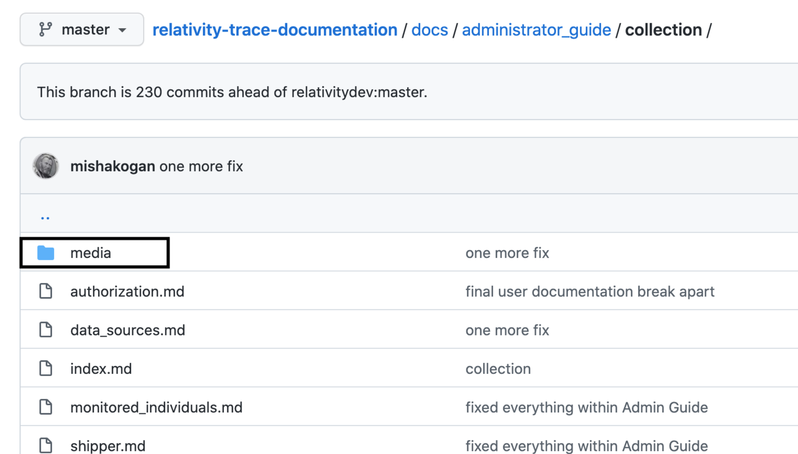
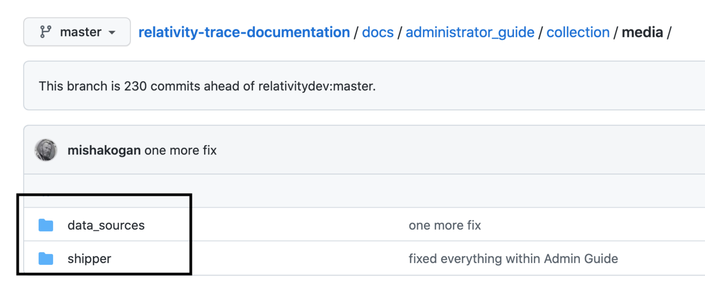
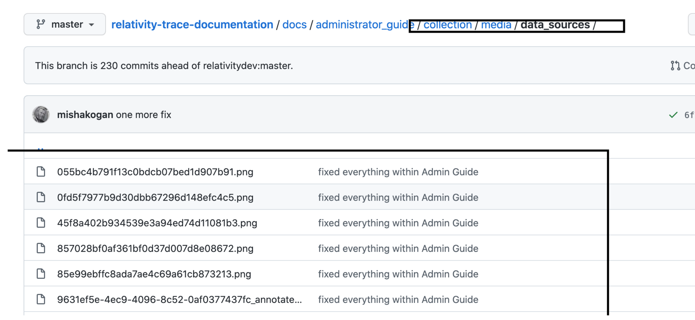
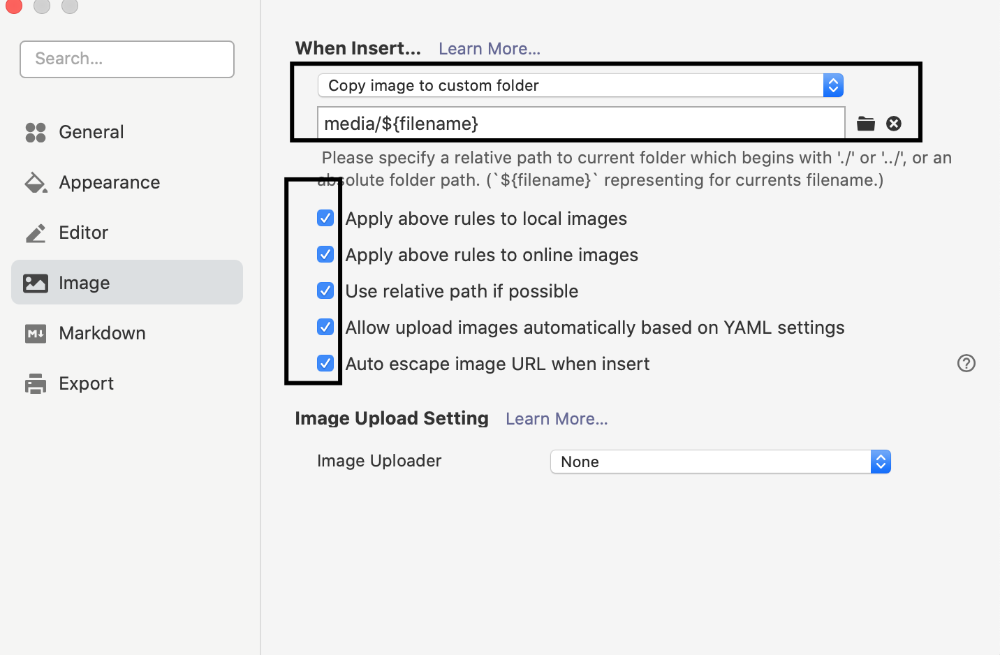

Trace Documentation is open source, meaning you can suggest changes to improve the content.

# Documentation Contributor Guide
## General Information

Relativity Trace User and Technical documentation

https://relativitydev.github.io/relativity-trace-documentation/

## How to contribute to this documentation

This documentation process was inspired by: [Microsoft Docs contributor guide](https://docs.microsoft.com/en-us/contribute/) and is based on Markdown language which is lightweight and portable. See more info [here](https://docs.microsoft.com/en-us/contribute/how-to-write-use-markdown).

### Key Standard Principles that MUST be followed

1. Image links MUST reference relative `media` folder AND images must be placed in the folder named after the name of `.MD` file  within relative `media` folder

   1. Example mardown: 
      ```markdown
      
      ```
   2. 
   3. 
   4. 

2. All `links` MUST be either relative OR refernce root

   1. example: 

      ```markdown
      [I'm a Trace User](/docs/user_guide/index.md)
      ```

3. Callouts such as `warn`, `info`, etc...

   Usage (`.info`,` .warn`, `.danger` are currently supported):

   ```markdown
   Do not blah blah blah...
   {: .warn }
   ```

   Information
   {: .info }

   Warning
   {: .warn }

   Danger
   {: .danger }

   

### What is required to start contributing?

1. Setup GitHub
2. Create a PR
   - **NOTE:** Please make all enhancements in the **"develop"** branch.
3. Use GitHub UI (for Quick Edits) OR [https://typora.io](https://typora.io/) for more involved changes
4. Submit changes for review and get PR approved

### Quick Edits

Follow this guide: https://docs.microsoft.com/en-us/contribute/#quick-edits-to-existing-documents

### More Involved Edits

1. Download [https://typora.io](https://typora.io/)
2. Open it and then `File` -> `Preferences`
3. Update `Image` Settings according to below
   1. 
4. ^ this will allow for copying and pasting of images **directly** into Typora
