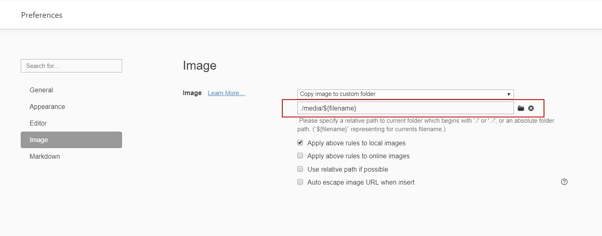

# Relativity Trace Documentation

## General Information
Version: Upcoming (Trace Release 101)

Relativity Trace User and Technical documentation

https://relativitydev.github.io/relativity-trace-documentation/

## How to contribute to this documentation

This documentation process was inspired by: [Microsoft Docs contributor guide](https://docs.microsoft.com/en-us/contribute/) and is based on Markdown language which is lightweight and portable. See more info [here](https://docs.microsoft.com/en-us/contribute/how-to-write-use-markdown).

### What is required to start contributing?

1. Setup GitHub
2. Create a PR
3. Use GitHub UI (for Quick Edits) OR [https://typora.io](https://typora.io/) for more involved changes
4. Submit changes for review and get PR approved

### Quick Edits

Follow this guide: https://docs.microsoft.com/en-us/contribute/#quick-edits-to-existing-documents

### More Involved Edits

1. Download [https://typora.io](https://typora.io/)

2. Open it and then `File` -> `Preferences`
3. Update `Image` Settings according to below 
5. ^ this will allow for copying and pasting of images **directly** into Typora
