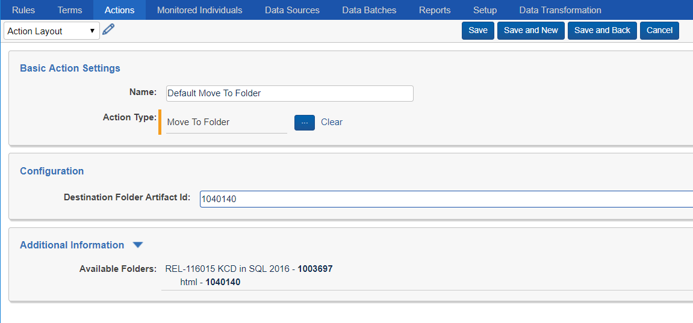
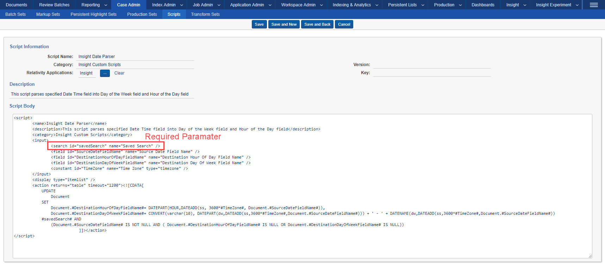
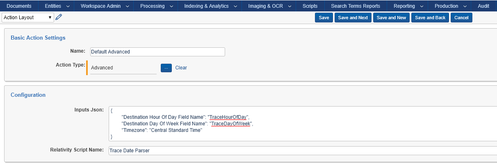
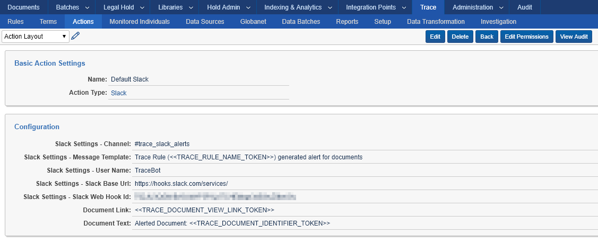

# Actions
{: .no_toc }


Actions are triggered automatically by Rules and can change attributes of a document or trigger external notifications.
{: .fs-6 .fw-300 }

1. TOC
{:toc}

---

## Overview

Currently supported action types are: Move To Folder, Data Disposal, Advanced, Email, Slack, and Webhook. For each Action Type there is a Default Action created. You can customize the Default Actions, but it is recommended that you create and configure your own Actions.

### Move To Folder Action Type

Move To Folder action works on documents that match Rule criteria. Upon execution of the action, the documents will be moved to the specified destination folder, inheriting folder permissions. This action can be used to effectively secure documents to specific set of users/groups by routing them to folders with different permission sets. This Action Type can also be used to drive regional review workflows in conjunction with alerting actions. Finally, it can be used to filter documents by moving only the relevant documents to a different folder targeted by additional rules.

You can configure the action by specifying the Artifact ID of the destination folder where the documents are to be moved. The Additional Information section automatically populates the list of available folders and their corresponding Artifact IDs for your convenience.



### Data Disposal Action Type

See the [Retention]({{ site.baseurl }}) page for more information about the Data Disposal Action Type. 

### Advanced Action Type

Advanced Action type can execute potentially harmful Relativity Scripts. Apply rigorous testing and impact assessment prior to deploying any custom script in production or enabling it to run continuously via Trace automation. For more information about Relativity Scripts in general, see the [Scripts](https://help.relativity.com/9.6/Content/Relativity/Scripts.htm) and [Scripts Properties](https://platform.relativity.com/9.6/Content/Scripts/Script_properties/Script_properties.htm) documentation pages.
{: .warn }

The Advanced Action Type executes a Relativity Script automatically on a recurring basis per the Rule Evaluation task configuration (schedule).

To create a Rule with an Advanced action attached, follow the following steps:

**Step 1**: Identify a Relativity Script you want to run automatically or create one yourself.

-   Script must have Saved Search input parameter with *name* attribute “Saved Search”
    
-   For more information about Relativity Script feature in general, see the [Scripts](https://help.relativity.com/9.6/Content/Relativity/Scripts.htm) and [Scripts Properties](https://platform.relativity.com/9.6/Content/Scripts/Script_properties/Script_properties.htm) documentation pages.

Currently all Relativity Scripts that can be associated with Trace actions require a Saved Search as one of the script inputs (Trace automatically populates that field during Rule Evaluation with an execution specific saved search).
{: .info }



**Step 2**: To incorporate your script into the Rule framework, you must create an Action of Action Type “Advanced”.

-   You can create new advanced actions in the Trace:Actions tab.

-   This custom Action will eventually be attached to a Rule, so be sure to give it an easily identifiable name.



Configuration of the action needs to provide all needed script inputs in the following format:

```json
{
"Destination Hour Of Day Field Name": "TraceHourOfDay",
"Destination Day Of Week Field Name": "TraceDayOfWeek",
"Timezone": "Central Standard Time"
}
```

For reference:

-   “Trace Date Parser” is the displayed script name as seen in the UI

-   “Destination Hour of Day Field Name”, and “Destination Day of Week Field Name” are Scripts Input Names
    
-   “Trace Hour Of Day”, and “Trace Day Of Week” are SQL Column names of corresponding Relativity Fields

Trace will automatically create a Saved Search that returns the net-new documents from your chosen Saved Search (from the Rule) AND your Term conditions and use that as the input for the script.
{: .info }

**Step 3**: To execute your script, attach this Action to a Rule and enable it (as you would with any Rule).

Advanced actions will run on a schedule, continuously. Please consider the resource usage of your scripts.
{: .info }

### Alert Action Types (Email, Slack, and Webhook)

Trace supports the following modes of notification: Email, Slack, and Webhook. These actions can be used as part of any rule.

#### Replacement Tokens

You can specify Trace Replacement Tokens in most configuration fields for the Alert Action Types. These tokens will be replaced with information relevant to the specific document, rule and/or alert:

`<<TRACE_RULE_VIEW_LINK_TOKEN>>` - Link to view Trace Rule in Relativity that generated the alert

`<<TRACE_DOCUMENT_VIEW_LINK_TOKEN>>` - Link to view Document matched by the alert

`<<TRACE_DOCUMENT_IDENTIFIER_TOKEN>>` - Relativity document identifier (Control Number)

`<<TRACE_DOCUMENT_ARTIFACT_ID_TOKEN>>` - ArtifactID of the document matched by the alert

`<<TRACE_RULE_NAME_TOKEN>>` - Name of the Trace Rule that generated the alert

`<<TRACE_WORKSPACE_ID_TOKEN>>` - Relativity Workspace ID (ArtifactID) of the workspace that generated the alert

The Trace Relativity Replacement tokens are not configurable, and are the only tokens available in the Trace application.
{: .info }

#### Email Action Type

You can configure the Email action to send out an email about specific document matching rule conditions. Note that the Email Action uses the SMTPUserName, SMTPPassword, SMTPServer, SMTPPort and SMTPSSLisRequired settings from the kCura.Notification Section of Instance Settings to send your email messages, so be sure they are configured properly.


**Configuration**

`Email Settings – Body Template`: Customize text that appears above the list of alerted documents. Can insert custom HTML and Replacement Tokens.

`Email Settings – Subject Template`: Subject of the email

`Email Settings – Recipients`: Recipients of the email. Supports to/cc/bcc, example (include square brackets): 

```[to:email1@test.com,cc:email2@test.com,bcc:email3@test.com]```

`Email Settings – From Address`: Sender of the email 
If using RelativityOne, email from field MUST end on `@relativity.one`
{: .info }

`Document Link` - By default contains a link to the alerted document. Can insert custom text and Replacement Tokens.

`Document Text` – Text that appears next to the Document Link. Can insert custom text and Replacement Tokens.


##### Sample Email generated by Trace


#### Slack Action Type



**Configuration**

`Slack Settings - Channel` – Slack channel to use for alert

`Slack Settings - Message Template` – Customize text that appears above the list of alerted documents. Can insert Replacement Tokens.

`Slack Settings - User Name` – Sender of the Slack message

`Slack Settings - Slack Base Url` – URL to use for Slack alert

`Slack Settings - Slack Web Hook Id` – Unique ID of the registered incoming webhook

`Document Link` - By default contains a link to the alerted document. Can insert custom text and Replacement Tokens.

`Document Text` – Text that appears next to the Document Link. Can insert custom text and Replacement Tokens.


You must register a webhook to specific channel in Slack that will be allowed to post messages from Trace. Once registered, enter the ID of the registration into “Slack Web Hook Id” field. For more information visit: <https://get.slack.help/hc/en-us/articles/115005265063-Incoming-WebHooks-for-Slack>
{: .info }

##### Sample Slack message generated by Trace


#### Webhook Action Type (Preview)

You can configure an action to make an API call to any web services hosted within the Relativity infrastructure. For example, you could use the Webhook action to call RelativityOne notification API to generate a mobile alert for the documents.


**Configuration**

`Json Payload` – Custom JSON string containing the payload of the API call. Can insert Replacement Tokens.

`Web Hook Base Api Url` – URL of the Relativity instance hosting the API

`Web Hook Api Function` – relative path of API method to execute (used in combination with Base Api Url)

`Document Link` - By default contains a link to the alerted document. Can insert custom text and Replacement Tokens.

`Document Text` – Text that appears next to the Document Link. Can insert custom text and Replacement Tokens.


POST is the only supported HTTP verb for Webhook.
{: .info }

Authentication is inherited from the Agent Server that is hosting the Trace agent. The access_token is retrieved from ClaimsPrincipal.Current.Identities.
{: .info }

