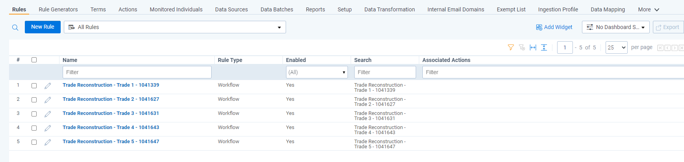
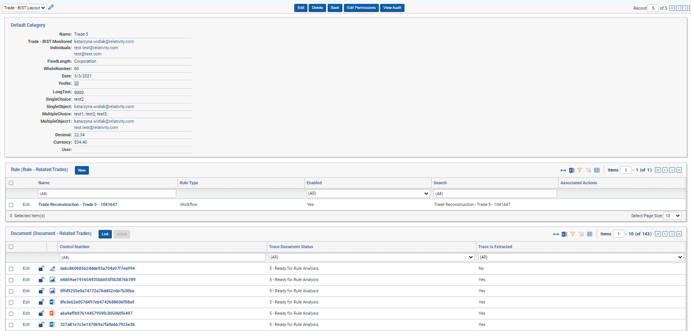

# Dynamic Rules
{: .no_toc }


Dynamic Rules are Rules that can change based on changes to external data such as control room data, or human resources data, or expense data. 
{: .fs-6 .fw-300 }

1. TOC
{:toc}

---

## Rule Generator

Rule Generator is a tool for automatically creating Rules based on non-document RDO data. Rule Generators can create rules to link Trade RDO's to Documents to simplify **Trade Reconstruction** workflows, alert on documents that breach insider lists or violate restricted lists defined by **Control Room** teams, or create **dynamic Rules** to link or alert on any communication related to integrated structured data coming from a CRM system, Time & Expense system, HR System, Excel file, or in-house tools.

Each Rule Generator is associated with a specific Object Type and creates a Rule for each underlying RDO for that object type using given search criteria. Rule creation by a Rule Generator runs during the Rule Evaluation task.

### Creating a Rule Generator


The Rule Generator form contains the following fields:

-   **Rule Generator Name:** the name of the Rule Generator, limited to 20 characters, must be unique, and can't be modified.
-   **Associated Object Type:** an Object Type associated with the Rule Generator. For each RDO of the declared Object Type a Rule and Saved Search is created. When a Rule which was created by a Rule Generator is evaluated, the Documents matching the Rule are linked to the associated RDO for which the rule was created.

An Object Type can only be associated with a single Rule Generator.
{: .info }

-   **Relational Field On Document:** a multi object field on the **Document** object that is associated with the Object Type populated on the `Associated Object Type` field. This Document field is populated with the RDO of the declared Associated Object Type when the Rule created from that RDO hits on the document. 

This field must be created manually as it changes based on the Object Type populated on the `Associated Object Type` field.
{: .info }

-   **Relational Field On Rule:** a multi object field on the **Rule** object that is associated with the Object Type populated on the `Associated Object Type` field. This Rule field is populated with the RDO of the declared Associated Object Type when the Rule associated with that RDO is created. 

This field must be created manually as it changes based on the Object Type populated on the `Associated Object Type` field.
{: .info }

-   **Alert On Related Documents:** a flag which determines if the Rules that are created by the Rule Generator are of the type `Alert` or `Workflow`. Can't be modified.
-   **Disable Generated Rules By Default:** a flag which determines if if the Rules that are created by the Rule Generator are disabled when they are created. Rule Generators that are going to create many rules or are of the type `Workflow` should be flagged as disabled by default.
-   **Disable Generated Rules After (Days):** integer field which indicates the number of days (counting from rule creation date) after which the Rules created by Rule Generator will be disabled.

A Rule will only be disabled after it has completed running regardless of the Disable Generated Rules After value.
{: .info }

-   **Search Criteria:** required JSON field to create the search parameters for the Saved Search created and linked to the generated Rule. The details of the proper search criteria can be accessed via Contextual Help button on the Rule Criteria section. Please see the Rule Generator Search Criteria section for more details.
-   **Terms Field:** optional field, name of the field on the Associated Object Type which will be used to create Terms that are linked to the generated Rule. Must be multiple object or multiple choice type field.

### Rule Generator Search Criteria

Rule Generator Search Criteria field is inputted as JSON with each `{}` representing a single logic group within a Saved Search. Each logic group should contain a list of conditions and boolean operator `AND|OR` which joins it with the next logic group.

**Parameters of logic group:**
- `SearchConditions` - [Required] a list of search conditions which will be included in the logic group
- `BooleanOperator` - [Required] a boolean operator which joins specified logic group with the next logic group `AND/OR`

**Parameters of search condition:**

 - `DocumentFieldName` - [Required] name of the target document field you wish to search across
 - `ObjectFieldName` - name of the source associated object type field used to populate the `DocumentFieldName` when searching
 - `Optional` - when set to `true`, it makes this search condition optional, meaning that if the `ObjectFieldName` field doesn't have a value, it will skip over this search condition in the created Saved Search and continue to make a Rule for that particular object. If this value is not set (defaults to `false`) or set to `false`, this search condition is not optional, and if the `ObjectFieldName` field doesn't have a value, it will fail to create a Rule for that particular Object (`true`,`false`) 
 - `Value` - value used to populate `DocumentFieldName` when searching (either `ObjectFieldName` or `Value` should be provided, not both). If `DocumentFieldName` is multiple/single object/choice type field, then static value should be object/choice name
 - `Condition` - [Required] the logical condition between the `DocumentFieldName` and `ObjectFieldName` (see conditions below)

| Field Type      | Conditions                                                   |
| --------------- | ------------------------------------------------------------ |
| Date            | `Between`, `Is`,`IsAfter`, `IsAfterOrOn`, `IsBefore`, `IsBeforeOrOn`, `IsSet` |
| Multiple Object | `AllOfThese`, `AnyOfThese`, `IsSet`                          |
| Multiple Choice | `AllOfThese`, `AnyOfThese`, `IsSet`                          |
| Single Object   | `AnyOfThese`, `IsSet`                                        |
| Single Choice   | `AnyOfThese`, `IsSet`                                        |
| Whole Number    | `GreaterThan`, `LessThan`, `Is`, `IsSet`                     |
| Decimal         | `GreaterThan`, `LessThan`, `Is`, `IsSet`                     |
| Currency        | `GreaterThan`, `LessThan`, `Is`, `IsSet`                     |
| Fixed Length    | `GreaterThan`, `GreaterThanOrEqualTo`, `Is`, `IsLike`, `IsSet`, `LessThan`, `LessThanOrEqualTo`, `StartsWith`, `EndsWith` |
| Long Text       | `GreaterThan`, `GreaterThanOrEqualTo`, `Is`, `IsLike`, `IsSet`, `LessThan`, `LessThanOrEqualTo`, `StartsWith`, `EndsWith` |
| Yes/No          | `Is`, `IsSet`                                                |

 - `NotOperator` - specifies if condition should be negative (defaults `false` if not added)
 - `DayRange` - specifies a number of days which will be added or subtracted from ObjectField date specified in condition (this works only for DATE fields when `BETWEEN` condition in specified, but it won't break when added to other conditions)
 - `DayRangeDirection` - connected with the `DayRange` parameter and specifies if the days should be added, subtracted, or added and subtracted from ObjectField date. Values for this parameter: `ForwardAndBackwards`, `Backwards`, `Forward`, the default value is `ForwardAndBackwards`
 - `BooleanOperator` - the operator which joins the specified condition with the next condition (`AND/OR`)

> **Search Criteria Validation Rules:**
>
> - Search criteria must contain at least one logic group
> - Each logic group must include a `SearchConditions` list (with at least one condition in it) and a `BooleanOperator`
> - `DocumentFieldName`, `ObjectFieldName` or `Value`, `Condition` and `BooleanOperator` are mandatory fields in a search condition
> - `DocumentFieldName` field must be a field which exists on Document or a reflected field, e.g. Trace Monitored Individuals::First Name
> - `ObjectFieldName` field must be a field which exists on the Object Type associated with Rule Generator
> - `DocumentFieldName` and `ObjectFieldName` fields must have the same field type, with one exception:
>   - `DocumentFieldName` fields with the field type single choice, multiple choice, single object, or multiple object can be mapped to `ObjectFieldName` fields with the fixed-length text field type
> - if `DocumentFieldName` and `ObjectFieldName` fields are single/multiple object fields, then both fields must be associated with the same object type
> - Saved Searches created by Rule Generators MUST have at least one condition, so if the `Optional` flag results in no search conditions being added, it will not create the Saved Search or Rule for that object
> - `Value` value must be convertible to `DocumentFieldName` field type, i.e. if `DocumentFieldName` is date field, then valid values are `15 Apr 2021` or `04/15/2021`
> - if `DocumentFieldName` is multiple/single object/choice field type, then `Value` should be a name of object/choice we want to search
> - `Condition` must be valid for field type


**Example Search Criteria:**

```json
[
   {
      "SearchConditions":[
         {
            "DocumentFieldName":"Trace Monitored Individuals",
            "ObjectFieldName":"Trade Monitored Individuals",
            "Condition":"AnyOfThese",
            "BooleanOperator":"Or",
         },
         {
            "DocumentFieldName":"Trace Monitored Individuals",
            "ObjectFieldName":"Trade Related Individuals",
            "Condition":"AnyOfThese",
            "BooleanOperator":"And",
            "NotOperator":true,
         }
      ],
      "BooleanOperator":"And"
   },
   {
      "SearchConditions":[
         {
            "DocumentFieldName":"Trace Document Status Updated On",
            "ObjectFieldName":"System Created On",
            "Condition":"Between",
            "BooleanOperator":"And",
            "DayRange":14,
            "DayRangeDirection":"Backwards",
	    "BooleanOperator":"Or"
         },
	 {
            "DocumentFieldName":"Trace Document Status Updated On",
            "Value":"1 Jan 2021",
            "Condition":"Is",
            "BooleanOperator":"And",
         }
      ],
      "BooleanOperator":"And"
   }
]
````

### Customizing and Running a Rule Generator

Enabled Rule Generators are executed by the Rule Evaluation task. Each time the task is run: 
1. Enabled rule generators are identified.


2. RDOs of Object Type associated with the Rule Generator are identified for each enabled Rule Generator:
   1. If the RDO doesn't have a Rule and Saved Search, then Saved Search/Rule is created for this object
   2. If the RDO already has a Rule and Saved Search created and nothing has changed in the RDO fields or in the Rule Generator setup, then nothing happens
   3. If the RDO already has a Rule and Saved Search created and something has changed in the RDO fields or in the Rule Generator setup, then existing Rule/Saved Search are updated

Rules created by a Rule Generator are visible in Rule Generator's layout. Rules and Saved Searches names follow the convention `[Rule Generator Name] - [RDO Name] - [RDO ArtifactId]`, but if name exceeds 50 characters then RDO Name gets truncated. All Saved Searches created for the same Rule Generator are stored in folder named `"Dynamic Rule Generation" - [Rule Generator Name]`





3. After Rule Generators evaluation, all enabled Rules are executed. Rules created by Rule Generator work the same as a regular Rules, but after the Rule Generator's rule is matched with Documents, those Documents are also linked with the RDO for which the Rule was created on the `Relational Field on Document` field selected when creating the Rule Generator.



### Rule Generator Limitations

1. `Enabled Rules Limit` - a setting in Rule Evaluation task which specifies the maximum number of enabled Rules in the workspace. If there are more Rules enabled than this specified limit, the Rule Evaluation Task errors and no Rules or Rule generators are executed. This is set to 100 by default to reduce strain on the system.
2. `Disable Active Rule Generators` - a setting which prevents all Rule Generators (enabled or disabled) within a workspace from executing when set to true; by default set to false. This can be treated as a fail switch.


