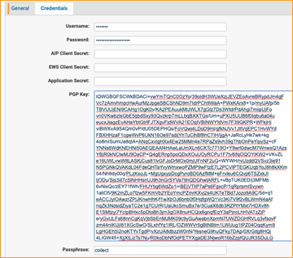

# Bloomberg Chat & PChat
{: .no_toc }

Collect Bloomberg Chat and PChat messages via Relativity Collect
{: .fs-6 .fw-300 }

1. TOC
{:toc}

---
 
## Overview
Deployment option B, depicted below, is required to use these data sources.

## Versions Supported

We support 1.3 as well as the latest 1.9 version.

## Activities Captured

The following activities are captured:

- Attachments (.att)
- Disclaimers (.dscl)
- Instant Bloomberg Messages (Chat & PChat) (.ib)

## Metadata

In addition to standard metadata populated during extracting data, the O365 Teams Data Source captures the following ones:

- **DATE** - start date of a chat or start date of a slice in the chat split into slices.
- **SUBJECT** - friendly name of the team and channel.
- **FROM** - the first person to send a message in that respective slice.
- **TO** - chat attendees.
- **CONVERSATION-ID** - the unique identifier. When creating a Data Mapping, set “Read From Other Metadata Column” to **Yes**.
- **X-RSMF-EndDate** - end date of the chat / slice. When creating a Data Mapping, set “Read From Other Metadata Column” to **Yes**.
- **X-RSMF-MessageCount** - number of messages in the chat / slice. When creating a Data Mapping, set “Read From Other Metadata Column” to **Yes**.
- **X-RSMF-AttachmentCount** - number of attachments in the chat / slice. When creating a Data Mapping, set “Read From Other Metadata Column” to **Yes**.

## Document View

Bloomberg Chat messages are captured as RMFS (Relativity Short Message Format) files. Relativity has created a Viewer experience to help reviewing RSMF data. See [Relativity Short Message Format](https://help.relativity.com/RelativityOne/Content/System_Guides/Relativity_Short_Message_Format/Relativity_Short_Message_Format.htm) for more details.

## Data Filtering

There are two levels of filtering data, which are the same for Bloomberg Mail (via Collect):

- **Data Source -** Data is being filtered according to specified Monitored Individuals (MI). No filter is applied at the message level. So, if MI exists in a channel, we will ingest the whole conversation for a given slice. If the conversation does not have any MIs in participants for that day, we do not ingest conversation at all.

- **Data Batch -** Only messages with data for the date that matches Data Batch collection period will be captured. For example, a message that has been exported for 10/1/2021 will be captured by the Data Batch that has collection period from “10/1/2021 00:00” to “10/2/2021 00:00”.

 

## Configuring Collect

Collect is used for data retrieval. Make sure Collect is installed in the workspace before configuring the data source. For detailed installation steps, see Installing Collect.

## Configuring Bloomberg Chat and PChat Trace Data Source 

Obtain the following information about the Bloomberg SFTP server:

- Host name and Port number
- Username and password

If Bloomberg messages are encrypted, then obtain the following information:

- PGP Key (Private Key is required)
- Passphrase (used to encrypt/decrypt PGP key)

Most parameters work the same for all Collect Data Sources. Follow the instructions from [Common Collect Data Source Functionality](#_Common_Collect_Data) section.

Below are specific parameters for Bloomberg Chat and PChat:

1. On the **General** tab, select **Bloomberg Chat** for the **Data Source Type**.

 

2. On the **Credentials** tab, do the following:

- **Username** - enter the SFTP username.
- **Password** - enter the SFTP password.
- **PGP Key** - enter the PGP Key used for message encryption.
- **Passphrase** - enter the PGP Passphrase used for message encryption.

3. For the **Data Source Specific Fields** section, do the following. For more information, see [Common Collect Data Source Functionality](#_Common_Collect_Data).

- **Host** - enter the SFTP location.
- **Path** - enter the folder path on the SFTP.
- **Port** - the TCP port number. Default value is 22.
- **Use PGP Encryption** - select this check box to decrypt a source file with the PGP Key and PGP Passphrase; otherwise, leave it blank.
- **Frequency in Minutes** - enter 1440.
- **Max Number of Batches To Merge** - enter 1.
- **Collection Period Offset in Minutes** - enter 1440.
