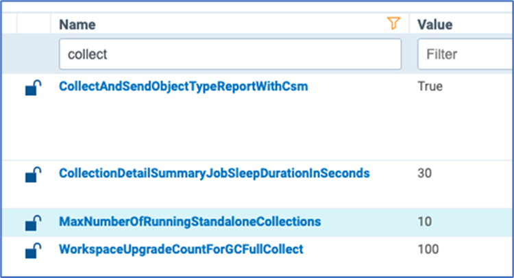
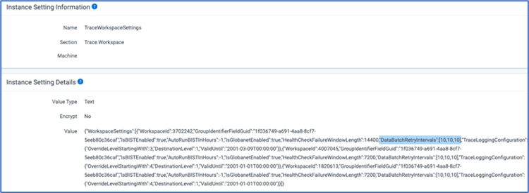
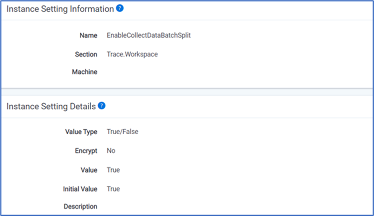
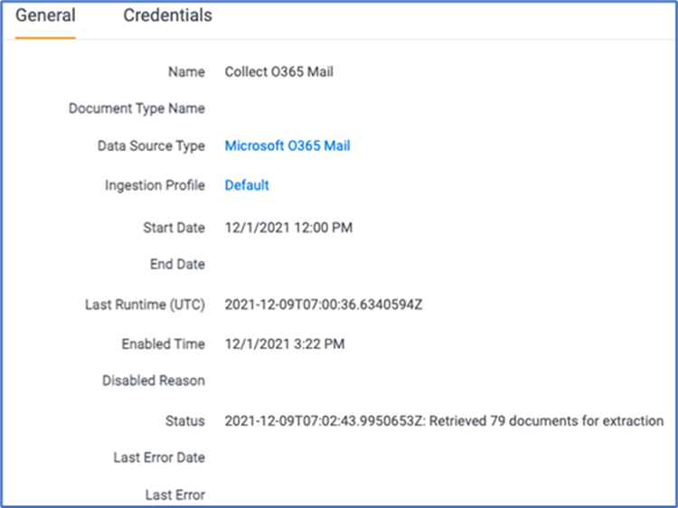
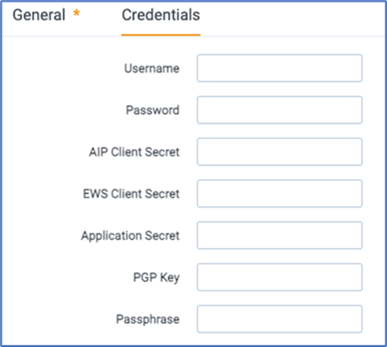
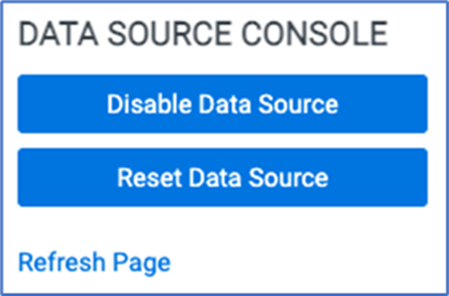
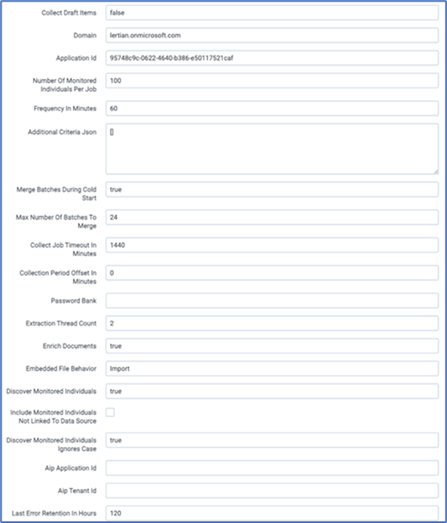

# **Installing and configuring Trace data sources** 

The following sections provide the steps required for installing and configuring Trace data sources. 

## **Installing Collect** 

Before configuring the required instance settings and the Trace data source, install the Collect RAP to the Trace Workspace. You will do this from the Application Library in Relativity. 

 

##  **Configuring instance settings** 

Before configuring Trace data source, configure the following instance settings: 

- Configure Collect Queue Depth: 

- **Name**: MaxNumberOfRunningStandaloneCollections 
- **Section**: Relativity.Collection 
- **Value Type**: Integer 32-bit 
- **Value**: 10 

 

Configure Data Batch Automatic Retry Policy: 

- **Name**: TraceWorkspaceSetting 
- **Section**: Trace.Workspace 
- **Value Type**: Text 
- **Value**: “DataBatchRetryIntervals”:[10,30,60] 

 

Toggle On/Off Auto Batch Split functionality: 

- **Name**: EnableCollectDataBatchSplit. 
- **Section**: Trace.Workspace. 
- **Value Type**: True/False. 
- **Value**: False (auto split disabled) or True (auto split enabled). 

## Configuring the Trace data source

To configure the Trace data source, perform the following steps. See [Data Sources](https://relativitydev.github.io/relativity-trace-documentation/docs/administrator_guide/collection/data_sources.html) documentation for details on any of the settings mentioned below.

1. Enter the following information in the General section:
   - Name: The name of the Data Source.
   - Data Source Type: Select Data Source Type.
     
   - Ingestion Profile: Ingestion Profile used to load data from this Data Source.
   - Start Date and End Date: Used to collect data for the specific collection period. Both dates are optional.
     - If both dates are provided, data will be collected between “Start Date” and “End Date”. If “Ingestion State” is later than “Start Date”, then data will be collected between “Ingestion State” and “End Date”.
     - If only “Start Date” is provided, data will be collected between “Start Date” and now. If “Ingestion State” is later than “Start Date”, then data will be collected between “Ingestion State” and now.
     - If only “End Date” is provided, data will be collected between “Ingestion State” and “End Date”.
     - If none of them is provided, data will be collected between “Ingestion State” and now.
   - Last Runtime (UTC)
   - Enabled Time
   - Disabled Reason
   - Status
   - Last Error Date
   - Last Error

​				

2. Enter the following information in the Advanced section. This is only visible on the development layout.
   - Ingestion State: Last ingestion date. This parameter is only visible in the development layout.

3. Enter the following information on the Credentials section:
   - Username: See specific connector for more details.
   - Password: See specific connector for more details.
   - AIP Client Secret: Not used.
   - EWS Client Secret: Not used.
   - Application Secret: See specific connector for more details.
   - PGP Key: See specific connector for more details.
   - Passphrase: See specific connector for more details.

​				

4. Select the appropriate Data Source Console action:
   - Enable/Disable Data Source: Enabled (or disables) data retrieval for this Data Source. Enabling a Data Source continues data retrieval from “Ingestion State” (the last run).
   - Reset Data Source: Disabled and resets this Data Source to retrieve from specified “Start Date”.
     - If “Start Date” is not present – data for this Data Source will be retrieved from now.
     - Data Source reset clearing “Ingestion State” parameter.
     - Depending on Import settings, resetting and re-enabling a Data Source could duplicate data in the Workspace.

​		

5. Enter the following information in the Data Source Specific Fields section:
   - Frequency in Minutes: Data Batch duration. Check specific Data Source for recommended value.
   - Additional Criteria Json: Not used.
   - Merge Batches During Cold Start: True (default) or False – When set to “True” it will merge initial Data Batches into bigger chunks of data. See “Data Retrieval” section for more details.
   - Max Number of Batches To Merge: 24 (default) – Number of Data Batches which will be merged when “Merge Batches During Cold Start” is set to “True”. See “Data Retrieval” section for more details.
   - Collect Job Timeout in Minutes: 1440 (default) – Time interval after which a Data Batch will be moved from Retrieving to Abandoned state.
   - Number of Monitored Individual Per Job: 100 (default) – Internal parameter to tweak data retrieval performance. This parameter is available for non-chat Data Sources only. See specific Data Source for more details.
   - Collection Period Offset in Minutes: 0 (default) – Modify Collection Period by adding offset in minutes to both Start and End Date. This parameter is used to collect data that are available to be retrieved with some delay e.g. 24 hours.
   - Password Bank
   - Extraction Thread Count
   - Enrich Documents
   - Embedded File Behavior
   - Discover Monitored Individual
   - Include Monitored Individuals Not Linked To Data Source
   - Discover Monitored Individuals Ignore Case
   - Aip Application Id: Not used.
   - Aip Tenant Id: Not used.
   - Last Error Retention In Hours
   - Excluded File Transformation Enabled.

​	

6. Complete the Trace Monitored Individuals.

7. Complete the Data Transformations.