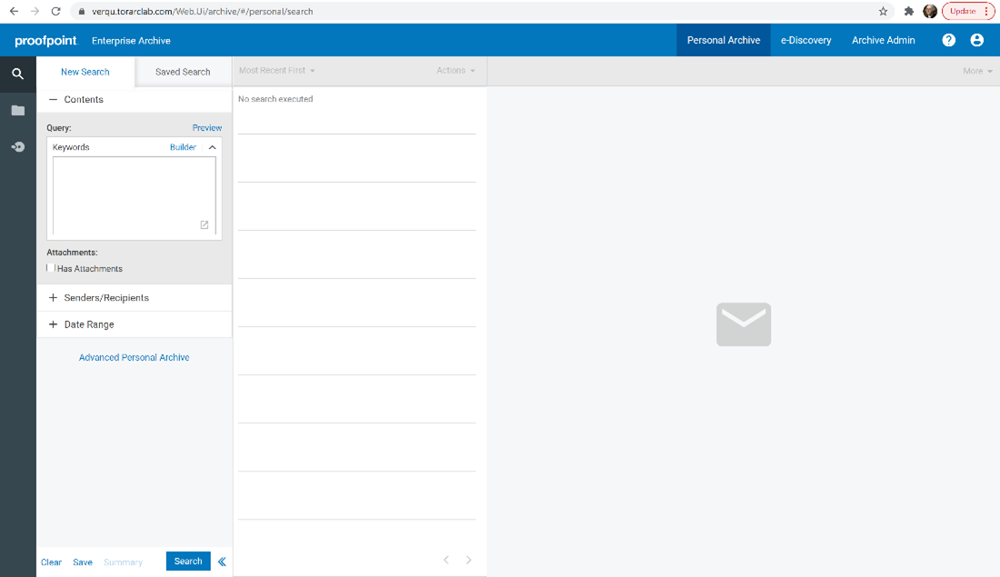
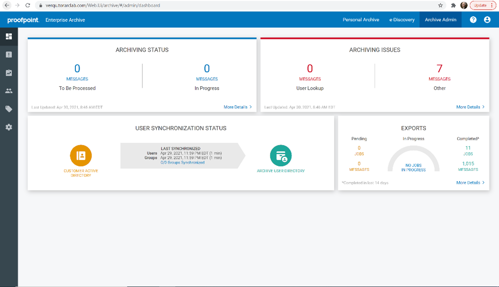
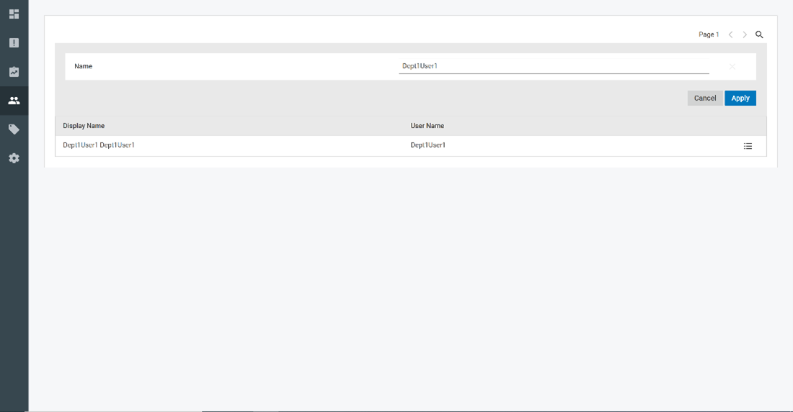
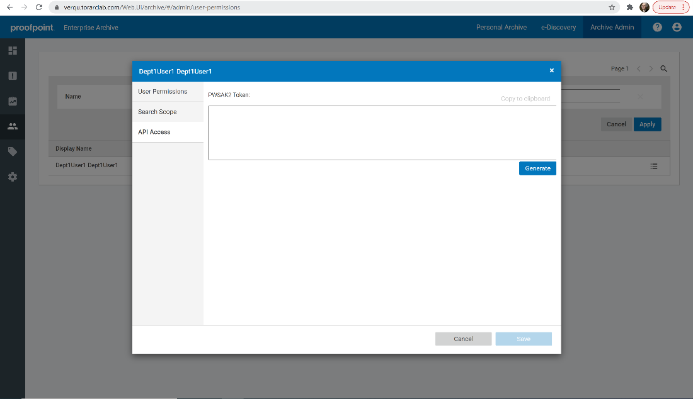

# Proofpoint Archive
{: .no_toc }

Data can be collected from the Proofpoint Archive via existing connectors.
{: .fs-6 .fw-300 }

1. TOC

{:toc}

---

## Requirements 

Before using this data source, note the following license requirements, version support, and special considerations.

### License requirements

-  A valid Proofpoint license is required to use this data source.

### Versions supported

The following versions of Microsoft Exchange are supported:

[comment]: <> No Proofpoint versions are specific in the Word doc.

## Considerations

Note the following considerations about this data source:

## Information captured 

This section lists what activities and, if applicable, metadata are captured when you use this data source.

### Activities captured

[comment]: <	"No activities captured provided in the Word doc for this data source"

The following table lists activities captured by this data source:

| Activity | Notes |
| -------- | ----- |
|          |       |
|          |       |
|          |       |
|          |       |

### Activities not captured

[comment]: <> No activities not captured provided in the Word doc for this data source.

The following table lists activities not captured by this data source:

| Activity not captured | Notes |
| --------------------- | ----- |
|                       |       |

## Setup instructions

This section provides details on the prerequisites and steps for setting up this data source.

### Prerequisites

You must have the following in order to complete the setup instructions for this data source.

- Access Token provided by Proofpoint for Authentication (In PWSAK2 format) 
- The URL to the Proofpoint API you want to be able to connect to (i.e https://{your domain}.torarclab.com/web.ui) 
- The location to write out the JSON file that sets the search filters for the export you created 
- The location of the CSV file of user SMTPs that you want to filter your search by. 
- Temp path to write the export file to (Location to flush to for debugging purposes) 

#### Company specific prerequisites

[comment]: <> No company specific requirements listed in the Word doc for this data source.

### Setup in Trace

To set up discovery for Proofpoint, provide values for the following required settings in the config file:

| Field                  | Description                                                  |
| ---------------------- | ------------------------------------------------------------ |
| **AccessToken**        | Access Token provided by Proofpoint for Authentication (In PWSAK2 format) |
| **URL**                | The URL to the Proofpoint API you want to be able to connect to (i.e https://{your domain}.torarclab.com/web.ui) |
| **Filter**             | The location to write out the JSON file that sets the search filters for the export you created |
| **ArchiveDateAfter**   | Filter results archived on or after the given date           |
| **ArchivedDateBefore** | Filter results archived on or before the given date          |

Provide values for the following optional Filter Criteria settings:

| Field                     | Description                                                  |
| ------------------------- | ------------------------------------------------------------ |
| **SentDateAfter**         | Filter results sent on or after the given date               |
| **SentDateBefore**        | Filter results sent on or before the given date              |
| **ExportName**            | Name of the Export you want to create in Proofpoint          |
| **Format**                | The file format you want the export to be in (json or pst). By default it is set to “json”. |
| **SearchQuery**           | Keyword or phrase within a message for rule to validate with. Gets all messages by default |
| **SearchLocation**        | Defaults to [subject, body, attachment, header].             |
| **IncludeMessageClasses** | Checks for classes that messages must be under               |
| **ExcludeMessageClasses** | Checks for classes that messages must not be under           |
| **FilterPlugin**          | Plugin that will provide a list of users to filter the results by |

Provide values for the following optional API Settings:

| Field             | Description                                                  |
| ----------------- | ------------------------------------------------------------ |
| **JobId**         | Proofpoint's Export Job Id. Set this if you want to run a specific existing export |
| **RetryInterval** | The amount of time in seconds to wait between retrying Proofpoint API calls to get a newly created export. Default is 30 seconds. |
| **RetryAttempts** | Amount of times to retry making API calls to Proofpoint. Default is 100,000 times |

To set up import for Proofpoint, provide values for the following required settings in the config file:

| Field    | Description                                                  |
| -------- | ------------------------------------------------------------ |
| **Temp** | Temp path to write the export file to (Location to flush to for debugging purposes) |

Provide a value for the following optional import setting:

| Field    | Description                                                  |
| -------- | ------------------------------------------------------------ |
| FileName | The name you want to give to the export file (i.e. test.eml). Used when flushing items for debugging purposes. |

To set up the CSV parser for Proofpoint, provide values for the following required settings in the config file:

| Field         | Description                                                  |
| ------------- | ------------------------------------------------------------ |
| **SourceCSV** | The location of the CSV file of user SMTPs that you want to filter your search by. |

### Getting the Proofrpoint access token

To procure the Proofpoint access token, perform the following steps:

1. Sign in to your Proofpoint workspace and select the **Archive Admin** tab.
   
2. From the Archive Admin page select the **Users & Groups** tab on the left hand side. Then select **User Permissions**.
   
3. Click the **Search** icon in the top right half of the screen and search the user you want to generate the token for if necessary. After you have found the desired user click on the **Option** icon on the far right of the screen on the same line as the desired user.
   
4. A window will pop up. Click on the **API Access** blade on the left side of the window and you will come to a page that looks like this. Click on the **Generate** button to create your Access Token and copy that into your clipboard. This will be what you use for the AccessToken Setting in Discovery.Proofpoint. 
   

### Data Transfer

[Shipper]({{ site.baseurl }}) will be used to transfer on-premises data collected by the VerQu application to Relativity Trace in the cloud.

### Data Source

Use the "Setting Up Data Sources in Relativity" section of the [Shipper]({{ site.baseurl }}) documentation to configure the Data Source.
