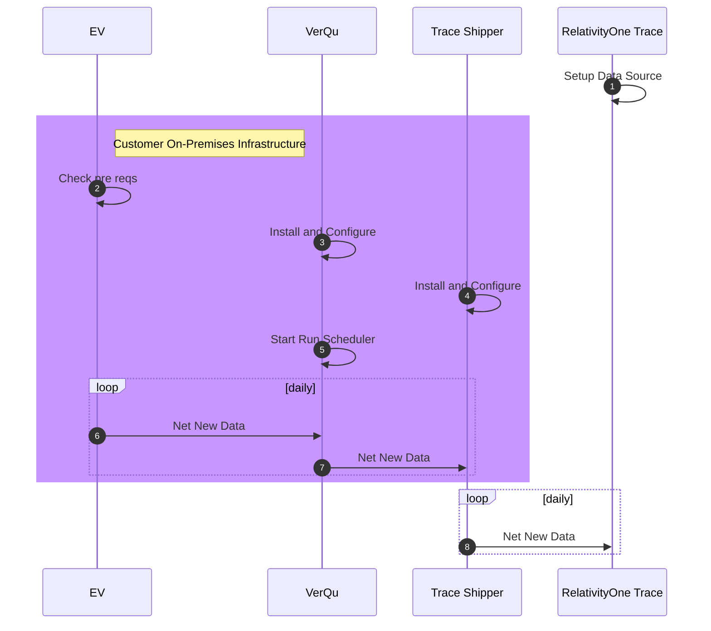

# Veritas Enterprise Vault On-Premises Archive
{: .no_toc }

This topic provides details on how to capture Veritas Enterprise Vault on-premises archive data via the VerQu on-premises collection application.
{: .fs-6 .fw-300 }

1. TOC
{:toc}

## Requirements

Before using this data source, note the following license requirements, version support, and special considerations.

### License requirements

A valid Veritas Enterprise Vault license is required to use this data source. 

### Supported versions

Veritas Enterprise Vault versions 10-14.x are supported. 

Older versions of Veritas are supported on a case-by-case basis, but additional configuration is required. Contact [support@relativity.com](mailto:support@relativity.com) for more information.

## Considerations

### File Collection
Only the following file types are collected:
- Exchange Journal Archive (Journal Wrapped MSG)
- SMTP Journal Archive (Journal Wrapped EML)
- User Archive (Journal wrapped MSG)
- File System Archive (Various file types)

## Information captured

This section lists what activities and, if applicable, metadata are captured when you use this data source.

### Activities captured

The following table lists activities captured by this data source:

| Activity | Notes |
| -------- | ----- |
|  Archived Files      |   See supported file types under the Considerations section    |

### Activities not captured

The following table lists activities that are not captured by this data source:

| Activity | Notes |
| -------- | ----- |
|          |       |

## Setup instructions

This section provides details on the prerequisites and steps for setting up this data source.

### Prerequisites

You must have the following access configuration.

#### Access Prerequisites
You must have the following access in Enterprise Vault to configure this data source:

Read Access to:
- EV Directory DB 
- EV Vault Stores 
- All EV Archives 

Read Access to source archives:
- EV API Runtime (Same Version as installed EV Version) 
- You must have .Net 3.5 is installed to use the EV.API.

#### Enterprise Vault specific prerequisites

It is recommended to have retention policy to be set for at least 30 days or more for all users who are being monitored. You can find the Veritas Documentation for Managing Retention Categories [here](https://www.veritas.com/content/support/en_US/doc/122376360-127396844-0/v122376051-127396844). 

### Setup in Trace

The following sections provide the steps for installing the VerQu On-Premises Application to collect the data locally, how to use a data transfer method for moving data to RelativityOne, and how to configure the data source in Relativity Trace.

#### VerQu On-Premises Application for Data Collection

1. Navigate to the [Using VerQu]({{ site.baseurl }}) and install, configure, and schedule VerQu.

Some data source specific configuration is required while following the [Using VerQu]({{ site.baseurl }}) steps. That configuration can be found below.

1. Locate the **EnterpriseVault.json** file

1. Use the table below as a guide to update the values within that file.

      | Setting                           | Notes                                                        |
      | --------------------------------- | ------------------------------------------------------------ |
      | **Temp**                          | Folder path where temporary data might be placed             |
      | **Mailboxes**                     | Path to Trace Shipper’s monitored_individuals.csv file.  Refer to TODO  to understand what timestamp will be used for the data for newly added monitored individuals |
      | **Server**                        | Specify the exact URL used when connecting to exchange server. |
      | **Username**                      | Specify login to admin account on exchange server            |
      | **Password**                      | Specify password to admin account on exchange server         |
      | **Logname**                       | A local file path where the log files for the application should be stored. Log path should always end with "verqu-{datetime}.log" |
      | **Destination**                   | The locally accessible path of the folder that needs to ship files from the Exchange server (note that the user running the service must have access) |
      | **DataRangeStart / DataRangeEnd** | This contains information on the start date of the first run |
      | **ConnectionString**              | This a standard SQL Server connection string that support all possible ways of connecting to SQL Server, including Windows Authentication and SQL Server Authentication |

1. Save the .json configuration files and navigate back to the [Using VerQu]({{ site.baseurl }}) documentation to complete the steps to configure VerQu.

### Data Transfer

[Shipper]({{ site.baseurl }}) will be used to transfer on-premises data collected by the VerQu application to Relativity Trace in the cloud.

### Data Source

Use the "Setting Up Data Sources in Relativity" section of the [Shipper]({{ site.baseurl }}) documentation to configure the Data Source.
