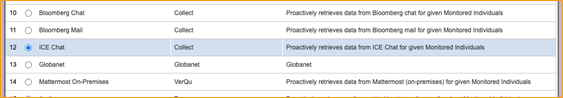
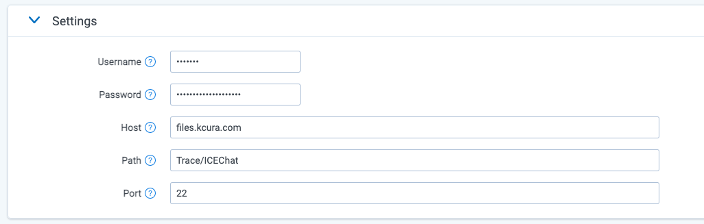

# ICE Chat
{: .no_toc }

Collect ICE Chat messages via Relativity Collect.
{: .fs-6 .fw-300 }

1. TOC
{:toc}

---

## Overview

The connector is pulling data directly from Cloud.

## Versions supported

There are no specific version requirements.

## Activities Captured

The following activities are captured:
- Room ID.
- Start Time.
- Message content.
- Participants.
- Participant Entered & Left.
- Message date
- Disclaimers

## Metadata

In addition to standard metadata populated during extracting data, this Data Source captures the following ones:

- **DATE** - start date of a chat or start date of a slice in the chat split into slices.
- **SUBJECT** - friendly name of the team and channel.
- **FROM** - the first person to send a message in that respective slice.
- **TO** - chat attendees.
- **CONVERSATION-ID** - the unique identifier. When creating a Data Mapping, set “Read From Other Metadata Column” to **Yes**.
- **X-RSMF-EndDate** - end date of the chat / slice. When creating a Data Mapping, set “Read From Other Metadata Column” to **Yes**.
- **X-RSMF-EventCount** - number of messages in the chat / slice. When creating a Data Mapping, set “Read From Other Metadata Column” to **Yes**.
- **X-RSMF-AttachmentCount** – number of attachments in the chat / slice. When creating a Data Mapping, set “Read From Other Metadata Column” to **Yes**.

## Document View

ICE Chat messages are captured as RMFS (Relativity Short Message Format) files. Relativity has created a Viewer experience to help reviewing RSMF data. See [Relativity Short Message Format](https://help.relativity.com/RelativityOne/Content/System_Guides/Relativity_Short_Message_Format/Relativity_Short_Message_Format.htm) for more details.

## Data Filtering

There are two levels of filtering data:

- **Data Source** - Data is being filtered according to specified Monitored Individuals (MI). No filter is applied at the message level. So, if MI exists in a channel, we will ingest the whole conversation for a given slice. If the conversation does not have any MIs in participants for that day, we do not ingest conversation at all.

- **Data Batch** - Only messages with data for the date that matches Data Batch collection period will be captured. For example, a message that has been exported for 10/1/2021 will be captured by the Data Batch that has collection period from “10/1/2021 00:00” to “10/2/2021 00:00”.

## Setup in Trace

This section provides details on the prerequisites and steps for setting up this data source.

### Obtaining Credentials

Obtain the following information about Eikon Chat SFTP server: 
1. Host.
2. Path.
3. TCP Port.
4. User and password.

### Whitelist Relativity IP Addresses

Bloomberg must add Relativity IP addresses to a whitelist so the system can connect and collect data. Please refer to the [IP Address Whitelisting Pre-work](https://relativitydev.github.io/relativity-trace-documentation/docs/administrator_guide/collection/general_data_source_information/common_collect_data_source_functionality.html#ip-address-whitelisting-pre-work) for more details.

### Collect

Prior to creating the Data Source, install the Collect application and configure the appropriate instance settings by following the [Using Relativity Collect](https://relativitydev.github.io/relativity-trace-documentation/docs/administrator_guide/collection/general_data_source_information/using_relativity_collect.html) page.

### Data source

Most parameters work the same for all Collect Data Sources. Follow the instructions from [Sections of a Data Source]( https://relativitydev.github.io/relativity-trace-documentation/docs/administrator_guide/collection/data_sources.html#data-source-details).

**ICE Chat specific parameters:**

In **General** section, select **ICE Chat** for the **Data Source Type**.

In **Settings** section, do the following:

1. **Username** - enter the SFTP username.
2. **Password** - enter the SFTP password.
6. **Host** - enter the SFTP location.
7. **Path** - enter the folder path on the SFTP.
8. **Port** - the TCP port number. Default value is 22.

In **Advanced Configuration** section, do the following:

1. **Frequency in Minutes** - enter 1440.
2. **Merge Batches During Cold Start**: enter True.
3. **Max Number of Batches To Merge** - enter 1.
4. **Collection Period Offset in Minutes** - enter 1440.
