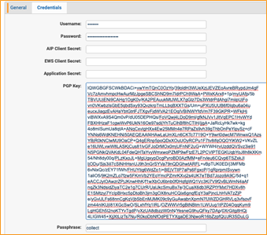
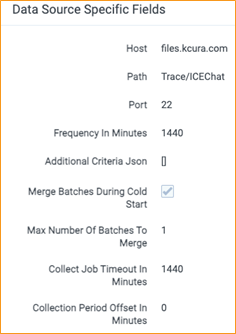

# ICE Chat
{: .no_toc }

This topic provides details on how to capture ICE Chat messages via Collect. 
{: .fs-6 .fw-300 }

1. TOC
{:toc}

---

## Considerations

Note the following considerations about this data source.

### Data Filtering

There are two levels of filtering data:

- **Data Source** - Data is being filtered according to specified Monitored Individuals (MI). No filter is applied at the message level. So, if MI exists in a channel, we will ingest the whole conversation for a given slice. If the conversation does not have any MIs in participants for that day, we do not ingest conversation at all.
- **Data Batch** - Only messages with data for the date that matches Data Batch collection period will be captured. For example, a message that has been exported for 10/1/2021 will be captured by the Data Batch that has collection period from “10/1/2021 00:00” to “10/2/2021 00:00”.

## Information Captured

### Activities captured

The following activities are captured by this data source:

- Room ID
- Start Time
- Message content
- Participants
- Participant Entered & Left
- Message date
- Disclaimers

### Metadata captured

The following table lists metadata captured by this data source:

| Field                  | Description                                                  |
| ---------------------- | ------------------------------------------------------------ |
| DATE                   | Start date of a chat or start date of a slice in the chat split into slices |
| SUBJECT                | Friendly name of the team and channel                        |
| FROM                   | The first person to send a message in that respective slice  |
| TO                     | Chat attendees                                               |
| CONVERSATION-ID        | Unique identifier. When creating a data mapping, set **Read From Other Metadata Column** to Yes. |
| X-RSMF-EndDate         | End date of the chat/slice. When creating a data mapping, set **Read From Other Metadata Column** to Yes. |
| X-RSMF-MessageCount    | Number of messages in the chat/slice. When creating a data mapping, set **Read From Other Metadata Column** to Yes. |
| X-RSMF-AttachmentCount | Number of attachments in the chat/slice. When creating a data mapping, set **Read From Other Metadata Column** to Yes. |

## Setup instructions

### Prerequisites

You must have the following in order to complete the setup instructions for this data source.

#### Standard prerequisites

You must have Collect installed in the workspace to set up this data source, since Collect will be used for data retrieval. 

For details on installing Collect, see [Using Relativity Collect]({{ site.baseurl }}).

#### Data transfer prerequisites

Obtain the following information about the ICE Chat SFTP server:

- Host name
- Username and password

If ICE Chat messages are encrypted, then obtain the following information:

- PGP Key
- Passphrase

### Setup in Trace

The following sections provide the steps for installing Collect and configuring the data source.

#### Collect

Prior to creating the Data Source, install the Collect application and configure the appropriate instance settings by following the [Using Relativity Collect]({{ site.baseurl }}) page.

#### Data source 

Most parameters work the same for all Collect Data Sources. Follow the instructions from [common_collect_data_source_functionality]({{ site.baseurl }}) section.

ICE Chat specific parameter:

General section:

- **Data Source Type:** Select **ICE Chat**.

Credentials section:

- **Userame**: Enter the SFTP usernname.
- **Password**: Enter the SFTP password.
- **PGP Key**: Enter the PGP Key used for message encryption.
- **Passphrase**: Enter the PGP Passphrase used for message encryption. 

Data Source Specific Fields section: 

- **Host**: Enter the SFTP location.
- **Path**: Enter the Folder path on SFTP.
- **Port**: Enter the TCP port number. Default value is 22.
- **Use PGP Encryption**: Select this check box to decrypt a source file with the PGP Key and PGP Passphrase; otherwise, leave it blank.
- **Frequency in Minutes**: 1440
- **Max Number of Batches To Merge**: 1
- **Collection Period Offset in Minutes**: 1440.
