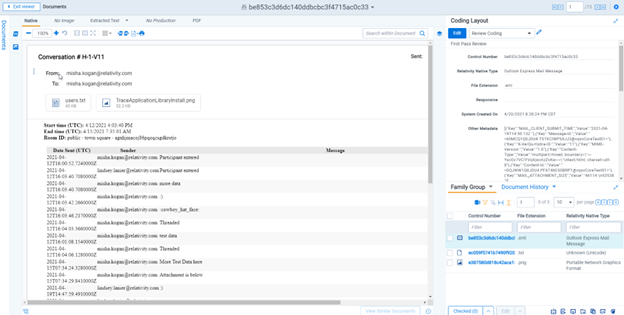

# Mattermost Chat
{: .no_toc }

Data can be collected from the Mattermost Chat via existing connectors.
{: .fs-6 .fw-300 }

1. TOC
[TOC]

---

## Requirements 

Before using this data source, note the following license requirements, version support, and special considerations.

### License requirements

-  A valid Mattermost Enterprise license. 

### Versions supported

The following versions of Mattermost Enterprise are supported:

- Mattermost Enterprise Edition E20 and above
  - Compliance Export Beta must be enabled

## Considerations

Note the following considerations about this data source:

- Mattermost keeps all data forever by default.

Date range advancement works slightly differently for Mattermost than for other data sources. Mattermost: 

- Relies on the name of the source folder drops.
- Remember the last end date range from the drop folder and does not process older/processed data. 

## Information captured 

This section lists what activities and, if applicable, metadata are captured when you use this data source.

### Activities captured

All Mattermost activities, including edits and deletes, are captured.

The following is an example of a captured Mattermost item:

## Setup instructions

This section provides details on the prerequisites and steps for setting up this data source.

### Prerequisites

You must have the following in order to complete the setup instructions for this data source.

#### Company specific prerequisites

You must have the following permissions to use this data source:

- MatterMost server - rights to deploy and execute .sh script on schedule via CRON.
- Administrator rights on the Trace Server to create a shared folder.
- Shared folder must be accessible via UNC by the MatterMost server.

### Setup in Trace

The following sections provide the steps for installing the VerQu On-Premises Application to collect the data locally, how to use a data transfer method for moving data to RelativityOne, and how to configure the data source in Relativity Trace.

#### VerQu On-Premises Application for Data Collection

1. Navigate to the [Using VerQu]({{ site.baseurl }}) and install, configure, and schedule VerQu.

Some data source specific configuration is required while following the [Using VerQu]({{ site.baseurl }}) steps. That configuration can be found below.

1. Locate the **Mattermost-Trace-Sample-Config.json** file.

1. Use the screenshots and table below as a guide to update the values within those files.

   
   

   | Setting              | Notes                                                        |
   | -------------------- | ------------------------------------------------------------ |
   | **Temp**             | The folder path where temporal data might be placed          |
   | **Path**             | The path to the root of exports created by Mattermost Compliance Export CLI |
   | **SubjectPrefix**    | By default, the subject prefix for EMLs will be “Mattermost Conversation #” – but can be configured to anything |
   | **DateStart**        | The date to use as start date for daily processing           |
   | **Logname**          | A local file path where the log files for the application should be stored. Log path should always end with "verqu-{datetime}.log" |
   | **Destination**      | The locally accessible path of the folder that needs to ship files from exchange server (note the user running the service must have access) |
   | **ConnectionString** | This a standard SQL Server connection string that support all possible ways of connecting to SQL Server, including Windows Authentication and SQL Server Authentication. |

1. Save the .json configuration files and navigate back to the [Using VerQu]({{ site.baseurl }}) documentation to complete the steps to configure VerQu.

[comment]: <> (It's difficult to tell which of the information from the Word doc for the Mattermost source is already accounted for in the existing "Using Verqu" documentation and which content needs to be included as Mattermost-specific content in this topic; for example, it's unclear whether the entire section titled "Create the script to run data exports on schedule (Step #5 in the sequence diagram above" needs to be here or not.)

### Data Transfer

[Shipper]({{ site.baseurl }}) will be used to transfer on-premises data collected by the VerQu application to Relativity Trace in the cloud.

### Data Source

Use the "Setting Up Data Sources in Relativity" section of the [Shipper]({{ site.baseurl }}) documentation to configure the Data Source.