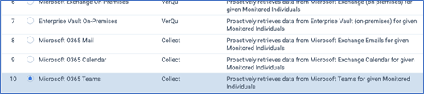
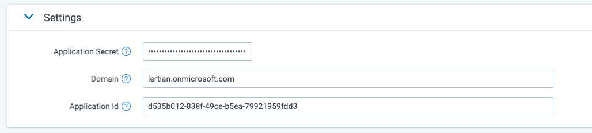

# Microsoft O365 Teams Chat
{: .no_toc }

This topic provides details on how to capture Microsoft Office 365 Teams Chat messages via Collect.
{: .fs-6 .fw-300 }

1. TOC
{:toc}

---

## Requirements 

Before using this data source, note the following license requirements, version support, and special considerations.

### License requirements

The following licenses are required to use this data source:

- Microsoft 365 E5/A5/G5

**OR**

- Microsoft 365 E3 plus one of the following:
  - Microsoft 365 E5 Security Add-on
  - Microsoft 365 E5 Compliance Add-on
  - Microsoft 365 E5 Information Protection and Governance Add-on
  - Microsoft 365 E5 Information Protection & Data Loss Prevention Add-on

For more details on Microsoft 365 requirements, see [Accessing Microsoft 365 tenants](https://help.relativity.com/RelativityOne/Content/Collect/Accessing_Microsoft_365_tenants.htm) on the Relativity documentation site.

### Versions supported

We support Microsoft 365 E3, E5, A5, and G5.

## Considerations

Note the following considerations about this data source:

### Data Access
- The connector can access data regardless of the geographic location the data resides in when [Microsoft Multi-Geo](https://docs.microsoft.com/en-us/microsoft-365/enterprise/multi-geo-capabilities-in-teams-in-microsoft-365?view=o365-worldwide) capabilities have been implemented.

### Data Filtering

There are two levels of filtering data:
- **Data Source** - data is being filtered according to specified Monitored Individuals. No filter is applied at message level. So, if a Monitored Individual exists in a channel, we will ingest the whole conversation for the day. If a conversation does not have any Monitored Individuals as participants for that day, we don’t ingest the conversation at all.
- **Data Batch**- only messages with data for the date that matches the Data Batch collection period will be captured. For example, a message that has been exported for 10/1/2021 will be captured by the Data Batch that has collection period from “10/1/2021 00:00” to “10/2/2021 00:00”.

### Chat content

Note the following considerations about how chat content is captured:
- Mentions are captured as plain text. 
- Formatted text is captured as plain text. 
- Numbered rows are captured as a single line.
- Team meetings are captured as message placeholder.
- Emojis are collected as plain text.

### Data Format

Slack content will be displayed in the Relativity Short Message Format (RSMF) in the Relativity Viewer to provide reviewers with a native chat like review experience. You can find more information on the Relativity Short Message Format [here](https://help.relativity.com/RelativityOne/Content/System_Guides/Relativity_Short_Message_Format/Relativity_Short_Message_Format.htm).

## Information captured 

This section lists what activities and, if applicable, metadata are captured when you use this data source.

### Activities captured

The following table lists activities captured by this data source:

| Activity                                                 | Notes                                                        |
| -------------------------------------------------------- | ------------------------------------------------------------ |
| Combined chats                                           | Chats are combined into easy-to-read threads                 |
| One-on-one chat messages                                 |                                                              |
| Group chat messages                                      |                                                              |
| Public team messages                                     | Applies to both public and private channels                  |
| Private team messages                                    | Applies to both public and private channels                  |
| Organization-wide team messages                          | Applies to both public and private channels                  |
| Last version of edited messages                          |                                                              |
| Chat meetings                                            | Includes chats via internal Teams video calls only, not external |
| Attachments                                              | This includes archived attachments and Audio and Video attachments   |
| Stickers                                                 |                                                              |
| Images                                                   |                                                              |
| Code snippets                                            |                                                              |
| Message count metadata                                   |                                                              |
| Attachment count metadata                                |                                                              |
| Message title                                            |                                                              |
| Deleted messages                                         |                                                              |
| Data for accurate search and retrieval during eDiscovery | Includes preserved metadata and  original message time       |

### Activities not captured

The following table lists activities not captured by this data source:

| Activity not captured                                        | Notes                                                |
| ------------------------------------------------------------ | ---------------------------------------------------- |
| GIF collection                                               |                                                      |
| Reaction collection                                          | MS Export API does not yet support this              |
| Summary record collection for every Microsoft Teams meeting or call |                                                      |
| User profile images                                          |                                                      |
| Chats during externally-hosted Teams video calls             |                                                      |
| Participant leaving/being deleted from the channel           | Participant is captured only if they wrote a message |
| Self Chats           | These are messages that a user sends to themself |
| Messages submitted by unlicensed O365 User                    | Microsoft Export API does not support the collection of this data                  |

### Metadata captured

The following table lists metadata captured by this data source:

| Field                  | Description                                                  |
| ---------------------- | ------------------------------------------------------------ |
| DATE                   | Start date of a chat or start date of a slice in the chat split into slices |
| SUBJECT                | Friendly name of the team and channel                         |
| FROM                   | The first person to send a message in that respective slice  |
| TO                     | Chat attendees                                               |
| CONVERSATION-ID        | Unique identifier - when creating a data mapping, set **Read From Other Metadata Column** to Yes. |
| X-RSMF-EndDate:         | End date of the chat/slice - when creating a data mapping, set **Read From Other Metadata Column** to Yes. |
| X-RSMF-EventCount:    | Number of messages in the chat/slice - when creating a data mapping, set **Read From Other Metadata Column** to Yes. |
| X-RSMF-AttachmentCount: | Number of attachments in the chat/slice - when creating a data mapping, set **Read From Other Metadata Column** to Yes. |

A "Slice" of data refers to a start and end time of data that will be captured in one Relativity Document. Unless specified, a slice will contain one days worth of data.
{: .info}

## Setup instructions

This section provides details on the prerequisites and steps for setting up this data source.

### Prerequisites

You must have the following in order to complete the setup instructions for this data source.

#### Standard prerequisites

Prior to creating the Data Source, install the Collect application and configure the appropriate instance settings by following the [Using Relativity Collect](https://relativitydev.github.io/relativity-trace-documentation/docs/administrator_guide/collection/general_data_source_information/using_relativity_collect.html) page.

#### Company specific prerequisites

You must have the following company-provided information to complete the authentication steps that precede setting up the data source:

- Access to the Azure portal and an active account
- A Client Secret
- An O365 domain name
- An Application / Client ID

#### Data transfer prerequisites

You must have the following information to complete the data transfer.

- An application ID
- A Client secret
- An O365 domain name

### Authentication

Before configuring the data source complete the following authentication steps. 

We strongly recommend registering a separate Azure Application for each Data Source.

Try to avoid running parallel Teams connections from the same Azure Application as Microsoft will throttle calls causing collection jobs to fail.
{: .warn }

To register your app:

1. Open your [Azure Portal](https://portal.azure.com/). 
1. Click **More Services**. 
1. Search for and select **Azure Active Directory**. 
1. In the left-navigation menu, click **App registrations**. 
1. Click **New Registration**. This will open the Register an application page. 
1. Enter an application name in the **Name** field. 
1. Select **Accounts** in this organizational directory only as the supported account type. 
1. Enter the redirect URL, http://localhost/ or https://localhost/, as the sign-on URL. 
1. Click **Register**. For more information on registering an application in Azure, see [Microsoft's documentation](https://docs.microsoft.com/en-us/azure/active-directory/develop/quickstart-register-app). 

From the app's page, add permissions to the web API: 

1. Click **API Permissions**. 
2. Click **Add a permission**. 
3. Click **Microsoft Graph**. 
4. Select **Application Permissions**. 
5. Select the following options from the **Application Permissions** section: 
   - ChannelMessage.Read.All.
   - Chat.Read.All. 
   - Directory.Read.All. 
   - Files.Read.All. 
   - Group.Read.All. 
   - Organization.Read.All. 
   - TeamsTab.Read.All. 
   - User.Read.All. 

6. Click **Add permissions**. 
7. Click **Grant Permission**. 

To request access to the protected APIs mentioned in this topic, complete the following [request form](https://forms.office.com/pages/responsepage.aspx?id=v4j5cvGGr0GRqy180BHbRzunGr4BpIZKrR2pxgnek8xURTVSUllZVFYyVlE4Tkw3UFZXSFZXN0I2WC4u). Microsoft review access requests every Wednesday and deploy approvals every Friday, except during major holiday weeks in the U.S. Submissions during those weeks will be processed the following non-holiday week. The person who submits the above form to Microsoft needs to receive confirmation from Microsoft that permission has been granted. For additional details about Teams security, contact Trace support. 

Grant Admin consent for the API: 

1. Click the **API Permissions** tab. 
2. Click **Grant admin consent** for [tenant]. 
3. In the pop-up window, click **Accept**. If you do not have the ability to grant Admin consent for application permissions, you will need to find an Admin that can consent. 
4. Once clicked, the window will show all permissions granted. 
5. Verify all permissions have been granted. 
6. Click **Accept** to grant the permissions. 

Generate Client Secret:

1. In the left navigation menu, select **Certificates & secrets**. 
2. Select **New client secret**.
3. Enter a description in the **Description** text box. 
4. Set the expiration time frame to **Never**. 
5. Click **Add**. 
6. Click on the clipboard and copy secret to clipboard to paste in your text document. Save this secret, as you will need it to set up your data sources in Trace. 

Microsoft will only show this secret this one time; there is no way to recover a secret if it is forgotten or lost. Make a note of the Application ID that Microsoft assigned to the app registration. This ID is also required for setup of data sources in Trace.
{: .info }

You will need the following information to complete setup of the data source from the Trace front end: 

  - Application ID 
  - Client Secret (copy the **Value** field) 
  - Domain (mycompanydomain.com)

Make sure you copy the **Value** field item for your Client Secret. Do not accidentally copy the Secret ID item as this is not the your Client Secret.
{: .warn }

Limit the access of Relativity Collect to specific Microsoft user accounts and mailboxes by using the New-ApplicationAccessPolicy Powershell cmdlet. For more information, see [Microsoft documentation](https://docs.microsoft.com/en-us/graph/auth-limit-mailbox-access).
{: .info }

### Setup in Trace

The following sections provide the steps for installing Collect and configuring the data source.

#### Collect

Prior to creating the Data Source, install the Collect application and configure the appropriate instance settings by following the [Using Relativity Collect]({{ site.baseurl }}) page.

#### Data source

Most parameters work the same for all Collect Data Sources. Follow the instructions from [Sections of a Data Source]( https://relativitydev.github.io/relativity-trace-documentation/docs/administrator_guide/collection/data_sources.html#data-source-details).

**O365 Teams specific parameters:**

In **General** section, select **Microsoft O365 Teams** for the **Data Source Type**.

In **Settings** section:

1. **Application Secret:** The Client Secret provided by the client (see [Authentication](#authentication) for more details).
   - The following is an example of an application secret, which includes random chars and numbers: NMubGVcDqkwwGnCs6fa01tqlkTisfUd4pBBYgcxxx=
2. **Domain**: The O365 domain name provided by the client.
3. **Application Id**: Application / Client ID provided by the client. For example, 53ba6f2b-6d52-4f5c-8ae0-7adc20808854

In **Advanced Configuration** section, do the following:

1. **Frequency in Minutes** - enter 1440.
2. **Merge Batches During Cold Start**: enter True.
3. **Max Number of Batches To Merge** - enter 7.
4. **Collection Period Offset in Minutes** - enter 0.