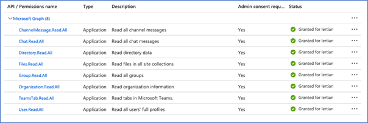

# Office 365 Teams Chat (via Collect)

{: .no_toc }

This topic provides details on how to capture Microsoft Office 365 Email and Calendar messages via Collect.
{: .fs-6 .fw-300 }

1. TOC

{:toc}

---

## Requirements 

Before using this data source, note the following license requirements, version support, and special considerations.

### License requirements

The following licenses are required to use this data source:

### Versions supported

## Considerations

Note the following considerations about this data source:

### Mailbox Collection

### Email Collection

- 

### Email Content

- 

### Data Filtering

- - 

## Information captured 

This section lists what activities and, if applicable, metadata are captured when you use this data source.

### Activities captured

The following table lists activities captured by this data source:

| Activity | Notes |
| -------- | ----- |
|          |       |
|          |       |
|          |       |
|          |       |
|          |       |
|          |       |
|          |       |

### Activities not captured

The following table lists activities not captured by this data source:

| Activity not captured | Notes |
| --------------------- | ----- |
|                       |       |
|                       |       |

## Setup instructions

This section provides details on the prerequisites and steps for setting up this data source.

### Prerequisites

You must have the following in order to complete the setup instructions for this data source.

#### Standard prerequisites

You must have Collect installed in the workspace to set up this data source, since Collect will be used for data retrieval. 

For details on installing Collect, see [Using Relativity Collect]({{ site.baseurl }}).

#### Company specific prerequisites

You must have the following company-provided information to complete the authentication steps that precede setting up the data source:

- 

#### Data transfer prerequisites

You must have the following information to complete the data transfer.

- 

### Authentication

Before configuring the data source complete the following authentication steps. 

We strongly recommend registering a separate Azure Application for each Data Source.
{: .info }

To register your app:

1. Open your [Azure Portal](https://portal.azure.com/). 
1. Click **More Services**. 
1. Search for and select **Azure Active Directory**. 
1. In the left-navigation menu, click **App registrations**. 
1. Click **New Registration**. This will open the Register an application page. 
1. Enter an application name in the **Name** field. 
1. Select **Accounts** in this organizational directory only as the supported account type. 
1. Enter the redirect URL, http://localhost/ or https://localhost/, as the sign-on URL. 
1. Click **Register**. For more information on registering an application in Azure, see [Microsoft's documentation](https://docs.microsoft.com/en-us/azure/active-directory/develop/quickstart-register-app). 

From the app's page, add permissions to the web API: 

1. Click **API Permissions**. 
2. Click **Add a permission**. 
3. Click **Microsoft Graph**. 
4. Select **Application Permissions**. 
5. Select the following options from the **Application Permissions** section: 
   - ChannelMessage.Read.All.
   - Chat.Read.All. 
   - Directory.Read.All. 
   - Files.Read.All. 
   - Group.Read.All. 
   - Organization.Read.All. 
   - TeamsTab.Read.All. 
   - User.Read.All. 

6. Click **Add permissions**. 
7. Click **Grant Permission**. 

Grant Admin consent for the API: 

1. Click the **API Permissions** tab. 
2. Click **Grant admin consent** for [tenant]. 
3. In the pop-up window, click **Accept**. If you do not have the ability to grant Admin consent for application permissions, you will need to find an Admin that can consent. 
4. Once clicked, the window will show all permissions granted. 
5. Verify all permissions have been granted. 
6. Click **Accept** to grant the permissions. 

Generate Client Secret:

1. In the left navigation menu, select **Certificates & secrets**. 
2. Select **New client secret**.
3. Enter a description in the **Description** text box. 
4. Set the expiration time frame to **Never**. 
5. Click **Add**. 
6. Click on the clipboard and copy secret to clipboard to paste in your text document. Save this secret, as you will need it to set up your data sources in Trace. 

Microsoft will only show this secret this one time; there is no way to recover a secret if it is forgotten or lost. Make a note of the Application ID that Microsoft assigned to the app registration. This ID is also required for setup of data sources in Trace.
{: .info }

You will need the following information to complete setup of the data source from the Trace front end: 

  - Application ID 
  - Client Secret (copy the **Value** field) 
  - Domain (mycompanydomain.com)

Make sure you copy the **Value** field item for your Client Secret. Do not accidentally copy the Secret ID item as this is not the your Client Secret.
{: .warn }

Limit the access of Relativity Collect to specific Microsoft user accounts and mailboxes by using the New-ApplicationAccessPolicy Powershell cmdlet. For more information, see [Microsoft documentation](https://docs.microsoft.com/en-us/graph/auth-limit-mailbox-access).
{: .info }

### Setup in Trace

The following sections provide the steps for installing Collect and configuring the data source.

#### Collect

Prior to creating the Data Source, install the Collect application and configure the appropriate instance settings by following the [Using Relativity Collect]({{ site.baseurl }}) page.

#### Data source

Most parameters work the same for all Collect Data Sources. Follow the instructions from [common_collect_data_source_functionality]({{ site.baseurl }}) section. 

O365 Mail and Calendar specific parameters: 

General section: 

1. **Data Source Type**: Select Microsoft O365 Mail or Calendar. 

​	

Credentials section: 

1. **Application Secret:** The Client Secret provided by the client (see [Authentication](#authentication) for more details). 
2. Data Source Specific Fields section
   - **Collect Draft items**: True or False (default)**.** False is default setting due to the nature of drafts (they are not sent we don’t want to risk false positives). 
   - **Domain**: The O365 domain name provided by the client. 
   - **Application Id**: Application / Client ID provided by the client. 
   - **Use Quick Discovery**: True 
   - **Frequency in Minutes**: 60 
   - **Number of Monitored Individual Per job**: 100 
   - **Collection Period Offset in Minutes**: 0 

 