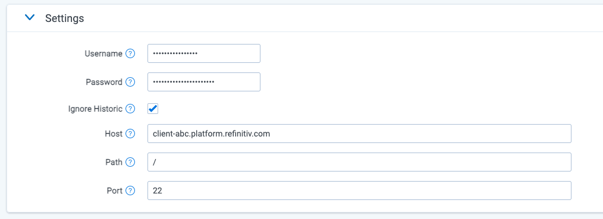

# Refinitiv Eikon Chat
{: .no_toc }

This topic provides details on how to capture Refinitiv Eikon Chat (aka Eikon Messenger) via Collect.
{: .fs-6 .fw-300 }

1. TOC
{:toc}

---

## Overview

The connector is pulling data directly from Cloud.

## Versions supported

There are no specific version requirements.

## Activity Captured

- **Chat2email** functionality no longer supported by Refinitiv.
- Potentially duplicative data from History Requests cannot be filtered out.

## Metadata 

In addition to standard metadata populated during extracting data, the Eikon Chat Data Source captures the following ones: 

| Field                                       | Description                                                  |
| ------------------------------------------- | ------------------------------------------------------------ |
| DATE                                        | Start date of a chat or start date of a slice in the chat split into slices. |
| SUBJECT                                     | Friendly name of the team and channel.                       |
| FROM                                        | The first person to send a message in that respective slice. |
| TO                                          | Chat attendees.                                              |
| CONVERSATION-ID                             | The unique identifier. When creating a Data Mapping, set “Read From Other Metadata Column” to “Yes.” |
| X-RSMF-EndDate                              | Number of messages in the chat / slice. When creating a Data Mapping, set “Read From Other Metadata Column” to “Yes.” |
| Distribution list emailsX-RSMF-EventCount | A copy of any email sent to a distribution list is captured from each mailbox that is on the distribution list. A distribution list itself is not a mailbox. |
| X-RSMF-AttachmentCount                      | Number of attachments in the chat / slice. When creating a Data Mapping, set “Read From Other Metadata Column” to “Yes.” |

A "Slice" of data refers to a start and end time of data that will be captured in one Relativity Document. Unless specified, a slice will contain one days worth of data.
{: .info}

## Document View

Eikon Chat content will be displayed in the Relativity Short Message Format (RSMF) in the Relativity Viewer to provide reviewers with a native chat like review experience. You can find more information on the Relativity Short Message Format [here](https://help.relativity.com/RelativityOne/Content/System_Guides/Relativity_Short_Message_Format/Relativity_Short_Message_Format.htm).

## Data Filtering

There are two levels of filtering data:

- **Data Source** - Data is being filtered according to specified Monitored Individuals. No filter is applied at message level. So, if a Monitored Individual exists in a channel, we will ingest the whole conversation for the day. If a conversation does not have any Monitored Individuals as participants for that day, we don’t ingest the conversation at all.

- **Data Batch** - Only messages with data for the date that matches the Data Batch collection period will be captured. For example, a message that has been exported for 10/1/2021 will be captured by the Data Batch that has collection period from “10/1/2021 00:00” to “10/2/2021 00:00”.

## Setup in Trace 

This section provides details on the prerequisites and steps for setting up this data source.

### Obtaining Credentials

Obtain the following information about Eikon Chat SFTP server: 
1. Host.
2. Path.
3. TCP Port.
4. User and password.

### Whitelist Relativity IP Addresses

Bloomberg must add Relativity IP addresses to a whitelist so the system can connect and collect data. Please refer to the [IP Address Whitelisting Pre-work](https://relativitydev.github.io/relativity-trace-documentation/docs/administrator_guide/collection/general_data_source_information/common_collect_data_source_functionality.html#ip-address-whitelisting-pre-work) for more details.

### Collect

Prior to creating the Data Source, install the Collect application and configure the appropriate instance settings by following the [Using Relativity Collect](https://relativitydev.github.io/relativity-trace-documentation/docs/administrator_guide/collection/general_data_source_information/using_relativity_collect.html) page.

### Data source

Most parameters work the same for all Collect Data Sources. Follow the instructions from [Sections of a Data Source]( https://relativitydev.github.io/relativity-trace-documentation/docs/administrator_guide/collection/data_sources.html#data-source-details).

**Refinitiv Eikon Chat specific parameters:** 

In **General** section, select **Eikon Chat** for the **Data Source Type**.

In **Settings** section:

1. **Username:** SFTP user.
2. **Password:** SFTP password.
3. **Ignore Historic:** If set to `FALSE`, when a new user joins a chat, all of the messages that were sent since the last time they joined the chat will be collected. This can cause a lot of duplicative data collection. The default value is `TRUE`.
4. **Host:** SFTP location.
5. **Path:** Folder path on SFTP.
6. **Port:** TCP port number. Default value is 22.

In **Advanced Configuration** section, do the following:

1. **Frequency in Minutes** - enter 1440.
2. **Merge Batches During Cold Start**: enter True.
3. **Max Number of Batches To Merge** - enter 1.
4. **Collection Period Offset in Minutes** - enter 1440.