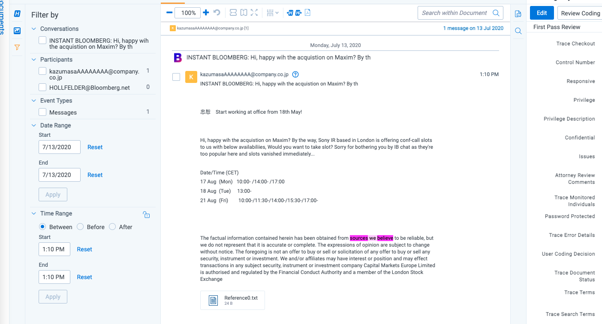

# Bloomberg Mail
{: .no_toc }

Data can be collected from Bloomberg Mail via existing connectors.
{: .fs-6 .fw-300 }

1. TOC
{:toc}

---

## Overview

The connector is pulling data directly from Cloud.

## Versions Supported

We support 1.3 as well as the latest 1.9 version.

## Activities Captured

The following activities are captured:
- Attachments (.att).
- Disclaimers (.dscl).
- Bloomberg Mail Messages (.msg).

## Metadata

In addition to standard (O365 Mail) metadata populated during extracting data, the Bloomberg Chat Data Source captures the following ones:
- **DATE** - start date of a chat or start date of a slice in the chat split into slices.
- **SUBJECT** - friendly name of the team and channel.
- **FROM** - the first person to send a message in that respective slice.
- **TO** - chat attendees.
- **CONVERSATION-ID** - the unique identifier. When creating a Data Mapping, set “Read From Other Metadata Column” to **Yes**.
- **X-RSMF-EndDate** - end date of the chat / slice. When creating a Data Mapping, set “Read From Other Metadata Column” to **Yes**.
- **X-RSMF-EventCount** - number of messages in the chat / slice. When creating a Data Mapping, set “Read From Other Metadata Column” to **Yes**.
- **X-RSMF-AttachmentCount** - number of attachments in the chat / slice. When creating a Data Mapping, set “Read From Other Metadata Column” to **Yes**.

## Document View

Similar to Chat, Bloomberg Mail messages are captured as RMFS (Relativity Short Message Format) files. Relativity has created a Viewer experience to help reviewing RSMF data. See [Relativity Short Message Format](https://help.relativity.com/RelativityOne/Content/System_Guides/Relativity_Short_Message_Format/Relativity_Short_Message_Format.htm) for more details.

## Data Filtering

There are two levels of filtering data, which are the same for Bloomberg Mail (via Collect):
- **Data Source -** Data is being filtered according to specified Monitored Individuals (MI). No filter is applied at the message level. So, if MI exists in a channel, we will ingest the whole conversation for a given slice. If the conversation does not have any MIs in participants for that day, we do not ingest conversation at all.
- **Data Batch -** Only messages with data for the date that matches Data Batch collection period will be captured. For example, a message that has been exported for 10/1/2021 will be captured by the Data Batch that has collection period from “10/1/2021 00:00” to “10/2/2021 00:00”.

## Setup in Trace

Setup instruction is almost the same as for Bloomberg Chat and PChat. The only difference is to choose **Bloomberg Mail** for the Data Source Type when setting up Trace Data Source.

See [Bloomberg Chat & PChat Setup Instruction](https://relativitydev.github.io/relativity-trace-documentation/docs/administrator_guide/collection/all_data_sources/chat_data_sources/bloomberg_chat_pchat_via_collect.html) for more details.