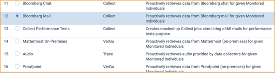

# Bloomberg Mail
{: .no_toc }

---
layout: default
title: Bloomberg Mail
nav_exclude: true

---

This topic provides details on how to capture Bloomberg Mail via Collect.
{: .fs-6 .fw-300 }

1. TOC

{:toc}

---

## Requirements 

Before using this data source, note the following license requirements, version support, and special considerations.

**DEPLOYMENT OPTION B** is required for this setup

### License requirements

The following licenses are required to use this data source:

- 

### Versions supported

Versions 1.6 - 1.9

## Considerations

Note the following considerations about this data source:

### Mailbox Collection

- 

### Email Collection

- 

### Email Content

- 

### Data Filtering

- - 

## Information captured 

This section lists what activities and, if applicable, metadata are captured when you use this data source.

### Activities captured

The following table lists activities captured by this data source:

| Activity                   | Notes                |
| -------------------------- | -------------------- |
| Attachments                | (.att)               |
| Disclaimers                | (.dscl)              |
| Instant Bloomberg Messages | (Chat & PChat) (.ib) |

### Metadata

In addition to standard metadata populated during extracting data, the O365 Teams Data Source captures the following ones:

| Term                     | Definition                                                   |
| ------------------------ | ------------------------------------------------------------ |
| "DATE"                   | Start date of a chat or start date of a slice in the chat split into slice |
| "SUBJECT"                | Friendly name of the team and channel                        |
| "FROM"                   | The first person to send a message in that respective slice  |
| "TO"                     | Chat attendees                                               |
| "CONVERSATION-ID"        | The unique identifier; when creating a data mapping set "Read From Other Metadata Column" to "Yes". |
| "X-RSMF-EndDate"         | End date of the chat / slice; when creating a data mapping set "Read From Other Metadata Column" to "Yes". |
| "X-RSMF-MessageCount"    | The number of messages in the chat / slice; when creating a data mapping set "Read From Other Metadata Column" to "Yes". |
| "X-RSMF-AttachmentCount" | The number of attachments in the chat / slice; when creating a data mapping set "Read From Other Metadata Column" to "Yes". |

## Setup instructions

This section provides details on the prerequisites and steps for setting up Bloomberg Mail via Collect.

### Prerequisites

You must have the following in order to complete the setup instructions for this data source.

#### Standard prerequisites

You must have Collect installed in the workspace to set up this data source, since Collect will be used for data retrieval. 

For details on installing Collect, see [Using Relativity Collect]({{ site.baseurl }}).

#### Company specific prerequisites

You must have the following company-provided information to complete the authentication steps that precede setting up the data source:

#### Bloomberg configuration

Obtain SFTP host and port number

Obtain the following information about Bloomberg SFTP server:

1. **Host** and **Port**

2. **User** and **password**.

If Bloomberg message are encrypted obtain the following information:

1. **PGP** Key (Private Key)

2. Passphrase.

#### Data transfer prerequisites

You must have the following information to complete the data transfer.

- 

### Setup in Trace

The following sections provide the steps for installing Collect and configuring the data source.

#### Collect

Prior to creating the Data Source, install the Collect application and configure the appropriate instance settings by following the [Using Relativity Collect]({{ site.baseurl }}) page.

#### Data source

Most parameters work the same for all Collect Data Sources. Follow the instructions from [common_collect_data_source_functionality]({{ site.baseurl }}) section. 

Bloomberg Mail specific parameters: 

General section: 

1. **Data Source Type**: Bloomberg Mail

Settings section:

1. Username: SFTP user

2. Password: SFTP password

3. PGP Key: PGP Key used for message encryption

4. Passphrase: PGP Passphrase used for message encryption

5. Host: SFTP location

6. Path: Folder path on SFTP

7. Port: TCP port number. Default value is 22. 

8. Use Pgp Encryption:

   - True - decrypt a source file with "PGP Key" and "Passphrase".

   - False - otherwise

   

Credentials section: 

1. **Application Secret:** The Client Secret provided by the client (see [Authentication](#authentication) for more details). 
2. Data Source Specific Fields section
   - **Collect Draft items**: True or False (default)**.** False is default setting due to the nature of drafts (they are not sent we don’t want to risk false positives). 
   - **Domain**: The O365 domain name provided by the client. 
   - **Application Id**: Application / Client ID provided by the client. 
   - **Use Quick Discovery**: True 
   - **Frequency in Minutes**: 60 
   - **Number of Monitored Individual Per job**: 100 
   - **Collection Period Offset in Minutes**: 0 

 

Data can be collected from Bloomberg Mail via existing connectors.
{: .fs-6 .fw-300 }

1. TOC

2. 

{:toc}

---

## Overview
Public documentation is coming soon. For complete documentation please contact [support@relativity.com](mailto:support@relativity.com).