# Google Suite
{: .no_toc }

As Google Workspace is highly integrated platform having as a goal for the user to seamlessly use Mail, Chat and Drive (file storage and collaboration) from same interface - it can be seen as single Data Source. In Trace as we want to take advantage of our specific formats for separate source types (EML for Mails, RSMF for Chats) we are managing GSuite through three separate Data Sources: 

- GMail (for emails)

- GChat (for chat data)
- Google Drive (for file storage and collaboration)

{: .fs-6 .fw-300 }

1. TOC
{:toc}

---

## Requirements 

Before using this data source, note the following license requirements, version support, and special considerations.

### License requirements

The following licenses are required to use this data source:

- Google Workspace Enterprise/Business license required (due to need for accessing Google Vault which is missing from G Suite Basic licenses)

## Considerations

Note the following considerations about this data source:

- The collection range ignores Hours, Minutes, Seconds (granularity on level of Day).
- We are collecting with 24 offset (collecting data from day now-1).

### Data Filtering

There are two levels of filtering data: 

- Data Source - data is being filtered according to specified Monitored Individuals. No filter is applied at message level. So, if MI exists in a channel, we will ingest the whole conversation for a given slice. If conversation does not have any Mis in participants for that day, we don’t ingest conversation at all. 

- Data Batch - only messages with data for the date that matches Data Batch collection period will be captured. For example, a message that has been exported for 10/1/2021 will be captured by the Data Batch that has collection period from “10/1/2021 00:00” to “10/2/2021 00:00”.

## Information captured 

This section lists what activities and, if applicable, metadata are captured when you use this data source.

### Activities captured

The following tables list activities captured by this data source:

#### Gmail

| Activity                  | Notes |
| ------------------------- | ----- |
| Messages with attachments |       |
| Meeting request           |       |
| Meeting cancellations     |       |

#### GChat

| Activity                     | Notes                                                    |
| ---------------------------- | -------------------------------------------------------- |
| One-on-one chat messages     |                                                          |
| Group chat messages          |                                                          |
| Space chat messages          |                                                          |
| Space threaded chat messages |                                                          |
| Attachments                  |                                                          |
| Emojis                       | These are captured as text.                              |
| Deletes                      | These include the deleted message and the event itself.  |
| Edits                        | These include the message before and after it is edited. |
| Message reactions            |                                                          |
| Files delete event           |                                                          |
| Video chat meeting           |                                                          |
| Stickers                     |                                                          |
| Images                       |                                                          |

#### Google Drive

| Activity                  | Notes                                                        |
| ------------------------- | ------------------------------------------------------------ |
| Files and file operations | These include the following actions: added, copied, deleted, downloaded, edited, moved, permanently deleted, renamed, restored, reverted, and rolled back. |
| Comments                  | These include the following actions: added, deleted, and edited. |
| Shared content            | These include the following actions: add invitees, add members, copy, view, and unshare. |
| Shared folder             | These include the following actions: create, mount, and unmount. |
| Shared link               | These include the following actions: create, copy, download, and view. |

### Activities not captured

The following tables list activities not captured by this data source:

#### Gmail

| Activity not captured                  | Notes                                                        |
| -------------------------------------- | ------------------------------------------------------------ |
| Chat conversation in Email data source | **Workaround:** Mapping in ingestion profile from metadata value “**Labels**:” which contains tags indicating origins of the message (including **^Chat**) |

#### GChat

| Activity not captured          | Notes                                      |
| ------------------------------ | ------------------------------------------ |
| Message reactions in RSMF      |                                            |
| Video Calls in RSMF            |                                            |
| Calendar Event details in RSMF | The only information is *“Event created”*. |

Other notes:

- You cannot collect if the MI list consists of even a single unlicensed / disabled account.
- Attachments are duplicated after each edit/delete of the message containing attachment.

#### Google Drive

| Activity not captured                               | Notes |
| --------------------------------------------------- | ----- |
| Information about the event which caused collection |       |

### Metadata captured

In addition to standard metadata populated during extracting data, the GSuite Data Source captures the following:

| Fields                                                       | Description                                                  |
| ------------------------------------------------------------ | ------------------------------------------------------------ |
| “DATE” Start date of a chat or start date of a slice in the chat split into slices. |                                                              |
| “SUBJECT” Friendly name of the team and channel.             |                                                              |
| “FROM” The first person to send a message in that respective slice. |                                                              |
| “TO” Chat attendees.                                         |                                                              |
| “CONVERSATION-ID:” The unique identifier.                    | When creating a Data Mapping, set “Read From Other Metadata Column” to “Yes”. |
| “X-RSMF-EndDate:” End date of the chat / slice.              | When creating a Data Mapping, set “Read From Other Metadata Column” to “Yes”. |
| “X-RSMF-MessageCount:” # messages in the chat / slice.       | When creating a Data Mapping, set “Read From Other Metadata Column” to “Yes”. |
| “X-RSMF-AttachmentCount:” # attachments in the chat / slice. | When creating a Data Mapping, set “Read From Other Metadata Column” to “Yes”. |

## Setup instructions

This section provides details on the prerequisites and steps for setting up this data source.

### Prerequisites

You must have the following in order to complete the setup instructions for this data source.

#### Standard prerequisites

Prior to creating the Data Source, install the Collect application and configure the appropriate instance settings by following the [Using Relativity Collect](https://relativitydev.github.io/relativity-trace-documentation/docs/administrator_guide/collection/general_data_source_information/using_relativity_collect.html) page.

### Authentication

Before configuring the data source, complete the following authentication steps:
- Required Google Workspace Credentials.
- Required Google Workspace User Account.
- Enable Required Privilages. 

#### Required Google Workspace Credentials Setup

##### Create Google Cloud Project

1. Open **Cloud Resource Manager** in **Google’s Cloud Console** https://console.cloud.google.com/cloud-resource-manager. 
2. Select an **Organization/Project** within which Trace will perform eDiscovery tasks. 
3. See https://cloud.google.com/resource-manager/docs/creating-managing-projects for more information. 

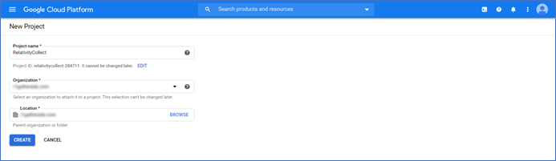

##### Enable required APIs for the Project

1. Open Google Cloud Console https://console.cloud.google.com/ and select newly created project.
2. Click on the **Navigation Menu** and select [**'APIs & Services**' → '**Library**'].
3. Find and enable **'Google Vault API'**. See https://cloud.google.com/service-usage/docs/enable-disable for more information.
4. Find and enable **'Admin SDK API**'
5. Find and enable **'Cloud Storage' API**.

*Note: **'Cloud Storage'** API may be enabled by default.*

##### Setup OAuth2 Consent Screen

1. Open **Google Cloud Console** https://console.cloud.google.com/ and select newly created project. 
2. Click on the **Navigation Menu** and select [**'APIs & Services**' → **'OAuth consent screen**'].
3. Select '**Internal'** type and click Create.
    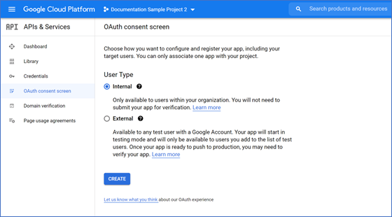
4. Enter descriptive **'App name'**, e.g., *Trace Collect* and provide **'User support email'** from within your organization.
   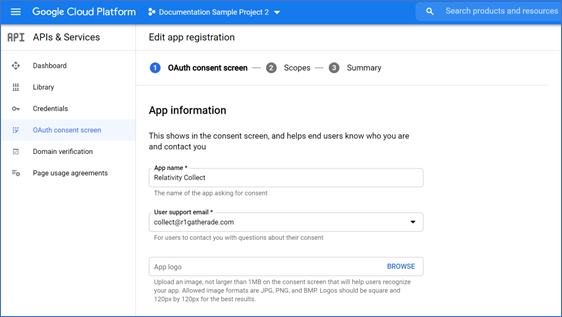
5. Enter *relativity.one* as **'Authorized domain'** and provide **'Developer contact information**' email from within your organization.
   
6. Click **'Save and continue'**. 
7. On the next step click **'Add or remove scopes'**. 
8. Either filter and select required scopes one-by-one or enter them in the text box. The scopes are: 
   - https://www.googleapis.com/auth/ediscovery 
   - https://www.googleapis.com/auth/devstorage.read_only 
   - https://www.googleapis.com/auth/admin.directory.user.readonly 
   - https://www.googleapis.com/auth/admin.directory.group.readonly
     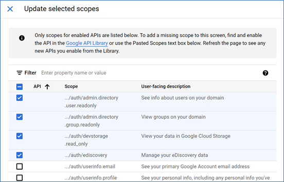
9. Click **'Update'** and then **'Save and continue'**. 

##### Create Credentials

1. Open Google Cloud Console https://console.cloud.google.com/ and select newly created project. 
2. Click on the Navigation Menu and select [**'APIs & Services'** → '**Credentials**'] 
3. Create new OAuth **Client ID** credentials 
4. For *Application Type* select *Web application* 
5. Enter required **'Name'**.
6. Add based on geo:
   - Asia (East)- https://services.esas.relativity.one/collect-oauth-authorization/index.html
   - Asia (Southeast) - https://services.seas.relativity.one/collect-oauth-authorization/index.html
   - Brazil (South) - https://services.brso.relativity.one/collect-oauth-authorization/index.html
   - Canada (Central) - https://services.cact.relativity.one/collect-oauth-authorization/index.html
   - Europe (North) - https://services.noeu.relativity.one/collect-oauth-authorization/index.html
   - Europe (West) - https://services.wseu.relativity.one/collect-oauth-authorization/index.html
   - Germany (West Central) - https://services.dect.relativity.one/collect-oauth-authorization/index.html
   - India (Central) - https://services.inct.relativity.one/collect-oauth-authorization/index.html
   - Korea (Central) - https://services.krct.relativity.one/collect-oauth-authorization/index.html
   - United Kingdom (South) - https://services.ukso.relativity.one/collect-oauth-authorization/index.html
   - United States (Central) - https://services.ctus.relativity.one/collect-oauth-authorization/index.html
   - United States (East) - https://services.esus.relativity.one/collect-oauth-authorization/index.html 
   - https://services.ctus.relativity.one/collect-oauth-authorization/index.html as 'Authorized redirect URI'. 
7. Click **'Create'** and take note of **Client ID** and **Client Secret** values.
   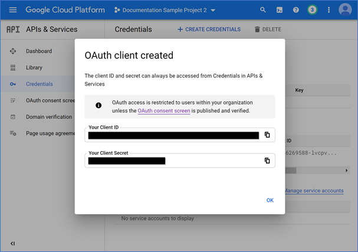

#### Required Google Workspace User Account Setup

*Collections require user account on which behalf Trace exports data. This can be a dedicated or an existing user account.*

##### Create admin role for Vault API

1. Open Google Admin page https://admin.google.com/ac/home. 

2. Click on the Navigation Menu and select [**'Account'** → **'Admin roles'**]. 

3. Click **'Create new role'**, enter required **'Name'** and click **'Continue'**.
   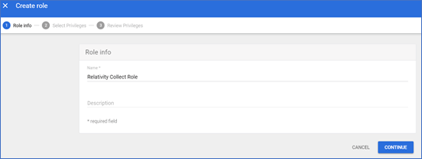

4. On the **'Admin console privileges'** scroll down to **'Google Vault**' and select the required privileges: 

   - Manage Matters 
   - Manage Searches 
   - Manage Exports
     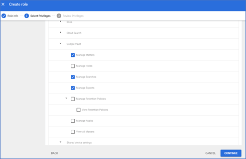
   
5. Click **'Continue'**, review assigned privileges and click **'Create Role'**. 

#####  Create admin role for the user accounts listing

1. Open Google Admin page https://admin.google.com/ac/home. 
2. Click on the Navigation Menu and select [**'Account'** → **'Admin roles'**].
3. Click **'Create new role'**, enter required **'Name'** and click **'Continue'**. 
4. On the **'Admin API privileges’** scroll down to **'Users'** and select the required privilege: 
   - Read 
5. Click **'Continue'**, review assigned privileges and click **'Create Role'**.
   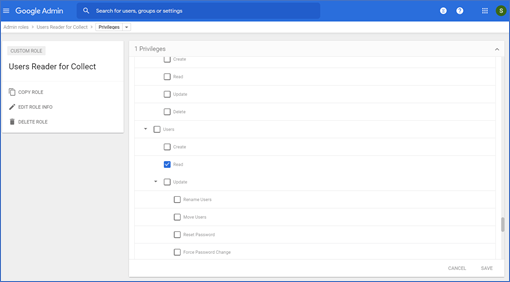

##### Create admin role for the groups listing

1. Open Google Admin page https://admin.google.com/ac/home. 

2. Click on the **Navigation Menu** and select [**'Account'** → **'Admin roles'**]. 

3. Click **'Create new role'**, enter required **'Name'** and click **'Continue'**. 

4. On the **'Admin API privileges’** scroll down to **'Users'** and select the required privilege: 
   - Read 
5. Click **'Continue'**, review assigned privileges and click **'Create Role'**.
   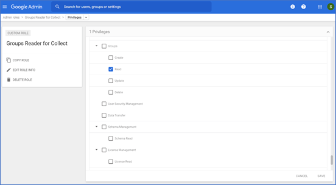

#### Enable Required Privileges

1. Open Google Admin page https://admin.google.com/ac/home. 

2. Click on the **Navigation Menu** and select [**'Directory'** → **'Users'**]. 

3. Create new or select existing user account.
   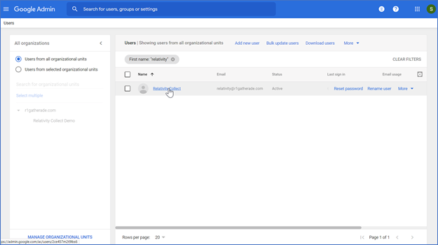

4. Select and expand **'Admin roles and privileges**' pane. 

5. Assign the following roles to the user in **'All organizational units'** scope.
   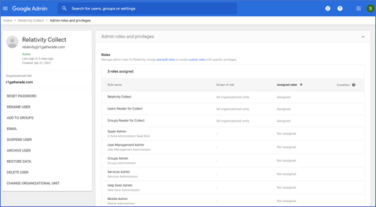

### Setup in Trace

The following sections provide the steps for installing Collect and configuring the data source.

#### Collect

Prior to creating the Data Source, install the Collect application and configure the appropriate instance settings by following the [Using Relativity Collect](https://relativitydev.github.io/relativity-trace-documentation/docs/administrator_guide/collection/general_data_source_information/using_relativity_collect.html) page.

#### Obtaining Application Token (in Trace)

This step should be done by a customer representative with access to the Google admin account.

1. In the Trace workspace, navigate to **Collect Admin**

2. Click the **New Collection Source Instance** button

3. Leave the data source name empty

4. Select **Gmail, Google Drive or Google Chat** as the data source
   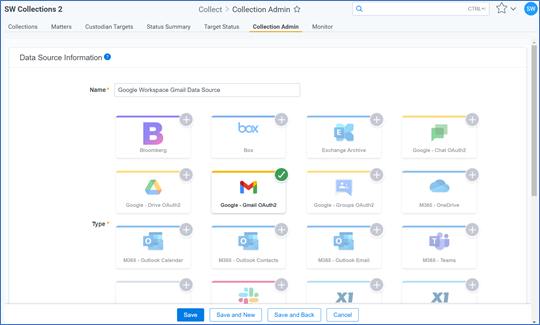

5. In the 'Settings' pane enter **'Client Id'** and **'Client Secret'** copied from Google’s OAuth2 credentials page.
   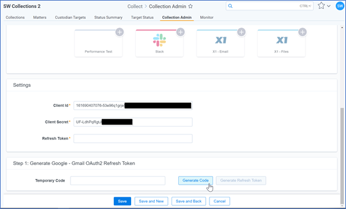

6. Click **'Generate Code'**. 

7. Select or sign into Google’s account on which behalf collections will be performed (see *Required Google Workspace User Account Setup* for details). 

8. Click **'Copy Temporary Code'** on the loaded page and close this window.
   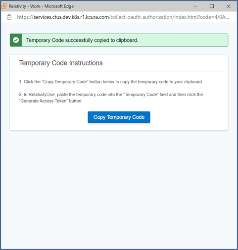

9. Paste **'Temporary Code'** into appropriate filed and click **'Generate Refresh Token'**. The **'Refresh Token'** field will be automatically populated.
   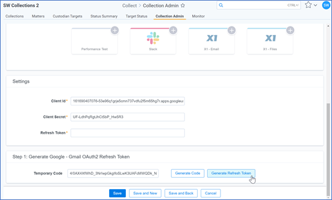

10. **Don’t click SAVE** – just copy the **Refresh Token**, click Cancel, and navigate to the **Trace Data Source** page.
    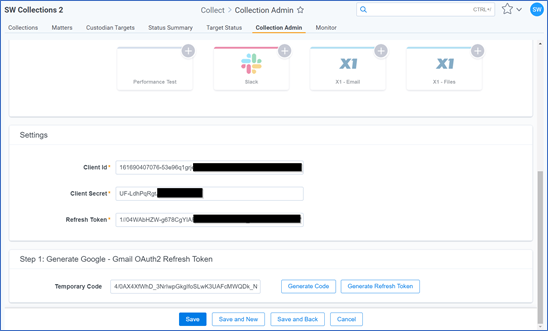

#### Configure Data source

Most parameters work the same for all Collect Data Sources. Follow the instructions from [Sections of a Data Source]( https://relativitydev.github.io/relativity-trace-documentation/docs/administrator_guide/collection/data_sources.html#data-source-details).

**GSuite (Gmail, Google Chat, Google Drive) specific parameters:**

1. General section: 
   - **Data Source Type**: Select **Google Gmail (Vault), Google Chat or Google Drive**.
     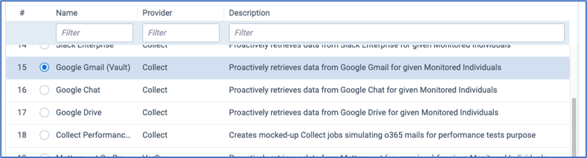

2. Credentials section: 
   - **Application Token**: Enter generated **Refresh Token**.
   - **Application Secret:** Enter generated **Application Secret**.

3. Data Source Specific Fields section:
   - Number of Monitored Individuals Per Job: **100**.
   - Client Id: **Captured Client Id**.
   - Frequency in Minutes: **1440**.
   - Merge Batches During Cold Start: **True**.
   - Max Number of Batches To Merge: **1**.
   - Collect Job Timeout In Minutes: **1440**.
   - Collection Period Offset in Minutes: **0**.

4. Set-up **DeDuplication** for this data source with following configuration:
   - Email Hashing - Use Binary Hash : **False**.
   - Email Hashing - Use Sender In Hash : **True**.
   - Email Hashing - Use Subject In Hash : **False**.
   - Email Hashing - Use Sent Date In Hash : **True**.
   - Email Hashing - Use Recipients In Hash : **True**.
   - Email Hashing - Use Body In Hash : **True**.
   - Email Hashing - Use Attachment List In Hash : **False**.