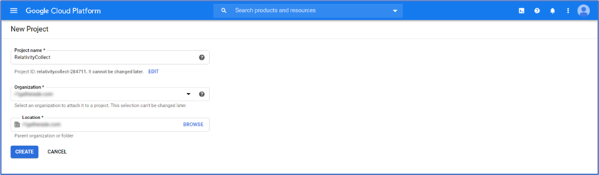
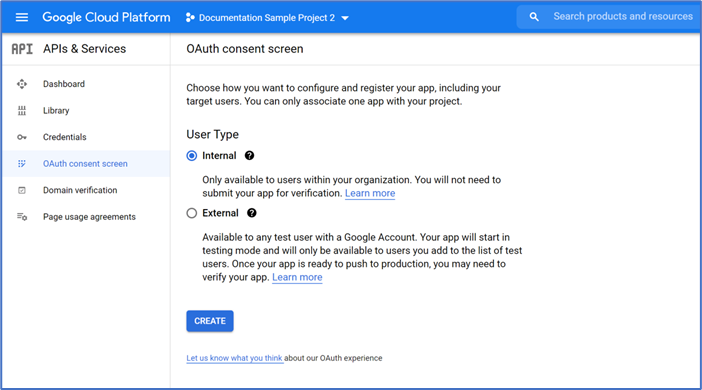

# Google Suite
{: .no_toc }

As Google Workspace is highly integrated platform having as a goal for the user to seamlessly use Mail, Chat and Drive (file storage and collaboration) from same interface - it can be seen as single Data Source. In Trace as we want to take advantage of our specific formats for separate source types (EML for Mails, RSMF for Chats) we are managing GSuite through three separate Data Sources: 

- GMail (for emails)

- GChat (for chat data)
- Google Drive (for file storage and collaboration)

{: .fs-6 .fw-300 }

1. TOC
{:toc}

---

## Requirements 

Before using this data source, note the following license requirements, version support, and special considerations.

### License requirements

The following licenses are required to use this data source:

- Google Workspace Enterprise/Business license required (due to need for accessing Google Vault which is missing from G Suite Basic licenses)

## Considerations

Note the following considerations about this data source:

- The collection range ignores Hours, Minutes, Seconds (granularity on level of Day).
- We are collecting with 24 offset (collecting data from day now-1).

### Data Filtering

- There are two levels of filtering data: 
  - Data Source - data is being filtered according to specified Monitored Individuals. No filter is applied at message level. So, if MI exists in a channel, we will ingest the whole conversation for a given slice. If conversation does not have any Mis in participants for that day, we don’t ingest conversation at all. 
  - Data Batch - only messages with data for the date that matches Data Batch collection period will be captured. For example, a message that has been exported for 10/1/2021 will be captured by the Data Batch that has collection period from “10/1/2021 00:00” to “10/2/2021 00:00”.

## Information captured 

This section lists what activities and, if applicable, metadata are captured when you use this data source.

### Activities captured

The following tables list activities captured by this data source:

#### Gmail

| Activity                  | Notes |
| ------------------------- | ----- |
| Messages with attachments |       |
| Meeting request           |       |
| Meeting cancellations     |       |

#### GChat

| Activity                     | Notes                                                    |
| ---------------------------- | -------------------------------------------------------- |
| One-on-one chat messages     |                                                          |
| Group chat messages          |                                                          |
| Space chat messages          |                                                          |
| Space threaded chat messages |                                                          |
| Attachments                  |                                                          |
| Emojis                       | These are captured as text.                              |
| Deletes                      | These include the deleted message and the event itself.  |
| Edits                        | These include the message before and after it is edited. |
| Message reactions            |                                                          |
| Files delete event           |                                                          |
| Video chat meeting           |                                                          |
| Stickers                     |                                                          |
| Images                       |                                                          |

#### Google Drive

| Activity                  | Notes                                                        |
| ------------------------- | ------------------------------------------------------------ |
| Files and file operations | These include the following actions: added, copied, deleted, downloaded, edited, moved, permanently deleted, renamed, restored, reverted, and rolled back. |
| Comments                  | These include the following actions: added, deleted, and edited. |
| Shared content            | These include the following actions: add invitees, add members, copy, view, and unshare. |
| Shared folder             | These include the following actions: create, mount, and unmount. |
| Shared link               | These include the following actions: create, copy, download, and view. |

### Activities not captured

The following tables list activities not captured by this data source:

#### Gmail

| Activity not captured                  | Notes                                                        |
| -------------------------------------- | ------------------------------------------------------------ |
| Chat conversation in Email data source | **Workaround:** Mapping in ingestion profile from metadata value “**Labels**:” which contains tags indicating origins of the message (including **^Chat**) |

#### GChat

| Activity not captured          | Notes                                      |
| ------------------------------ | ------------------------------------------ |
| Message reactions in RSMF      |                                            |
| Video Calls in RSMF            |                                            |
| Calendar Event details in RSMF | The only information is *“Event created”*. |

Other notes:

- You cannot collect if the MI list consists of even a single unlicensed / disabled account.
- Attachments are duplicated after each edit/delete of the message containing attachment.

#### Google Drive

| Activity not captured                               | Notes |
| --------------------------------------------------- | ----- |
| Information about the event which caused collection |       |

### Metadata captured

In addition to standard metadata populated during extracting data, the GSuite Data Source captures the following:

| Fields                                                       | Description                                                  |
| ------------------------------------------------------------ | ------------------------------------------------------------ |
| “DATE” Start date of a chat or start date of a slice in the chat split into slices. |                                                              |
| “SUBJECT” Friendly name of the team and channel.             |                                                              |
| “FROM” The first person to send a message in that respective slice. |                                                              |
| “TO” Chat attendees.                                         |                                                              |
| “CONVERSATION-ID:” The unique identifier.                    | When creating a Data Mapping, set “Read From Other Metadata Column” to “Yes”. |
| “X-RSMF-EndDate:” End date of the chat / slice.              | When creating a Data Mapping, set “Read From Other Metadata Column” to “Yes”. |
| “X-RSMF-MessageCount:” # messages in the chat / slice.       | When creating a Data Mapping, set “Read From Other Metadata Column” to “Yes”. |
| “X-RSMF-AttachmentCount:” # attachments in the chat / slice. | When creating a Data Mapping, set “Read From Other Metadata Column” to “Yes”. |

## Setup instructions

This section provides details on the prerequisites and steps for setting up this data source.

### Prerequisites

You must have the following in order to complete the setup instructions for this data source.

#### Standard prerequisites

You must have Collect installed in the workspace to set up this data source, since Collect will be used for data retrieval. 

For details on installing Collect, see [Using Relativity Collect]({{ site.baseurl }}).

### Authentication

STOPPED HERE - headers to divide up are below:

*Step #1: Required Google Workspace Credentials Setup*
*Create Google Cloud Project* 
*Enable required APIs for the Project*
*Setup OAuth2 Consent Screen*
*Create Credentials*
*Step #2: Required Google Workspace User Account Setup*
*Create admin role for Vault API*
*Create admin role for the user accounts listing*
*Create admin role for the groups listing*
*Enable required privileges*
*Step #3: Obtaining Application Token (in Trace)*
*Step #4: Configure Trace Data Source*

Before configuring the data source complete the following authentication steps. 

We strongly recommend registering a separate Azure Application for each Data Source.
{: .info }

To register your app:

1. Open your [Azure Portal](https://portal.azure.com/). 
1. Click **More Services**. 
1. Search for and select **Azure Active Directory**. 
1. In the left-navigation menu, click **App registrations**. 
1. Click **New Registration**. This will open the Register an application page. 
1. Enter an application name in the **Name** field. 
1. Select **Accounts** in this organizational directory only as the supported account type. 
1. Enter the redirect URL, http://localhost/ or https://localhost/, as the sign-on URL. 
1. Click **Register**. For more information on registering an application in Azure, see [Microsoft's documentation](https://docs.microsoft.com/en-us/azure/active-directory/develop/quickstart-register-app). 

From the app's page, add permissions to the web API: 

1. Click **API Permissions**. 
2. Click **Add a permission**. 
3. Click **Microsoft Graph**. 
4. Select **Application Permissions**. 
5. Select the following options from the **Application Permissions** section: 
   - **Mail** - Read. 
   - **User** - Read.All 
   - **Calendars** - Read. For the Email only option, this permission is not needed 

6. Click **Add permissions**. 
7. Click **Grant Permission**. 

Grant Admin consent for the API: 

1. Click the **API Permissions** tab. 
2. Click **Grant admin consent** for [tenant]. 
3. In the pop-up window, click **Accept**. If you do not have the ability to grant Admin consent for application permissions, you will need to find an Admin that can consent. 
4. Once clicked, the window will show all permissions granted. 
5. Verify all permissions have been granted. 
6. Click **Accept** to grant the permissions. 

Generate Client Secret:

1. In the left navigation menu, select **Certificates & secrets**. 
2. Select **New client secret**.
3. Enter a description in the **Description** text box. 
4. Set the expiration time frame to **Never**. 
5. Click **Add**. 
6. Click on the clipboard and copy secret to clipboard to paste in your text document. Save this secret, as you will need it to set up your data sources in Trace. 

Microsoft will only show this secret this one time; there is no way to recover a secret if it is forgotten or lost. Make a note of the Application ID that Microsoft assigned to the app registration. This ID is also required for setup of data sources in Trace.
{: .info }

You will need the following information to complete setup of the data source from the Trace front end: 

  - Application ID 
  - Client Secret (copy the **Value** field) 
  - Domain (mycompanydomain.com)

Make sure you copy the **Value** field item for your Client Secret. Do not accidentally copy the Secret ID item as this is not the your Client Secret.
{: .warn }

Limit the access of Relativity Collect to specific Microsoft user accounts and mailboxes by using the New-ApplicationAccessPolicy Powershell cmdlet. For more information, see [Microsoft documentation](https://docs.microsoft.com/en-us/graph/auth-limit-mailbox-access).
{: .info }

### Setup in Trace

The following sections provide the steps for installing Collect and configuring the data source.

#### Collect

Prior to creating the Data Source, install the Collect application and configure the appropriate instance settings by following the [Using Relativity Collect]({{ site.baseurl }}) page.

#### Data source

Most parameters work the same for all Collect Data Sources. Follow the instructions from [common_collect_data_source_functionality]({{ site.baseurl }}) section. 

O365 Mail and Calendar specific parameters: 

General section: 

1. **Data Source Type**: Select Microsoft O365 Mail or Calendar. 

​	

Credentials section: 

1. **Application Secret:** The Client Secret provided by the client (see [Authentication](#authentication) for more details). 
2. Data Source Specific Fields section
   - **Collect Draft items**: True or False (default)**.** False is default setting due to the nature of drafts (they are not sent we don’t want to risk false positives). 
   - **Domain**: The O365 domain name provided by the client. 
   - **Application Id**: Application / Client ID provided by the client. 
   - **Use Quick Discovery**: True 
   - **Frequency in Minutes**: 60 
   - **Number of Monitored Individual Per job**: 100 
   - **Collection Period Offset in Minutes**: 0 

 

