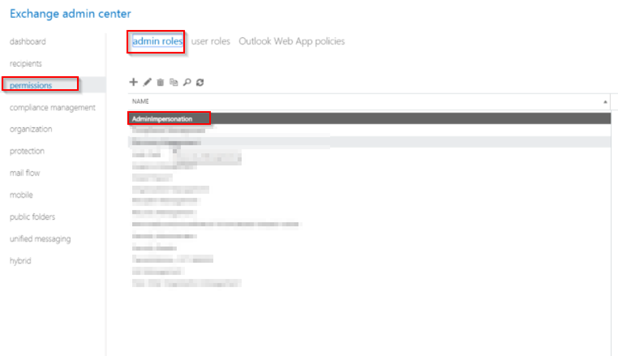
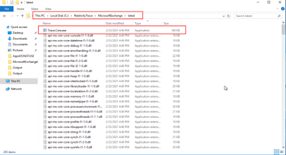
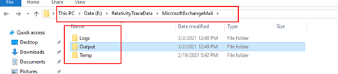
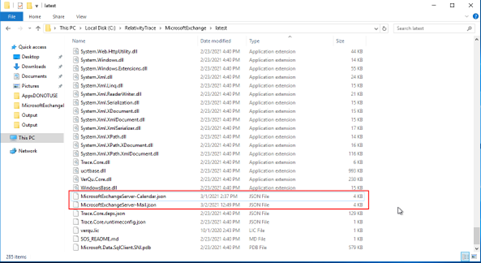
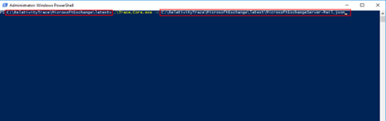
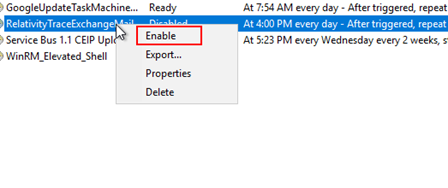

# Microsoft Exchange Server
{: .no_toc }

This topic provides details on how to capture Microsoft Exchange Server data sources via Collect.
{: .fs-6 .fw-300 }

1. TOC
{:toc}

---

## Requirements 
Before using this data source, note the following license requirements, version support, and special considerations.

### License requirements
-  A valid Microsoft Exchange Server license

### Versions supported
The following versions of Microsoft Exchange are supported:
- Exchange2007_SP1
- Exchange2010
- Exchange2010_SP1
- Exchange2010_SP2
- Exchange2013
- Exchange2013_SP1 and later

## Considerations
Note the following considerations about this data source:

### Email Collection
- By default, draft email messages are excluded
- Items deleted from the **Deleted Items** folder are captured by default
- Data in the folder **Recoverable Items** > **Audit** will be skipped since this folder contains system information only

It is recommended to have a retention policy set to at least 30 days for all users who are being monitored. Refer to the following guide from Microsoft to get started with retention policy, if you do not have one in place already: https://docs.microsoft.com/en-us/exchange/policy-and-compliance/policy-and-compliance?view=exchserver-2019
{: .info}

## Information captured 
This section lists what activities and, if applicable, metadata are captured when you use this data source.

### Activities captured
The following table lists activities captured by this data source:

| Activity                    | Notes                                                        |
| --------------------------- | ------------------------------------------------------------ |
| Emails with attachments   |       |
| Calendar Appointments |  |
| Calendar Meeting requests |  |
| Calendar Meeting Cancellations |  |
| Skype Conversations | Skype Conversations are pulled from the **Conversation History** folder |

### Activities not captured
The following table lists activities not captured by this data source:

| Activity not captured | Notes |
| --------------------- | ----- |
|                       |       |

## Setup instructions
This section provides details on the prerequisites and steps for setting up this data source.

### Prerequisites
You must have the following in order to complete the setup instructions for this data source.

#### Company specific prerequisites
You must provide an Exchange Service Account user with the following permissions: 
- **ApplicationImpersonation** Role
- Be ready to enter the email address and password for Exchange Service Account

To configure an Exchange Service Account, follow the steps below:
1. Navigate to the admin section for your Exchange server (**Exchange** under **Admin Center**)
2. Navigate to **Permissions** > **Admin Roles**
   
3. Select an Existing Admin Role OR Create a new one. Edit the Role as follows:
   - **Roles** must include **ApplicationImpersonation**
   - **Members** must include Exchange Service Account that will be used to pull Exchange data
   

### Setup in Trace
The following sections provide the steps for installing and configuring the data source.

### VerQu On-Premises Application
- Email [support@relativity.com](mailto:support@relativity.com) to request the installation package for Trace on-premises data source deployment powered by VerQu.

#### Deploy and run

1. Unzip the installation package to your Exchange server, and ensure the following folder structure exists. 
   
   - **Trace.Core.exe** is the executable responsible for running VerQu technology to pull data.
   - Note that the installation Drive letter can be different.
   - You will be directed to use one of the configurations depending on what type of data sources you need to configure: Email, Calendar or Skype
     
2. Create the following data structure for each data source
   
   
   - Note that the output folder is where Trace Shipper will be getting data from, in order to ship it to Relativity
3.  Go back to the **MicrosoftExchange\latest** folder to edit the .json files highlighted below:
    
4. Edit **Microsoft[DataSourceName].json** file to define specific values, using the table below as a guide
   
   

| Setting                           | Notes                                                        |
| --------------------------------- | ------------------------------------------------------------ |
| **Temp**                          | Folder path where temporary data might be placed             |
| **Mailboxes**                     | Path to Trace Shipper’s monitored_individuals.csv file. <br />Refer to TODO  to understand what timestamp will be used for the data for newly added monitored individuals |
| **Server**                        | Specify the exact URL used when connecting to exchange server. |
| **Username**                      | Specify login to admin account on exchange server            |
| **Password**                      | Specify password to admin account on exchange server         |
| **Logname**                       | A local file path where the log files for the application should be stored. Log path should always end with "verqu-{datetime}.log" |
| **Destination**                   | The locally accessible path of the folder that needs to ship files from the Exchange server (note that the user running the service must have access) |
| **DataRangeStart / DataRangeEnd** | This contains information on the start date of the first run |
| **ConnectionString**              | This a standard SQL Server connection string that support all possible ways of connecting to SQL Server, including Windows Authentication and SQL Server Authentication |

5. Run a Smoke Test using the command line shown below
   
6. Configure the task to run on a schedule
   a. See the Microsoft documentation for any customizations: [Windows Task Scheduler](https://docs.microsoft.com/en-us/troubleshoot/windows-server/system-management-components/schedule-server-process#:~:text=Schedule the Task,on your computer is displayed)
   
   b. Use the Windows Task Scheduler Template shown below to create a file called **RelativityTraceExchangeMail.xml**.
   Note that the **Author** value should be full username that will run this task – e.g. *DOMAIN\username*, and edit the file system paths to reflect the correct values for your environment.

```xml
   `<?xml version="1.0" encoding="UTF-16"?>`
   `<Task version="1.2" xmlns="http://schemas.microsoft.com/windows/2004/02/mit/task">`
    `<RegistrationInfo>`
     `<Date>2021-03-12T15:53:36.1319058</Date>`
     `<Author>RELATIVITY\Hopper</Author>`
     `<URI>\RelativityTraceExchangeMail</URI>`
    `</RegistrationInfo>`
    `<Triggers>`
     `<CalendarTrigger>`
      `<Repetition>`
   ​    `<Interval>PT1H</Interval>`
   ​    `<StopAtDurationEnd>false</StopAtDurationEnd>`
      `</Repetition>`
      `<StartBoundary>2021-03-12T16:00:00</StartBoundary>`
      `<Enabled>true</Enabled>`
      `<ScheduleByDay>`
   ​    `<DaysInterval>1</DaysInterval>`
      `</ScheduleByDay>`
     `</CalendarTrigger>`
    `</Triggers>`
    `<Principals>`
     `<Principal id="Author">`
      `<UserId>S-1-5-21-2689140839-1754446295-1098153973-1006</UserId>`
      `<LogonType>Password</LogonType>`
      `<RunLevel>HighestAvailable</RunLevel>`
     `</Principal>`
    `</Principals>`
    `<Settings>`
     `<MultipleInstancesPolicy>IgnoreNew</MultipleInstancesPolicy>`
     `<DisallowStartIfOnBatteries>true</DisallowStartIfOnBatteries>`
     `<StopIfGoingOnBatteries>true</StopIfGoingOnBatteries>`
     `<AllowHardTerminate>true</AllowHardTerminate>`
     `<StartWhenAvailable>false</StartWhenAvailable>`
     `<RunOnlyIfNetworkAvailable>false</RunOnlyIfNetworkAvailable>`
     `<IdleSettings>`
      `<StopOnIdleEnd>true</StopOnIdleEnd>`
      `<RestartOnIdle>false</RestartOnIdle>`
     `</IdleSettings>`
     `<AllowStartOnDemand>true</AllowStartOnDemand>`
     `<Enabled>false</Enabled>`
     `<Hidden>false</Hidden>`
     `<RunOnlyIfIdle>false</RunOnlyIfIdle>`
     `<WakeToRun>true</WakeToRun>`
     `<ExecutionTimeLimit>P1D</ExecutionTimeLimit>`
     `<Priority>7</Priority>`
    `</Settings>`
    `<Actions Context="Author">`
     `<Exec>`
      `<Command>C:\RelativityTrace\MicrosoftExchange\latest\Trace.Core.exe</Command>`
      `<Arguments>-c "C:\RelativityTrace\MicrosoftExchange\latest\MicrosoftExchangeServer-Mail.json"</Arguments>`
      `<WorkingDirectory>C:\RelativityTrace\MicrosoftExchange\latest</WorkingDirectory>`
     `</Exec>`
    `</Actions>`
   `</Task>`
```
   
   c. Import the XML file into Windows Task Scheduler
   
   
   d. Verify that the Task is properly setup
   
   
   
   
   

   e. Enable the Task Scheduler
   

### Data Transfer
[Shipper]({{ site.baseurl }}) will be used to transfer on-premises data collected by the VerQu application to Relativity Trace in the cloud.

### Data Source
Use the "Setting Up Data Sources in Relativity" section of the [Shipper]({{ site.baseurl }}) documentation to configure the Data Source.