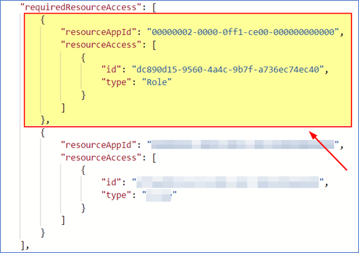
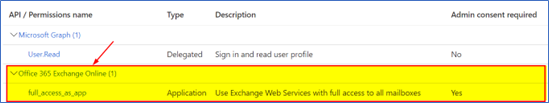

# Microsoft Office O365 Mail Archive Mailbox
{: .no_toc }

The Microsoft O365 Mail Archive Mailbox is not collected via the Microsoft O365 Mail and Calendar data source. This topic provides details on how to capture data from the Microsoft O365 Mail Archive Mailbox via Collect.
{: .fs-6 .fw-300 }

1. TOC
{:toc}

---

## Requirements 

Before using this data source, note the following license requirements, version support, and special considerations.

### License Requirements

The following licenses are required to use this data source:
- Microsoft 365 E3 or higher (if E3, also need the compliance module) license is required. 

### Versions Supported

We support Microsoft 365 Enterprise 3 and above.

## Considerations

Note the following considerations about this data source:

### Mailbox Collection

- Only Active accounts are collected (Inactive accounts are not collected regardless of license status)
- Both Licensed and Unlicensed mailbox can be collected 
- Guest mailboxes can only be collected if they are active.
- Shared mailboxes can only be captured if they are active.
- Archive mailboxes are not collected, but can be collected via the [Microsoft O365 Mail Archive Mailbox data source]({{ site.baseurl }})

### Email Collection

- The connector collects all items in visible folders within Outlook’s inbox and custom folders
- Deleted items can be collected. 
- Deleted items from deleted folder (deleted and purged items) can be collected.
- Users must set their "Deleted items retention" to at least 14 days (MSFT default).
- Items sent or received from/to regular mailbox but then archived.
- Hidden folders cannot be collected. 

### Email Content

- Formatted text is captured as plain text. 
- Numbered rows are captured as a single line.
- Emojis collected as plain text. 
  
### Data Filtering

- There are two levels of filtering data: 
- Data Source - only data linked to a Data Source Monitored Individuals will be captured. 
- Data Batch - only messages which have “Date Received” within Data Batch collection period will be captured. 

## Information captured 

This section lists what activities and, if applicable, metadata are captured when you use this data source.

### Activities captured

The following table lists activities captured by this data source:

| Activity                    | Notes                                                        |
| --------------------------- | ------------------------------------------------------------ |
| Messages with attachments   | A participant is only captured if they wrote a message.      |
| Meeting Requests   |       |
| Meeting Cancellations   |      |
| Calendar Events (vCalendar)   |     |
| Deleted items               | Users must set their Deleted items retention to at least 14 days (MSFT default).  If this is not set, Trace cannot collect data that has been triple deleted by user. |
| Permanently deleted items   |                                                              |
| Distribution list emails    | A copy of any email sent to a distribution list is captured from each mailbox that is on the distribution list. A distribution list itself is not a mailbox. |


### Activities not captured

The following table lists activities not captured by this data source:

| Activity not captured            | Notes                                                        |
| -------------------------------- | ------------------------------------------------------------ |
| Distribution lists               | A distribution list itself is not a mailbox.                 |

## Setup in Trace

This section provides details on the prerequisites and steps for setting up this data source.

### Collect

Prior to creating the Data Source, install the Collect application and configure the appropriate instance settings by following the [Using Relativity Collect](https://relativitydev.github.io/relativity-trace-documentation/docs/administrator_guide/collection/general_data_source_information/using_relativity_collect.html) page.

### Company specific prerequisites

You must have the following company-provided information to complete the authentication steps that precede setting up the data source:

- Access to the Azure portal and an active account
- Archive mailboxes configured for users

> Set an employee up with archive mailbox capabilities (this is not required to set up the Microsoft O365 Mail Archive Mailbox Data Source)
> 1. Go to Microsoft Purview compliance portal and sign in. 
> 2. In the left pane of the compliance portal, select Data lifecycle management > Archive. 
> 3. On the Archive page, the Archive mailbox column identifies whether an archive mailbox is enabled or disabled for each user. 
> 4. In the list of mailboxes, select the user to enable their mailbox for archive, and then select the Enable archive option: Enable archive option for a selected user. 
> 5. A warning is displayed saying that if you enable the archive mailbox, items in the user's mailbox that are older than the archiving policy assigned to the mailbox will be moved to the new archive mailbox. The default archive policy that is part of the retention policy assigned to Exchange Online mailboxes moves items to the archive mailbox two years after the date the item was delivered to the mailbox or created by the user. For more information, see Learn about archive mailboxes
> 6. Select Enable to confirm.
> 7. It might take a few moments to create the archive mailbox. When it's created, Enabled is displayed in the Archive mailbox column for the selected user, although you might need to refresh the page to see the change of status.
{: .info}

### Data transfer prerequisites

You must have the following information to complete the data transfer:
- An application ID
- Client Secret
- Domain (e.g. mycompanydomain.com)

### Authentication

Before configuring the data source complete the following authentication steps. 

We strongly recommend registering a separate Azure Application for each Data Source.
{: .info }

**To register your app:**
1. Open your [Azure Portal](https://portal.azure.com/). 
2. Click **More Services**. 
3. Search for and select **Azure Active Directory**. 
4. In the left-navigation menu, click **App registrations**. 
5. Click **New Registration**. This will open the Register an application page. 
6. Enter an application name in the **Name** field. 
7. Select **Accounts in this organizational directory only** as the supported account type.
8. For **Platform Type** set `Web`
9. Enter the redirect URL, http://localhost/ or https://localhost/, as the sign-on URL. 
10. Click **Register**. For more information on registering an application in Azure, see [Microsoft's documentation](https://docs.microsoft.com/en-us/azure/active-directory/develop/quickstart-register-app). 

**From the app's page, add permissions to the web API (EWS):**
1. Click **Manifest** in the left-hand navigation under **Manage**. 
2. Locate the **requiredResourceAccess** property in the manifest and add the following code inside the square brackets:
  
    ```json
    { 
    "resourceAppId": "00000002-0000-0ff1-ce00-000000000000", 
    "resourceAccess": [ 
      { 
        "id": "dc890d15-9560-4a4c-9b7f-a736ec74ec40", 
        "type": "Role" 
      } 
      ] 
    }, 
    ```

    *Example*

    ​

3. Click **Save**. 
4. Confirm that the **full_access_as_app** permission is listed.

    

**Grant Admin consent for the API:**
1. Click the **API Permissions** tab. 
2. Click **Grant admin consent for [tenant]**. 
3. In the pop-up window, click Accept. 

    If you do not have the ability to grant Admin consent for application permissions, you will need to find an Admin that can consent.
    {: .info }

4. Once clicked, the window will show all permissions granted. 
5. Verify all permissions have been granted
6. Click **Accept** to grant the permissions. 

Generate Client Secret:
1. In the left navigation menu, select **Certificates & secrets**. 
2. Select **New client secret**.
3. Enter a description in the **Description** text box
4. Set the expiration time frame to **Never**.
5. Click **Add**. 
6. Click on the clipboard and copy secret to clipboard to paste in your text document.

Make sure you copy the **Value** field item for your Client Secret. Do not accidentally copy the Secret ID item as this is not the your Client Secret.
{: .warn }

Microsoft will only show this secret this one time; there is no way to recover a secret if it is forgotten or lost. Make a note of the Application ID that Microsoft assigned to the app registration. This ID is also required for setup of data sources in Trace.
{: .info }

You will need the following information to complete setup of the data source from the Trace front end: 
  - Application ID 
  - Client Secret (copy the **Value** field) 
  - Domain (mycompanydomain.com)

Limit the access of Relativity Collect to specific Microsoft user accounts and mailboxes by using the New-ApplicationAccessPolicy Powershell cmdlet. For more information, see [Microsoft documentation](https://docs.microsoft.com/en-us/powershell/module/exchange/new-applicationaccesspolicy?view=exchange-ps).
{: .info }

### Data source

Most parameters work the same for all Collect Data Sources. Follow the instructions from [Sections of a Data Source](https://relativitydev.github.io/relativity-trace-documentation/docs/administrator_guide/collection/data_sources.html#data-source-details).

**Microsoft O365 Mail Archive Data Source specific parameters:**

In **General** section, select **Select Microsoft O365 Mail (Archived)** for the **Data Source Type**.

In **Settings** section, do the following:

1. **Application Secret:** The Client Secret provided by the client (see [Authentication](#authentication) for more details).
2. **Domain**: The O365 domain name provided by the client.
3. **Application Id**: Application / Client ID provided by the client.

In **Advanced Configuration** section, do the following:

1. **Collect Draft items**: If set to `FALSE` (default), then only emails that were sent (non-Draft) are collected. If set to `TRUE`, then both sent emails (non-draft) and drafts emails are collected. Since draft emails are not actually communication, most customers elect to set this to `FALSE` and ignore the collection of draft emails to reduce false-positive alerts.
2. **Number of Monitored Individual Per job**: 100.
3. **Use Quick Discovery**: True.
4. **Frequency in Minutes**: 60.
5. **Merge Batches During Cold Start**: enter True.
6. **Max Number of Batches To Merge** - enter 24.
7. **Collection Period Offset in Minutes**: 0.