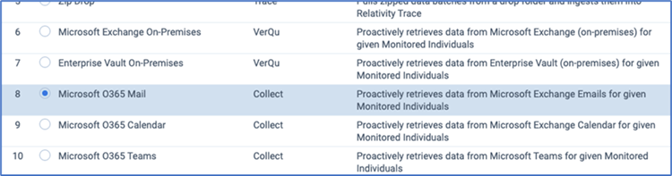
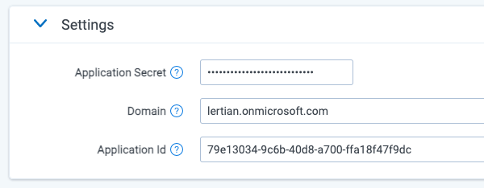
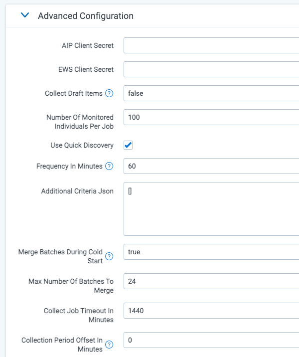

# Microsoft O365 Email and Calendar
{: .no_toc }

This topic provides details on how to capture Microsoft Office 365 Email and Calendar messages via Collect.
{: .fs-6 .fw-300 }

1. TOC
{:toc}

---

## Requirements 

Before using this data source, note the following license requirements, version support, and special considerations.

### License requirements

The following licenses are required to use this data source:

- Microsoft 365 E3 or higher is required.
  - If you are using Microsoft 365 E3, you also need to add the Compliance module. 

### Versions supported

We support Microsoft 365 Enterprise 3 and above.

## Considerations

Note the following considerations about this data source:

### Mailbox Collection

- The connector only supports accessing active mailboxes.
- The connector does **NOT** support collection from Archive mailboxes
- You can collect from unlicensed custodians, but the mailbox must still be active in the case where the user is unlicensed.
- The connector can access data regardless of the geographic location the data resides in when [Microsoft Multi-Geo](https://docs.microsoft.com/en-us/microsoft-365/enterprise/microsoft-365-multi-geo?view=o365-worldwide) capabilities have been implemented.
- Guest mailboxes can only be collected if they are active & licensed.
- Shared mailboxes can only be captured if they are active.

The [Microsoft O365 Mail Archive Mailbox data source]({{ site.baseurl }}) should always be enabled alongside the Microsoft O365 Email and Calendar data source to ensure holistic collection is performed. Without Microsoft O365 Mail Archive Mailbox data source enabled you may miss data that is quickly archived either by a rule or manual action.
{: .warn}

### Email Collection

- The connector collects all items in visible folders within Outlook’s inbox and custom folders. 
- Deleted items can be collected. 
- Deleted items from deleted folder (deleted and purged items) can be collected. Users must set their "Deleted items retention" to at least 14 days (Microsoft default). 
- Hidden folders cannot be collected. 

### Email Content

- Formatted text is captured as plain text. 
- Numbered rows are captured as a single line. 
- Emojis are collected as plain text. 
  
### Data Filtering

- There are two levels of filtering data: 
- Data Source - only data linked to a Data Source Monitored Individuals will be captured. 
- Data Batch - only messages which have “Date Received” within Data Batch collection period will be captured. 

## Information captured 

This section lists what activities and, if applicable, metadata are captured when you use this data source.

### Activities captured

The following table lists activities captured by this data source:

| Activity                    | Notes                                                        |
| --------------------------- | ------------------------------------------------------------ |
| Messages with attachments   | A participant is only captured if they wrote a message.      |
| Meeting request             | A team meeting request is captured as a message placeholder. |
| Meeting cancellations       |                                                              |
| Calendar events (vCalendar) |                                                              |
| Deleted items               | Users must set their Deleted items retention to at least 14 days (MSFT default).  If this is not set, Trace cannot collect data that has been triple deleted by user. |
| Permanently deleted items   |                                                              |
| Distribution list emails    | A copy of any email sent to a distribution list is captured from each mailbox that is on the distribution list. A distribution list itself is not a mailbox. |

### Activities not captured

The following table lists activities not captured by this data source:

| Activity not captured            | Notes                                                        |
| -------------------------------- | ------------------------------------------------------------ |
| Participant removed from channel | A participant who leaves or is removed from a channel event is not captured. The participant is captured only if they wrote a message |
| Distribution lists               | A distribution list itself is not a mailbox.                 |

## Setup instructions

This section provides details on the prerequisites and steps for setting up this data source.

### Prerequisites

You must have the following in order to complete the setup instructions for this data source.

#### Standard prerequisites

Prior to creating the Data Source, install the Collect application and configure the appropriate instance settings by following the [Using Relativity Collect](https://relativitydev.github.io/relativity-trace-documentation/docs/administrator_guide/collection/general_data_source_information/using_relativity_collect.html) page.

#### Company specific prerequisites

You must have the following company-provided information to complete the authentication steps that precede setting up the data source:

- Access to the Azure portal and an active account
- A Client Secret
- An O365 domain name
- An Application / Client ID

#### Data transfer prerequisites

You must have the following information to complete the data transfer.

- An application ID
- A Client secret
- An O365 domain name

### Authentication

Before configuring the data source complete the following authentication steps. 

We strongly recommend registering a separate Azure Application for each Data Source.
{: .info }

To register your app:
1. Open your [Azure Portal](https://portal.azure.com/). 
2. Click **More Services**. 
3. Search for and select **Azure Active Directory**. 
4. In the left-navigation menu, click **App registrations**. 
5. Click **New Registration**. This will open the Register an application page. 
6. Enter an application name in the **Name** field. 
7. Select **Accounts** in this organizational directory only as the supported account type. 
8. Enter the redirect URL, http://localhost/ or https://localhost/, as the sign-on URL. 
9. Click **Register**. For more information on registering an application in Azure, see [Microsoft's documentation](https://docs.microsoft.com/en-us/azure/active-directory/develop/quickstart-register-app). 

From the app's page, add permissions to the web API: 
1. Click **API Permissions**. 
2. Click **Add a permission**. 
3. Click **Microsoft Graph**. 
4. Select **Application Permissions**. 
5. Select the following options from the **Application Permissions** section: 
   - **Mail** - Read. 
   - **User** - Read.All 
   - **Calendars** - Read. For the Email only option, this permission is not needed 

6. Click **Add permissions**. 
7. Click **Grant Permission**. 

Grant Admin consent for the API: 
1. Click the **API Permissions** tab. 
2. Click **Grant admin consent** for [tenant]. 
3. In the pop-up window, click **Accept**. If you do not have the ability to grant Admin consent for application permissions, you will need to find an Admin that can consent. 
4. Once clicked, the window will show all permissions granted. 
5. Verify all permissions have been granted. 
6. Click **Accept** to grant the permissions. 

Generate Client Secret:
1. In the left navigation menu, select **Certificates & secrets**. 
2. Select **New client secret**.
3. Enter a description in the **Description** text box. 
4. Set the expiration time frame to **Never**. 
5. Click **Add**. 
6. Click on the clipboard and copy secret to clipboard to paste in your text document. Save this secret, as you will need it to set up your data sources in Trace. 

Microsoft will only show this secret this one time; there is no way to recover a secret if it is forgotten or lost. Make a note of the Application ID that Microsoft assigned to the app registration. This ID is also required for setup of data sources in Trace.
{: .info }

You will need the following information to complete setup of the data source from the Trace front end: 
  - Application ID 
  - Client Secret (copy the **Value** field) 
  - Domain (mycompanydomain.com)

Make sure you copy the **Value** field item for your Client Secret. Do not accidentally copy the Secret ID item as this is not the your Client Secret.
{: .warn }

Limit the access of Relativity Collect to specific Microsoft user accounts and mailboxes by using the New-ApplicationAccessPolicy Powershell cmdlet. For more information, see [Microsoft documentation](https://docs.microsoft.com/en-us/graph/auth-limit-mailbox-access).
{: .info }

### Setup in Trace

The following sections provide the steps for installing Collect and configuring the data source.

#### Data source

Most parameters work the same for all Collect Data Sources. Follow the instructions from [Sections of a Data Source]( https://relativitydev.github.io/relativity-trace-documentation/docs/administrator_guide/collection/data_sources.html#data-source-details).

**O365 Mail and Calendar specific parameters:**

In **General** section, select **Microsoft O365 Mail or Calendar** for the **Data Source Type**.

In **Settings** section, do the following:

1. **Application Secret:** The Client Secret provided by the client (see [Authentication](#authentication) for more details).
2. **Domain**: The O365 domain name provided by the client.
3. **Application Id**: Application / Client ID provided by the client.

In **Advanced Configuration** section, do the following:

1. **Collect Draft items**: If set to `FALSE` (default), then only emails that were sent (non-Draft) are collected. If set to `TRUE`, then both sent emails (non-draft) and drafts emails are collected. Since draft emails are not actually communication, most customers elect to set this to `FALSE` and ignore the collection of draft emails to reduce false-positive alerts.
2. **Number of Monitored Individual Per job**: 100.
3. **Use Quick Discovery**: True.
4. **Frequency in Minutes**: 60.
5. **Merge Batches During Cold Start**: enter True.
6. **Max Number of Batches To Merge** - enter 24.
7. **Collection Period Offset in Minutes**: 0.

