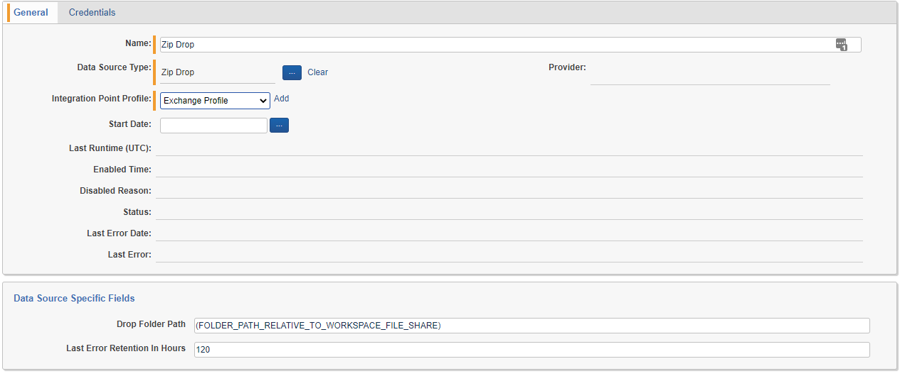

# Zip Drop Data Source
{: .no_toc }

This topic provides details on how to ingest communications or other structured data in a generic way to any objectType in the system.
{: .fs-6 .fw-300 }

1. TOC
{:toc}

---

### Overview

The Zip Drop Data Source Type allows Relativity Trace to import of fully formed data batches (documents, extracted text and associated metadata) in the form of ZIP files dropped into a defined Drop Folder on the Relativity workspace file share. The Zip Drop Data Source Type is particularly useful for data like audio where partners produce data in its final state (natives, extracted text and metadata) and need a simple way to get it into Relativity Trace without making any API calls. The Zip Drop Data Source Type meets this need by monitoring the drop folder and pulling every ZIP file placed there into the system as a new Data Batch. The Zip Drop Data Source Type works especially well when combined with the Trace Shipper Service, which can be used to deliver archived data batches from servers outside of the Relativity instance directly to the drop folder where they are consumed by the Zip Drop Data Source.

**Configuration**

Configuration for the Zip Drop Data Source is pretty simple. There are no credentials or start date required. In fact, there are only a few things that need to be set up:

- **Drop Folder Path** - Path where ZIP files will be retrieved by the data source, relative to the root of the file share for the workspace (beneath the EDDSXXXXXX folder). The Drop Folder does not need to exist when settings are saved as it will be created automatically. If the file path does not resolve to a location within the file share for the workspace, an error will be thrown.
- **Ingestion Profile** - See Appendix C for more information on Ingestion Profiles.

**ZIP File Format**

The following requirements must be met by any ZIP file imported by the Zip Drop Data Source:

- The name of the ZIP file is the name of the Data Batch that will be created, and should be unique
- There must be a load file at the root of the ZIP file named "loadfile.dat"
- There should be no other files at the root of the ZIP file except for "loadfile.dat"
- All native files should be in a folder named "OriginalNatives" at the root of the ZIP file
- All extracted text files should be in a folder named "ExtractedData" at the root of the ZIP file
- There should be no folders at the root of the ZIP file except for "OriginalNatives" and "ExtractedData"
- The load file "loadfile.dat" must contain columns named "Trace Monitored Individuals", "Trace Document Hash", and "Trace Data Batch" in addition to the other columns and data mappings that are required by every Relativity Trace data source

Files imported by the Zip Drop Data Source do not need to have the extension .ZIP.
{: .info }

**Zip File Supported Formats**

| Archive format  | Compression method      |
|:-------:|:------------------:|
| zip | Deflate |

**Drop Folder**

The Drop Folder is the place on the file share where ZIP files full of documents and metadata should be placed. The Zip Drop Data Source will discover ZIP files, extract them to a different location, and then delete each ZIP file from the Drop Folder so that the next file can be processed. The Zip Drop Data Source attempts to extract every file in the Drop Folder, regardless of extension. Only one file is processed at a time, so the file is always moved or deleted after a single attempt to guarantee throughput. 

When selecting a file to import, the Zip Drop Data Source will always start with the oldest file present in the Drop Folder. If the file name contains "_inprogress", the file will be skipped. This convention allows integration partners a failsafe way to indicate a file is still being transmitted to avoid failures where extraction is attempted before the file is fully written. The file can then be renamed when it is fully written. As an additional safety measure, the Zip Drop Data Source will obtain and release a write lock on any file before attempting to extract it. If a write lock cannot be obtained, the file will be skipped under the assumption that it is still being written.

**Zip Drop Data Batches**

Once a ZIP file is extracted, a Data Batch RDO is created. The name of the Data Batch RDO will be the same as the name of the ZIP file, minus the extension. If a Data Batch RDO with that name already exists, the name will be adjusted to contain the duplicate count in parentheses (eg. Data Batch (2)). The load file will be adjusted automatically so that the documents within are associated with the correct Data Batch by name.

Once created, the Data Batch RDO will be given a status of ReadyForImport. Because of this, Zip Drop Data Sources do not support Data Enrichment - the load file in the ZIP must already contain all of documents, extracted text and metadata needed for the Data Batch. However, Data Transformations occur prior to import and therefore are supported for the Zip Drop Data Source.

**Failure Scenarios**

There are a few different unique failure scenarios for the ZIP Drop Data Source. Regardless of the scenario, every file placed in the Drop Folder will result in a Data Batch RDO and the dropped data will not be lost.

The first scenario is if a file placed in the Drop Folder cannot be extracted. This is most common if the file is not actually a ZIP file. In this case, a Data Batch RDO will be created in CompletedWithErrors status with error details and the file will be moved to a FailedToExtract folder within the Drop Folder. The only way to retry a file in this scenario is to manually move it back to the Drop Folder. In the event that multiple files with the same name fail to be extracted, only the most recent file with a given name will be retained in the FailedToExtract folder, so please make sure that ZIP files containing unique data have unique names.

The second scenario is that the ZIP file (or the load file it contains) does not match the requirements specified above in "Zip File Format". In this case, a Data Batch RDO will be created in CompletedWithErrors status explaining the error and the ZIP file will be extracted to the normal data batch folder location on the file share, just as if it had been a healthy data batch. The load file will exist at the load file path on the Data Batch RDO as long as it was included in the ZIP file. It is possible to retry Data Batches in this state using the Data Batch Retry console button, but the files will need to be modified in the extracted data batch folder on the file share to meet the requirements or the Data Batch will just fail again. In most cases it is better to just Abandon the Data Batch and drop a corrected ZIP file in the Drop Folder.

All other Data Batch failure scenarios with the ZIP Drop Data Source occur once the ReadyForImport status is reached and are not unique to this data source type. Please reference the rest of this documentation for more details on other requirements for Data Ingestion using Relativity Trace.

**Monitored Individuals CSV**

ZIP Drop Data Source will export its configured Monitored Individuals in CSV format every time the Drop Folder is checked for new files. The CSV will be located at `(Drop Folder)\Config\monitored_individuals.csv`.
