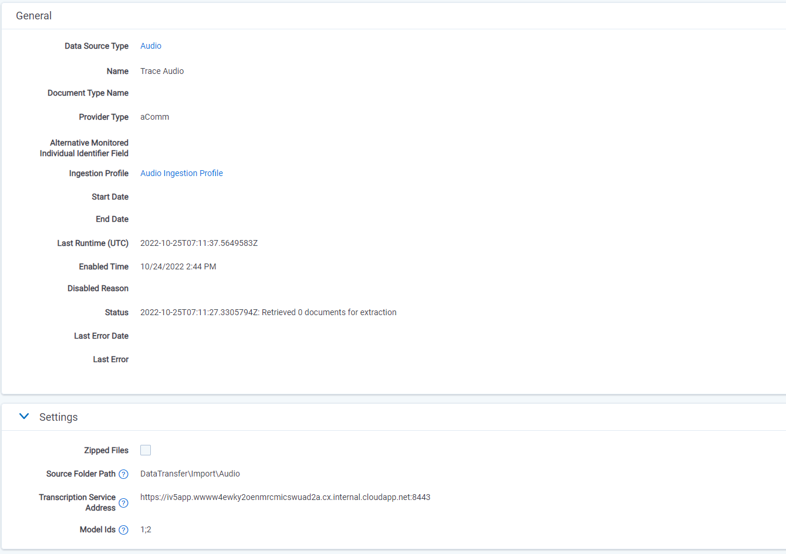

# Generic Audio Data Source
{: .no_toc }

Audio data from any source can be processed, transcribed, and ingested if provided in one of our standard supported formats and structures.
{: .fs-6 .fw-300 }

1. TOC
{:toc}

---

## Overview
Although audio data can be retrieved directly from the most common audio data channels through our standard audio data sources, we understand that some users either do not want Trace to connect directly to these sources or are using unique call recording capabilities that do not support direct connect. For these cases, data can still be processed, transcribed, and ingested as long as it's provided to Trace in one of our standard supported formats and structures.

### Configuration



Configuration for the Audio Data Source is pretty simple. In fact, there are only a few things that need to be set up:

- **Source Folder Path** - Path where media and the metadata file files will be retrieved by the data source, relative to the root of the file share for the workspace (beneath the EDDSXXXXXX folder). The Source Folder does not need to exist when settings are saved as it will be created automatically. If the file path does not resolve to a location within the file share for the workspace, an error will be thrown.
- **Transcription Service Address** - URL address of transcription service.
- **Model Ids** - Ids of language models used during transcription (models from data source configuration are used only if populated monitored individual doesn't have language assigned).

### Supported Formats and Structures
Two formats are currently supported for generic audio data. There is a JSON format and an XML format. The JSON format is preferred, while the XML format should be used only as a secondary option.

Two files are required for a successful ingestion:
1. A media file: audio_file.wav (.mp3 is also supported but not preferred)
2. A metadata file: audio_file.json (.xml is also supported but not preferred)

Both the media file and the metadata file **must** have the exact same name to ensure proper correlations within the system.
{: .warn }

Data source of `Audio` type should be used for `wav-json` pair.  
Data source of `Audio (Custom XML)` type should be used for `wav-xml` pair.
{: .info }


### Metadata File Format

#### JSON Template
```json
{
    "Metadata": {
        "end": "2021-07-13T16:12:53.811012",
        "start": "2021-07-13T16:14:59.811012",
        "channels": [
            {
                "userID": "John.Doe@domain.com",
                "userName": "John Doe",
                "deviceID": "+48223416489"
            }
        ]
    }
}
```

All non-required tags in the JSON will be added to the `Other Metadata` field and will not be mapped to fields.
{: .info }


#### XML Template

```xml
<?xml version="1.0" encoding="UTF-8"?>
<Audio xmlns:xsd="http://www.w3.org/2001/XMLSchema"
  xmlns:xsi="http://www.w3.org/2001/XMLSchema-instance">
  <Metadata>
    <end>2021-07-13T16:12:53.811012</end>
    <start>2021-07-13T16:14:59.811012</start>
    <channels>
      <channel>
        <userID>John.Doe@domain.com</userID>
        <userName>John Doe</userName>
        <deviceID>+48223416489</deviceID>
      </channel>  
    </channels>
  </Metadata>
</Audio>
```

All non-required tags in the XML will be added to the `Other Metadata` field and will not be mapped to fields.
{: .info }

#### "Metadata" Section Details

|   Name   |   Required   |  Parent  |                                                                 Description                                                                 |
| :------: | :----------: | :------: | :-----------------------------------------------------------------------------------------------------------------------------------------: |
|   end    |   Required   |    NA    |                          ISO 8601 format datetime string representing the point in time when the call terminated.                           |
|  start   |   Optional   |    NA    |                            ISO 8601 format datetime string representing the point in time when the call started.                            |  |  |
| channels |   Optional   |    NA    | An array of objects, each representing a single audio channel in the media file. If no information is available this array should be empty. |  |
|  userID  | Required (*) | channels | String containing a globally unique identifier for the call participant. This will be used to match the participant across all recordings.  |
| userName | Required (*) | channels |                                             A human-readable display name for the participant.                                              |
| deviceID | Required (*) | channels |         String containing a globally unique identifier for the device. This will be used to match the device across all recordings.         |

(*) Value in one of the following fields is required: `userID, userName, deviceID`.
{: .info }


### XML dynamic mapping
It is possible to customize which XML element contains a specific value. To do that `Dynamic Mapping Json` must be filled in the `Audio (Custom XML)` data source

#### Dynamic mapping JSON
```json
[
    {
        "Key": "End",
        "Value": "CustomAudio/Metadata/EndDate"
    },
    {
        "Key": "Start",
        "Value": "CustomAudio/Metadata/StartDate"
    },
    {
        "Key": "UserId",
        "Value": "CustomAudio/Speakers/Speaker[0]/UserID"
    },
    {
        "Key": "UserName",
        "Value": "CustomAudio/Speakers/Speaker[0]/UserName"
    },
    {
        "Key": "DeviceId",
        "Value": "CustomAudio/Speakers/Speaker[0]/DeviceID"
    },
    {
        "Key": "UserId_1",
        "Value": "CustomAudio/Speakers/Speaker[1]/UserID"
    },
    {
        "Key": "UserName_1",
        "Value": "CustomAudio/Speakers/Speaker[1]/UserName"
    },
    {
        "Key": "DeviceId_1",
        "Value": "CustomAudio/Speakers/Speaker[1]/DeviceID"
    }
]
```
To customize ``UserId, UserName, DeviceId`` for next channels it is necessary to provide channel number postfix e.g. `_1` is a postfix for channel number 1 {: .info }

In `Value` should be provided existing XML element path. To omit leave blank. {: .info }