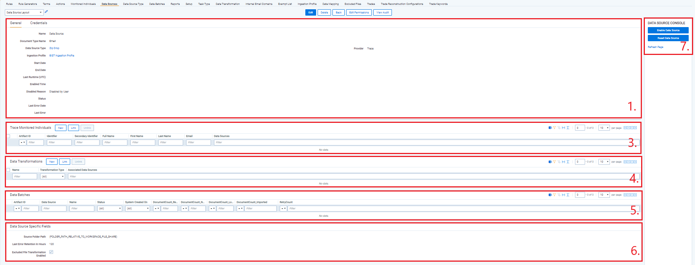
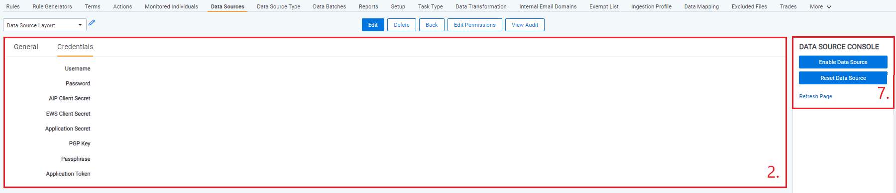
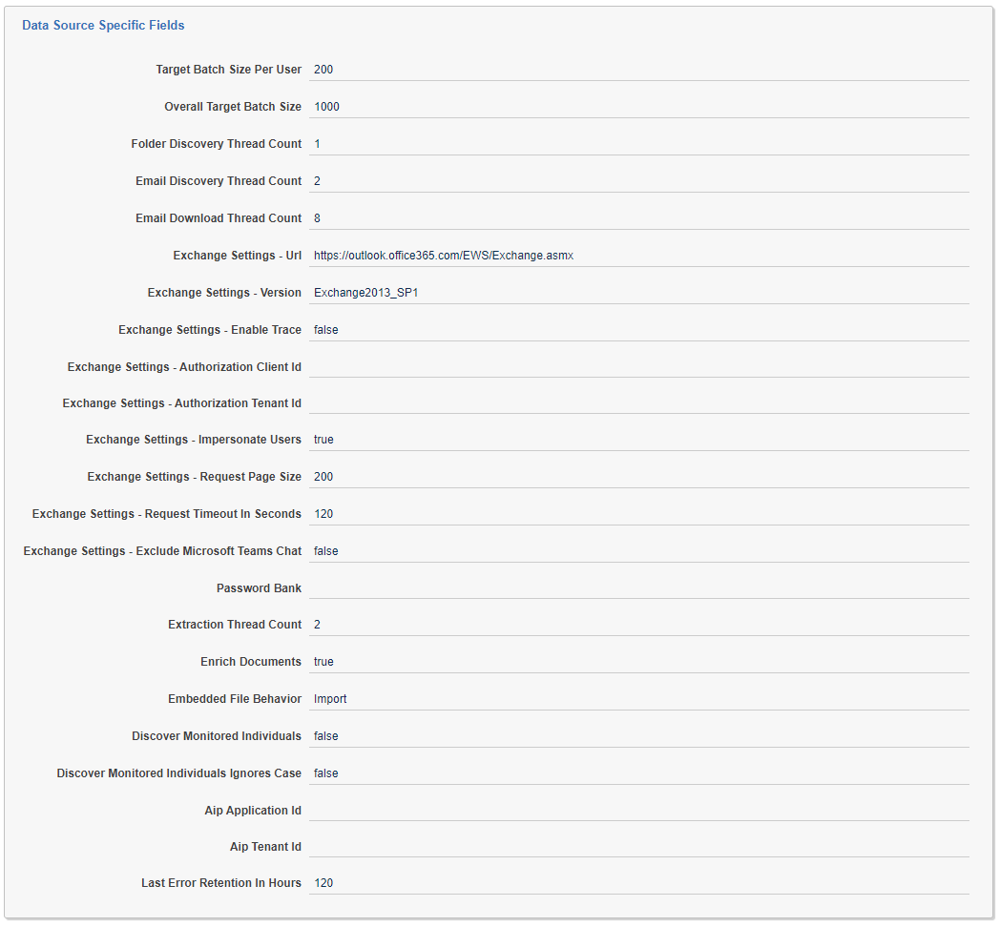
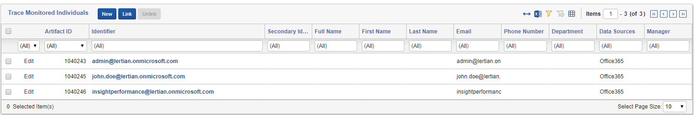
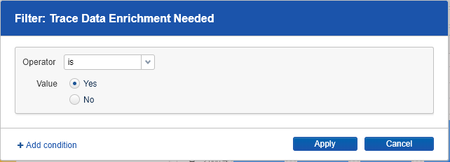

# Data Sources
{: .no_toc }

A Data Source allows you to define where and how you are pulling data from a communication channel.
{: .fs-6 .fw-300 }

1. TOC
{:toc}

---

## Overview
 A Data Source stores the configuration necessary to retrieve data from a communication channel, process that data, and ingest it into Relativity Trace. Data Sources reference an Ingestion Profile that holds configuration on how to import data for that Data Source (data mappings). Data Batches reference Data Source to dynamically lookup the Ingestion Profile to use during import.

Ingestion Profiles are susceptible to corruption by modification of Relativity Fields and Data Mappings which are referenced in the profile.  Any time a Relativity Field or Data Mapping which is used in an Ingestion Profile is edited or deleted, it is imperative to validate the integrity of each of the related Ingestion Profiles. Automatic validation occurs during the Data Retrieval task and may cause a data source to be automatically disabled if it is found to have been corrupted.
{: .warn }

### Data Source State Serialization

Globanet and Zip Drop Data sources created in Trace serialize their current state as a JSON file at regular intervals. This data is designed to be retrieved by the Trace Shipper Service to facilitate integrations with external data sources. 

The serialized data source file is saved in {Source/Drop Folder}\Config\DataSourceState.json, where {Source/Drop Folder} is the configured source or drop folder for the given data source. If the data source has been deleted, the deleted field is set to True in the JSON file and the file will no longer be updated. 

All fields for a data source, including Data Source Specific Fields, are saved except fields including personal/private information (such as passwords and secrets). Different fields are set to be excluded depending on the type of data source. 
Data source state serialization currently excludes the following fields from being saved:

- Username
- Password
- Password Bank
- Aip Client Secret
- Aip Application Id
- Aip Tenant Id
- Exchange Url
- Exchange Authorization Client Id
- Exchange Authorization Tenant Id
- EWS Client Secret
- Drop Folder Path

Other data source types can serialize their state as well, if this functionality is needed please contact support@relativity.com.
{: .info }

### Microsoft Exchange Data Source
{: .d-inline-block }

Replaced by O365 Data Source
{: .label .label-yellow }

The Microsoft Exchange Data Source enables Relativity to automatically pull emails from a Microsoft Exchange instance (Office 365 or On Premises) into Relativity. The Microsoft Exchange Data Source is executed by the Data Retrieval task (seen on the Setup tab). Note, this Data Source only pulls emails at this
time, if you need to retrieve other object types from Microsoft Exchange please contact [support@relativity.com](mailto:support@relativity.com).

**Data Flow Overview**

**Setup**

**Step 1: Create Ingestion Profile**

>   Refer to **[Appendix C](#appendix-c-create-email-fields-data-mappings-and-ingestion-profile)**

**Step 2: Adjust Office 365 permissions**

Settings for On Premises exchange are very similar to Office 365. Setting user permissions only applies if you are using Basic Authentication or OAuth Resource Owner Password Credential Grant (see authorization.md for more details).
{: .info }

1.  Log into the Office 365 Admin Center

2.  Adjust Administration Exchange settings:

    

3.  Under Admin Roles create (or update if exists) Discovery Management role:

    

4.  Ensure the account you use to authenticate with includes “Application
    Impersonation”, “Legal Hold”, “Mailbox Import Export” and “Mailbox Search”
    roles:
   
   

5. (Optional) Adjust password expiration permission for the account used for Trace

     https://docs.microsoft.com/en-us/office365/admin/add-users/set-password-to-never-expire?view=o365-worldwide#set-the-password-expiration-policy-for-individual-users

**Step 3: Create a Microsoft Exchange Data Source**

1.  Go to the Trace:Data Sources Tab and Click the “New Data Source” Button

2.  Set the Name = “*Microsoft Exchange*” (for example)

3.  Select Data Source Type: “Microsoft Exchange”

    

4.  Select Ingestion Profile created in Step 1

5.  Set the required credentials depending on your authentication method (see authorization.md for more details).
    
7.  Set Start Date to the earliest email timestamp you would like imported (UTC
    time)

8.  Optionally set End Date to the latest email timestamp you would like imported (UTC
    time)
    
9.  Under Data Source Specific Fields, set Exchange Settings - Url and Exchange
    Settings - Version (there are a lot of other settings that can be
    configured, but the default values are fine, please contact us if you would
    like more information)
    
    
1.  *Exchange Settings – Url* gives you the chance to specify the exact URL used when connecting to your exchange server. If this field is left blank, Microsoft’s Autodiscover technology will be used to populate the field with a URL based on the credentials provided in the Username and Password fields. Autodiscover is typically a suitable option and works for Office 365 and many on premises solutions but it is not guaranteed to work.
    
        If Autodiscover fails, specify this URL in the field: https://outlook.office365.com/EWS/Exchange.asmx ( OR https://YOUR_EXCHANGE_SERVER_URL/EWS/Exchange.asmx)
    
2. *Exchange Settings - Version* allows you to specify the version of your exchange server. For Office 365, the default is the correct choice. For on premises servers, provide the correct version. It needs to be an exact match to one of the options, filling it out incorrectly will provide a list of all of the options available in the error message at the top of the page: Exchange2007_SP1, Exchange2010, Exchange2010_SP1, Exchange2010_SP2, Exchange2013, Exchange2013_SP1
   
10. *Exchange Settings - Exclude Microsoft Teams Chat* indicates whether Trace will ignore any Microsoft Teams chat messages being stored in a Monitored Individual's folders in Outlook as a part of O365. The default behavior is to pull data from the Teams Chat folder, but users may want to exclude these folders if Teams data is being pulled from a different data source or the data should not be pulled at all.

11. Click “Save”

12. Link / Create New Monitored Individuals (same page after clicking Save)

    

    1.  Click `New` if the monitored individual is not already defined on another Data Source, or “Link” if the user has already been monitored in the past
    
2.  Microsoft Exchange Data Source will only pull data for linked Monitored Individuals (by identifier field: email address)
    
    3.  Once everything is set up, click the Enable Data Source button on the upper right to begin pulling data

**Content**

The Microsoft Exchange Data Source works by pulling content directly from an Exchange Server instance (Office 365 or On Premises) using Exchange Web Services (EWS). The Data Source downloads the native (.eml) email files and then extracts all information including email metadata, email body text, native attachments and their metadata. Container attachment file types (zips and similar archives) are automatically extracted into individual documents – e.g. zip with 10 word (.docx) documents = 11 Relativity documents. In addition, images from email content and each individual document are automatically expanded into separate Relativity documents. 

The Microsoft Exchange data source only retrieves emails. It does not retrieve other exchange metadata at this time.
{: .info }

Please, refer to [Appendix B: Trace Document Extraction Fields](#appendix-b-trace-document-extraction-fields) for field descriptions.

### Relativity Native Data Extraction Data Source

This Data Source allows for automatic text extraction/expansion of previously ingested documents with natives in Relativity. This data source will automatically extract text, metadata and any children documents from containers/archives for all documents in the workspace with *Trace Data Enrichment Needed* field set to *Yes* and where Trace is able to locate the Native file on disk:

**Setup:**

1. Integration Points Profile

   1.  Please, re-use profile creation steps documented for Microsoft Exchange above OR re-use existing “Microsoft Office 365 Profile” profile. 
       
       > **IMPORTANT:** Ensure import option is set to Append/Overlay.
   
2.  Create Relativity Native Data Extraction Data Source

    1.  Go to the `Trace` -> `Data Sources` tab and Click the “New Data Source” button

    2.  Set the Name = for example, “Native Data Extraction”

    3.  Select Ingestion Profile created in Step 1

    4.  Select Data Source Type: “Relativity Native Data Extraction”

    5.  Ignore Username field

    6.  Ignore Password field

    7.  Ignore Start Date field

    8.  Ignore End Data field

    9.  You have the option to leave the Data Source as Enabled or Disabled

3.  Fill out [Data Source Specific Settings](#data-source-specific-settings) and click Save
    
    -   **Batch Size:** The maximum number of Original Native files to group into a single Data Batch

**Content**

Extracted text and metadata for submitted Native files and all children documents expanded from containers/archives. Please, refer to [Appendix B](#appendix-b-trace-document-extraction-fields) for field descriptions.

Re-extraction of child documents from containers (emails, zips, archives) will generate duplicate child documents (old children will be dropped off the family group) if they already exist in the workspace.
{: .warn }

Containers with many children documents (and nested containers) could produce significant number of expanded items in Relativity.
{: .warn }

**Limitations**

Relativity Native Data Extraction Data Source do not support [Deduplication](#deduplication-data-transformation). Deduplication transformations must be unlinked before the Data Source can be enabled.

