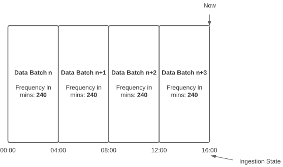
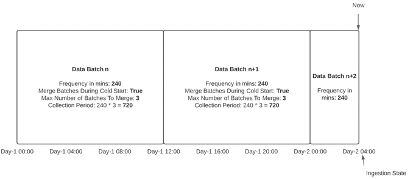
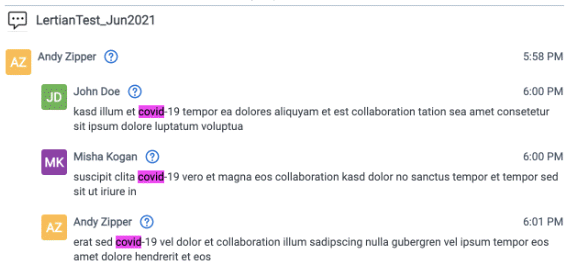

# Common Collect Data Source Functionality
{: .no_toc }

This topic provides information on functionality common to most or all data sources.
{: .fs-6 .fw-300 }

1. TOC
{:toc}

---

## IP Address Whitelisting Pre-work 

For data sources such as [Bloomberg Chat and PChat]({{ site.baseurl }}), [ICE Chat]({{ site.baseurl }})
, and [Refinitiv Eikon Chat and FXT]({{ site.baseurl }})
, you must be able to make a connection to the Data Source's SFTP accounts prior to starting collection. For security purposes, only IP addresses that have been whitelisted by the vendor can connect to their SFTP accounts. For this reason, you must reach out to each vendor and get Relativity IP addresses added to the vendors whitelist.

**Requirements**
- Each Relativity instance has unique IP addresses that must be added to each vendor's whitelist for Relativity to connect to their SFTP accounts. 
- Find the `Outbound IP address` in the table below that corresponds to the region or regions of your Relativity instances.
- Have your IT team contact each data source vendor (independently) with the following request, "“We are setting up a connection with Relativity to automatically ingest our data from you into Relativity. Please whitelist this IP address so that Relativity is able to connect to our SFTP site and collect data on our behalf. `Outbound IP address`: value here”

| Region               | Outbound IP address |
| -------------------- | ------------------- |
| Australia East       | 20.53.89.176/28     |
| Brazil South         | 20.201.55.192/28    |
| Canada Central       | 52.237.59.0/28      |
| Central India        | 20.204.224.224/28   |
| Central US           | 20.109.248.176/28   |
| East Asia            | 168.63.211.176/2    |
| East US              | 52.226.235.64/28    |
| Germany West Central | 20.113.19.176/28    |
| Japan East           | 20.210.49.80/28     |
| Korea Central        | 20.196.233.192/28   |
| North Europe         | 20.54.28.144/28     |
| South Africa North   | 20.87.37.80/28      |
| Southeast Asia       | 104.43.75.192/28    |
| Switzerland North    | 20.203.175.64/28    |
| UAE North            | 20.203.42.80/28     |
| UK South             | 20.108.135.0/28     |
| West Europe          | 20.50.242.80/28     |

## Data retrieval

Data is retrieved from the source via data batches. The data batch collection period is controlled by the following parameters on the data source: 
- **Ingestion State:** the date to which data has been retrieved during the last pull via Data Retrieval Task. This parameter is only visible in **Date Source Layout (dev)**.
- **Frequency in Minutes:** Number of minutes worth of data to pull for each attempted data pull via Data Retrieval Task.
- **Merge Batches During Cold Start:** It will merge initial Data Batches into ont, big Data Batch.
- **Max Number Of Batches To Merge:** Input Value to control number of hours collected per Data Batch created, dependent on Frequency in Minutes value.

In the following example, the Frequency in Minutes was set to 240 and the Ingestion State was 00:00. Once enabled, the data source started retrieving data. During data retrieval execution, there was the first data batch created, from 00:00 to 04:00. The Ingestion State was changed to 04:00. During the next data retrieval run, there was another Batch created, from 04:00 to 08:00, and the Ingestion State was set to 08:00. Then, during two more data retrieval runs, more data batches were created, with the final Ingestion State set to 16:00. 

When **Merge Batches During Cold Start** is set to True, then the Data Batch collection period will be modified to improve performance.
{: .info}

In the following example , a data source was run at 04:00 on Day-2. Because the Ingestion State was Day-1 00:00, there were two merged data batches created. The first was between 00:00 and 12:00 on Day-1 and the second was between 12:00 and 24:00 on Day-1. Then, there was a third data batch created to cover the remaining period from 00:00 to 04:00 on Day-2, and the Ingestion State was changed to 04:00 on Day-2. 

## Data Batch status update

When Collect Data Source is disabled, the status of its Data Batches will not be updated, even though underlying Collect Jobs got completed. Before disabling a Data Source, make sure all Data Batches were moved to the final state.

## Collection period offset

If data is not available for retrieval immediately, the Collection Period Offset needs to be applied on the data source. For example, if chat data is available with 24-hour delay, then a 24-hour offset needs to be configured on the data source. The Collection Period Offset is controlled by the Offset in Minutes parameter on the data source. 

## Data batch split

A data batch that has completed with errors and displays a status of `CompletedWithErrors` will be automatically split into two Data Batches: 
- Batch #1 - the batch that contains mailboxes that were retrieved successfully. The status of this batch is Completed. There is no action that needs to be taken on it. 
- Batch #2 - the batch that contains mailboxes that were failed during data retrieval. The status of that batch is Abandoned. Depending on the reason for failure, that batch can be retried manually. 

This functionality doesn't apply to chat type of Data Sources e.g. O365 Teams, Bloomberg Chat, etc.
{: .info }

## Message slicing – Chat only  

To handle dynamics and continuity of the communication in chat channels, Trace uses a slicing strategy to divide chats while keeping needed context for analysis. If the first message in a slice is a reply to the previously captured message, then the parent message is replaced by an empty message placeholder. 

In the following example: 

- Message sent by Hogan Lovells on 7/26/2021 12:00AM is the first message of the slice. 
- Message sent by Misha Kogan on 7/25/2021 11:58PM is the parent message, previously captured. It doesn’t contain text. 
- Start date of this slice is 7/26/201 12:00AM. 

