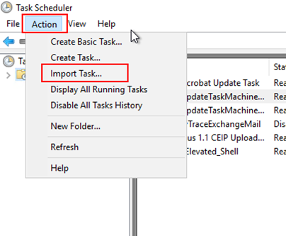
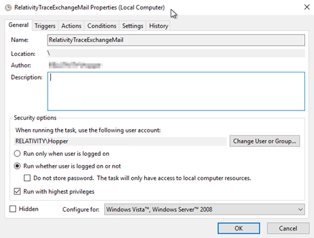
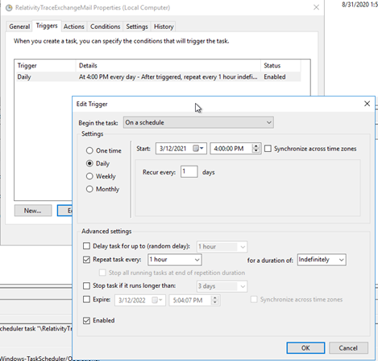

# Using VerQu
{: .no_toc }

VerQu (Hydra) is an on-premises application that collects data from on-premises data sources.
{: .fs-6 .fw-300 }

1. TOC
{:toc}

---

## Overview

The following sections provide the steps for deploying VerQu locally and configuring it data collection.

## Deploying VerQu

### Request Installation Package
Email [support@relativity.com](mailto:support@relativity.com) to request the installation package for VerQu on-premises application for data collection.

### Installing and Configuring the VerQu

1. Unzip the installation package ensure the following folder structure exists.

    

    Install this package on the server where the data you're attempting to collect resides (e.g Exchange server).
    {: .warn}

    - **Trace.Core.exe** is the executable responsible for running VerQu technology to pull data.
    - The installation Drive letter may be different than what you see in the example.
    - You will be directed to use one of the .json configurations depending on what type of data sources you are configuring.
    {: .info}

1. Identify the location where you want data to be exported to and create a folder called `RelativityTraceData`

1. Create unique folders within `RelativityTraceData` for each unique data source

    

1. Create a `Logs`, `Output`, and `Temp` folder within each unique data source folder.

    

    The output folder is where Shipper will access the data or where data will be retrieved to transfer through SFTP to RelativityOne.
    {: .info}

1.  Navigate back to the folder where the **Trace.Core.exe** resides and locate the .json configuration files that align with the data source you are configuring.

    

    The .json configuration file that needs to be edited for the data source you are configuring will be specified in the data source specific documentation page (e.g. [Microsoft Exchange Server]({{ site.baseurl }})).
    {: .info}

1. Edit the .json configuration to define specific values. 

    Details on what changes are required for the data source you are configuring will be specified in the data source specific documentation page (e.g. [Microsoft Exchange Server]({{ site.baseurl }})).
    {: .info}

1. Once the .json configuration file is updated and saved, using command line run the **Trace.Core.exe** with the corresponding .json configuration file. This will perform a one time pull of data using the connector.

    *Example for Microsoft Exchange*

    ```
    C:\RelativityTrace\MicrosoftExchange\latest> .\Trace.Core.exe -cC:\RelativityTrace\MicrosoftExchange\latest\MicrosoftExchangeServer-Mail.json
    ```

    

1. Check the `RelativityTraceData\[DataSourceName]\Output` folder to ensure data was extracted from the source

1. Check the `RelativityTraceData\[DataSourceName]\Logs` folder to ensure there are no critical errors

The VerQu connector is now properly configured.

## Setting VerQu to Run on a Schedule

1. VerQu is set to run on a schedule using the [Windows Task Scheduler](https://docs.microsoft.com/en-us/troubleshoot/windows-server/system-management-components/schedule-server-process). Familiarize yourself with this tool.

1. Create a Task configuration .xml file that will be uploaded to the Windows Task Scheduler.
   
    Here is an example Task configuration .xml file for a Microsoft Exchange connector (**RelativityTraceExchangeMail.xml**).

    The **Author** value should be full username that will run this task (e.g.) *DOMAIN\username*)
    {: .info}

    ```xml
    <?xml version="1.0" encoding="UTF-16"?>
    <Task version="1.2" xmlns="http://schemas.microsoft.com/windows/2004/02/mit/task">
        <RegistrationInfo>
        <Date>2021-03-12T15:53:36.1319058</Date>
        <Author>RELATIVITY\Hopper</Author>
        <URI>\RelativityTraceExchangeMail</URI>
        </RegistrationInfo>
        <Triggers>
        <CalendarTrigger>
        <Repetition>
    ​    <Interval>PT1H</Interval>
    ​    <StopAtDurationEnd>false</StopAtDurationEnd>
        </Repetition>
        <StartBoundary>2021-03-12T16:00:00</StartBoundary>
        <Enabled>true</Enabled>
        <ScheduleByDay>
    ​    <DaysInterval>1</DaysInterval>
        </ScheduleByDay>
        </CalendarTrigger>
        </Triggers>
        <Principals>
        <Principal id="Author">
        <UserId>S-1-5-21-2689140839-1754446295-1098153973-1006</UserId>
        <LogonType>Password</LogonType>
        <RunLevel>HighestAvailable</RunLevel>
        </Principal>
        </Principals>
        <Settings>
        <MultipleInstancesPolicy>IgnoreNew</MultipleInstancesPolicy>
        <DisallowStartIfOnBatteries>true</DisallowStartIfOnBatteries>
        <StopIfGoingOnBatteries>true</StopIfGoingOnBatteries>
        <AllowHardTerminate>true</AllowHardTerminate>
        <StartWhenAvailable>false</StartWhenAvailable>
        <RunOnlyIfNetworkAvailable>false</RunOnlyIfNetworkAvailable>
        <IdleSettings>
        <StopOnIdleEnd>true</StopOnIdleEnd>
        <RestartOnIdle>false</RestartOnIdle>
        </IdleSettings>
        <AllowStartOnDemand>true</AllowStartOnDemand>
        <Enabled>false</Enabled>
        <Hidden>false</Hidden>
        <RunOnlyIfIdle>false</RunOnlyIfIdle>
        <WakeToRun>true</WakeToRun>
        <ExecutionTimeLimit>P1D</ExecutionTimeLimit>
        <Priority>7</Priority>
        </Settings>
        <Actions Context="Author">
        <Exec>
        <Command>C:\RelativityTrace\MicrosoftExchange\latest\Trace.Core.exe</Command>
        <Arguments>-c "C:\RelativityTrace\MicrosoftExchange\latest\MicrosoftExchangeServer-Mail.json"</Arguments>
        <WorkingDirectory>C:\RelativityTrace\MicrosoftExchange\latest</WorkingDirectory>
        </Exec>
        </Actions>
    </Task>
    ```
   
1. Import the Task configuration .xml file into Windows Task Scheduler by going to `Action` > `Import Task`.

    
   
1. Verify that the Task is properly configured.

    
    
    
    
    

1. Enable the Task Scheduler

    

The VerQu connector is now collecting data on a schedule.