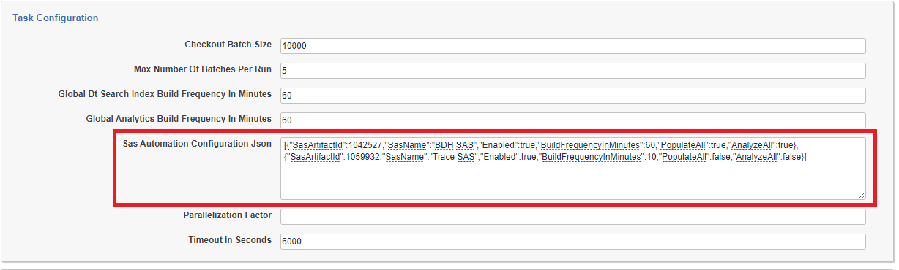

# Analytics
{: .no_toc }

Analytics capabilities consist of language identification, name normalization, email threading, textual near duplicate identification, repeated content identification, find conceptually similar content, and topic clustering.
{: .fs-6 .fw-300 }

1. TOC
{:toc}

---

## Analytics Automation

Conceptual Analytics Indexes, Classification Analytics Indexes, and Structured Analytics Sets can all be automated with Relativity Trace.

The Analytics application must be installed into the workspace before analytics automation can be used.
{: .info }

### Conceptual and Classification Analytics

Relativity Trace will create the Trace Conceptual Analytics Index and the Trace Classification Analytics Index after install or upgrade of the Trace application if the Analytics application is installed in the workspace. By default, these indexes will not build automatically. To begin automation of an index, first perform a Full Build manually through the Relativity UI. Subsequently, Relativity Trace will automate incremental builds of the index based on the value of the `Global Analytics Build Frequency In Minutes` setting defined on the Indexing Task. To disable automatic builds of the Trace Conceptual and Classification indexes, set the value of the `Global Analytics Build Frequency In Minutes` setting to `-1`.

### Structured Analytics Sets

Relativity Trace can trigger automatic builds of any Structured Analytics Set defined in the workspace. It is possible to configure automation of multiple Structured Analytics Sets at the same time with different settings for build frequency, population scope and analysis scope.

1. Create the Structured Analytics Set(s) that will be automated and run Full Builds on them.

   For recommendations on how to configure each of the different types of Structured Analytics Sets including Saved Search details, how frequently to run, and what kind of builds to automate, please contact [support@relativity.com](mailto:support@relativity.com)
   {: .info }

2. Edit the Indexing Task from the Setup page. Under Task Settings, the `Sas Automation Configuration Json` field should automatically populate with a JSON node for every Structured Analytics Set defined in the workspace: 

3. For each Structured Analytics Set that should be automated, perform the following steps:

   1. Find the Structured Analytics Set by looking for its name in the `SasName` field

   2. In the same JSON node (wrapped with {}), change the `Enabled` property to `true`

   3. Change the `BuildFrequencyInMinutes` property to the appropriate build frequency in minutes 

      This is the most frequently the Structured Analytics Set will be built, if a build takes longer than the interval then the next build will start when the previous one ends. Be careful not to build more frequently than needed as every build consumes resources on the Analytics server.
      {: .info }

   4. Change the `PopulateAll` property to `true` if the underlying index should be repopulated with all relevant documents before each build (`true` for a full build, `false` for an incremental build)

      Setting `PopulateAll` to `true` can cause builds to take much longer and consume a lot more resources on the Analytics server.
      {: .info }

   5. Change the `AnalyzeAll` property to `true` if the entire index should be analyzed in each build (`true` for a full build, `false` for an incremental build)

      Setting `AnalyzeAll` to `true` can cause builds to take much longer and consume a lot more resources on the Analytics server.
      {: .info }

4. Click Save and the Trace Manager Agent will automate for every Structured Analytics set with Enabled = true.

