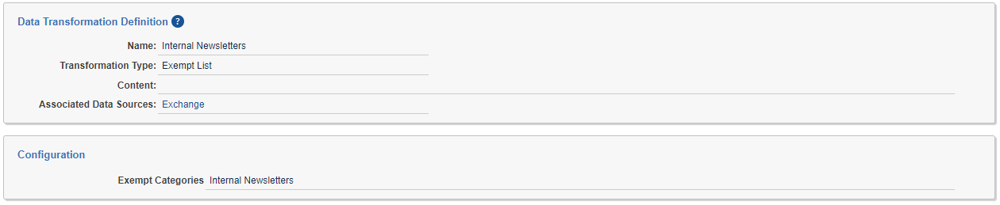
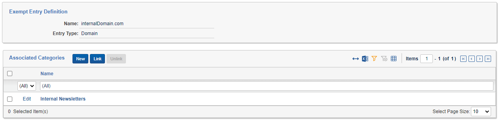
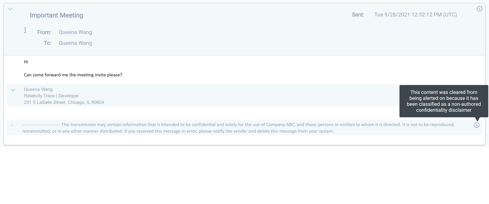
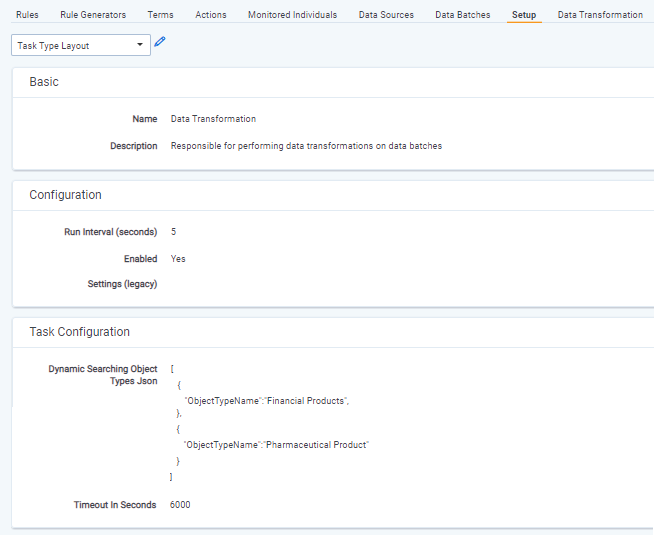
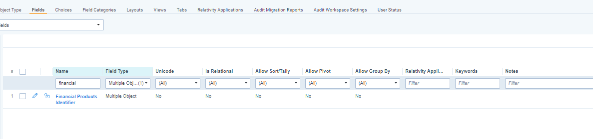
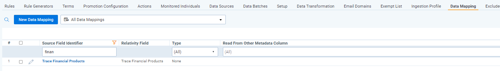
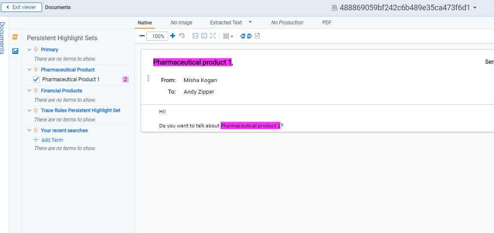
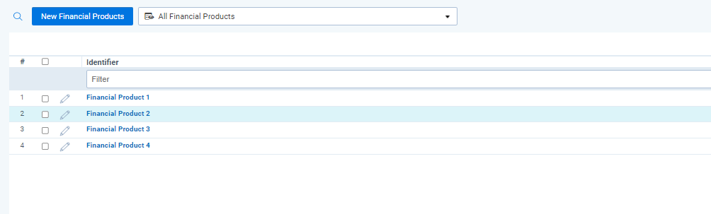

# Data Transformations
{: .no_toc }


Data Transformations analyze and enrich communications before they become a document and have the ability to adjust underlying content.
{: .fs-6 .fw-300 }

1. TOC
{:toc}

---

## Data Transformations

Data Transformations allow administrators to specify a way data should be transformed while it is being imported by the data source. Some Trace Data Transformations must be attached to a Data Source by clicking Link in the Data Transformations section of the Data Source Layout, while other Data Transformations run automatically for all data sources.

### Language Identification

This Data Transformation runs automatically for all Data Sources and does not require a Data Transformation to be manually linked to a Data Source.
{: .info}

The languages used within a communication are automatically identified by the system. The `Cleansed Extracted Text` field is used to analyze for languages used. The following language related fields are populated:
- `Trace Primary Language`: A fixed-length text field that contains the most used language in the communication (e.g. `French`)
- `Trace Other Langauges`: A fixed-length text field that lists all of the non-primary languages used in the communication (e.g. `(Language: Danish , Confidence: 540),(Language: Japanese , Confidence: 1977)`)

There is a a known issue for the spelling of the `Trace Other Langauges` field and the format of the results.
{: .warn}

- `Trace Language Switching`: A Yes/No field the denotes whether multiple languages are detected in the communication

**Limitations**
- If the `Cleansed Extracted Text` field does not contain any content for a communication then results will not be populated for the language identification fields.
- If the `Cleansed Extracted Text` field contains more than 30mb of text then results will not be populated for the language identification fields.

**Using Results**
These language identification results can be used to hone alert Rules, build workflow Rules that direct communications in certain languages to native speaking reviewers, or search for specific communications as part of an investigation.


### Spam Detection

This Data Transformation runs automatically for all Data Sources and does not require a Data Transformation to be manually linked to a Data Source.
{: .info}

The system automatically detects whether a communication is Spam based on the `Cleansed Extracted Text` of the communication. Spam is defined as irrelevant communications that could not contain misconduct. The `Trace Is Spam` field is populated with either a `Spam` or `Not Spam` value based on its analysis.

**Limitations**
- Spam Detection only analyzes English text within a communication, so if there is no English text or an insufficient amount to determine whether the communication is Spam the communication will receive a value of `Not Spam`.
- If the `Cleansed Extracted Text` field does not contain any content for a communication then results will not be populated for the `Trace Is Spam` field.
- If the `Cleansed Extracted Text` field contains more than 30mb of text then results will not be populated for the `Trace Is Spam` field.

**Using Results**
To remove all Spam content from generating false-positive alerts, it is suggested that you add a `Trace Is Spam = Spam` condition to the Saved Search used on the `Omit from Alert Rules` setting on the `Rule Evaluation` Task. Find more information on `Omit from Alert Rules` [here]({{ site.baseurl }})

To eliminate the likelihood false-positive spam detection, the threshold for classifying a communication as `Spam` is high.
{: .info}


### Replace Data Transformation

Data Transformations of type *Replace* allow you to strip exact blocks of text out of the Extracted Text for any documents imported by the associated Data Source. This allows for removal of things like email signatures and other frequently occurring, benign text so that they do not match Terms. A Data Source can be associated with multiple Data Transformations of type Replace.

By Default, content will simply be replaced with nothing (empty string). This can be changed by entering Match Replacement Text in the Configuration section.


Replacement of the Extracted Text (application of replace data transformation) happens on a new copy of the Extracted Text (referenced as *<original_file_name>.replaced.txt*).  Newly generated Extracted Text is referenced in a separate loadfile (`loadfile.replaced.dat`).  In addition, if original loadfile.dat contains a column named `Extracted Text Size in KB` , ONLY then `Extracted Text Size in KB` field is re-generated with updated length.  **Previously generated/supplied data for `Extracted Text Size in KB` is overwritten in this case.**
{: .info}

### Deduplication Data Transformation

Data Transformations of type `Deduplication` prevent a Data Source from importing an original document and its extractions if the same document already exists in the workspace. Only one Data Transformation of type Deduplication should be associated with each Data Source.

For Trace native [Data Sources](#data-sources), deduplication is driven by a SHA256 hashing algorithm that populates the Trace Document Hash field on each document. By Default, if the document is an email, the algorithm will hash together the sender, subject, recipients, sent date, email body and attachment list to create the hash value. If the document is not an email, then the hash will be done directly on the bytes of the file. It is possible to configure the exact hashing algorithm used for emails using the settings in the Configuration section:


When additional documents are ingested (either within the same Data Batch or different Data Batches), hashes of original documents will be compared to those on documents that already exist in the workspace. If there is a match, the duplicate document will not be ingested. Instead, the Trace Monitored Individuals field on the document will be updated to include the Monitored Individual that was the source of the duplicate in addition to the Monitored Individual that was the source of the original.

#### Required Fields for Deduplication

Deduplication of a Data Source requires that the following Relativity fields be mapped in the Data Source's associated Ingestion Profile.

1. Trace Document Hash
2. Group Identifier
3. Native File Path -- must be specified, but not necessarily mapped.
   
   Because of this requirement, Deduplication is incompatible with [Ingestion Profiles](#Ingestion-Profiles) where Import Natives is set to no.
   {: .info}

### Communication Direction Data Transformation

Data Transformations of type `Communication Direction` can be used to populate the `Trace Communication Direction` and `Trace Communication Personal` fields on documents based on domain classifications made on the `Email Domain` object. 

**Trace Communication Direction**
By specifying internal email domains (e.g mycompany.com, us.mycompany.com) on the `Email Domain` object, the Communication Direction Data Transformation will mark communications as either `Internal`, `Inbound`, `Outbound`, or `External` on the `Trace Communication Direction` field. This can be used to target risks that only occur on inbound communication or internal communications.

- **Internal** ALL of the email addresses in the From, To, CC, and BCC fields have domains that have been classified as **internal**
- **Inbound** the From address has a domain that is **NOT internal**, and ONE OR MORE of the email addresses in the To, CC, and BCC fields has a domain that has been classified as **internal**
- **Outbound** the From address has a domain that has been classified as **internal**, and ONE OR MORE of the email addresses in the To, CC, and BCC fields has a domain that is **NOT internal**
- **External** All of the email addresses in the From, To, CC, and BCC fields have domains that are **NOT internal** (unlikely to happen unless `Internal Email Domains` change)
- **Undefined** the From field must contain an email address with a domain and at least one of the To, CC, or BCC fields must contain an email address with a domain or the `Trace Communication Direction` is considered **Undefined** (need one domain in each direction to determine `Communication Direction`)


**Trace Communication Personal**
By specifing person email domains (e.g. google.com, yahoo.com) on the `Email Domain` object, the Communcication Direction Data Transformation will mark communications as either `Personal` or `No Personal Domains` on the `Trace Communication Personal` field. This can be used to target risks that only occur when invididuals are sending or receiving communications from personal email addresses.

- **Personal** the From address has a domain that has been classified as **personal** OR any email address in the To, CC, BCC fields has a domain that is personal **personal**
- **No Personal Domains** NONE of the email addresses in From, To, CC and BCC fields has a domina that has been classified as **personal**
- **Undefined** the From field must contain an email address with a domain and at least one of the To, CC, or BCC fields must contain an email address with a domain or the `Trace Communication Personal` is considered **Undefined** (need one domain in each direction to determine `Communication Direction`)

.
- `Email Domain` object names are not case sensitive.
- When using the `Communication Direction` transformation type, analysis is performed only on native documents (top-level) and then the `Trace Communication Direction` and `Trace Communication Personal` value is populated on the native documents and inherited down to all child documents (attachments, embedded objects).
- The `Trace Communication Direction` and `Trace Communication Personal` field will not be populated on documents unless it is mapped in the Ingestion Profile associated with the Data Source containing the `Communication Direction` transform.
- Use of the `Communication Direction` Data Transformation type requires that columns named To, From, CC, and BCC exist in the load file. This is always true for Data Sources that ship with Relativity Trace but may not be true for certain external data sources.
- Use of the `Communication Direction` Data Transformation type requires that a load file column be specified as a Native File Path in the Data Source's [Ingestion Profile](#Ingestion-Profiles). Because of this requirement, Communication Direction is incompatible with Ingestion Profiles where Import Natives is set to no.
{: .info}


### Exempt List Data Transformation

Data Transformations of type `Exempt List` can be used to populate the `Trace Exempt` field on documents with a Yes/No value that indicates whether a particular communication can be excluded from review. The `Trace Exempt` document field is populated based on the `Exempt Entry` objects defined in the workspace. `Exempt List` transformations can specify the `Exempt List Categories` that should apply to the Data Source, or the `Exempt List Categories` field can be left blank in which case all `Exempt Entry` objects in the workspace will be considered. Only one `Exempt List` Data Transformation can be applied to each `Data Source`.



A communication is considered exempt if the `From ` field matches one or more of the `Exempt Entry` objects in the `Exempt List Categories` specified on the `Exempt List` transform.  An `Exempt Entry` has a value in the `Name` field and an `Entry Type` of **Username** (the part before the `@`) **Domain** (the part after the `@`) or the entire **Email Address**. Regardless of the `Entry Type`, all entries are matched **case insensitive** . An `Exempt Entry` can be in one or more Associated Categories, or it can be left without a category in which case it will only apply for transforms that do not specify a category.

> **EXAMPLES:** Consider the email address `John.Doe@Trace.com`
>
> * The **Username** is `John.Doe`
> * The **Email Address** is `John.Doe@Trace.com`
> * The **Domain** is Trace.com
>
> Each of the following `Exempt Entry` objects would match this email address
>
> * `john.doe` of type Username
> * `john.doe@trace.com` of type Email Address
> * `trace.com` of type Domain
>
> Notice case is ignored in all three examples.



When using the `Exempt List` transformation type, analysis is performed only on native documents (top-level) and then the `Trace Exempt` value is populated on the native documents and inherited down to all child documents (attachments, embedded objects).

The `Trace Exempt` field will not be populated on documents unless it is mapped in the Ingestion Profile associated with the Data Source containing the `Exempt List` transform.
{: .info}

Having too many `Exempt Entry` objects in a workspace will increase the memory needs of the `Trace Manager Agent` when running `Exempt List` transformations. If your workspace has more than 5000 `Exempt Entry`  objects defined, please contact [support@relativity.com](mailto:support@relativity.com) to make sure you have adequate system resources available.
{: .info}

Use of the `Exempt List` Data Transformation type requires that a column named From exists in the load file. This is always true for Data Sources that ship with Relativity Trace but may not be true for certain external data sources.
{: .info}

Use of the `Communication Direction` Data Transformation type requires that a load file column be specified as a Native File Path in the Data Source's [Ingestion Profile](#Ingestion-Profiles). Because of this requirement, Exempt List is incompatible with Ingestion Profiles where Import Natives is set to no.
{: .info}

### AI Extracted Text Cleansing Data Transformation

  Data Transformation of type `AI Extracted Text Cleansing` can be used to identify and remove non-authored content and duplicative content from the Extracted Text of an email document. A single instance of this data transformation must be added to a data source to enable cleansing. It can be configured to remove confidentiality disclaimers, email signatures, email headers, and duplicative email content that has already been ingested, allowing users to review and run rules on only new authored content. This will reduce both false positive and duplicative alert volumes.

  There are two categories of cleansing : <u>Non-Authored Content Removal</u> and <u>Duplicative Content Removal</u>. Non-Authored Content removal automatically removes content that was not written by the sender of the email, such as headers, signatures, and disclaimers. Duplicative Content Removal automatically removes content within an email that was previously ingested in a separate email. For example, when you reply or forward an email previous emails within the chain will be included in your new email below your new message. If these prior emails were already ingested by the system, this content would be removed from the new email, leaving only the new authored content. This is also called Email Thread Deduplication, since the content that gets removed are email threads within the email chain that were previously ingested in another email document. This allows users to only review and alert on net new emails as they come in.

  There are five fields that are used through the cleansing transformation process:

  1. <u>Extracted Text</u> - input field for cleansing that is generated during enrichment
  2. <u>Trace Cleansed Extracted Text</u> - field that gets populated during cleansing that contains the Extracted Text after non-authored and duplicative content is removed. If nothing was cleansed, this field will contain the same content as Extracted Text.
  3. <u>Trace Removed Extracted Text</u> - field that gets populated with the content that was removed from Extracted Text if content was removed during cleansing. It will be empty if nothing was cleansed. This content is stored in a JSON format and contains information on why the content was removed.
  4. <u>Trace AI Extracted Text Cleansing Status</u> - field that contains the status of the cleansing transformation. There are 4 possible statuses for cleansing. See status section below for the possible statuses.
  5. <u>Trace AI Extracted Text Cleansing Error Details</u> - field that contains the error details of cleansing transform if an error occurred. It will be empty if no error occurred.
 
**Alerting on Cleansed Data**

To get the alert reduction benefit of text cleansing, you will need to have Term Searching for Rules run across the newly generated `Trace Cleansed Extracted Text` rather than the original `Extracted Text` that contains non-authored and duplicative content. 

One can migrate to 'Trace Cleansed Extracted Text' in the Setup tab. Please see the image below. 


 
Changing the `Trace All Documents` saved search will impact all functionality that relies on it. Prior to making this change, check search indexes (global search), analytics indexes (classification and conceptual), to better understand how this saved search is being used. In certain cases you may want to create a new saved search that uses the `Extracted Text` field for index builds and other downstream functionality.  
{: .danger}

Documents created prior Trace version 14.5 being deployed will not have the `Trace Cleansed Extracted Text` field populated. This means that if you were to create a search index off of this field, old documents would not have any text in the index and therefor not be returned in a term search.
{: .danger}

After changing the `Trace All Documents` saved search please contact support@relativity.com when attempting to perform a Document Retry on old documents that don't have the `Trace Cleansed Extracted Text` populated.
{: .warn}

When you add the `AI Extracted Text Cleansing` Data Transformation to a any data source, the `Trace Cleansed Extracted Text` is populated for every document that gets ingested into the workspace from any data source. This makes it possible to use the `Trace Cleansed Extracted Text` field within the `Trace All Documents` saved search for every document.
{: .info}

The `Trace Cleansed Extracted Text` can also be used in search, conceptual, or classification indexes to impact other operations and use cases.
{: .info}

**Cleansed Data in the Viewer**

We are able to identify headers, footers, confidentiality segments, and deduplicative text that were removed during `AI Extracted Text Cleansing`.



More information on the Viewer can be found [here](https://relativitydev.github.io/relativity-trace-documentation/docs/user_guide/review/reviewing_communications.html).

**Statuses**

When `AI Extracted Text Cleansing` is performed on a document, `Trace AI Extracted Text Cleansing Status` document field will be populated. `Trace AI Extracted Text Cleansing Status` stores a status denoting whether extracted text was cleansed, not cleansed, or a warning if an error occurred when attempting to cleanse. If an error occurred, information regarding the error will be populated on the `Trace AI Extracted Text Cleansing Error Details` document field.

  There are four possible outcome after cleansing and are denoted with the following four statuses:
  
  Regardless of the `AI Extracted Text Cleansing Status` a document will move through the document flow and be analyzed for alerts. If a warning status occurs on a document, it purely means that cleansing could not be performed and that analysis and alerting will occur on the original text. 
     {: .info}
     
  1. <u>Success - Extracted Text Cleansed</u> : Cleansing was successful and content was removed. `Trace Cleansed Extracted Text` will have less content than `Extracted Text`. `Trace Removed Extracted Text`  will contain the removed properties from the emails and `Trace AI Extracted Text Cleansing Error Details` will be empty.

  2. <u>Success - No Extracted Text Cleansed</u> : Cleansing was successful, but no content was removed. `Trace Cleansed Extracted Text` and `Extracted Text` fields will have the same content. `Trace Removed Extracted Text` and `Trace AI Extracted Text Cleansing Error Details` will be empty.

  3. <u>Warning - Service Error</u> : Cleansing was unable to run due to a service error.  `Trace Cleansed Extracted Text` and `Extracted Text` fields will be the same and `Trace Removed Extracted Text` will be empty since cleansing did not occur. `Trace AI Extracted Text Cleansing Error Details` will contain an error message with the reason for the service error.

  4. <u>Warning - Document Error</u> : Cleansing was unable to run due to a document error. This means that the actual input document was the cause of the error and cleansing was unable to run. `Trace Cleansed Extracted Text` and `Extracted Text` fields will be the same and `Trace Removed Extracted Text` will be empty since cleansing did not occur. `Trace AI Extracted Text Cleansing Error Details` will contain an error message with the reason for the document error.

     Common document errors include trying to cleanse documents that are not emails OR the email headers do not contain all required properties. See Considerations section for required email header properties.
     {: .info}
     
     Emails that contain mobile headers (e.g. On Jan 1, 2021 12:00PM, John Doe <john.doe@domain.com> wrote:) are currently not supported and if included in an email will cause the status to be `Warning - Document Error`. Support for this header format will be supported in the future.
     {: .warn}

     

  If cleansing was successful, regardless of whether anything was cleansed or not, the cleansed version of extracted text will be found in `Trace Cleansed Extracted Text`. All of the content that was removed during cleansing can be found as a JSON in the `Trace Removed Extracted Text` field. If nothing was actually cleansed, then `Trace Cleansed Extracted Text` will be exactly the same as the `Extracted Text` field and `Trace Removed Extracted Text` will be empty.

**How To Configure the Transform**

  1. To setup cleansing transform, create a new data transformation in the data transformation tab.

  2.  Give the transform a name, select transformation type of `AI Extracted Text Cleansing`, and select the checkboxes on the type of content you want to cleanse.

     When `Remove Email Headers` is enabled, cleansing will always act on the document since headers will always exist in an email, unlike email signatures or confidentiality disclaimers.
     {: .info} 

  3. Once created, add the transformation to the data source you want to run cleansing on.

     Only data sources that bring in emails should be used for cleansing as it only cleanses email documents. If any non-email types are ran through cleansing, they will fail with a status of Warning - Document Error and the error details will contain the reason for the document error.
     {: .info}

  4. All email documents being ingested from this data source will now undergo cleansing. If you want to change the configuration of the content that gets removed, you can return to the data transformation, click edit, and de-select the checkboxes as desired. Any future emails ingested will now remove content as configured.

     

  

**Trace Conversation Thread Field**
When the "Duplicative Content - Remove Already Ingested Email segments" configuration is set to TRUE, and the operation runs successfully, the Trace Conversation Thread field is populated with an id that links together all emails within the same thread. The Trace Conversation Thread field is a Relational field making it where documents within the same thread as a document shown in the Viewer will be displayed in the Relational Pane, allowing for quick navigation to other communications in a thread for greater context around how events unfolded. This field can be used as an alternative to the Email Thread Group ID created by the Structured Analytics operation.

This runs without Structured Analytics and will not produce results that can be visualized in the Email Thread visualization
{: .info}

**Important Considerations**

  1. Cleansing is meant to only work on email documents. This means emails that have clear and defined headers will get cleansed. Email headers need to contain From, Sent, Subject, Body, and at least one of To, CC, or BCC. If these headers can't be parsed, then cleansing will fail with a status of Warning - Document Error. No other type of documents are currently supported for cleansing.
  2. AI Extracted Text Cleansing transformation occurs before any Replace transformations take place. This means, if there are Replace transform that target non-authored content, they will not take effect if that portion of the text is removed by the AI Extracted Text Cleansing transform first.

 
### Group Identifier Truncation for External Data Sources

`Group Identifier` is a special field in Relativity Trace that is used to power several features including Deduplication. It is essential that a value for `Group Identifier` be provided for every document imported with Trace. Relativity imposes a restriction on the Group Identifier field where the value is not allowed to be longer than 400 characters. The Trace team has found that some external Data Sources populate Group Identifier with a value longer than 400 characters. Instead of failing to import documents from these Data Sources, if the value provided in the field mapped to Group Identifier is longer than 400 characters, Trace will calculate the SHA256 hash of the value and use the hashed value instead. If Group Identifier Truncation occurs, the document is marked as `Trace Has Errors` and the `Trace Error Details` field is filled with a message explaining that a hashed value was used instead of the original Group Identifier value provided.  The message template is of the following format: `{groupIdentifier_SourceFieldDisplayName} length ({groupIdentifierString.Length}) exceeded 400 characters - used hashed string instead`

`Group Identifier` Truncation occurs for EXTERNAL DATA SOURCES ONLY. External Data Sources have a `Provider` on their `Data Source Type` that is not equal to `Trace` or `Globanet`. Running `Group Identifier` Truncation will result in generation of a separate `loadfile.replaced.dat` load file even if no other Data Transformations are defined on the Data Source. For additional information, please contact [support@relativity.com](mailto:support@relativity.com).
{: .info}

## Dynamic Searching Configuration
Dynamic Searching can be configured in `Data Transformation` task using `Dynamic Searching Object Types Json` setting. In this setting user can set up a list of object types for which searching should be performed. 

  

### Dynamic Search Configuration Parameters

`Dynamic Searching Object Types Json` field is inputted as JSON with each `{}` representing a single object type.

**Parameters of `Dynamic Searching Object Types Json`:**
- `ObjectTypeName` - [Required] an object type for which search will be performed

**Example `Dynamic Searching Object Types Json` configuration:**
```json
[
   {
      "ObjectTypeName":"Financial Products",
   },
   {
      "ObjectTypeName":"Pharmaceutical Product"
   }
]
```

> **`Dynamic Searching Object Types Json` Validation Rules:**
>
> - `ObjectTypeName` must be a name of object type which exists in the workspace
> - One object type can occur only once in `Dynamic Searching Object Types Json` configuration
> - Object type has to have fixed-length field of type identifier
> - Object type can't be saved in configuration if there are no RDOs of given object type
> - Object type can't be saved in configuration if there are RDOs of this object type with duplicated values in identifer field

## Dynamic Searching Execution

After saving `Dynamic Searching Object Types Json` a new configuration is created automatically for every object type.
1) New multiple object field called `Trace` + `ObjectTypeName` is created on `Document` object type. This field joins `Document` and particular `Object Type`.

    

2) New `Persistent Highlight Set` is created and it is set to highlight values from multiple object document field created in previous step.

    

3) New `Data Mapping` is created for multiple object document field created in first step. This data mapping is also added to each `Ingestion Profile` set up for `Document` object type.

    

When new documents are ingested into the system and data transformations are executed on documents' data batch, documents are tagged with objects set up in `Dynamic Searching Object Types Json` setting.





## Dynamic Searching Limitations
1) Objects of object type set up in `Dynamic Searching Object Types Json` cannot contain semicolon (`;`) in identifier field.
2) `Insight.Shared.Toggles.RunTraceDynamicSearchTransformation` toggle must be set to true in order for Dynamic Search to be performed.

