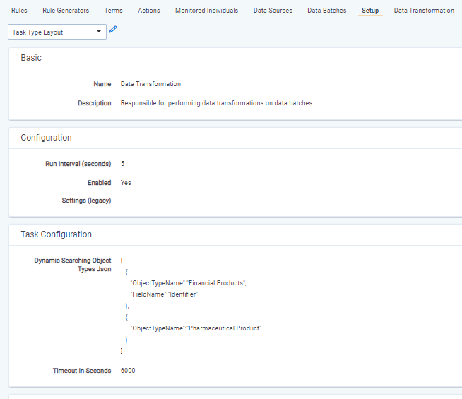

# Dynamic Searching
{: .no_toc }
Dynamic Searching is a feature, which allows user to perform search for different objects that Trace Terms. 

1. TOC
{:toc}

---
## Dynamic Searching Configuration
Dynamic Searching can be configured in `Data Transformation` task using `Dynamic Searching Object Types Json` setting. In this setting user can set up a list of object types and object types' fields for which searching should be performed. 

