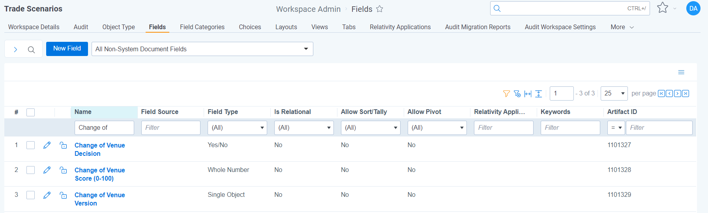
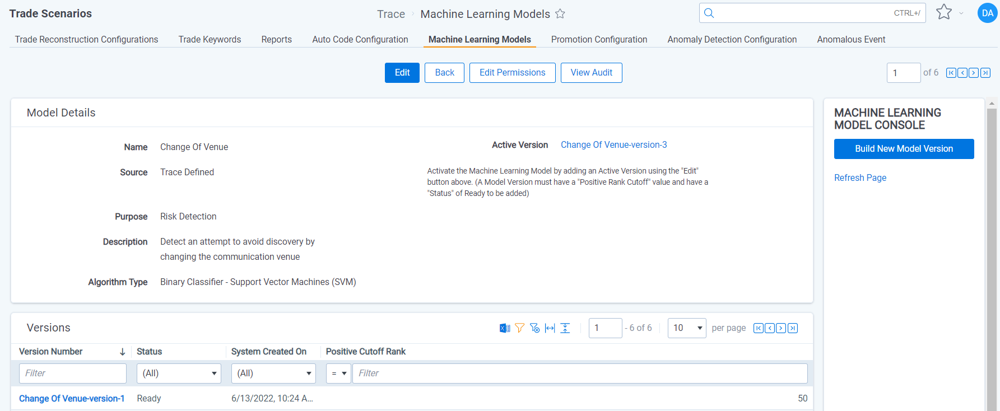
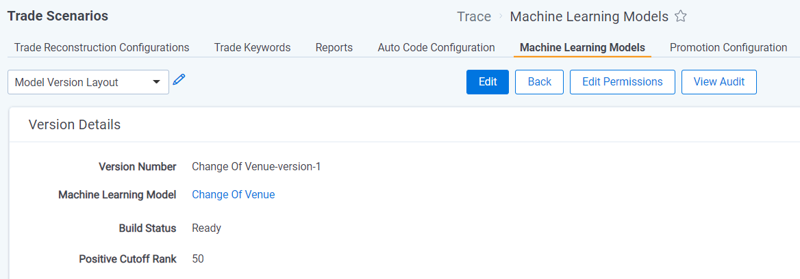
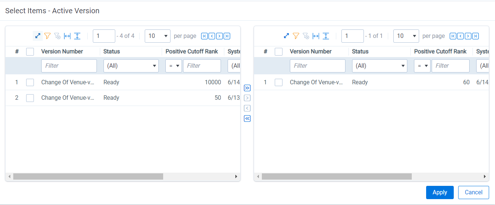
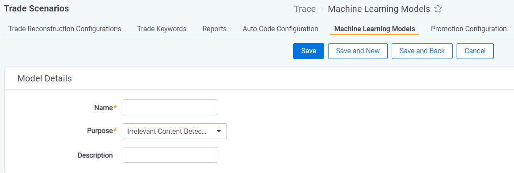

# Machine Learning Models
{: .no_toc }

Machine Learning models can help detect risk or identify irrelevant content that shouldn't be alerted on to reduce false-positive alerting.
{: .fs-6 .fw-300 }

1. TOC
{:toc}

---
## Overview
Trace Machine Learning models are binary classifiers where each model determines whether a communication is a positive or negative example of the behavior the model is built to identify. Machine Learning models also Rank each communication between 0-100 based on the likelihood of being a positive example. A Positive Cutoff Rank is set for each model that determines whether a communication is determined to be positive or negative. E.g. a Collusion model may Rank a communication as 82, but the Positive Cutoff Rate may be 90, meaning this is a negative example of Collusion. Multiple Machine Learning models can be implemented within each workspace to identify unique specific behaviors.

Both pre-built machine learning models and user created models can be used to detect risky content or identify irrelevant content.

Documentation on the deprecated Active Learning workflow for machine learning can be found [here]({{ site.baseurl }}).
{: .info }

## Machine Learning Model Results
The following document fields are created for each Machine Learning Model once the model is enabled (Active Version set).
   1. [Model Name] Decision = Yes or No value on whether the communication is a positive example of the model based on the Rank and the Positive Rank Cutoff value
   2. [Model Name] Score = 0-100 rank on the likelihood the expected outcome occurred with 100 being a high and 0 being low
   3. [Model Name] Version = the Model Version that was set as the Active version when the document was analyzed
   

### Using Machine Learning Model Results

#### Providing Context
Add the `[Machine Learning Model] Decision` and `[Machine Learning Model] Rank` fields to your coding layout to understand the model results when reviewing or analyzing alerted communications for greater context.

#### Alerting on Risky Content
A Rule is automatically created for `Risk Detection` Machine Learning Models. The associated Rule is `Disabled` by default, but can be enabled to start alerting on the risk that the model is built to identify. Other search criteria can be added to this Rule to further hone or expand to broader risks.

Rules work best when they leverage AI, metadata, and terms. Prior to enabling a machine learning created Risk Detection rule consider updating the corresponding saved search to evaluate the following fields: `Recipient Count`, `Trace Is Extracted`, `Trace Primary Language`, `Communication Direction`, `Trace Type`, or Mailbox Group/Business Division of Monitored Individuals.
{: .info}

#### Ignoring Irrelevant Content
Machine Learning Models with the purpose of detecting irrelevant content can be used to reduce false-positive alerts.
1. Locate the Saved Search used for the `Omit from Alert Rules` functionality within the `Rules Evaluation` Task (See Trace Document Flow Overview section for more information)
1. Create a new logic group with an `OR` operator
1. Add `[Machine Learning model] Decision` is `YES` to the logic group
1. Add more conditions to the logic group separated by `AND` operators to hone what is removed:
   - `Trace Is Extracted`: `False`
   - `Trace Communication Direction`: `Inbound`, `Outbound`, `Internal`, `External`
   - `Trace Primary Language`: `English`
   - `Trace Type`: Select email, chat, and audio data sources
1. Save the saved search

## Enabling a Trace Defined Machine Learning Model
The following steps can be used to enable a Trace Defined Machine Learning Model.

1. Navigate to the Machine Learning Model tab

2. Click into the Machine Learning Model of interest

3. If you don't see a Model Version in the list at the bottom of the page, click "Build New Model Version" on the Console (refresh the page to see the status of the new Model Version)
4. Click on the Model Version in the list at the bottom of the page
5. Assign a "Positive Cutoff Rank" (Start with 70 if no validation test has been performed)

5. Navigate back to the Machine Learning Model
6. Edit the Machine Learning Model and populate the "Active Version" field with the most recent Model Version

- A "Positive Rank Cutoff" must be set on the Model Version to be set as the Active Version
- Only one Model Version can be set as the Active Version at a time
{: .info }

Once an "Active Version is set, the Machine Learning Model is enabled, and will analyze new communications that are ingested through Data Batches. See the Machine Learning Model Results for more details.

## Building your own Machine Learning Model
The following steps can be used to build your own Machine Learning Models for either risk detection or irrelevant content detection.

- Each Machine Learning model should be as specific as possible rather than attempt to identify multiple behaviors
{: .info }  

- Each Machine Learning model requires a unique name
- Machine Learning Model names cannot be changed after they are created
- Machine Learning Models cannot be deleted after being created
{: .warn }        

1. Navigate to the Machine Learning Model tab

2. Click the `New Machine Learning Model` button and create a new Machine Learning Model
   1. Name = This should describe what the model is attempting to identify. This value must be unique. This value will be used to create document fields and other objects
   2. Purpose = The goal of the model (If Risk Detection is selected a disabled Rule will be created for this model)
   3. Description = Explain what this model is intended to accomplish for your own understanding

By saving the Machine Learning Model, a choice with the name of the Machine Learning Model will be added to the `Risk Detection Label` field or `Irrelevant Content Detection Label` document field based on the Purpose field value on the Machine Learning Model.

Prior to enabling a Machine Learning Model, at least five documents will need to be tagged with the corresponding choice on either the `Risk Detection Label` or `Irrelevant Content Detection Label` field.

5. Once labeling requirements are met, navigate back to the Machine Learning Model
6. Click "Build New Model Version" on the console (refresh the page to see the status of the new Model Version)
7. Click on the Model Version in the list at the bottom of the page
5. Assign a "Positive Cutoff Rank" (Start with 70 if no validation test has been performed)

5. Navigate back to the Machine Learning Model
6. Edit the Machine Learning Model and populate the "Active Version" field with the most recent Model Version

- A "Positive Rank Cutoff" must be set on the Model Version to be set as the Active Version
- Only one Model Version can be set as the Active Version at a time
{: .info }

Once an "Active Version is set, the Machine Learning Model is enabled, and will analyze new communications that are ingested through Data Batches. See the Machine Learning Model Results for more details.

## Improving a Machine Learning Model

Both Trace Defined and Customer Defined Machine Learning Models can be enhanced with further customer labeling.

1. Locate positive communications for the behavior the Machine Learning Model is attempting to identity
2. Use either the Mass Edit operation or Viewer coding pane to tag the appropriate choice on the `Risk Detection Label` or `Irrelevant Content Detection Label` document field
4. Navigate to the Machine Learning Model and press the "Build New Model Version" console button (refresh the page to see the status of the new Model Version)
5. Edit the Machine Learning Model and populate the "Active Version" field the newly created Model Version

Machine Learning Models are not updated by simply labeling documents on either the `Risk Detection Label` or `Irrelevant Content Detection Label` document field. You must build a new model version and set that new version as the "Active Version" to get the benefits of the newly labeled documents.
{: .info }

Documents that were included in a previous Model Version, but have since been removed from the workspace, will not be included in new model version builds.
{: .warn }
