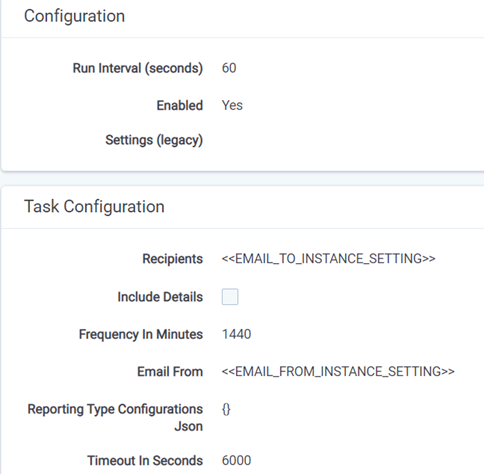

# Notifications
{: .no_toc }

Trace offers predifined notification reports for complete defensibility and reporting.
{: .fs-6 .fw-300 }

1. TOC
{:toc}

---

## Trace Document Fields
Trace has added functionality that allows companies to better detect risk by monitoring actions taken by their surveillance team. Now companies can track if surveillance team members have viewed documents that should not have been viewed. Trace will send an email report or real-time notifications regarding privacy issues where reviewers are looking at non-alerted documents. 

The following is how to enable the feature

1. Go to *Setup Tab*
2. Click *Reporting Tasks* 
3. Reporting Type Configuration set to enabled and enter the recipients in the json 
