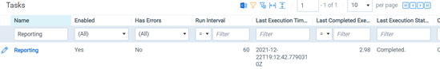
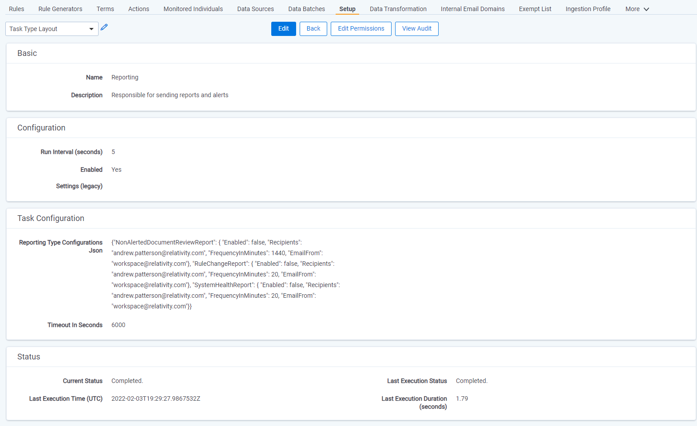

# Notifications
{: .no_toc }


Trace offers predefined notification reports for complete defensibility and reporting.
{: .fs-6 .fw-300 }

1. TOC
{:toc}

---

## Monitor Your Surveillance Team
Companies must protect themselves from bad actors within their compliance teams. Notifications allow for supervisors to get notified when potentially questionable actions are being taken by their surveillance team. Both emails and in-product reports (Reports tab) will be generated for notifications that are configured.

## Notification Types

### Non-Alerted Document Review Reports
Get notified when a surveillance team member views a document that was not alerted on.

### Rule Change Report
Get notified when a surveillance team member updates a Term associated to a Rule.

### System Health Report
Get notified there are task errors in the system.

Task errors are escalated to Trace support automatically and fixed generally without any customer interaction and therefor this notification does not need to be enabled.
{: .info}

## Setting Up Notifications

1. Navigate to the `Setup` tab
1. Click the `Reporting` task 
    

1. Populate the `Reporting Type Configuration` field based on the json configuration settings below

The Reporting task must be enabled for notifications to be generated.
{: .info}

### JSON Configuration

Non-Alerted Document Review Report: `NonAlertedDocumentReviewReport`
Rule Change Report: `RuleChangeReport`
System Health Report: `SystemHealthReport`


**Generic Configuration**

- Enabled - a true/false value. Technically deleting the entry from the json will also disable, but to preserve expected settings the preferred method to stop a report is to set this value to false
- Recipients - a semi-colon-separated list of email addresses to send this report to, or <<EMAIL_TO_INSTANCE_SETTING>> to override with the EmailTo Relativity Instance setting
- FrequencyInMinutes - how often the report should run, i.e. 15 for every 15 minutes
- EmailFrom - email address the report should come from, or <<EMAIL_FROM_INSTANCE_SETTING>>  to override with the EmailFrom Relativity Instance setting

**Notification Type Specific Configuration**

- ExcludedTraceTypes - *Non-Alerted Document Review Report Only* - an optional field that allows for the exclusion of communications of a certain `Trace Type` from a report. Multiple values can be excluded if comma delimited. `["Office 365 Email", "Slack]`
- IncludeDetails - *System Health Report Only* - a true/false value which pro. Currently only used by the SystemHealthAlertsReport to provide extra details on the error each Task encountered

*Example JSON Configuration*

```json
{"NonAlertedDocumentReviewReport":{"Enabled":true,"Recipients":"user@domain.com","FrequencyInMinutes":1440,"EmailFrom":"noreply@relativity.one", "ExcludedTraceTypes":"Slack"},
"RuleChangeReport": {"Enabled":true,"Recipients":"user@domain.com","FrequencyInMinutes":1440,"EmailFrom":"noreply@relativity.one"}, "SystemHealthReport": {"Enabled":true,"Recipients":"user@domain.com","FrequencyInMinutes":1440,"EmailFrom":"noreply@relativity.one"}}
```

#### Example JSON Configuration with All Reports


- If there is nothing to report an email will not be sent, but an Automated Report object will still be created within the product
- The Non-Alerted Document Review Report only analyzes events that occurred the previous day, and cannot gather historical results
- To see what the report looks like in Trace, see the [User Guide]({{ site.baseurl }})
{: .info}
