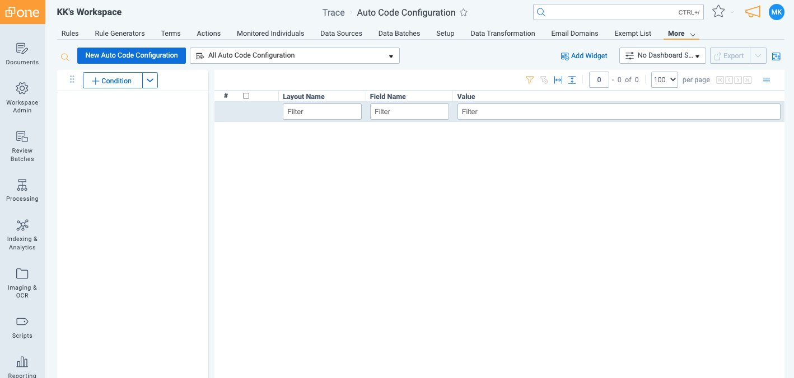
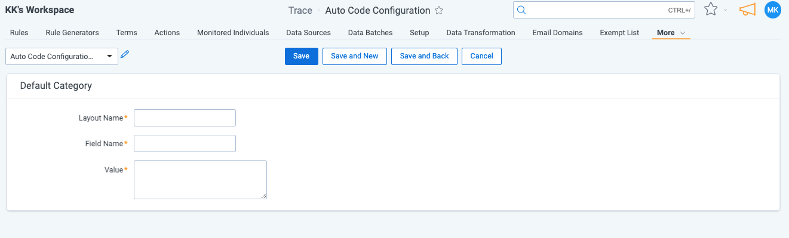

# Auto Coding Communications
{: .no_toc }

To increase the efficiency of review, administrator can set default review decisions that are automatically populated when a communication is viewed.

{: .fs-6 .fw-300 }

1. TOC
{:toc}

---

## Overview

Administrators can set up default coding decisions for any field that exists in a coding layout. These Fields will be automatically populated with the determined value when communication is viewed by a reviewer. These automatically coding decision can be changed by a reviewer prior to them saving the decision.

Configuring a default coding decision:

1. Navigate to `Auto Code Configuration` tab in the given workspace.

2. Click "New Auto Code Configuration" button.

3. Provide the "Layout Name", "Field Name" and the coding "Value" (expected default value for the field).

    The "Field Name" cannot be a fields that is `Read-only` in the layout specified in the "Layout Name".
    {: .warn}

4. When done click "Save"

At this point, when reviewing communication using the layout specified in the "Auto Coding Configuration" the field will be automatically populated with the provided value. You can add more auto coding decisions for other fields on the layout or for fields on different layouts.

- Supported field types are limited to (Single Choice, Multiple Choice, Fixed Text Length, Long Text Length, Yes/No, Whole Number, Decimal, Currency). 
- If “Copy from Previous” is enabled on the layout for any of the "Auto Code Configuration" fields then the auto coding will not run on the layout and display an error message.
{: .info }

