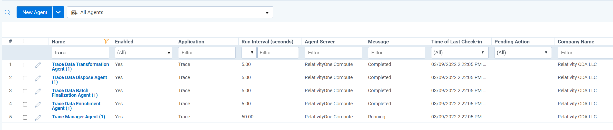
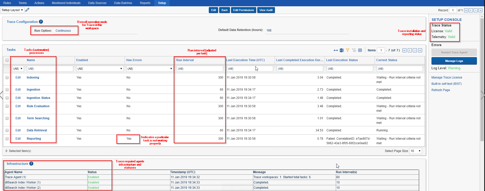

# Getting Started
{: .no_toc }

Follow these steps to get Relativity Trace up and running in your Relativity Instance.
{: .fs-6 .fw-300 }

1. TOC
{:toc}

---

## Prerequisites

Ensure the following Relativity Instance components are appropriately configured before setting up Relativity Trace:

### Agents

-   dtSearch Index Manager

-   dtSearch Index Worker

-   dtSearch Search

-   Application Installation Manager

-   Integration Points Agent (need to install [Relativity Integration Points](https://platform.relativity.com/RelativityOne/index.htm#Relativity_Integration_Points/Get_started_with_integration_points.htm) first)
    

If you plan to use `Analytics` functionality, please also make sure the following agents are set up:

-   Relativity Analytics Index Manager

-   Relativity Analytics Cluster Manager

-   Analytics Categorization Manager

-   Analytics Index Progress Manager

-   Active Learning Manager

-   Active Learning Worker

-   Structured Analytics Manager (need to install [Relativity Analytics](https://help.relativity.com/RelativityOne/Content/Relativity/Analytics/Structured_analytics_set_tab.htm) first)
    
-   Structured Analytics Worker (need to install [Relativity Analytics](https://help.relativity.com/RelativityOne/Content/Relativity/Analytics/Structured_analytics_set_tab.htm) first)

### Applications

-   [Relativity Integration Points](https://help.relativity.com/RelativityOne/Content/Relativity/Relativity_Integration_Points/Relativity_Integration_Points.htm)
    1.  Relativity Integration Points is a required application for Relativity Trace and should be installed in all Trace workspaces BEFORE installing Trace
    2.  Used by Trace Data Sources
-   [Relativity Analytics](https://help.relativity.com/RelativityOne/Content/Relativity/Analytics/Structured_analytics_set_tab.htm#Setting_up_your_environment)
    1.  Used by Trace after ingestion to perform Structured Analytics workflows (language identification, repeated content identification, etc)
    
-   [Active Learning](https://help.relativity.com/RelativityOne/Content/Relativity/Active_Learning/Active_Learning.htm)
    1. Used by Trace after ingestion to analyze documents against Machine Learning models.

[comment]: <> (Line 59 - Link Broken)

## Setting up Relativity Trace

1.  Install [Relativity Integration Points](https://help.relativity.com/RelativityOne/Content/Relativity/Relativity_Integration_Points/Relativity_Integration_Points.htm) in all the workspaces that will Run Trace.
    
2. [Install](https://help.relativity.com/RelativityOne/Content/Relativity/Applications/Installing_applications.htm) the `Trace_<version>.rap` from the Application Library tab in the Admin case to all workspaces
   that will run Trace 
   
   > **NOTE** Using the Relativity Applications tab from within a workspace to install Trace is NOT recommended. Always install Trace from the Application Library.
   
3. Wait until application Status switches to `Installed` in the target workspaces 
   
4. Create Trace agents

   > **NOTE**: Trace application will contain deploy.yaml file which automatically sets up the agent configuration.

   This file is all that is needed to create and start necessary Trace agents for a Relativity instance. The Trace agents will run in our Kubernetes (K8S) architecture making Trace agents scalable to handle changing workloads.

   Once configured, only the following agents will be displayed in the `Agents` tab:
    - Trace Manager Agent
    - Trace Data Batch Finalization Agent
    - Trace Data Enrichment Agent
    - Trace Data Dispose Agent
    - Trace Data Transformation Agent

   

   
    > On the `Agents` tab, the Agent Server column will show a value of `RelativityOne Compute`. This means a given agent type is running in Kubernetes.
    {: .info }

    > When upgrading from standard agends to Kubernetes agends, the workspace may take 20-30 minutes to finish upgrading.  Please reach out support@relativity.com if the upgrade takes longer.
    {: .info }

5. In the workspace, navigate to the `Trace`->`Setup` tab and set the `Run Option` to `Continuous`

 > Changing the “Run Option” to “Continuous” will automatically build a dtSearch index for this workspace for all documents present. Only change this setting to "Continuous" when appropriate agent infrastructure is configured and disk space available to build a corresponding dtSearch Index. Please reach out to [support@relativity.com](mailto:support@relativity.com) for support on installing Trace into workspaces with existing data.
 > {: .warn }

6. You must also set the `Production Status` of the workspace. The three options are:
   1. `Not Active` - the workspace is not being used by a customer or in the process of implementation 
   2. `In Implementation` - the workspace is actively being configured and data sources are being added for a customer
   3. `Live` - customers are actively getting and reviewing alerts in this workspace

[comment]: <> (Line 72 - Link Broken)
[comment]: <> (Line 83 - grammar add in: 'Trace application will contain a deploy.yml file)
