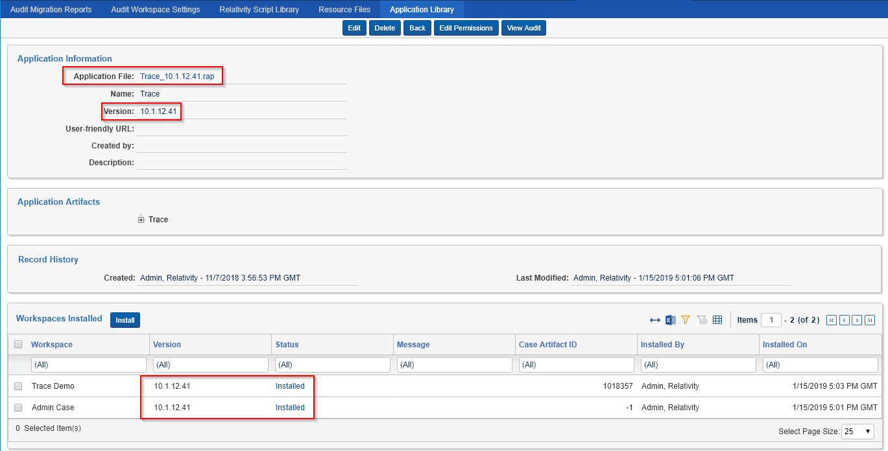

# Getting Started
{: .no_toc }

Follow these steps to get Relativity Trace up and running in your Relativity Instance.
{: .fs-6 .fw-300 }

1. TOC
{:toc}

---

## Prerequisites

Ensure the following Relativity Instance components are appropriately configured before setting up Relativity Trace:

### Agents

-   dtSearch Index Manager

-   dtSearch Index Worker

-   dtSearch Search

-   Application Installation Manager

-   Auto Batch Manager

-   Integration Points Agent (need to install [Relativity Integration Points](https://platform.relativity.com/9.6/Content/Relativity_Integration_Points/Get_started_with_integration_points.htm?) first)
    
-   Integration Points Manager (need to install [Relativity Integration Points](https://platform.relativity.com/9.6/Content/Relativity_Integration_Points/Get_started_with_integration_points.htm?) first)

If you plan to use `Analytics` functionality, please also make sure the following agents are set up:

-   Relativity Analytics Index Manager

-   Relativity Analytics Cluster Manager

-   Analytics Categorization Manager

-   Analytics Index Progress Manager

-   Active Learning Manager

-   Active Learning Worker

-   Structured Analytics Manager (need to install [Relativity Analytics](https://help.relativity.com/9.6/Content/Relativity/Analytics/Structured_analytics_set_tab.htm) first)
    
-   Structured Analytics Worker (need to install [Relativity Analytics](https://help.relativity.com/9.6/Content/Relativity/Analytics/Structured_analytics_set_tab.htm) first)

### Applications

-   [Relativity Integration Points](https://help.relativity.com/RelativityOne/Content/Relativity/Relativity_Integration_Points/Relativity_Integration_Points.htm)
1.  Relativity Integration Points is a required application for Relativity Trace and should be installed in all Trace workspaces BEFORE installing Trace
    2.  Used by Trace Data Sources
    3.  See this [page](https://help.relativity.com/9.6/Content/Relativity_Integration_Points/RIP_9.6/Installing_Integration_Points.htm) for details on how to install Integration Points
-   [Relativity Analytics](https://help.relativity.com/RelativityOne/Content/Relativity/Analytics/Structured_analytics_set_tab.htm#Setting_up_your_environment)
    1.  Used by Trace after ingestion to perform Structured Analytics workflows (language identification, repeated content identification, etc)
    
-   [Active Learning](https://help.relativity.com/RelativityOne/Content/Relativity/Active_Learning/Active_Learning.htm)
    1. Used by Trace after ingestion to analyze documents against Machine Learning models.

## Setting up Relativity Trace

1.  Install [Relativity Integration Points](https://platform.relativity.com/9.6/Content/Relativity_Integration_Points/Get_started_with_integration_points.htm?) in all the workspaces that will Run Trace.
    
2. [Install](https://help.relativity.com/9.6/Content/Relativity/Applications/Installing_applications.htm) the `Trace_<version>.rap` from the Application Library tab in the Admin case to all workspaces
   that will run Trace 
   
   > **NOTE** Using the Relativity Applications tab from within a workspace to install Trace is NOT recommended. Always install Trace from the Application Library.
   
3. Wait until application Status switches to `Installed` in the target workspaces 

   
4. Create Trace agents

   > Trace agents are Resource Pool aware.  A single resource pool supports only one `Trace Manager Agent` and an unlimited number of `Trace Worker Agents`

   1.  Trace Manager Agent
       1.  Agent Type = `Trace Manager Agent`
       2.  Number of Agents = `1` 
       3.  Agent Server = Select the agent server you would like the agent deployed on (see “Infrastructure and Environment Considerations” section for optimal performance)
       4.  Run Interval = `60`
       5.  Logging level of event details = `Log all messages`
   2.  Trace Worker Agent
       1. Agent Type = `Trace Worker Agent`
       2. Number of Agents = `No more than 2x #of CPU cores per agent server (Ex. 4 CPU agent server should host no more than 2 Trace Worker agents`
       3. Agent Server = Select the agent server you would like the agent deployed on (see “Infrastructure and Environment Considerations” section for optimal performance)
       4. Run Interval = `60`
       5. Logging level of event details = `Log all messages`
   3.  Integration Points Manager Agent
       1. Agent Type = `Integration Points Manager`
       2. Number of Agents = `1`
       3. Agent Server = Select the agent server you would like the agent deployed on (see “Infrastructure and Environment Considerations” section for optimal performance)
       4. Run Interval = `60`
       5. Logging level of event details = `Log critical errors only`
   4.  Integration Points Agent
       1. Agent Type = `Integration Points Agent`
       2. Number of Agents = `up to 4` (start with 1 and add more if data batches get backed up)
       3. Agent Server = Select the agent server you would like the agent deployed on (see “Infrastructure and Environment Considerations” section for optimal performance)
       4. Run Interval = `60`
       5. Logging level of event details = `Log critical errors only`
   
5. Please review the [Considerations](#infrastructure-and-environment-considerations) for system impact information. By default system processes (Tasks) are scheduled to run every 5 minutes (configurable per workspace).

   > Please reach out to `support@relativity.com` for additional information

6. On the `Agents` tab, view the Message of `Trace Manager Agent` until there are no longer any workspaces listed as `Updating` (this is necessary because the manager agent makes additional modifications to target workspaces after application install that are needed in the next steps) 
> **NOTE:** On upgrades, the workspaces with existing data could take considerable time but should not take longer than 20-30 minutes to finish upgrading.  Please reach out support@relativity.com if the upgrade takes longer. 

7. In the workspace, navigate to the `Trace`->`Setup` tab and set the `Run Option` to `Continuous`

 > **WARNING:** Changing the “Run Option” to “Continuous” will automatically build a dtSearch index for this workspace for all documents present. Only change this setting to "Continuous" when appropriate agent infrastructure is configured and disk space available to build a corresponding dtSearch Index. Please reach out to `support@relativity.com` for support on installing Trace into workspaces with existing data.
