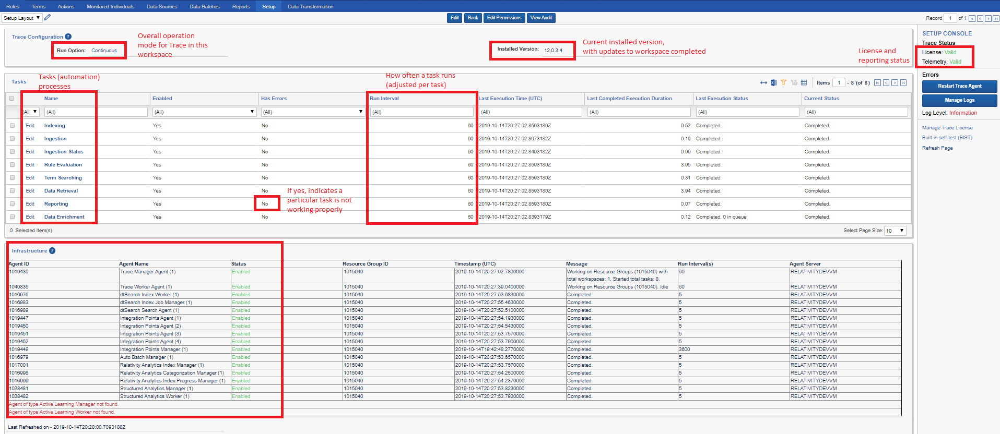
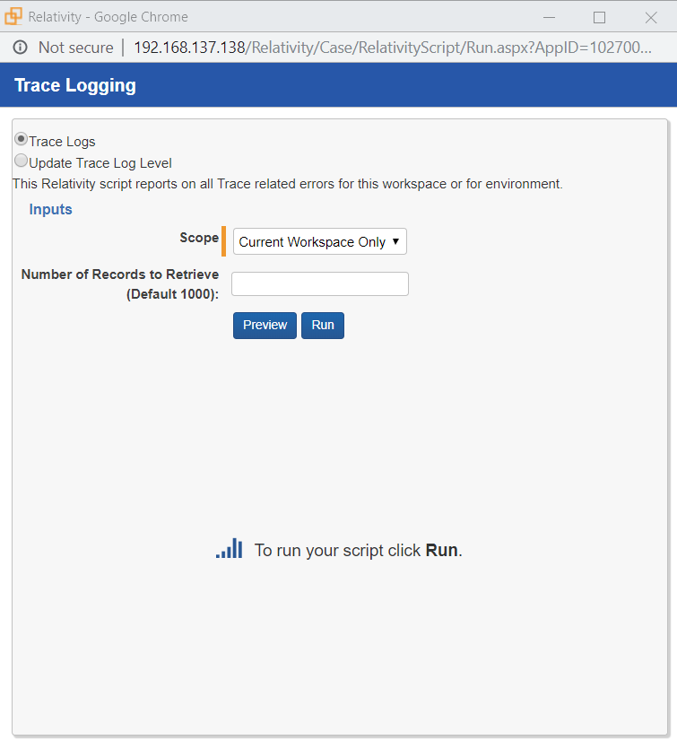
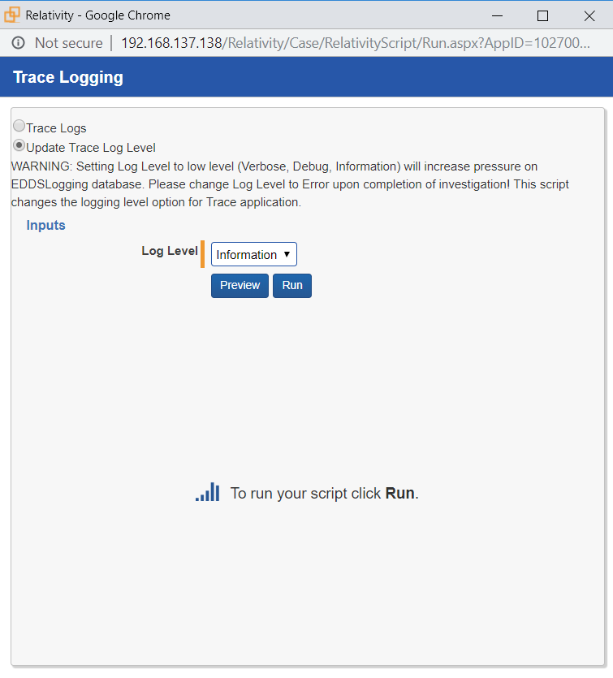
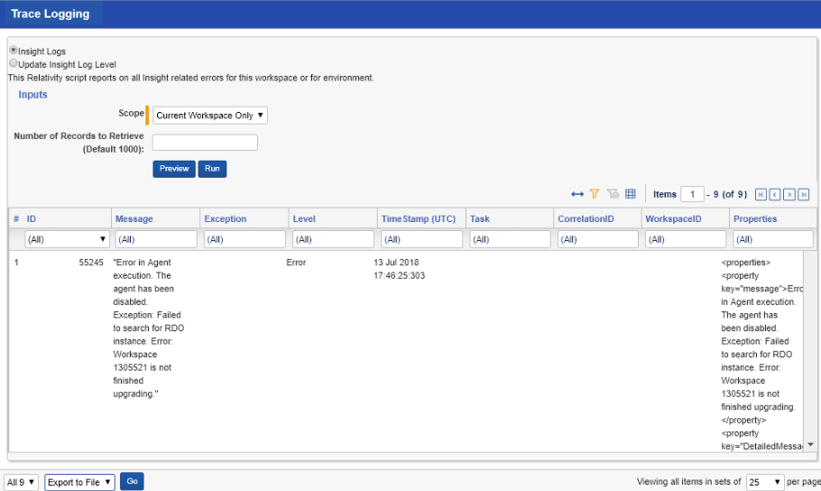
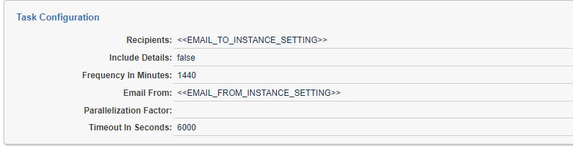
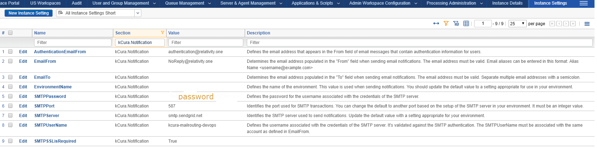
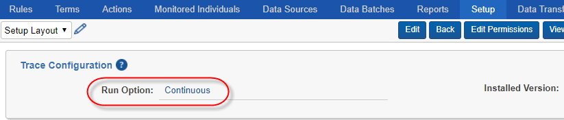
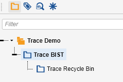
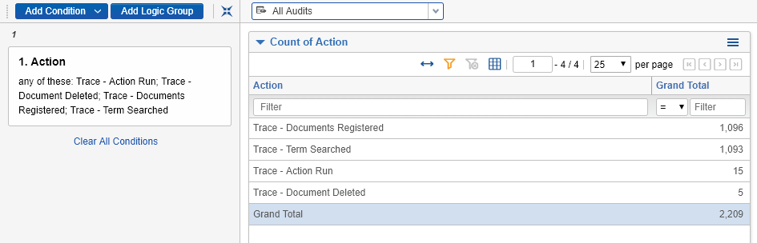

# System Health
{: .no_toc }

The Trace support and engineering team monitor the health of each customer's deployment. System health can also be monitored directly with the product.
{: .fs-6 .fw-300 }

1. TOC
{:toc}

---

## In-product Heath Metrics

The `Setup` tab aggregates the most important information about configuration, health and overall status of Trace for a workspace. It shows the currently installed version,  active tasks and their configuration, and a snapshot of instance infrastructure that’s relevant to Trace. More detailed logging information can be retrieved using the "Manage Logs" button on the console.

If an update to a new version of Trace is in progress, the Setup page will show a large red bar indicating an Update is in progress:

### Adjusting Logging Level [DEPRECATED]

You can adjust the logging level to get more information about the system performance specific to Trace. The Default logging level is Error. The management of the Logging infrastructure can be adjusted via the UI console button “Manage Logs”. In order to adjust the logging level use the “Update Trace Log Level” option. In order to collect and display logging data use the “Trace Logs” option. You can export the logs to a csv file with a mass operation “Export to File” at the bottom of the list.

> **CAUTION:** The more verbose logging levels (information/debug) can place substantial load on infrastructure in terms of number of writes and disk space usage (particularly if logs are being written to the EDDSLogging database in SQL, which is the default configuration in new Relativity instances). Don’t forget to adjust your logging level back up to Warning or Error once low level information is no longer needed.

### Reporting Trace Reviewer Decision

To gain visibility into the amounts of alerts and non-alerts that are being reviewed by compliance teams, we have a `Trace Reviewer Decision` field which needs to be setup by a specialist. This field allows us to collect helpful information for product understanding, better support, and marketing. 

This is a field on the `Document` object and has three review decisions:

1. `Escalate` - the user believes this content needs to be reviewed by other or more senior reviwers
2. `Clear` - the user does not think this content is risky but it happy an alert was generated
3. `False Positive` - the user does not think this content is risky and thinks that this content never should have been an alert in the first place

For this field, there are also three relating scripts: `Trace Reviewer Decision - Escalate`, `Trace Reviewer Decision - Clear`, and `Trace Reviewer Decision - False-Positive`.

To setup this reporting, a specialist will create a workflow rule for each type of Review Decision, and map the script to the workflow rule. More information on how to create workflow rules can be found [here]({{ site.baseurl }}). The specialist can then define how field choices map to these three review decision buckets.

These reported metrics are based on the first level of reviewer decisions, meaning any decision that may differ after the initial review will not be counted.
{: .info }

If a review decision doesn't map to one of the three reviewer decision buckets, it will not be reported in these metrics.
{: .info }

## Reporting Task (Updated)

For an update improved System Health Reporting please see the [Reporting Tab](docs/administrator_guide/reporting/notifications.html)

The Reporting task is designed to email designated administrators information regarding the health of the Trace system every 24 hours, to ensure they are aware of any outages or delays in processes. Email configurations for this task default to instance settings, but can be manually overridden from the Reporting task page. See below sample configuration for example.

-   **Recipients:** List of emails to send the report to, separated by
    semi-colons (;) (the token \<\<EMAIL_TO_INSTANCE_SETTING\>\> will be
    replaced with the configured email address in Instance Setting: “EmailTo”
    under “kCura.Notification” section)

-   **Include Details:** Flag to determine if you want to see the details in the
    email report (default: false)

-   **Frequency In Minutes:** How often should an email report be sent out
    (default: 24hrs)

-   **Email From:** Email address to send the report from (the token
    \<\<EMAIL_FROM_INSTANCE_SETTING\>\> will be replaced with the configured
    email address in Instance Setting: `EmailTo` under `kCura.Notification`
    section)

> It is required to fill in the `kCura.Notification` instance settings
> `SMTPUserName`, `SMTPPassword`, `SMTPServer`, `SMTPPort` and `SMTPSSLisRequired` with
> details of a functioning email delivery system in order to receive important
> notifications and alerts from Relativity and Trace.
> 
{: .info }

## Built-In Self-Test (BIST)

Built-In Self-Test (BIST) is a separate Trace Task that can be enabled in certain workspaces. By default, BIST does a basic “happy path” test of the majority of Trace functionality to make sure Trace is functioning properly. You only need to enable BIST, and let it 
run on its own.

Manual Tests are recommended but not required to be run. Steps marked with **[AUTOMATED]** in the Manual Tests section are already part of Built-in self-test (**BIST**). If you decide to run Manual Tests, it is recommended that you run **BIST** first.

### How to Run BIST

> BIST must be run on a separate, dedicated non-production workspace. This is because **BIST** creates test documents/rules/terms that do not get removed.
{: .info }

-   First, you must set the Trace Configuration "Run Option" to Continuous
-   Navigate to -\> Trace -\> Setup
-   Click Edit, and set Run Option = Continuous

-   Next, click "Built-in self-test (**BIST**)" link in the console

-   If the "Built-in self-test (**BIST**)" link does not appear, follow these steps:
      - Navigate to Instance Settings
      - Under "Name", filter for TraceWorkspaceSettings, and edit this setting
      - Change WorkspaceID from 0 to the ArtifactID value of your BIST workspace
      - Change IsBISTEnabled from false to true
      - Click Save

-    Return to Setup tab in your BIST workspace
      - You should now be able to click on the "Built-in self-test (**BIST**)" link in the console
-    Click Edit on Built-In Self Test (BIST) Task Type, set Enabled to Yes and click Save

> Once test completes Last Execution Status field will update to "Completed. Succeeded - Trace Test GoldenFlow Test." and the task will auto-disable itself.
{: .info }

### Manual Tests

#### Pre-requisites

1. Create a new Test Workspace

2. Install the Trace application

   1.  Navigate to Library Application (Admin), locate Trace and install it
       into Test Workspace

   2.  Ensure that Trace Agent and all dependent Agents are enabled and working 

   3.  Within the workspace, navigate to Trace → Setup and set Run Option →
       Continuous

3. Data Setup

   1.  Online Data Setup: Office 365 [Follow steps in [User Documentation](user_documentation.md#microsoft-exchange-data-source)]

       1.  Enable the data source

       2.  Ensure documents correctly processed throughout the pipeline

   2.  Offline Data Setup: Sample Data Source **[AUTOMATED]**

       1.  Create test data source (Trace BIST Data Source)

       2.  Create Data Transformations

           1.  Replace

           2.  Deduplication

       3.  Create and link Monitored Individuals

       4.  Generate test data emails with attachments

       5.  Extract and Ingest 148 documents with various file types, language
           contents across 2 data batches

4. Create Terms **[AUTOMATED]**

   1.  problem\*

   2.  suffering

   3.  коррупц\*

   4.  protect against

   5.  "message is ready to be sent"

   6.  Lorem Ipsum

   7.  Test rule evaluation

   8.  "Nederlandsprekendes"  

5. Create Document Folders **[AUTOMATED]** 

6. Create Saved Searches **[AUTOMATED]**

   

7. Update Rule Evaluation task **[AUTOMATED]**

   

8. Create Rules **[AUTOMATED]**

   

   1.  Create new Trace BIST - Basic Rule

       1.  Create a new rule (“Trace BIST - Basic Rule*”*) with “Trace BIST -
           Documents” saved search

       2.  Associate Terms created above

       3.  Associate Default Tag and Default Advanced actions

       4.  Enable rule

   2.  Create new Trace BIST - Data Retention Rule

       1.  Create a new rule (“Trace BIST - Data Retention Rule*”*) with “Trace
           BIST - Recycle Bin” saved search

       2.  Associate Trace BIST - Data Retention Action

       3.  Enable rule

   3.  Create new Trace BIST - Move To Folder Rule

       1.  Create a new rule (“Trace BIST - Move To Folder Rule*”*) with “Trace
           BIST - Documents” saved search

       2.  Associate Trace BIST - Move To Folder Action

       3.  Associate Terms: suffering

       4.  Enable rule

9. Create Rule Generator test object types **[AUTOMATED]**

   

10. Create Rule Generators **[AUTOMATED]**

    

    

### Test Verification [AUTOMATED]

**Final expected state of the documents in workspace:**

- Trace BIST Data Source Generated Batches: `2`

- Total Documents in Trace BIST folder: `147`

- Total Deleted Documents: `1`

- Total Documents Matching Basic Rule: `6`

- Document Status: 
  - `3 - Term Searched` - 2
  - `5 - Ready for Rule Analysis` - 143
  - `6 - Alert Rules Complete` - 2

- Documents fields (Trace Hour Of The Day \| Trace Day Of Week): `populated` for all documents with `5 - Ready for Rule Analysis` and `6 - Alert Rules Complete` status

- Number of rules generated by rule generators: `2`

- Number of documents matched with rule generated by `BIST Trade RG`: `143`

- Number of documents matched with rule generated by `BIST Watchlist RG`: `1`

**Additional Verification:**

1. Trace custom audits are generated:

   

2. Data Batch Retry/Abandon mass-operations work (re-triggers import of data):

   

3. Trace Document Retry mass-operations work (re-submits documents through
   Trace flow, but does not re-trigger import):

