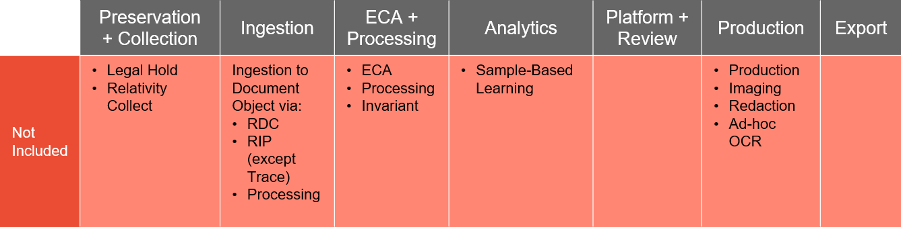

# Workspace Restrictions
{: .no_toc }

Certain RelativityOne functionality is not permitted to be used with a Relativity Trace license.
{: .fs-6 .fw-300 }

1. TOC
{:toc}

---

## Restricted Functionality

The following Relativity features are restricted from use in a Trace workspace:

* Non-Trace Ingestion to Document Object
  * [Relativity Desktop Client](https://help.relativity.com/RelativityOne/Content/Relativity/Relativity_Desktop_Client/Relativity_Desktop_Client.htm)
  * [Relativity Integration Points](https://help.relativity.com/RelativityOne/Content/Relativity/Relativity_Integration_Points/Relativity_Integration_Points.htm) (except within Trace application)
* [ECA](https://help.relativity.com/RelativityOne/Content/Relativity/ECA_and_Investigation/ECA_and_Investigation.htm)
* [Processing](https://help.relativity.com/RelativityOne/Content/Relativity/Processing/Processing_in_Relativity.htm)
* Invariant
* [Sample-Based Learning](https://help.relativity.com/RelativityOne/Content/Relativity/Assisted_Review/Assisted_Review_Workflow.htm)
* [Productions](https://help.relativity.com/RelativityOne/Content/Site_Resources/Production.htm)
  * [Imaging](https://help.relativity.com/RelativityOne/Content/Relativity/Imaging/Imaging.htm)
  * [Redaction](https://help.relativity.com/RelativityOne/Content/Site_Resources/Supporting_applications_R1.htm#Redactions)
* [Legal Hold](https://help.relativity.com/RelativityOne/Content/Relativity_Legal_Hold/Relativity_Legal_Hold.htm)
* Relativity Collect (except through Trace Data Source)
* [Repository Workspace](https://help.relativity.com/RelativityOne/Content/Relativity/RelativityOne_document_repository.htm)
* [Cold Storage](https://help.relativity.com/RelativityOne/Content/Relativity/Workspaces/Workspaces.htm?%20storage#Cold)

Client cannot download applications that would enable any restricted features, or move data to a repository workspace or cold storage. Client is responsible for hiding restricted features from its users.

NOTE: If you need to use any restricted Relativity features, you can export the data to a RelativityOne workspace using [Relativity Integration Points](https://help.relativity.com/RelativityOne/Content/Relativity/Relativity_Integration_Points/Relativity_Integration_Points.htm).

