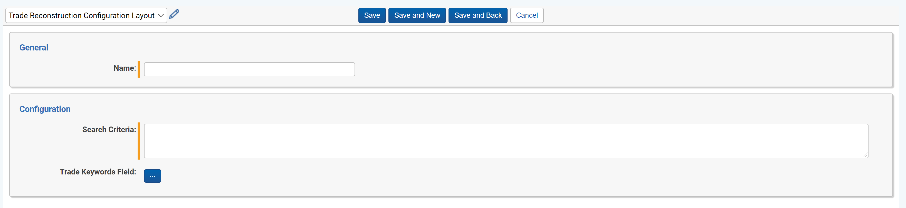

# Trade Reconstruction
{: .no_toc }

Trade Reconstruction is used to automatically link trade and orders from Order Management Systems (OMS) or Trade Capture systems to their related communications.
{: .fs-6 .fw-300 }

1. TOC
{:toc}

---

## Overview

Each Trade object has a connected Trade Reconstruction Configuration, which is used to add the criteria necessary to connect Trades to their related Communications. Trade Reconstruction Configruations have two components: the Search Criteria field, which defines the parameters of the saved search created for the Trade, and the Trade Keywords Field, which defines the Trade Keywords created for the Trade. Below is information on how to create a Trade Reconstruction Configuration, details on the Search Criteria field for Trade Reconstruction Configurations, details about Trade Keywords, and the limitations of Trade Reconstruction.

## Creating A Trade Reconstruction Configuration

The Trade Reconstruction Configuration attached to your Trade is a key component to Trade Reconstruction, as it determines how Trades will be connected to their related communications. **This must be created before you can create your Trade**. To create a Trade Reconstruciton Configuration, follow the steps below:

1. Naviagte to the `Trade Reconstruction Configurations` tab and click `New Trade Reconstruction Configuration`.

	

2. The Trade Reconstruction Configuration creation form has the following fields:

   1. **Name:** the name of the Trade Reconstruction Configruation
   
   2. **Search Criteria:** required JSON field to create the search parameters for the Saved Search created and linked to the Trade during Reconstruction. The details of the proper search criteria can be accessed via Contextual Help button on the Configuration secontion. 
      - See the below section titled `Search Criteria for Trade Reconstruction Configuration` for more information
      
   3. **Trade Keywords Field:** optional field, allows you to choose fields on the Trade object which will be used to create `Trade Keywords` that are linked to the Trade
   
      You can choose Trade fields of any field type. If you choose a Yes/No field, the`Yes Display Value` or `No Display Value` for that field will be used to create the `Trade Keyword`.
      {: .info }

### Search Criteria for Trade Reconstruction Configuration

Trade Reconstruction Configuration Search Criteria field is inputted as JSON with each `{}` representing a single logic group within a Saved Search. Each logic group should contain a list of conditions and boolean operator `AND|OR` which joins it with the next logic group.

**Parameters of logic group:**

- `SearchConditions` - [Required] a list of search conditions which will be included in the logic group
- `BooleanOperator` - [Required] a boolean operator which joins specified logic group with the next logic group `AND/OR`

**Parameters of search condition:**

- `DocumentFieldName` - [Required] name of the target document field you wish to search across
- `ObjectFieldName` - name of the Trade field used to populate the `DocumentFieldName` when searching
- `Optional` - when set to `true`, it makes this search condition optional, meaning that if the `ObjectFieldName` field doesn't have a value, it will skip over this search condition in the created Saved Search and continue to make a Rule for that particular object. If this value is not set (defaults to `false`) or set to `false`, this search condition is not optional, and if the `ObjectFieldName` field doesn't have a value, it will fail to create a Rule for that particular Object (`true`,`false`)
- `Value` - value used to populate `DocumentFieldName` when searching (either `ObjectFieldName` or `Value` should be provided, not both). If `DocumentFieldName` is multiple/single object/choice type field, then static value should be object/choice name
- `Condition` - [Required] the logical condition between the `DocumentFieldName` and `ObjectFieldName` (see conditions below)

| Field Type      | Conditions                                                   |
| --------------- | ------------------------------------------------------------ |
| Date            | `Between`, `Is`,`IsAfter`, `IsAfterOrOn`, `IsBefore`, `IsBeforeOrOn`, `IsSet` |
| Multiple Object | `AllOfThese`, `AnyOfThese`, `IsSet`                          |
| Multiple Choice | `AllOfThese`, `AnyOfThese`, `IsSet`                          |
| Single Object   | `AnyOfThese`, `IsSet`                                        |
| Single Choice   | `AnyOfThese`, `IsSet`                                        |
| Whole Number    | `GreaterThan`, `LessThan`, `Is`, `IsSet`                     |
| Decimal         | `GreaterThan`, `LessThan`, `Is`, `IsSet`                     |
| Currency        | `GreaterThan`, `LessThan`, `Is`, `IsSet`                     |
| Fixed Length    | `GreaterThan`, `GreaterThanOrEqualTo`, `Is`, `IsLike`, `IsSet`, `LessThan`, `LessThanOrEqualTo`, `StartsWith`, `EndsWith` |
| Long Text       | `GreaterThan`, `GreaterThanOrEqualTo`, `Is`, `IsLike`, `IsSet`, `LessThan`, `LessThanOrEqualTo`, `StartsWith`, `EndsWith` |
| Yes/No          | `Is`, `IsSet`                                                |

- `NotOperator` - specifies if condition should be negative (defaults `false` if not added)
- `DayRange` - specifies a number of days which will be added or subtracted from ObjectField date specified in condition (this works only for DATE fields when `BETWEEN` condition in specified, but it won't break when added to other conditions)
- `DayRangeDirection` - connected with the `DayRange` parameter and specifies if the days should be added, subtracted, or added and subtracted from ObjectField date. Values for this parameter: `ForwardAndBackwards`, `Backwards`, `Forward`, the default value is `ForwardAndBackwards`
- `BooleanOperator` - the operator which joins the specified condition with the next condition (`AND/OR`)

> **Search Criteria Validation Rules:**
>
> - Search criteria must contain at least one logic group
> - Each logic group must include a `SearchConditions` list (with at least one condition in it) and a `BooleanOperator`
> - `DocumentFieldName`, `ObjectFieldName` or `Value`, `Condition` and `BooleanOperator` are mandatory fields in a search condition
> - `DocumentFieldName` field must be a field which exists on Document or a reflected field, e.g. Trace Monitored Individuals::First Name
> - `ObjectFieldName` field must be a field which exists on the Trade Object
> - `DocumentFieldName` and `ObjectFieldName` fields must have the same field type, with one exception:
>   - `DocumentFieldName` fields with the field type single choice, multiple choice, single object, or multiple object can be mapped to `ObjectFieldName` fields with the fixed-length text field type
> - if `DocumentFieldName` and `ObjectFieldName` fields are single/multiple object fields, then both fields must be associated with the same object type
> - Saved Searches created by Trade Reconstruction MUST have at least one condition, so if the `Optional` flag results in no search conditions being added, it will not create the Saved Search for that object, thus Trade Reconstruction will fail
> - `Value` value must be convertible to `DocumentFieldName` field type, i.e. if `DocumentFieldName` is date field, then valid values are `15 Apr 2021` or `04/15/2021`
> - if `DocumentFieldName` is multiple/single object/choice field type, then `Value` should be a name of object/choice we want to search
> - `Condition` must be valid for field type

**Example Search Criteria:**

```
[
   {
      "SearchConditions":[
         {
            "DocumentFieldName":"Trace Monitored Individuals",
            "ObjectFieldName":"Trade Monitored Individuals",
            "Condition":"AnyOfThese",
            "BooleanOperator":"Or",
         },
         {
            "DocumentFieldName":"Trace Monitored Individuals",
            "ObjectFieldName":"Trade Related Individuals",
            "Condition":"AnyOfThese",
            "BooleanOperator":"And",
            "NotOperator":true,
         }
      ],
      "BooleanOperator":"And"
   },
   {
      "SearchConditions":[
         {
            "DocumentFieldName":"Trace Document Status Updated On",
            "ObjectFieldName":"System Created On",
            "Condition":"Between",
            "BooleanOperator":"And",
            "DayRange":14,
            "DayRangeDirection":"Backwards",
	    "BooleanOperator":"Or"
         },
	 {
            "DocumentFieldName":"Trace Document Status Updated On",
            "Value":"1 Jan 2021",
            "Condition":"Is",
            "BooleanOperator":"And",
         }
      ],
      "BooleanOperator":"And"
   }
]
```

### Trade Keywords

The `Trade Keywords Field` field on the `Trade Reconstruction Configuration` holds the names of the field on Trade which hold critical keywords that will be searched in the created saved search. 

For example, there is a field on Trade called `Important Names` which is a Multiple Choice field. On a particular Trade, the names `John Smith` and `Jane Doe` are selected as choices on `Important Names` that are important for this Trade. To search for these names, you will select `Important Names` in the `Trade Keywords Field` on the `Trade Reconstruction Configuration` attached to the Trade. During Reconstruction, `John Smith` and `Jane Doe` will be created as Trade Keywords, which can be found on the `Trade Keywords` tab and will be attached to that Trade. If another Trade shares the same keyword, they will both be attached to that single keyword.

## Integration with Order Management Systems (OMS) or Trade Capture Systems
Please contact [support@relativity.com](mailto:support@relativity.com) for more information on Trade system integrations.

## Trade Reconstruction Limitations

You must create a Trade Reconstruction Configruation before you can create a Trade.
{: .info }

If you decide to Reconstruct a Trade which has already been Reconstructed in the past, everything is removed from the previous Reconstruction and replaced with the new information from the most recent Reconstruction. `Trade Keywords` are not deleted, but the connection between the `Trade Keyword` and the Trade is gone and will not be searched for (unless the same keyword is still on the Trade, in which it will re-establish the connection and search for this keyword). All of the Trade's Related Documents from the previous Reconstruction will be removed. However, an Audit will be created for each Reconstruction with the following information: the Artifact ID of the Reconstructed Trade, the User that kicked off the Reconstruction, the date and time the Reconstruction began, and the Artifact ID of every Related Document that was connected to the Trade.
{: .danger}

You must run each Trade indiviudally - mass editing `Perform Reconstruction` field on the Trade will not start Trade Reconstruction.
{: .warn }
