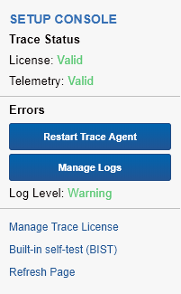
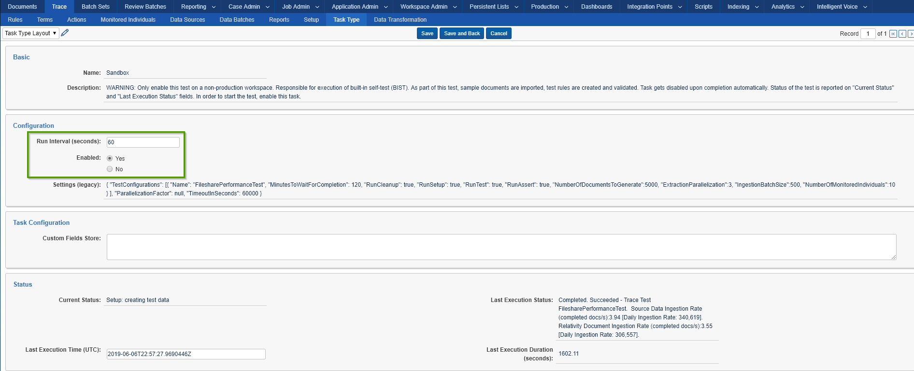
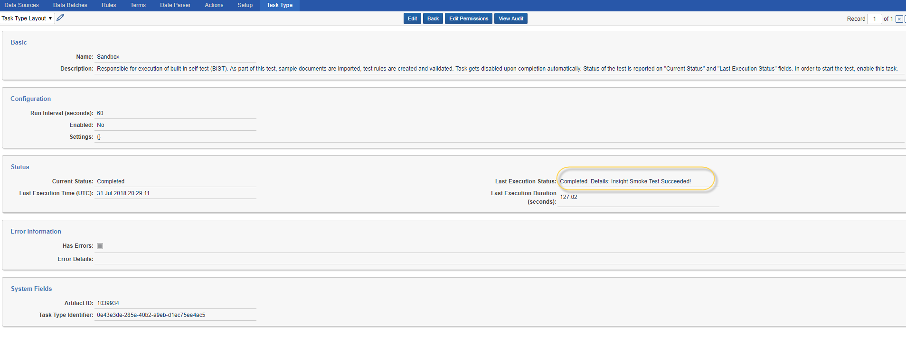
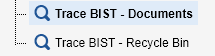
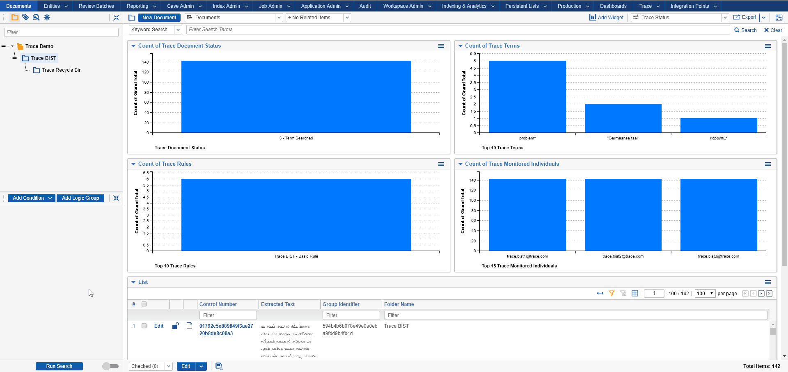

# Relativity Trace Automated Tests (BIST)

* [How to Run **BIST**](#how-to-run)
* [Manual Tests](#manual-tests)
  + [Pre-requisites](#pre-requisites)
  + [Test Verification **[AUTOMATED]**](#test-verification-automated)

Trace BIST (Built-in self test) contains automated tasks that perform basic smoke tests to ensure that
Relativity and Trace have been set up and configured properly. You only need to enable BIST, and let it 
run on its own.

Manual Tests are recommended but not required to be run. Steps marked with
**[AUTOMATED]** in the Manual Tests section are already part of Built-in self-test (**BIST**). If you decide
to run Manual Tests, it is recommended that you run **BIST** first.

## How to Run **BIST**

> **NOTE:** BIST must be run on a separate, dedicated non-production workspace. This is because **BIST** creates test documents/rules/terms that do not get removed.

-   First, you must set the Trace Configuration "Run Option" to Continuous
-   Navigate to -\> Trace -\> Setup
-   Click Edit, and set Run Option = Continuous

-   Next, click "Built-in self-test (**BIST**)" link in the console

-   If the "Built-in self-test (**BIST**)" link does not appear, follow these steps:
      - Navigate to Instance Settings
      - Under "Name", filter for TraceWorkspaceSettings, and edit this setting
      - Change WorkspaceID from 0 to the ArtifactID value of your BIST workspace
      - Change IsBISTEnabled from false to true
      - Click Save

-    Return to Setup tab in your BIST workspace
      - You should now be able to lick on the "Built-in self-test (**BIST**)" link in the console

-   Click Edit on Sandbox Task Type, set Enabled to Yes and click Save

> **NOTE:** Once test completes Last Execution Status field will update to "Completed. Details: Smoke Test Succeeded!" and task will auto-disable itself

## Manual Tests

### Pre-requisites

1.  Create a new Test Workspace

2.  Install Trace application

    1.  Navigate to Library Application (Admin), locate Trace and install it
        into Test Workspace

    2.  Ensure that Trace Agent and all dependent Agents are enabled and working 

    3.  Within the workspace, navigate to Trace → Setup and set Run Option →
        Continuous

3.  Data Setup

    1.  Online Data Setup: Office 365 [Follow steps in Documentation]

        1.  Enable data source

        2.  Ensure documents are pulled through

    2.  Offline Data Setup: Sample Data Source **[AUTOMATED]**

        1.  Create test data source (Trace BIST Data Source)

        2.  Create Data Transformations

            1.  Replace

            2.  Deduplication

        3.  Create and link Monitored Individuals

        4.  Generate test data emails with attachments

        5.  Extract and Ingest 144 documents with various file types, language
            contents across 2 data batches

4.  Create Terms **[AUTOMATED]**

    1.  problem\*

    2.  suffering

    3.  коррупц\*

    4.  protect against

    5.  "message is ready to be sent"

5.  Create Document Folders **[AUTOMATED]**

    

6.  Create Saved Searches **[AUTOMATED]**

    

7.  Create Rules **[AUTOMATED]**

    

    1.  Create new Trace BIST - Basic Rule

        1.  Create a new rule (“Trace BIST - Basic Rule*”*) with “Trace BIST -
            Documents” saved search

        2.  Associate Terms created above

        3.  Associate Default Tag and Default Advanced actions

        4.  Enable rule

    2.  Create new Trace BIST - Data Retention Rule

        1.  Create a new rule (“Trace BIST - Data Retention Rule*”*) with “Trace
            BIST - Recycle Bin” saved search

        2.  Associate Trace BIST - Data Retention Action

        3.  Enable rule

    3.  Create new Trace BIST - Move To Folder Rule

        1.  Create a new rule (“Trace BIST - Move To Folder Rule*”*) with “Trace
            BIST - Documents” saved search

        2.  Associate Trace BIST - Move To Folder Action

        3.  Associate Terms: suffering

        4.  Enable rule

### Test Verification **[AUTOMATED]**

**Final expected state of the documents in workspace:**

- Trace BIST Data Source Generated Batches: `2`

- Total Documents in Trace BIST folder: `143`

- Total Deleted Documents: `1`

- Total Documents Matching Basic Rule: `6`

- Document Status: `3 - Term Searched`

- Documents fields (Trace Hour Of The Day \| Trace Day Of Week): `populated`

**Additional Verification:**

1.  Trace custom audits are generated:

    

2.  Data Batch Retry/Abandon mass-operations work (re-triggers import of data):

    

3.  Trace Document Retry mass-operations work (re-submits documents through
    Trace flow):

