Relativity Trace Demo Guide
===========================
  * [Demo Environment and Login Information](#demo-environment-and-login-information)
  * [Relativity Trace: An Overview of Relativity for Compliance](#relativity-trace--an-overview-of-relativity-for-compliance)
  * [Goals of the Demo](#goals-of-the-demo)
    + [Demo A](#demo-a)
    + [Demo B](#demo-b)
    + [Workspace overview](#workspace-overview)
- [DEMO A: Enabling Office 365 Data Source and auto-tagging documents (alerts)](#demo-a--enabling-office-365-data-source-and-auto-tagging-documents--alerts-)
    + [Section 1: Rules Overview](#section-1--rules-overview)
    + [Section 2: Importing Data and Running Rules](#section-2--importing-data-and-running-rules)
    + [Section 3: Viewing Results](#section-3--viewing-results)
    + [Section 4: Recap](#section-4--recap)
- [DEMO B: Running an Archive Rule](#demo-b--running-an-archive-rule)

### Demo Environment and Login Information

Reach out to trace@relativity.com 

Relativity Trace: An Overview of Relativity for Compliance
----------------------------------------------------------

Relativity today is primarily used for e-discovery, investigations and
regulatory inquiries: typically reactive and transactional workflows.  Trace is
built for **proactive compliance and surveillance workflows**.

Trace’s is a Compliance product on top of Relativity used to **monitor all forms
of communication** (audio, email, and chat plus their attachments) with an
extensible engine that gets better at filtering out false positives over time.
Trace can monitor and pull data from **40+ data origins**. In addition, Trace
can automatically extract text and meta-data from monitored content, **900+ file
types are supported**.

Goals of the Demo
-----------------

-   See how Trace can automatically and proactively pull data from a live Office
    365 instance for several Trace Monitored Individuals.

-   Highlight Trace’s capabilities of automatically extracting text and
    meta-data from Office 365 emails and attachments.

-   Show overall data flow from ingestion, indexing, searching, tagging
    (reviewing) and ultimately data archival.

-   Introduction of the Trace Rules Engine – a way to define what type of
    information gets flagged upon ingestion and auto-batched out to a reviewer.

-   Familiarize you with broad Trace capabilities in a **sample compliance
    workflow**.

### Demo A 

In this demo we will be monitoring for “Market Abuse” conversations and
automatically flag those documents as they propagate though Trace flow.

This demo has 4 simple steps:

1.  Enabling pre-configured “Market Abuse” rule

2.  Enabling live ingestion from pre-configured Office 365 Data Source

3.  Viewing extracted text and meta-data that Trace automatically extracted from
    ingested emails and attachments

4.  Viewing the results of the Trace Rules Engine (tagged documents)

### Demo B

In this demo we will be enabling an archiving rule that is based on Data Archive
action to automatically delete data outside of a configured data retention
policy.

### Workspace overview 

-   **Trace Demo**: Workspace with multiple pre-created rules and Office 365
    Data Source.

DEMO A: Enabling Office 365 Data Source and auto-tagging documents (alerts)
===========================================================================

### Section 1: Rules Overview

1.  Go into the **Trace Demo** workspace

1.  Click into the **Trace:Rules** tab to see sample rules in the workspace.
    Rules are how you define the type of content that is relevant to you. The
    **Market Abuse** rule has been pre-created for you along with a few others.

1.  Click into the **Market Abuse** rule and see the options that make up this
    rule:

-   **Searchable Set:** A Saved Search that the rule runs against

-   **Associated Actions:** A set of actions to take on matched documents (this
    rule will Tag and Batch out to reviewers)

-   **Terms**: Allows you to link Trace Terms to refine your document filter
    criteria with an e-discovery grade searching engine (dtSearch)

-   **Customize Batch Set:** Opens the Batch Set that that was automatically
    created and allows you to customize the batch set (only available if Default
    Batch action was set as an Associated Action at rule creation)

-   The rule is currently **Disabled**

1.  Click the **Enable Rule** console button under **Automation** section:

-   The rule is now **Enabled**

-   As data is ingested, this rule will be automatically applied to all incoming
    documents

### Section 2: Importing Data and Running Rules

1.  Now let’s test our rules by adding live stream of data into the workspace
    with Office 365 Data Source. Go to the **Trace:Data Sources** tab

    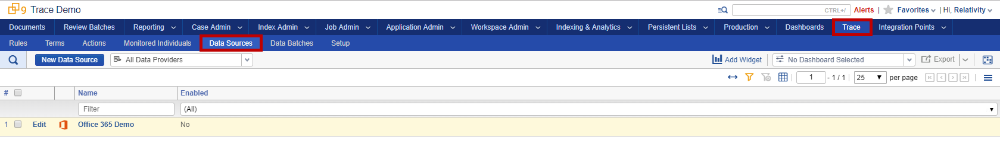

2.  Click on the **Office 365 Demo** data source to see how it is configured

-   **Data Source Type**: You can choose which type of data you want to ingest.
    This instance has been setup with a few basic types. Trace can support 40+
    different Data Source Types

-   **Integration Point Profile:** Used for Field Mapping and other ingestion
    options

-   **Username / Password:** secure way to enter authentication information for
    various Data Sources

-   **Trace Monitored Individuals:** lets you select which people to monitor

-   The Data Source is currently **Disabled**

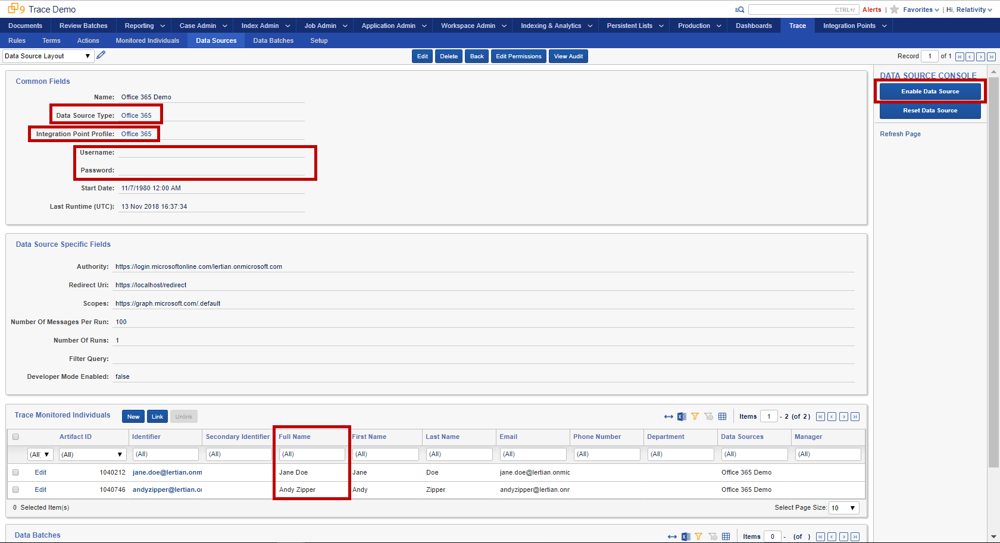

1.  Click **Enable Data Source** on the right hand side

1.  Wait for Data Batches with data to start showing up – refresh the page
    several times, until you start seeing Data Batches on the bottom (it may
    take several minutes for first data batch to be fully created). You can see
    how much data each Data Batch retrieved and corresponding statuses. Once you
    have a few Data Batches in “Completed” state the rest of the Trace workflow
    automatically triggers.

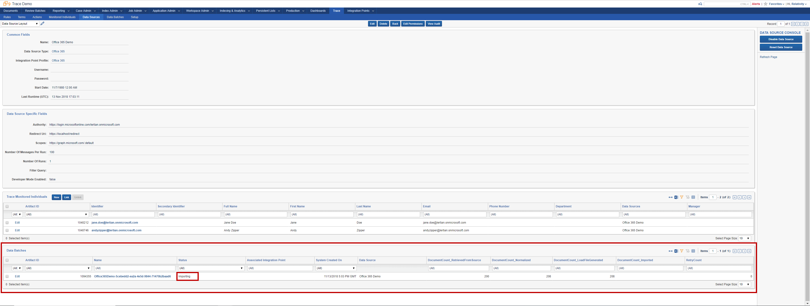

As time goes on, more batches with data will be created and ingested:

### Section 3: Viewing Results

1.  Go to the **Review Batches** tab. This shows all Review Batches that were
    auto-generated from the enabled rules

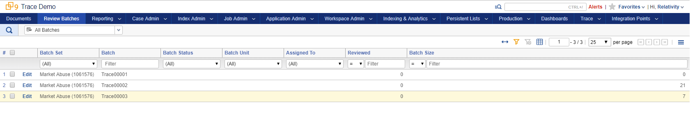

1.  Click on **Documents** tab:

    1.  Data is proactively being retrieved, extracted and ingested

    2.  “**Trace Search Index**” is built automatically -\> for your ad-hoc
        searching

        

2.  Explore Dashboards

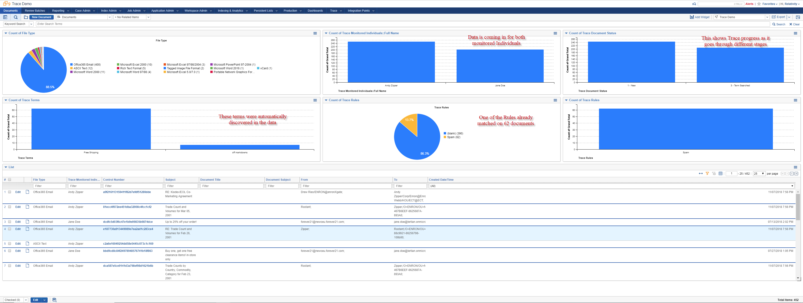

Once all the data is ingested and analyzed about 7.6% of ingested documents have
matched the rules:

All of the Rules that matched:

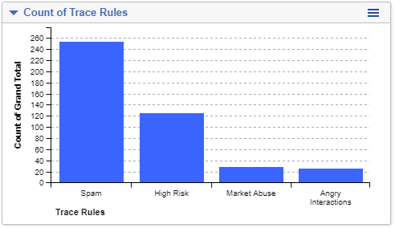

File type breakdown of ingested documents:

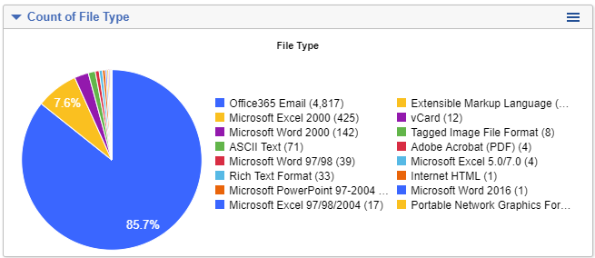

1.  Review matched documents

    1.  Click on “Market Abuse” on the Rules widget

        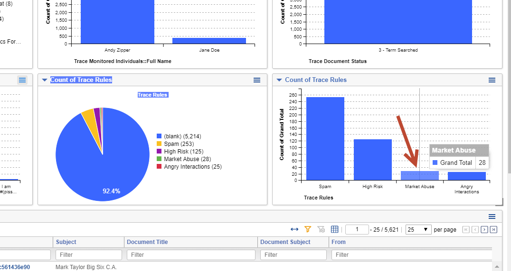

    2.  Click on “Revenue Sharing” on the Terms widget

        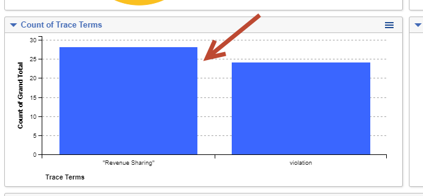

    3.  Click on one of the documents in the list:

        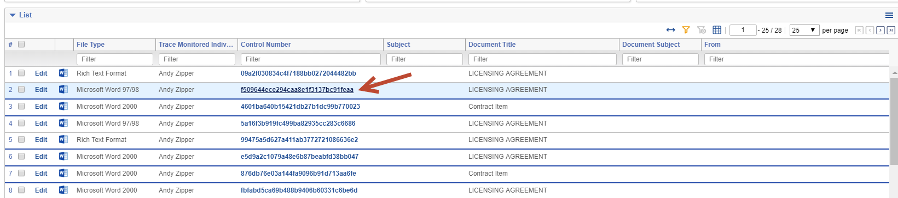

    4.  Explore document details:

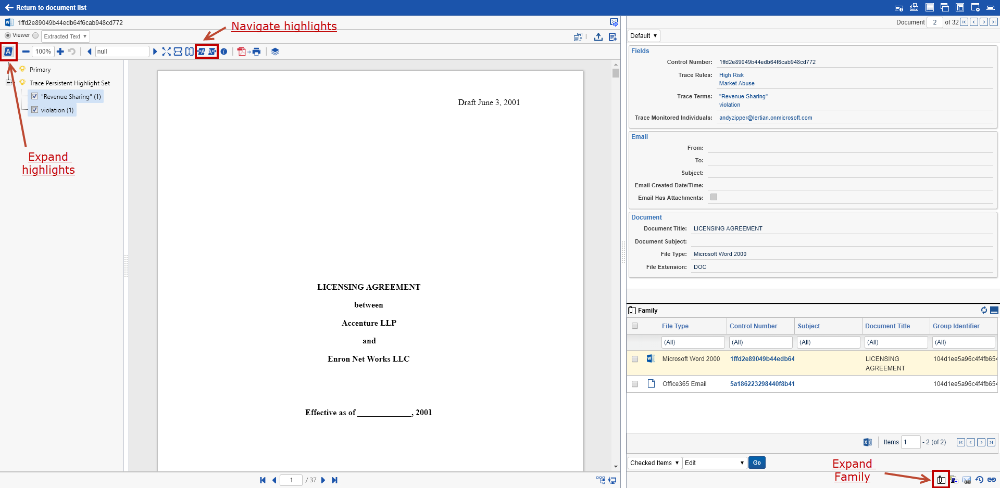

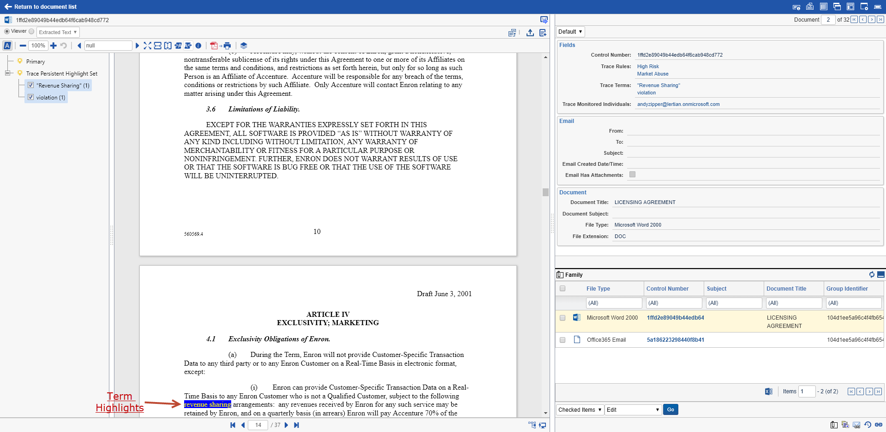

1.  Matched terms are automatically highlighted in the document

2.  Document text and meta-data was automatically extracted

3.  Related documents are displayed in the “Family” section

### Section 4: Recap

Thanks for completing Demo A! Quick recap, here’s what we did:

1.  Enabled **Market Abuse** rule for continuous evaluation

2.  Viewed rules that are based on Saved Searches and Trace Terms that have
    Tagging and Batching as associated actions

3.  Enabled ingestion of documents, proactively from live Office 365 instance

4.  Validated that the documents were ingested into the workspace, automatically
    indexed, searched, tagged and batched out for review

5.  Reviewed a matched document in the viewer with extracted data, related
    documents and highlighted terms

Let us know what you think! Reach out to <trace@relativity.com> with any
feedback. Thanks!

DEMO B: Running an Archive Rule
===============================

1.  Go into the **Trace Demo** workspace

1.  Let’s check out our “Non-alerted Documents” Saved Search. Go to **Saved
    Search** browser in the **Documents** tab and select the “**Non-alerted
    Documents**” Saved Search. You’ll notice there are \~5k documents that are
    currently in this Saved Search.

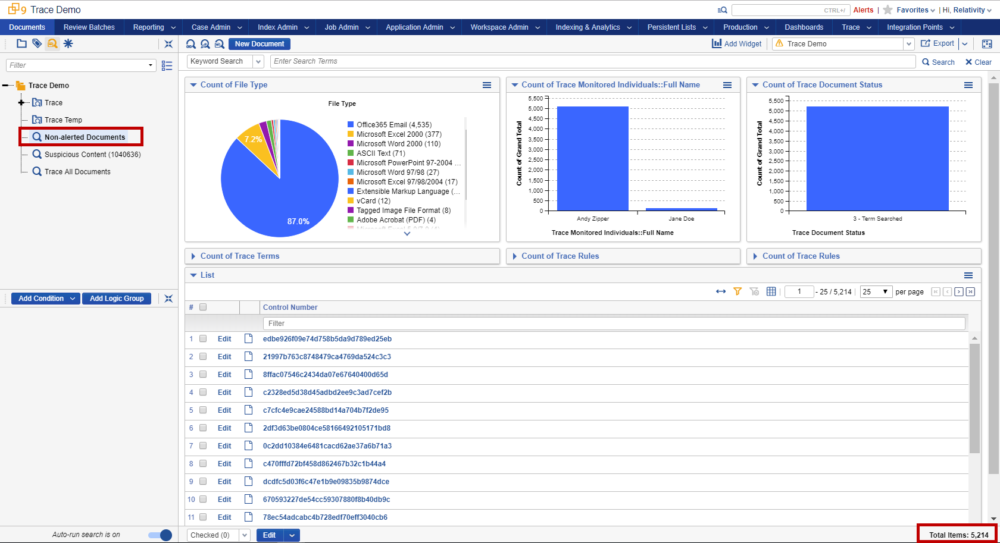

1.  Click into the **Trace:Rules** tab to see all rules in the workspace. The
    **Delete Rule** has been pre-created for you. Click into the **Delete
    Rule**.

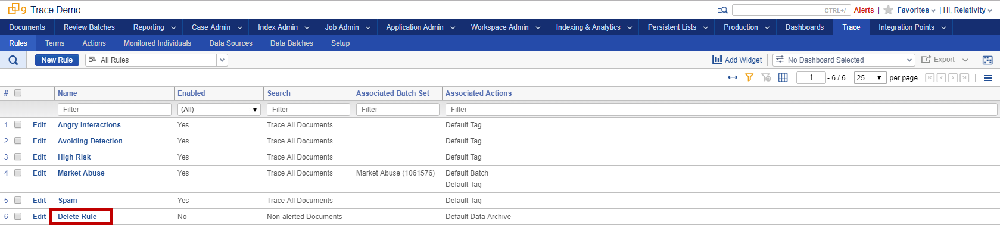

1.  You’ll notice that the **Delete Rule** follows a similar format to the prior
    demo. The rule runs on the “Non-alerted Documents” Saved Search and has the
    “Default Data Archive” action associated with it. This action will delete
    all documents in the Saved Search (outside of the set retention policy) once
    the rule is enabled. This will enable you to have an **automated retention
    policy** in Relativity.

2.  Now let’s enable the rule so Trace can start enforcing your Data Archive
    policy. Go to the **Trace:Rules** tab again and click on the “**Delete
    Rule**”

1.  Click on **Enable Rule** in console button under **Automation** section

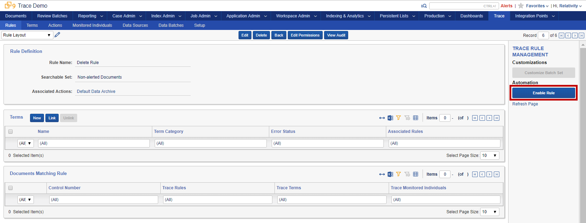

1.  Go back to the Saved Search Browser in the Documents tab and select the
    “Documents to Delete” Saved Search. Within a few minutes and you’ll start to
    see documents getting deleted from this workspace.

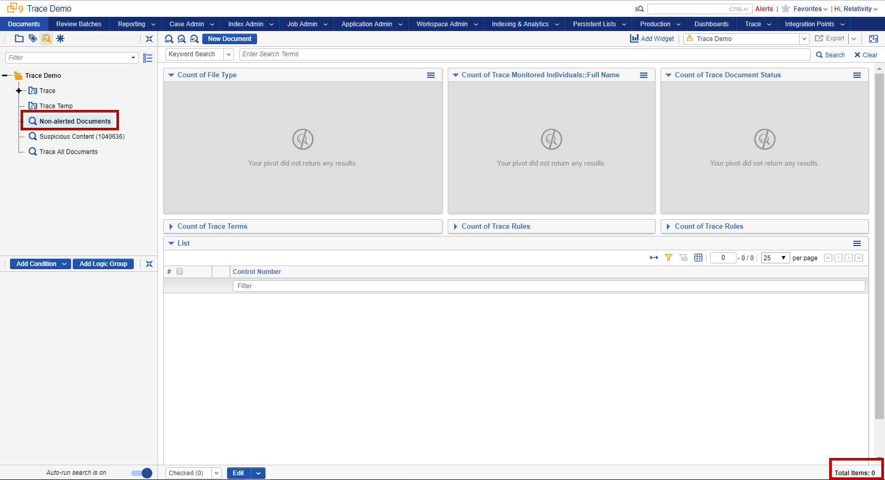

1.  Go to **Trace:Rules** , navigate to the Delete Rule and Disable it

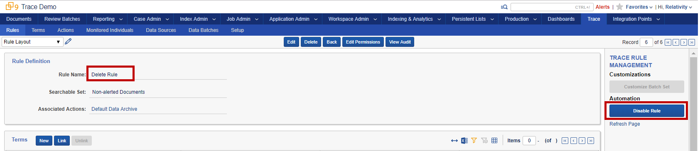

Let us know what you think! Reach out to <trace@relativity.com> with any
feedback. Thanks!
