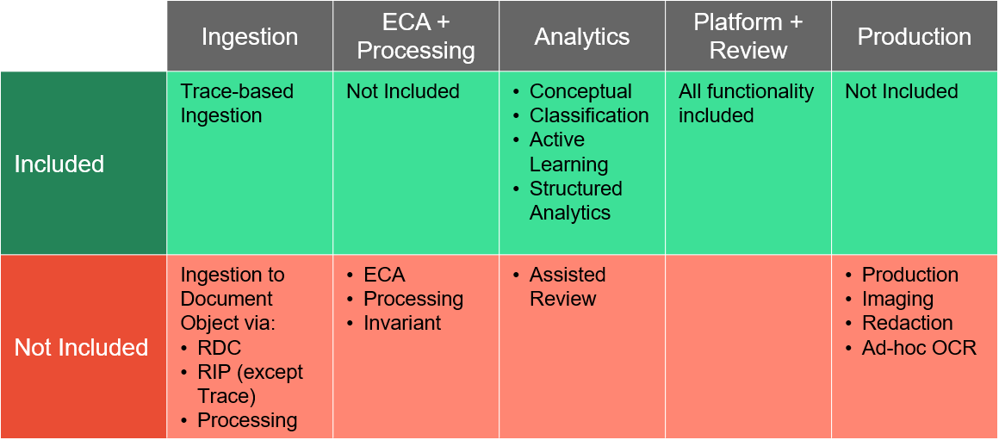
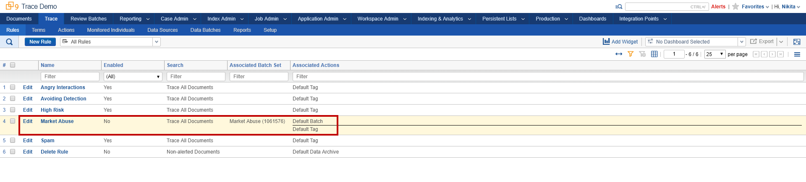
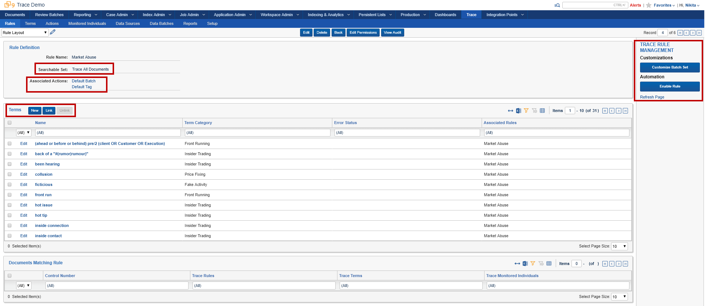
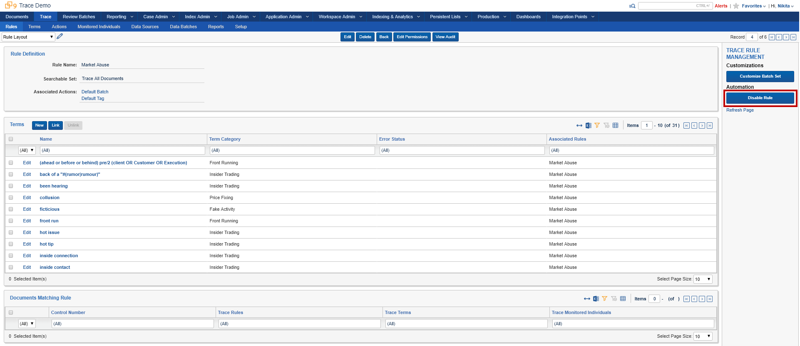

Relativity Trace Workspace
===========================

When Relativity Trace is installed into a workspace, that workspace is limited in Relativity functionality to provide for a streamlined approach to monitor all forms of communication (audio, email, and chat plus their attachments). This allows for a more cost-effective pricing for Trace by providing only the functionality you need for proactive compliance monitoring and surveillance.

This page contains the following information:

- [Pricing parameters](#pricing-parameters)
- [Workspace limitations](#Workspace limitations)
- [Use Integration Points to push data into review workspace](#Use-Integration-Points-to-push-data-into-review-workspace)

Pricing parameters
==================

Clients buy packages of Monitored Individuals
Each subscription includes a fixed amount of Trace GBs and Relativity Users

There are 2 SKUs:
30 Day Retention (includes 3 Trace GBs per MI)
365 Day Retention (includes 40 GBs per MI)

We don’t enforce any retention policy; the customer can configure retention policies themselves based on whatever they want
We only cap the data volumes in the software

The Trace GBs are separate: you cannot use an existing Relativity/RelativityOne subscription

Relativity Users are fungible across eDiscovery and Trace

There is no on-prem SKU; customers would buy the 30 Day Retention SKU and not use the included GBs

Workspace Limitations
=====================

Use Integration Points to push data into review workspace
=========================================================

  * [Demo Environment and Login Information](#demo-environment-and-login-information)
  * [Relativity Trace: An Overview of Relativity for Compliance](#relativity-trace--an-overview-of-relativity-for-compliance)
  * [Goals of the Demo](#goals-of-the-demo)
    + [Demo A](#demo-a)
    + [Demo B](#demo-b)
    + [Workspace overview](#workspace-overview)
- [DEMO A: Enabling Office 365 Data Source and auto-tagging documents (alerts)](#demo-a--enabling-office-365-data-source-and-auto-tagging-documents--alerts-)
    + [Section 1: Rules Overview](#section-1--rules-overview)
    + [Section 2: Importing Data and Running Rules](#section-2--importing-data-and-running-rules)
    + [Section 3: Viewing Results](#section-3--viewing-results)
    + [Section 4: Recap](#section-4--recap)
- [DEMO B: Running an Archive Rule](#demo-b--running-an-archive-rule)

### Demo Environment and Login Information

Reach out to `trace@relativity.com`

Relativity Trace: An Overview of Relativity for Compliance
----------------------------------------------------------

Relativity today is primarily used for e-discovery, investigations and
regulatory inquiries: typically reactive and transactional workflows.  Trace is
built for **proactive compliance and surveillance workflows**.

Trace’s is a Compliance product on top of Relativity used to **monitor all forms
of communication** (audio, email, and chat plus their attachments) with an
extensible engine that gets better at filtering out false positives over time.
Trace can monitor and pull data from **40+ data origins**. In addition, Trace
can automatically extract text and meta-data from monitored content, **900+ file
types are supported**.

Goals of the Demo
-----------------

-   See how Trace can automatically and proactively pull data from a live Office
    365 instance for several Trace Monitored Individuals.

-   Highlight Trace’s capabilities of automatically extracting text and
    meta-data from Office 365 emails and attachments.

-   Show overall data flow from ingestion, indexing, searching, tagging
    (reviewing) and ultimately data archival.

-   Introduction of the Trace Rules Engine – a way to define what type of
    information gets flagged upon ingestion and auto-batched out to a reviewer.

-   Familiarize you with broad Trace capabilities in a **sample compliance
    workflow**.

### Demo A 

In this demo we will be monitoring for “Market Abuse” conversations and
automatically flag those documents as they propagate though Trace flow.

This demo has 4 simple steps:

1.  Enabling pre-configured “Market Abuse” rule

2.  Enabling live ingestion from pre-configured Office 365 Data Source

3.  Viewing extracted text and meta-data that Trace automatically extracted from
    ingested emails and attachments

4.  Viewing the results of the Trace Rules Engine (tagged documents)

### Demo B

In this demo we will be enabling an archiving rule that is based on Data Archive
action to automatically delete data outside of a configured data retention
policy.

### Workspace overview 

-   **Trace Demo**: Workspace with multiple pre-created rules and Office 365
    Data Source.

DEMO A: Enabling Office 365 Data Source and auto-tagging documents (alerts)
===========================================================================

### Section 1: Rules Overview

1.  Go into the **Trace Demo** workspace
    

2.  Click into the **Trace:Rules** tab to see sample rules in the workspace.
    Rules are how you define the type of content that is relevant to you. The
    **Market Abuse** rule has been pre-created for you along with a few others.
    

3.  Click into the **Market Abuse** rule and see the options that make up this
    rule:

    -   **Searchable Set:** A Saved Search that the rule runs against

    -   **Associated Actions:** A set of actions to take on matched documents (this
    rule will Tag and Batch out to reviewers)

    -   **Terms**: Allows you to link Trace Terms to refine your document filter
    criteria with an e-discovery grade searching engine (dtSearch)

    -   The rule is currently **Disabled**
    

4.  Click the **Enable Rule** console button under **Trace Rule Management** section:

    -   The rule is now **Enabled**

    -   As data is ingested, this rule will be automatically applied to all incoming
    documents
    

