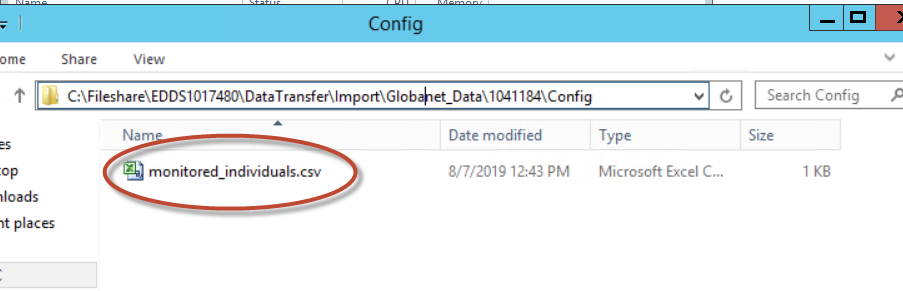
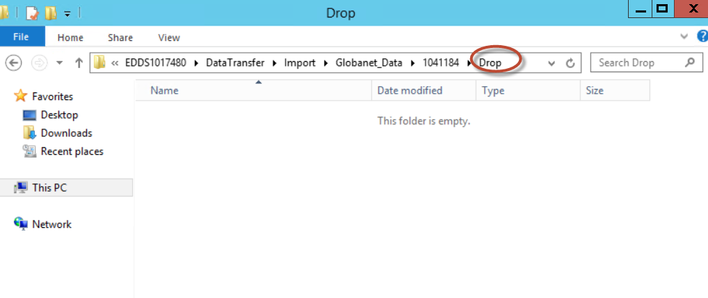
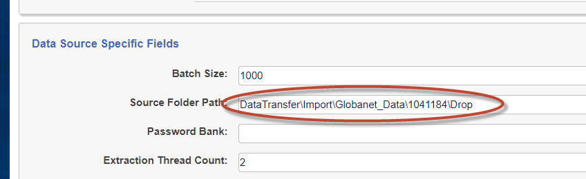
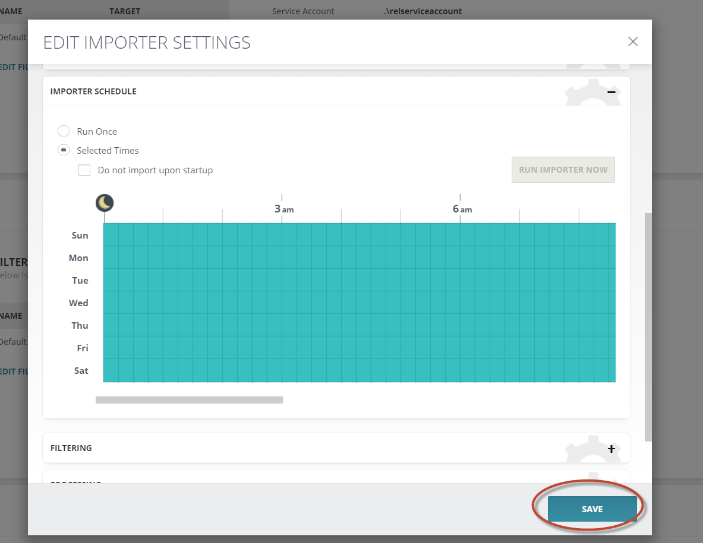

# Relativity Trace Data Source User Guide

  * [Installation](#installation)
    + [Pre-requisites](#pre-requisites)
    + [Installation Steps](#installation-steps)
    + [Data Flow Overview](#data-flow-overview)
  * [Setting up different data sources](#setting-up-different-data-sources)
    + [Generic steps that apply to all data sources](#generic-steps-that-apply-to-all-data-sources)
  * [Appendix A: Bloomberg, ICE Chat, Thomson Reuters, Symphony](#appendix-a--bloomberg--ice-chat--thomson-reuters--symphony)
  * [Appendix B: Importer Schedule Helper](#appendix-b--importer-schedule-helper)

For every Trace Data Source, except for [Microsoft Exchange Data Source](https://relativitydev.github.io/relativity-trace-documentation/user_documentation#microsoft-exchange-data-source), it is required to deploy an additional software / hardware: Trace "Shipper" powered by Globanet’s Merge1 product – this product is integrated into Trace.

## Installation

### Pre-requisites

**System Requirements**

1.  Hardware

    1.  2.4 GHz or faster 64-bit dual-core processor

    2.  16 GB RAM

    3.  300 GB hard-disk space

2. Software

   1. Windows 8 or later; Windows Server 2012 or later

   2. Internet Information Services 7.0 or higher

   3. .NET Framework 3.5 & 4.7.2

   4. Microsoft Visual C++ 2017 (x64) Redistributable

   5. SQL Server 2012 or later

      1. >  **NOTE:** We recommend to take daily backups and keep them for 1 week
      
      2. >  **NOTE:** We recommend to shrink database daily in order not to run out of disk space

3. Network Requirements

   1.  Server with Globanet needs to have access to Relativity's Fileshare
       1.  If Globanet does not have direct access to Relativity's Fileshare, site-to-site VPN OR SFTP sync can be setup. See Data Flow Overview below for more details
       2.  Server with Globanet only needs access to specific folders on Relativity Fileshare. Details are documents in Data Flow Overview section below.

### Installation Steps

Refer to `Merge1 6.0 User Guide.pdf` guide. Reach out to support@relativity.com if you don't have access to this guide.

### Data Flow Overview

1. Globanet needs access to the following file `{FILESHARE_WORKSPACE_ROOT}\DataTransfer\Import\Globanet_Data\{DATA_SOURCE_ARTIFACT_ID}\Config\monitored_individuals.csv`
2. Globanet pulls data from a data origin
3. Globanet processes the data and generates the output
4. Globanet pushes the data to Relativity Fileshare's `{FILESHARE_WORKSPACE_ROOT}\DataTransfer\Import\Globanet_Data\{DATA_SOURCE_ARTIFACT_ID}\Drop` folder
5. Globanet pushes any logs to Relativity Fileshare's `{FILESHARE_WORKSPACE_ROOT}\DataTransfer\Import\Globanet_Data\{DATA_SOURCE_ARTIFACT_ID}\Logs` folder

## Setting up different data sources

### Generic steps that apply to all data sources

1.  Configure Data Source Object in Relativity

2.  Create Monitored Individuals and associate them with a Data Source

3.  Enable Data Source Relativity Trace

    1.  **Wait** until `monitored_individuals.csv` is generate in the following folder:
        `{FILESHARE_WORKSPACE_ROOT}\DataTransfer\Import\Globanet_Data\{DATA_SOURCE_ARTIFACT_ID}\Config`
        
        
            
    
4. Create a `Drop` folder for where Globanet will be delivering data

   1.  `{FILESHARE_WORKSPACE_ROOT}\DataTransfer\Import\Globanet_Data\{DATA_SOURCE_ARTIFACT_ID}\Drop`

       

5.  Create `Logs` folder for where Globanet will be delivering logs: `{FILESHARE_WORKSPACE_ROOT}\DataTransfer\Import\Globanet_Data\{DATA_SOURCE_ARTIFACT_ID}\Logs`

6. Edit Data Source and update Source Folder Path field to the relative location of the `Drop` folder:
   `DataTransfer\\Import\\Globanet_Data\\{DATA_SOURCE_ARTIFACT_ID}\\Drop`

   

7. Configure a corresponding “Importer” in Globanet

   1.  Configure monitored individuals to point to
       `{FILESHARE_WORKSPACE_ROOT}\DataTransfer\Import\Globanet_Data\{DATA_SOURCE_ARTIFACT_ID}\Config\monitored_individuals.csv`

       

   2.  If `Monitored User` option is NOT available, configure `Filter` and use `Dynamic` -\> `CSV` option to point it to `{FILESHARE_WORKSPACE_ROOT}\DataTransfer\Import\Globanet_Data\{DATA_SOURCE_ARTIFACT_ID}\Config\monitored_individuals.csv`
       
       

   3.  Configure Target to point to `{FILESHARE_WORKSPACE_ROOT}\DataTransfer\Import\Globanet_Data\{DATA_SOURCE_ARTIFACT_ID}\Drop`
       
   
   
       
   
       
   4.  Configure `LOG ON ACCOUNT` section
       1.  Best practice is to specify computer administrator's username and password
       2.  
   5.  Configure `REPORTING` section
       1.  Report Level = Generate Summary Report Only
       2.  MISC = Leave Checkbox checked for `Delete reported and ...`
       3.  MUST specify `EMAIL REPORT SETTINGS` and send test email
       4.  
   6.  Configure `LOGGING` section
       1.  File log folder = `{FILESHARE_WORKSPACE_ROOT}\DataTransfer\Import\Globanet_Data\{DATA_SOURCE_ARTIFACT_ID}\Logs`
       2.  File Log Priority = `Error`
       3.  Event Log Priority = `Error`
   7.  Configure `ALERTING` section
       1.  MUST configure Email Alert Settings
       2.  Send Test Email
       3.  
   8.  For data source-specific instructions, Refer to `Merge1 6.0 User Guide.pdf` guide. Reach out to support@relativity.com if you don't have access to this guide.
   9.  Configure `Importer Schedule` to run at a desirable frequency (daily is the most common frequency)
   
   
   

## Appendix A: Bloomberg, ICE Chat, Thomson Reuters, Symphony

All of these Data Sources work similar via scheduled drops of data to an FTP.
Globanet picks it up from SFTP and delivers it to Trace.

See sample data flow below and refer to *Merge1 6.0 User Guide.pdf* for more
details

## Appendix B: Importer Schedule Helper

In order to ensure that data source runs **every X minutes** run the following steps OR manually select appropriate time slots:

1.  Open chrome and navigate to Configuration

    

2.  Edit Importer Settings

    

    

    

    1. Script needed:  `$("div.schedule_table").find("td").click()`
    2. 
    3. At this point Importer will be set to run every x minutes
    
## Appendix C: High Availability Setup for Globanet's Merge1

It is possible to setup Merge1 in HA mode. Recommended approach is to setup secondary Merge1 server that runs the same version of the Merge1 and installed in the same path as the production. You also need to have the same folder structure for all connectors (Import, quarantine, log folders). 

Once that is done, the secondary Merge1 should be connected to the same Merge1 DB as the primary Merge1 server. If for any reason the production server goes down, you just need to run the services on the second Merge1. Please note that no service should be started on the secondary Merge1 if the production is running. 
For the DB, you can take backups on a daily basis or apply any other standard SQL Server  HA scenarios that you wish.
