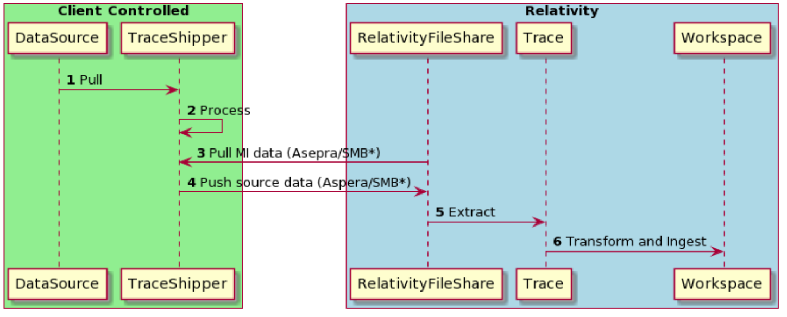

# Relativity Trace Data Source User Guide

For every Trace Data Source, except for [Microsoft Exchange Data Source](https://relativitydev.github.io/relativity-trace-documentation/user_documentation#microsoft-exchange-data-source), it is required to set up and deploy additional software.  In order to ship the data from on-premise network to Relativity you must deploy: Trace Data Shipper and additional data source provider (Globanet Merge1).  You will also need to install additional hardware.

  * [Trace Shipper Data Flow Overview]()
  * [Installation](#installation)
    + [Pre-requisites](#pre-requisites)
    + [Installation Steps](#installation-steps)
    + [Data Flow Overview](#data-flow-overview)
  * [Setting up Data Sources](#setting-up-data-sources)
  * [Appendix A: Bloomberg, ICE Chat, Thomson Reuters, Symphony](#appendix-a--bloomberg--ice-chat--thomson-reuters--symphony)
  * [Appendix B: Importer Schedule Helper](#appendix-b--importer-schedule-helper)
  * [Appendix C: High Availability Setup for Globanet's Merge1](#appendix-c-high-availability-setup-for-globanets-merge1)

## Trace Shipper Data Flow Overview 

**NOTE:** Data Pull (1) and Process (2) are performed via Globanet Merge1 software | Audio data is provided by external data provider

**NOTE:** SMB protocol is available only for on-premise deployments with direct access to RelativityFileshare

## Installation of Trace Shipper

### Pre-requisites

**System Requirements**

1.  Hardware

    1.  2.4 GHz or faster 64-bit dual-core processor

    2.  16 GB RAM

    3.  300 GB hard-disk space

2. Software

   1. Windows 8 or later; Windows Server 2012 or later

   2. Internet Information Services 7.0 or higher

      1. Make sure the following **components** are installed
         1. **Web Server**
            1. Common HTTP Features
               1. Default Document
               2. Static Content
            2. Security
               1. Basic Authentication
               2. Request Filtering
               3. Windows Authentication
            3. Application Development
               1. All .NET Extensibility Components
               2. All ASP.NET Components
               3. SAPI Extensions
               4. ISAPI Filters
         2. **Web Management Tools**
            1. IIS Management Console
            2. IIS 6 Management Compatibility
               1. IIS Metabase and IIS 6 configuration compatibility
            3. IIS Management Scripts and Tools
            4. IIS Management Service

   3. .NET Framework 3.5 & 4.7.2

   4. Microsoft Visual C++ 2017 (x64) Redistributable

   5. SQL Server 2012 or later

      1. >  **NOTE:** We recommend to take daily backups and keep them for 1 week

      2. >  **NOTE:** We recommend to shrink database daily in order not to run out of disk space

### Setting up Trace Shipper Service

Trace Shipper Service needs to be installed and configured to send data to your Relativity Trace workspace.  Refer to the 

[Trace Shipper Guide]( /trace_shipper_service.md) for instructions on how to install and configure the Trace Shipper Service. Contact support@relativity.com if you need assistance.

1. Capture the `remoteRelativePath` for each data source that you wish to process with Trace Shipper (this will be used to configure Data Source UI in Relativity - `Source Folder Path`)

   **NOTE:** `remoteRelativePath` and corresponding `Source Folder Path` **MUST** be unique for each data source.

### Installation Steps for Globanet

Refer to the [Merge 1 User Guide](https://s3.amazonaws.com/Merge1Public/User%20Guide/Merge1%206.20.0131.257.pdf) for instructions on how to install Globanet. Contact support@relativity.com if you need assistance with installation steps.

### Setting up data sources

In Trace enabled Relativity workspace perform the following steps:

> **NOTE:** When setting up the Data Source, if you do not see the Data Source Type that you are interested in please contact support@relativity.com.

1.  Create Integration Point Profiles for each data source to specify data mappings.  The Integration Point Profile is used to map fields in a source load file to workspace fields in Relativity Trace. Refer to this document [Setting up an Integration Point Profile for Trace Data Sources](https://relativitydev.github.io/relativity-trace-documentation/user_documentation#appendix-c-create-email-fields-map-integration-point-profile) for detailed instructions.
2. Create a new Data Source for each specific data source type (for example, ICE Chats) that you want to start pulling data from
   1. Navigate to Data Source tab
   
   2. Click on "New Data Source" in upper left hand corner. Please see [Data Source documentation](https://relativitydev.github.io/relativity-trace-documentation/user_documentation#data-sources) for more information about each data source configuration field
   
   3. Fill out the required fields and click "Save"
   
   4. For Globanet data sources, re-edit the data source specifying Source Folder Path field to the relative location of the `Drop` folder:
      `DataTransfer\\Import\\Globanet_Data\\{DATA_SOURCE_ARTIFACT_ID}\\Drop`
   
      
   
      **NOTE:** In order to retrieve the {DATA_SOURCE_ARTIFACT_ID}, you can capture it from the browser URL once you are in the edit mode.  (Ex: in the URL of edit mode of data source, extract "ArtifactID" - https://trace.relativity.one/Relativity/Case/Mask/EditField.aspx?AppID=1979203&ArtifactID=1869789&ArtifactTypeID=1000097)
3. Create Monitored Individuals

   1. Navigate to Monitored Individuals tab
   2. Click on "New Monitored Individual" to create a new object

   > **NOTE:** You can also bulk upload Monitored Individuals using a CSV load file and the Relativity Desktop Client.

4. Link the desired Monitored Individuals to the Data Source

   1. Navigate to the Data Source object in view mode
   2. Click "Link" under Monitored Individuals section

5. Enable the Data Source

   1. Navigate to the Data Source in view mode
   2. Click on "Enable Data Source" in the console on the right hand side

#### Steps specific to setting up Globanet data sources        

1. Create a `Drop` folder for where Globanet will be delivering data.

   A.  `{FILESHARE_WORKSPACE_ROOT}\DataTransfer\Import\Globanet_Data\{DATA_SOURCE_ARTIFACT_ID}\Drop`

      

2. Create `Logs` folder for where Globanet will be delivering logs: `{FILESHARE_WORKSPACE_ROOT}\DataTransfer\Import\Globanet_Data\{DATA_SOURCE_ARTIFACT_ID}\Logs`

3. Configure Trace Shipper with specific "Drop" folder location for the data source

   1. Start Trace Shipper service, on startup, a new folder will be created and "monitored_individuals.csv" file will be created with the appropriate MIs that were configured in Relativity UI : `{FILESHARE_WORKSPACE_ROOT}\DataTransfer\Import\Globanet_Data\{DATA_SOURCE_ARTIFACT_ID}\Drop\Config`

4. Configure a corresponding “Importer” in Globanet

   1.  Configure monitored individuals to point to
       `{FILESHARE_WORKSPACE_ROOT}\DataTransfer\Import\Globanet_Data\{DATA_SOURCE_ARTIFACT_ID}\Drop\Config\monitored_individuals.csv`

       

   2.  If `Monitored User` option is NOT available, configure `Filter` and use `Dynamic` -\> `CSV` option to point it to `{FILESHARE_WORKSPACE_ROOT}\DataTransfer\Import\Globanet_Data\{DATA_SOURCE_ARTIFACT_ID}\Drop\Config\monitored_individuals.csv`
       
       
       1. Go to Edit filters
       2. Add new Mail filter
       3. From Filter type select Dynamic option
       4. Select CSV option and type path to CSV file. Please be sure that CSV has no headers and contains only two columns: SMTP address in the first column and the username in the second (example@exampe.com, username).
       5. Go to importer settings
       6. Under the filtering section check Enable Filtering checkbox
       7. Check Process all filters checkbox
       8. Select Match any option
       9. From the first Target dropdown menu select your default target
       10. From Filter dropdown menu select created Mail filter
       11. From the second Target dropdown menu select the target where your monitored users' messages will be imported
       12. Hit the + button and save settings

   3.  Configure Target to point to `{FILESHARE_WORKSPACE_ROOT}\DataTransfer\Import\Globanet_Data\{DATA_SOURCE_ARTIFACT_ID}\Drop`
       

   
       
   
       
   4.  Configure `LOG ON ACCOUNT` section
       1.  Best practice is to specify computer administrator's username and password
           
   5.  Configure `REPORTING` section
       1.  Report Level = Generate Summary Report Only
       2.  MISC = Leave Checkbox checked for `Delete reported and ...`
       3.  MUST specify `EMAIL REPORT SETTINGS` and send test email
           
   6.  Configure `LOGGING` section
       1.  File log folder = `{FILESHARE_WORKSPACE_ROOT}\DataTransfer\Import\Globanet_Data\{DATA_SOURCE_ARTIFACT_ID}\Logs`
       2.  File Log Priority = `Error`
       3.  Event Log Priority = `Error`
   7.  Configure `ALERTING` section
       1.  MUST configure Email Alert Settings
       2.  Send Test Email
           
   8.  For data source-specific instructions, Refer to `Merge1 6.0 User Guide.pdf` guide. Reach out to support@relativity.com if you don't have access to this guide.
   9.  Configure `Importer Schedule` to run at a desirable frequency (daily is the most common frequency)

   

## Appendix A: Bloomberg, ICE Chat, Thomson Reuters, Symphony

All of these Data Sources work similar via scheduled drops of data to an FTP. Globanet picks it up from SFTP and delivers it to Trace.

See sample data flow below and refer to [Merge 1 User Guide](https://s3.amazonaws.com/Merge1Public/User%20Guide/Merge1%206.20.0131.257.pdf) for more details

## Appendix B: Globanet Importer Schedule Helper

In order to ensure that data source runs **every X minutes** run the following steps OR manually select appropriate time slots:

1.  Open chrome and navigate to Configuration

    

2.  Edit Importer Settings

    

    

    

    1. Script needed:  `$("div.schedule_table").find("td").click()`
    2. 
    3. At this point Importer will be set to run every x minutes
    
## Appendix C: High Availability Setup for Globanet's Merge1

It is possible to setup Merge1 in HA mode. Recommended approach is to setup secondary Merge1 server that runs the same version of the Merge1 and installed in the same path as the production. You also need to have the same folder structure for all connectors (Import, quarantine, log folders). 

Once that is done, the secondary Merge1 should be connected to the same Merge1 DB as the primary Merge1 server. If for any reason the production server goes down, you just need to run the services on the second Merge1. Please note that no service should be started on the secondary Merge1 if the production is running. 
For the DB, you can take backups on a daily basis or apply any other standard SQL Server  HA scenarios that you wish.