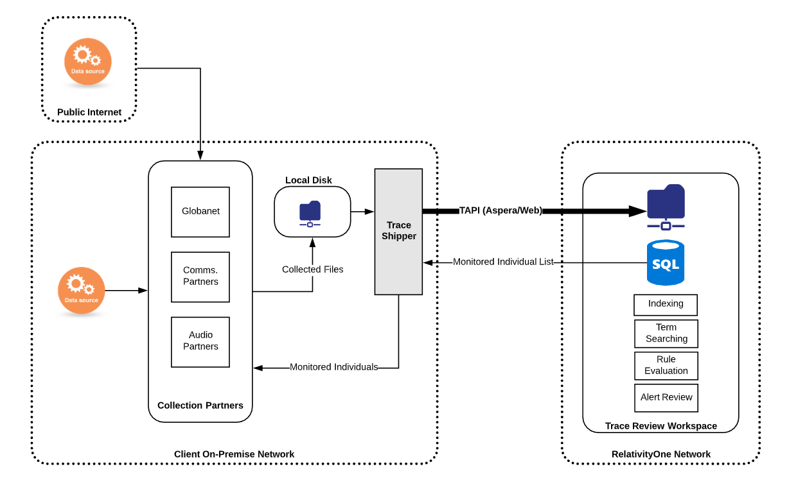

# Trace Shipper Service Documentation

The Trace Shipper Service is a Windows service released by Trace that delivers data from the client network to a remote Relativity Trace workspace. The service monitors configured source folders on the local network and ships files that appear in the source folders to predetermined file share locations within a Relativity workspace that are associated with Trace Data Sources. The files are deleted from the source folder once they have been transmitted to Relativity successfully. 

### Overview

### Trace Data Shipper Advantages
1. Fully managed Windows service with Trace specific semantics and configuration
   1. Integration with IT policies managing Windows reporting/alerting
   2. Robust mechanism for retrying in case of data transfer failures
   3. Integration of Data Source configuration from Relativity side
2. No need for VPN setup
   1. Faster onboarding of clients
   2. Fewer dependent components in data transfer
3. Fast data transfer rates
4. Secure (data encrypted in flight)

### Prerequisites Before Installing

- Identify/provision a Windows machine to run the Trace Shipper Service
> **NOTE:** This should be the same machine as Globanet appliance VM
- Identify what source folder(s) on your local network need their files shipped to a Relativity
> **NOTE:** Windows service must have read/write/modify permission on the folders
- Create/identify a Windows user to run the service (Log on as...) that has access to all folders that need to be shipped and that can be allowed access to Relativity user credentials stored in configuration
- Lookup the destination Relativity Instance(s), Workspace(s) and Target folder(s) on the destination fileshare(s) where the files should be shipped (configured as part of creating Trace Data Sources)

> **NOTE:** A document will fail to ship if a file with the same name already exists in the destination folder. Care should be taken to avoid duplicate file names both when initially retrieving data and at the remote destination folder.

- Create a designated Relativity username and password for each destination that can be used to authenticate against a Relativity API with appropriate rights
> **NOTE:** To view the file shares the user must be in a group, other than the System Administrator group, that is added to at least one workspace built on the Resource Pool with the associated file shares.
- Request the Trace Shipper deployment package by submitting a ticket to support@relativity.com
- Download and install ROSE (Staging Explorer) and run Test Connectivity ([available here](https://help.relativity.com/RelativityOne/Content/Relativity/RelativityOne_Staging_Explorer/RelativityOne_Staging_Explorer.htm#connection))

- (Only for Web protocol) Request the Relativity Transfer API Services application (Relativity.TransferApi.Services.rap) by submitting a ticket to support@relativity.com. [Install](https://help.relativity.com/10.3/Content/Relativity/Applications/Installing_applications.htm#Installi3) the Relativity Transfer API Services application to the Application Library.
>**NOTE:*** Do not install the Relativity Transfer API Services application to any workspace. By installing it to the Application Library, the services are available for consumption.

- (Only for Web protocol) Assign required permissions to Relativity user
   1. Go to Instance Details/Manage permissions.
   2. Go to Admin Operations and select a group the user belongs to.
   3. Check "Data Transfer Operations" permission.

### Data Transfer Protocols
Transfer API (TAPI) is the underlying method of data delivery to RelativityOne.  TAPI supports multiple protocols of data transfer including:
1. Direct - only available on-premise
2. Aspera (FASP protocol) - default for RelativityOne
3. Web - available on-premise and RelativityOne

### Ports and Firewall settings
For the Aspera data transfer protocol, the following ports must be configured:
1. Allow outbound connections to the server on the TCP port 33001.
2. Allow outbound connections to the server on the UDP ports 33001 - 33050, 33101, 33102.
3. Allow outbound connections to the server on HTTPS (443)

For details on the IP ranges for your specific RelativityOne instance please contact support@relativity.com

### Installation Steps

1. Extract `TraceShipperService_(version).zip` to a folder called `Trace Shipper Service` on the machine that will be running the service. Make sure that the files are directly under the `Trace Shipper Service` directory with no extra nested folders.
2. Run a command prompt AS ADMINISTRATOR, navigate to the `Trace Shipper Service` folder in the command prompt, and run `TraceShipperService.exe /i`
3. Go to Services on the machine and verify that the service was installed (`Trace Shipper Service`)
4. From the Services window, right click on the `Trace Shipper Service` and select Properties, and then on the Log On tab configure the service to run as the user with proper access to the local folders
5. In the `Trace Shipper Service` folder, edit the `serviceConfiguration.json` file. 
   > **Note:** All fields must comply with JSON formatting. The type of each value is specified below. Special characters (for `\` and `"`) will need to be escaped by a `\` character. See [this guide](https://developer.mozilla.org/en-US/docs/Web/JavaScript/Reference/Global_Objects/JSON) for help with JSON formatting.

   The root object has a single `shippers` property, which is an array of objects with the following properties:

   | Name                                   | Required | Type             | Description                                                  |
   | :------------------------------------- | :------- | :--------------- | :----------------------------------------------------------- |
   | localDirectoryPath                     | yes      | string           | The locally accessible path of the folder that needs to ship files (note the user running the service must have access) |
   | remoteRelativePath                     | yes      | string           | The path relative to the workspace fileshare root of the destination workspace where all files should be stored |
   | retrieveConfigurationIntervalInMinutes | no       | number           | The interval between Data Source configuration pulls from Relativity. Values less than or equal to 0 turns off this feature. This setting is used to synchronize, for example, monitored individuals and data source state from Relativity One to a local Globanet instance. For further customization of Data Source configuration pulling, contact support@relativity.com. *Default: 0 (off)* |
   | remoteRelativeConfigPath               | no       | string           | Location of the remote Config folder to retrieve, relative to the workspace fileshare root of the destination workspace. The default should be correct for most situations. This setting is ignored if `retrieveConfigurationIntervalInMinutes` is less than or equal to 0. Contact support@relativity.com prior to changing this value. *Default: `**remoteRelativePath**\Config`* |
   | localConfigDestinationPath             | no       | string           | The full path to the local folder where the remote Config directory should be downloaded. This will create a subdirectory named `Config` in the configured location and contents of the remote Config folder will be placed inside. This setting should only be changed if necessary. *Default: the value of `localDiretoryPath`* |
   | cacheLengthInMinutes                   | no       | number           | How long a file is ignored by monitoring before Trace Shipper Service attempts to send it to Relativity again (provides a buffer for long transfer times and surges in volume as well as automatic retries of failed transfers) *Default: 20* |
   | logLevel                               | no       | string           | The minimum message level to include in the log file (Verbose/Debug/Information/Warning/Error/Fatal), increase if log files are too large, decrease when troubleshooting.  *Default: Warning* |
   | logFilePath                            | yes      | string           | A local file path **ACCESSIBLE TO THE SERVICE USER** where the log files for the application should be stored. The log files roll automatically every 100MB, so there will be more than one file, it is best to dedicate a folder to these Trace Shipper logs. Each configured local folder requires a unique `logFilePath` |
   | logUploadIntervalInMinutes             | no       | number           | How frequently Trace Shipper Service pushes its log files to the Relativity workspace fileshare, contact support@relativity.com for more information before changing this setting. *Default: 10* |
   | externalServiceLogLocations            | no       | array of objects | An array of External Service Log Locations to push to the Relativity workspace fileshare. See below for definition of each object *Default: [] (empty)* |
   | clientType                             | no       | string           | Transfer API client type to use, current supported options are Aspera, Fileshare and Web, contact support@relativity.com for more information *Default: Aspera* |
   | relativityUserName                     | yes      | string           | The username used to connect to Relativity to upload files. **It is recommended to secure the TraceShipperService folder as a way to reduce risk of exposing these credentials.** |
   | relativityPassword                     | yes      | string           | The password used to connect to Relativity to upload files. **It is recommended to secure the TraceShipperService folder as a way to reduce risk of exposing these credentials.** |
   | relativityUrl                          | yes      | string           | The URL of the Relativity Instance where the files will be shipped. |
   | workspaceId                            | yes      | whole number     | The workspace ID of the workspace where the files will be shipped. |

   The External Service Log Location object is described by the following properties:

   | Name             | Required | Type   | Description                                                  |
   | :--------------- | :------- | :----- | :----------------------------------------------------------- |
   | logFilePath      | yes      | string | The path to the external service log to ship. The final element of this path is not necessarily an existing file, but rather a pattern to match existing files. A wildcard match is inserted after the filename, before the file extension. All files matching this pattern are considered equivalent for shipping, and the only newest files will be transferred. **For Example:** If logs of the form `\path\to\EWS.mm-dd-yyyy.log` are to be shipped, the setting should read (excluding escape characters for clarity) `\path\to\EWS.log`. This setting will match any file in `\path\to\` of the form `EWS*.log`. By using this template scheme, logging systems which include the date of the log and/or an index can be transferred. |
   | uniqueRemoteName | no       | string | The file name of the log on the remote Relativity fileshare. All external service logs are shipped to the same remote path (`**remoteRelativePath**\Logs`). If you need to transfer logs from two services with the same file name, this setting allows you to distinguish between them. *Default: the filename and extension of the path in `logFilePath` of this External Service Log object* |

6. From the Services window, Start the `Trace Shipper Service`. If all configuration is correct, files should start departing the local source folders and showing up on the Relativity fileshare as configured.
7. If the Service fails to start, look at the Application Event Logs (Event Viewer > Windows Logs > Application) to see any errors.
8. If the Service starts but does not ship files, look at the log files (as configured in the logFilePath setting) to see what messages are logged.
9. Finally, once everything is running well, use Windows permissions to secure the `Trace Shipper Service` folder and the configured logs folder to only users that should be able to access the sensitive information contained within (Relativity credentials, file paths, etc.).
10. OPTIONALLY: Create and configure Extension Scripts

### Data Source Configuration Sync and Extension Scripts
Each configured shipper automatically syncs data source configuration (in Relativity).  This configuration can be used to create custom actions that automatically trigger on certain events and changes (ex: Data Source enable/disable, Monitored Individual changes, Data Source Specific Fields changes).  Please contact support@relativity.com for more details.

### Starting/Stopping Service
The service can be managed directly from the Services application in Windows (you can quickly navigate to the window by executing `services.msc` in the Windows task bar)

### Uninstall Steps

1. Run a command prompt AS ADMINISTRATOR
2. Navigate to the `Trace Shipper Service` folder in the command prompt
3. Run `TraceShipperService.exe /u`
