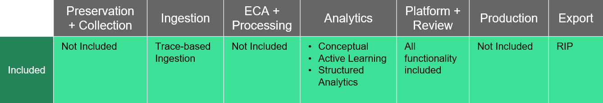
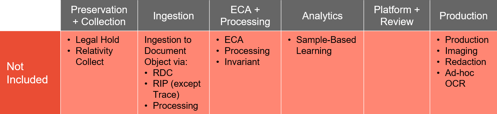

# Relativity Trace Workspace
{: .no_toc }

Description here...
{: .fs-6 .fw-300 }

## Table of contents
{: .no_toc .text-delta }

1. TOC
{:toc}

---

# Overview

When [Relativity Trace](https://relativitydev.github.io/relativity-trace-documentation/user_documentation) is installed into a workspace, that workspace is limited in Relativity features to provide for a streamlined approach to monitor all forms of communication (audio, email, and chat plus their attachments). This allows for a more cost-effective pricing for Trace by providing only the features you need for proactive compliance monitoring and surveillance.

# Trace workspace capabilities

The following Relativity features can be used in a Trace workspace:

* [Trace-based Ingestion](https://relativitydev.github.io/relativity-trace-documentation/proactive_ingestion_api_documentation)
* [Analytics](https://help.relativity.com/RelativityOne/Content/Relativity/Analytics/Analytics.htm)
  * [Conceptual index](https://help.relativity.com/RelativityOne/Content/Relativity/Analytics/Analytics_indexes.htm)
  * [Active Learning](https://help.relativity.com/RelativityOne/Content/Relativity/Active_Learning/Active_Learning.htm)
  * [Structured Analytics](https://help.relativity.com/RelativityOne/Content/Relativity/Analytics/Structured_analytics_set_tab.htm)
* [Platform + Review](https://help.relativity.com/RelativityOne/Content/Site_Resources/Review.htm)
* Export
  * [Relativity Integration Points](https://help.relativity.com/RelativityOne/Content/Relativity/Relativity_Integration_Points/Relativity_Integration_Points.htm) (RIP)
  * [ARM](https://help.relativity.com/RelativityOne/Content/ARM/ARM_Overview.htm) (Archive Restore Move)

# Trace workspace restrictions

The following Relativity features are restricted from use in a Trace workspace:

* Non-Trace Ingestion to Document Object
  * [Relativity Desktop Client](https://help.relativity.com/RelativityOne/Content/Relativity/Relativity_Desktop_Client/Relativity_Desktop_Client.htm)
  * [Relativity Integration Points](https://help.relativity.com/RelativityOne/Content/Relativity/Relativity_Integration_Points/Relativity_Integration_Points.htm) (except within Trace application)
* [ECA](https://help.relativity.com/RelativityOne/Content/Relativity/ECA_and_Investigation/ECA_and_Investigation.htm)
* [Processing](https://help.relativity.com/RelativityOne/Content/Relativity/Processing/Processing_in_Relativity.htm)
* Invariant
* [Sample-Based Learning](https://help.relativity.com/RelativityOne/Content/Relativity/Assisted_Review/Assisted_Review_Workflow.htm)
* [Productions](https://help.relativity.com/RelativityOne/Content/Site_Resources/Production.htm)
  * [Imaging](https://help.relativity.com/RelativityOne/Content/Relativity/Imaging/Imaging.htm)
  * [Redaction](https://help.relativity.com/RelativityOne/Content/Site_Resources/Supporting_applications_R1.htm#Redactions)
  * [OCR](https://help.relativity.com/RelativityOne/Content/Relativity/OCR/OCR.htm)
* [Legal Hold](https://help.relativity.com/RelativityOne/Content/Relativity_Legal_Hold/Relativity_Legal_Hold.htm)
* Relativity Collect
* [Repository Workspace](https://help.relativity.com/RelativityOne/Content/Relativity/RelativityOne_document_repository.htm)
* [Cold Storage](https://help.relativity.com/RelativityOne/Content/Relativity/Workspaces/Workspaces.htm?%20storage#Cold)

Client cannot download applications that would enable any restricted features, or move data to a repository workspace or cold storage. Client is responsible for hiding restricted features from its users.

**NOTE: If you need to use any restricted Relativity features, you can export the data to a fully functional workspace using [Relativity Integration Points](https://help.relativity.com/RelativityOne/Content/Relativity/Relativity_Integration_Points/Relativity_Integration_Points.htm).**

# Basic Trace workspace usage workflow

Using the Trace workspace allows you to focus on the alerts generated from the [Monitored Individuals](https://relativitydev.github.io/relativity-trace-documentation/user_documentation#monitored-individuals) in your [Data Sources](https://relativitydev.github.io/relativity-trace-documentation/user_documentation#data-sources). After Trace ingests data from Monitored Individuals and pushes alerts to the Document object, reviewers can begin reviewing the alerts for true and false positives. You can then leverage Active Learning to conduct a prioritized review of the alerts. You can also use the other tools in the Analytics suite to more quickly drill down to the true alerts.

