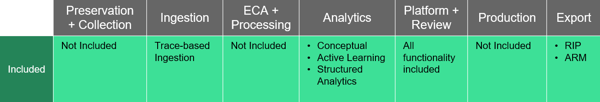
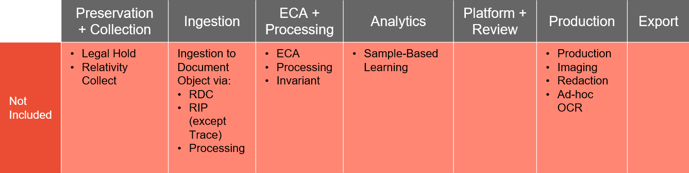

Relativity Trace Workspace
===========================

When Relativity Trace is installed into a workspace, that workspace is limited in Relativity functionality to provide for a streamlined approach to monitor all forms of communication (audio, email, and chat plus their attachments). This allows for a more cost-effective pricing for Trace by providing only the functionality you need for proactive compliance monitoring and surveillance.

This page contains the following information:

- [Workspace capabilities](#workspace-capabilities)
- [Workspace restrictions](#workspace-restrictions)
- [Basic Trace workspace usage workflow](#basic-trace-workspace-usage-workflow)

Workspace capabilities
======================

Trace SKUs include the following functionality:
* Trace-based Ingestion
* Analytics 
  1. Conceptual index
  2. Active Learning
  3. Structured Analytics
* Platform + Review

Workspace restrictions
=====================

Trace SKUs do not include eDiscovery functionality:

* Non-Trace Ingestion
* Invariant
* Processing
* Productions
* Sample-Based Learning
* Legal Hold
* Relativity Collect
* Reduced data count features

Client is responsible for hiding restricted features from its users. Client cannot 

Restricted Features include, but are not limited to, Relativity’s full stack eDiscovery product, Relativity Legal Hold, Relativity Collect and any reduced data count features. Any access to, use of, or attempt to enable, any Restricted Feature will be considered a violation of this Agreement and Relativity may charge Client its then applicable standard fees for the Restricted Feature, without prejudice to any of Relativity’s other remedies under this Agreement. If Client desires to access or use any Restricted Feature, the parties must sign and deliver a formal written amendment or new license agreement with mutually agreed upon applicable provisions and fees…

Basic Trace workspace usage workflow
====================================
Using the Trace workspace allows you to focus on the alerts generated from the Monitored Individuals in your data sources. After Trace ingests data from Monitored Individuals and pushes alerts to the Document object, reviewers can begin reviewing the alerts for true and false positives. You can then leverage Active Learning to conduct a prioritized review process of the alerts. You can also use the other tools in the Analytics suite to more quickly drill down to the true alerts.

