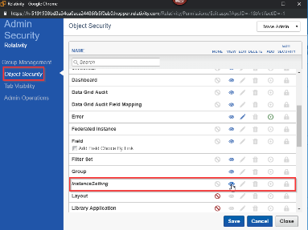

Relativity Trace Troubleshooting Guide
================================

*Note: most issues below are purely Relativity issues and must be resolved
before running Trace*

| Issue ID | Issue Symptoms                                               | Resolution                                                   | Notes                                                        |
| -------- | ------------------------------------------------------------ | ------------------------------------------------------------ | ------------------------------------------------------------ |
| 1        | System.Exception: Cannot send email because EmailTo OR EmailFrom values are empty. Update EmailTo/Recepients and EmailFrom instance setting OR provide settings for Reporting task for this workspace | Update instance settings for *kCura.Notification* section, or update Reporting task settings. |                                                              |
| 2        | Your search couldn't run at this time. Contact your system administrator -OR- System.Exception: Error during CreateAndPopulateCacheTable for Insight ---\> kCura.dtSearch.MSSQL.Exception.SearchRequestHasTimedOutException: Your search request has timed out, please contact your system administrator | Check that port entered in instance setting *SearchAgentServicePort* is unblocked on the Agent Server where dtSearch Search Agent is installed. Port needs to allow inbound and outbound connections. | Usually port number is *6870*                                |
| 3        | Relativity.Services.Exceptions.ServiceException: An unexpected server error occurred: | Ensure that all Agent Servers have *kCura Service Host Manager* service running | Check if *kCura Service Host Manager* (Kepler) is having issues communicating with Secret Store |
| 4        | System.Data.SqlClient.SqlException: Could not allocate space for object … filegroup is full | Update the storage allocation for the database. Make sure enable *Autogrowth* so this issue never happens again | https://dba.stackexchange.com/questions/33700/primary-filegroup-is-full-sql-server-2008 |
| 5        | Relativity REST Calls return “500” and message “An Error Has occurred” | Restart IIS                                                  |                                                              |
| 6        | Web Package Manger Offline Builder for Service Bus. “Object reference is not set to an instance of an object” when using WebPI 5.0. | Use offline builder files supplied by Relativity. Online builder is currently broken and is not able to be used to perform offline installations. Offline installer files are currently stored on an Anexsys USB. |                                                              |
| 7        | Service Bus configuration would not run. Timeout error occurred when creating databases for Service Bus | SQL Server session hangs when you try to enable snapshot isolation in SQL Server 2016. Stop the audit on the SQL server; 1. Run the following SQL command; ALTER SERVER AUDIT AuditName WITH (STATE = OFF) 2. Run Service Bus configuration wizard again 3. Enable SQL Server Audit; ALTER SERVER AUDIT AuditName WITH (STATE = ON) https://support.microsoft.com/en-ca/help/4090966/sql-server-session-hangs-when-you-try-to-enable-snapshot-isolation If the databases are partly created, it will be required to drop the databases that were created during the first attempt. The databases are created in Single User mode, so you will be unable to delete them straight away. To get them out of single user mode, we need to identify the process ID that is locking the database. To do this, run the following SQL; exec sp_who Scroll through the list of returned results, and identify the corresponding ID for the Service Bus databases (prefixed with SB). Kill the process that is locking the database in Single User mode by running the following SQL in SSMS: KILL (ID). Replace (ID) with the process ID number identified in the first step. The databases will now be able to be deleted by right clicking the databases in SSMS and choosing ‘Delete’. |                                                              |
|          | IIS Application Pool for Relativity and Relativity.REST would not stay up | Add Relativity Service account to the ‘Allow Logon as Batch Job’ Local Group. |                                                              |
| 8        | Schannel SSL – Could not ping the secret store & event viewer suggests Schannel SSL errors | Two-part process to fix:  **Step 1** Enable Secure Crypto (TLS 1.2), by running the following in an Elevated Powershell;  \# set strong cryptography on 64 bit .Net Framework (version 4 and above)  `Set-ItemProperty -Path 'HKLM:\\SOFTWARE\\Wow6432Node\\Microsoft\\.NetFramework\\v4.0.30319' -Name 'SchUseStrongCrypto' -Value '1' -Type DWord`  # set strong cryptography on 32 bit .Net Framework (version 4 and above)  br>`Set-ItemProperty -Path 'HKLM:\\SOFTWARE\\Microsoft\\.NetFramework\\v4.0.30319' -Name 'SchUseStrongCrypto' -Value '1' -Type DWord`  **Step 2** Download IISCrypto to the server you want to configure - https://www.nartac.com/Products/IISCrypto/  - Click Best Practices  - Uncheck TLS 1.0 and 1.1  - Uncheck Triple DES 168/168  - Uncheck MD5 - Uncheck SHA Reboot server |                                                              |
| 9        | Agent/Worker Installation – occasional issue with installation failing. Logs indicate this is due to a dependency issue, but do not state which package is causing the problem. | Install Visual C++ redistributable 2015 (x86 & x64), then reboot the server and retry the installation. Installers can be downloaded from: https://www.microsoft.com/en-us/download/details.aspx?id=48145 |                                                              |
| 10       | Some applications fail to upgrade during installation – error logs indicate an issue populating full text catalog, and SQL Full-text Filter Daemon Launcher service fails to start with “logon failure” error message | --Reconfigure the SQL Full-text Filter Daemon Launcher service to run under the Relativity service account, restart the service. --Rebuild the full text catalog for all databases. --Rerun the failed application upgrades from the Relativity frontend. |                                                              |
| 11       | Integration Points Application fails to install (failed install might still show Integration Points in workspace, creating a new Integration Point Profile will not be possible because Type field will have no options available). Specific error message might be “Could not create provider of type kCura.IntegrationPoints.DocumentTransferProvider.DocumentTransferProvider”. | Ensure WebAPIPath instance settings is setup for kCura.IntegrationPoints section. This needs to be a fully qualified URL. Going to the URL in a browser should not return a 404, it will probably be a 403 because you cannot navigate directly to the API URL. | WebApi path should not contain localhost in multi-server instances. Look at other WebApi path Instance Settings for examples of proper values. |
| 12       | Integration Point fails with 404 for HTTP or HTTPS call      | Ensure WebAPIPath instance settings is setup for kCura.IntegrationPoints section | WebApi path should not contain localhost in multi-server instances. Look at other WebApi path Instance Settings for examples of proper values. |
| 13       | Error: SQL Statement Failed ---Additional Errors--- Error: Subquery returned more than 1 value. This is not permitted when the subquery follows =, !=, \<, \<= , \>, \>= or when the subquery is used as an expression. ----- | •Happens during RIP or RDC import •This means that are duplicate objects for related data. For example, duplicate Data Batches •Remove duplicate Data Batches or other related objects |                                                              |
| 14       | Integration Points are slow to create                        | •Unlock RIP App •Add ability to delete history records to RIP •Delete ALL history using Relativity •Delete ALL non-active Integration Points using Relativity •Lock RIP Application back |                                                              |
| 15       | Trace Telemetry is Invalid                                   | •Find Error Related to Telemetry •Error log will start either with “Error in Report Billing Data:” OR with “Failed to write Billing Data To Telemetry on Agent Error” •Send found logs to <trace@relativity.com> for assistance |                                                              |
| 16       | Documents are stuck in “New” state. Indexing task throwing “SQL Statement Failed-\>Execution Timeout Expired” | Identify from logs which query is timing out. If the query is SqlService.CheckoutDocuments - ensure TraceCheckout index is created on Document table | CREATE NONCLUSTERED INDEX [IX_TraceCheckout] ON [EDDSDBO].[Document] ( [TraceCheckout] ASC ) WITH (PAD_INDEX = OFF, STATISTICS_NORECOMPUTE = OFF, SORT_IN_TEMPDB = OFF, DROP_EXISTING = OFF, ONLINE = OFF, ALLOW_ROW_LOCKS = ON, ALLOW_PAGE_LOCKS = ON) ON [PRIMARY] |
| 17       | Relativity.API.Exceptions.SecretStoreException: Secret Store set request failed. ---\> Relativity.SecretStore.Client.Exceptions.FailedHttpRequestException: Exception of type 'Relativity.SecretStore.Client.Exceptions.FailedHttpRequestException' | Check disk space on the server where secret service is running on. Specifically, the audit may not be able to be created in SQL server on each action executed against SecretStore |                                                              |
| 18       | Unable to access Setup tab (throws error) when user is not a full administrator | Ensure the user’s group has instance level permissions for “InstanceSetting”. You can adjust this on InstanceDetails tab in admin mode.  |                                                              |
| 19       | “Case Statistics Manager failed to complete for the following workspaces:” OR “Invalid object name 'EDDSDBO.SourceProvider'.” | Ensure that Integration Points Application is installed into a workspace in question | When workspace is ARMed, IP Application is not installed automatically |
| 20       | "User doesn't have permissions to relativity applications." error during App Install | --Ensure Service Account User is properly setup --Remove and then Add "Aministrator" group from Service Account User |                                                              |
| 21       | "Error in Pre-workspace SecuredApplicationGuids creation logic" error during App Install | --Update OR Create `SecuredApplicationGuids` instance setting (Section: `Relativity.Core`) --Ensure the `Description` is blank --Ensure the `Value` has semicolumn-separate list of Default Application GUIDS ( reach out to `trace@relativity.com` ) + Trace Application GUID `f931e0b6-dbee-4167-855b-f0fc407f2dc0` --Retry Install |                                                              |
| 22       | "Could not find a part of the path '\\serverFileShareName\dtSearch\dt_1073716_28a3ffe6-e101-482b-8356-7f80edc6d7ff'. Hide Error Details System.IO.DirectoryNotFoundException: Could not find a part of the path '\\serverFileShareName\dtSearch\dt_1073716_28a3ffe6-e101-482b-8356-7f80edc6d7ff'." | --Check to see if Folder exists and re-create it if it does not --Go back to dtSearch page and `Cancel` the build --dtSearch Index should be in good state  |                                                              |
| 23       | "The Index share is invalid (dtSearch) indexing pre-condition validiation" | https://community.relativity.com/s/article/Trace---The-Index-share-is-invalid-28dtSearch29-indexing-pre-condition-validiation-2019-11-12181315Z |                                                              |
| 24       | Agent gets disabled "Failed To Load"                         | Check Agent Manager and Service Host services are up and running.  Ensure there's disk space available on the all drives. |                                                              |
| 25       | Application is locked and needs to be unlocked               | Run this sql in workspace database  `UPDATE [RelativityApplication] SET [Locked] = 0 WHERE ArtifactID IN (SELECT ArtifactID FROM ArtifactGuid WHERE ArtifactGuid = 'dcf6e9d1-22b6-4da3-98f6-41381e93c30c')` | Replace `dcf6e9d1-22b6-4da3-98f6-41381e93c30c` with Application's GUID in question |
| 26       | Application needs to be re-installed because some components are missing | -- Run this SQL in workspace database `UPDATE [RelativityApplication] SET [ApplicationIsDirty] = 1, [Locked] = 0, [OriginSignature] = null WHERE  ArtifactID IN (SELECT ArtifactID FROM ArtifactGuid WHERE ArtifactGuid = 'dcf6e9d1-22b6-4da3-98f6-41381e93c30c') ` -- Manually trigger re-installation of the app in question from Library Application Page | Replace `dcf6e9d1-22b6-4da3-98f6-41381e93c30c ` with Application's GUID in question |
| 27       | Data Batches failing with RIP error - Failed to retrieve OAuth2Client for user | --Restarting Service Host service on all available Web Servers |                                                              |
| 28       | Data Batch fails to import with message "IAPI Error" or "Input length exceeds maximum set length" | -- Navigate to the field tab and increase the Fixed Text Length property of the field in error -- Retry Data Batch via Mass Operation or from console button |                                                              |
| 29       | Error: The remote server returned an error: (500) Internal Server Error. The server was unable to process the request; please retry the operation. If the problem persists, please contact your Service Bus administrator and provide the tracking id..TrackingId:42f7d1f2-a496-48a9-a517-80abbc572332_GemtTest,TimeStamp:11/4/2019 6:25:48 PM->The remote server returned an error: (500) Internal Server Error. | --Ensure Agent Server has ServiceBus services started (Service Bus Gateway, Service Bus Message Broker, Service Bus Resource Provider) |                                                              |
| 30       | Trace Error Details: Invalid date for MAIL_CLIENT_SUBMIT_TIME. Actual value: Thu, 10 Oct 2019 05:25:51 -0400 (EDT) | --Edit Document Manually and adjust the date accordingly   --Figure out root cause for invalid date |                                                              |
| 31       | Integration Point fails with error "IAPI - Your account does not have rights to add a document or object to this case" | Edit Ingestion Profile and make sure destination folder still exists |                                                              |
| 32       | Relativity.Services.Exceptions.ConflictException: Could not load file or assembly 'file:///C:\Users\RelSVC-T004\AppData\Local\Temp\HostedService\feaee623044b419d9fda02fcc65eb71b\11.1.242.2\svs\FSharp.Core.dll' or one of its dependencies. The process cannot access the file because it is being used by another process. (Exception from HRESULT: 0x80070020) | Restart agent serverhosting Trace Manager agent.  Alternatively, delete/re-create manager agent on different agent server. |                                                              |
| 33       | Trace Manager Agent cannot install / upgrade Trace and the following error is in logs "...Could not find field info for Guid 1f036749-a691-4aa8-8cf7-5eeb80c36caf..."                        | 1) Verify that GUID does not exist for `Group Identifier` Field: `SELECT * FROM ArtifactGuid WHERE ArtifactId = GROUP_IDENTIFIER_ARTIFACTID`   2) Insert guid for Group Identifier Field: `insert INTO ArtifactGuid values (GROUP_IDENTIFIER_ARTIFACTID, '1F036749-A691-4AA8-8CF7-5EEB80C36CAF' );` |  Replace `GROUP_IDENTIFIER_ARTIFACTID` with Actual Group Identifier ArtifactId
| 34       | Term Searching task times out - "Task has exceeded timeout of {timeout} seconds. Please restart Trace Agent from Setup tab and contact administrator if problem persists" | 1. Restart trace agent.   2. Delete all search indexes with 'temp' in the name   3. Delete all 'Temp' saved searches under Trace temp folder except the folder itself   4. Retry all documents that got stuck (not in 'Term Searched' or later)   5. Change indexing task to run quicker than default of 7200   6. Let it start executing and then change back to 7200   7. See if temp indexes are being generated   8. Wait until documents are term searched | This can happen if there is an issue with dtSearch agents or there are too many temp indexes or the timeout is too small |
| 35       | System.Exception: All searches did not complete successfully. 0 completed, but 1 failed. The following destinations failed: http://SX9000063272:6870/api/dtSearchService/Search.   First Exception Encountered: System.Net.WebException: Unable to connect to the remote server ---> System.Net.Sockets.SocketException: A connection attempt failed because the connected party did not properly respond after a period of time, or established connection failed because connected host has failed to respond 10.30.69.115:6870 | Check agent server configuration whether port 6870 is opened for inbound connections. | |
