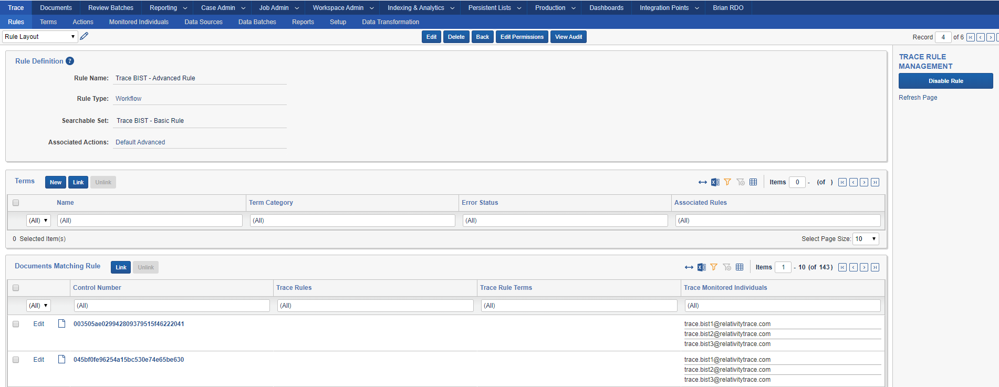

# Relativity Trace User Documentation

- [Introduction to Relativity Trace](#introduction-to-relativity-trace)
- [Prerequisites](#prerequisites)
	- [Agents](#agents)
	- [Applications](#applications)
	- [BIST ( Built-in self-test ) Workspace](#bist--built-in-self-test--workspace)
- [Setting up Relativity Trace](#setting-up-relativity-trace)
- [Trace Document Flow Overview](#trace-document-flow-overview)
	- [Trace Document Fields](#trace-document-fields)
	- [Dashboard Widgets](#dashboard-widgets)
	- [Trace Document Retry and Error Resolution Workflow](#trace-document-retry-and-error-resolution-workflow)
- [Trace Rules Engine Overview](#trace-rules-engine-overview)
	- [1 - Creating a Rule](#1---creating-a-rule)
	- [2 - Customizing and Running a Rule](#2---customizing-and-running-a-rule)
	- [3 - Validating Results](#3---validating-results)
	- [Terms](#terms)
		- [Creating Terms](#creating-terms)
		- [Highlighting](#highlighting)
	- [Rule Generator](#rule-generator)
		- [Creating a Rule Generator](#creating-a-rule-generator)
		- [Rule Generator Search Criteria](#rule-generator-search-criteria)
		- [Customizing and Running a Rule Generator](#customizing-and-running-a-rule-generator)
		- [Rule Generator Limitations](#rule-generator-limitations)
	- [Actions](#actions)
		- [Move To Folder Action Type](#move-to-folder-action-type)
		- [Data Disposal Action Type](#data-disposal-action-type)
		- [Advanced Action Type](#advanced-action-type)
		- [Alert Action Types](#alert-action-types)
		- [Replacement Tokens](#replacement-tokens)
			- [Email Action Type](#email-action-type)
				- [Sample Email generated by Trace](#sample-email-generated-by-trace)
			- [Slack Action Type](#slack-action-type)
				- [Sample Slack message generated by Trace](#sample-slack-message-generated-by-trace)
			- [Webhook Action Type (Preview)](#webhook-action-type-preview)
		- [Custom Relativity Scripts](#custom-relativity-scripts)
- [Trace Proactive Ingestion Framework](#trace-proactive-ingestion-framework)
  - [Data Sources](#data-sources)
    - [Data Source Specific Settings](#data-source-specific-settings)
        - [Data Source State Serialization](#data-source-state-serialization)
    - [Data Source Auto-Disable](#data-source-auto-disable)
    - [Microsoft Exchange Data Source](#microsoft-exchange-data-source)
    - [Zip Drop Data Source](#zip-drop-data-source)
  - [Ingestion Profiles](#ingestion-profiles)
    - [Data Mappings](#data-mappings)
  - [Monitored Individuals](#monitored-individuals)
  - [Data Transformations](#data-transformations)
  	- [Replace Data Transformation](#replace-data-transformation)
  	- [Deduplication Data Transformation](#deduplication-data-transformation)
  	  - [Required Fields for Deduplication](#required-fields-for-deduplication)
  	- [Communication Direction Data Transformation](#communication-direction-data-transformation)
  	- [Exempt List Data Transformation](#exempt-list-data-transformation)
  - [Data Batches](#data-batches)
    - [Data Batch Retry and Error Resolution Workflow](#data-batch-retry-and-error-resolution-workflow)
  - [Discovery of Monitored Individuals](#discovery-of-monitored-individuals)
    - [Monitored Individual Discovery On Globanet Data Sources](#monitored-individual-discovery-on-globanet-data-sources)
    - [Monitored Individual Discovery On Other Data Sources](#monitored-individual-discovery-on-other-data-sources)
    - [Supported File Formats](#supported-file-formats)
  - [Excluded Files](#excluded-files)
    - [Trace Add To Excluded Files](#trace-add-to-excluded-files)
    - [Identifying Files to Exclude](#identifying-files-to-exclude)
    - [Disposing of Documents that have been Added as Excluded Files](#disposing-of-documents-that-have-been-added-as-excluded-files)
- [Setup](#setup)
	- [Tasks](#tasks)
	- [System Health Reporting](#system-health-reporting)
	- [Errors and Logging](#errors-and-logging)
- [Analytics Automation](#analytics-automation)
  - [Conceptual and Classification Analytics](#conceptual-and-classification-analytics)
  - [Structured Analytics Sets](#structured-analytics-sets)
  - [Machine Learning](#machine-learning)
- [Built-In Self-Test (BIST)](#built-in-self-test-bist)
- [Reporting](#reporting)
	- [Trace Terms Report](#trace-terms-report)
- [Trace and Azure Information Protection](#trace-and-azure-information-protection)
- [Considerations](#considerations)
	- [Usability Considerations](#usability-considerations)
	- [General Infrastructure and Environment Considerations](#general-infrastructure-and-environment-considerations)
	- [Large Workspaces Infrastructure and Environment Considerations](#large-workspaces-infrastructure-and-environment-considerations)
	- [License and Billing Data](#license-and-billing-data)
- [Glossary](#glossary)
- [Appendix A: Trace Object Architecture](#appendix-a-trace-object-architecture)
- [Appendix B: Trace Document Extraction Fields](#appendix-b-trace-document-extraction-fields)
- [Appendix C: Create Email Fields Data Mappings and Ingestion Profile](#appendix-c-create-email-fields-data-mappings-and-ingestion-profile)
	- [Setup Ingestion Profile](#setup-ingestion-profile)


Introduction to Relativity Trace
================================

Relativity Trace is an application built on the Relativity platform for built for proactive communication surveillance workflows.

Relativity Trace is an [ADS Deployable Application](https://platform.relativity.com/9.5/Content/Building_Relativity_applications/Building_Relativity_applications.htm) containing [RDOs](https://platform.relativity.com/9.5/Content/Managing_Relativity_dynamic_objects/RDO_9.5/Relativity_objects.htm), Custom [Agents](https://help.relativity.com/9.5/Content/System_Guides/Agents_Guide/Agents.htm), [Event Handlers](https://help.relativity.com/9.5/Content/Relativity/Event_Handler_Express/Relativity_Event_Handler_Express.htm) and other relevant infrastructure.

Prerequisites
=============

Ensure the default Relativity infrastructure has been set up and is fully operational. In addition, Relativity Trace utilizes the following components for its processes:

### Agents

-   dtSearch Index Manager

-   dtSearch Index Worker

-   dtSearch Search

-   Application Installation Manager

-   Auto Batch Manager

-   Integration Points Agent (need to install [Relativity Integration Points](https://platform.relativity.com/9.6/Content/Relativity_Integration_Points/Get_started_with_integration_points.htm?) first)
    
-   Integration Points Manager (need to install [Relativity Integration Points](https://platform.relativity.com/9.6/Content/Relativity_Integration_Points/Get_started_with_integration_points.htm?) first)

If you plan to use `Analytics` functionality, please also make sure the following agents are set up:

-   Relativity Analytics Index Manager

-   Relativity Analytics Cluster Manager

-   Analytics Categorization Manager

-   Analytics Index Progress Manager

-   Active Learning Manager

-   Active Learning Worker

-   Structured Analytics Manager (need to install [Relativity Analytics](https://help.relativity.com/9.6/Content/Relativity/Analytics/Structured_analytics_set_tab.htm) first)
    
-   Structured Analytics Worker (need to install [Relativity Analytics](https://help.relativity.com/9.6/Content/Relativity/Analytics/Structured_analytics_set_tab.htm) first)

### Applications

-   [Relativity Integration Points](https://help.relativity.com/RelativityOne/Content/Relativity/Relativity_Integration_Points/Relativity_Integration_Points.htm)
1.  Relativity Integration Points is a required application for Relativity Trace and should be installed in all Trace workspaces BEFORE installing Trace
    2.  Used by Trace Data Sources
    3.  See this [page](https://help.relativity.com/9.6/Content/Relativity_Integration_Points/RIP_9.6/Installing_Integration_Points.htm) for details on how to install Integration Points
-   [Relativity Analytics](https://help.relativity.com/RelativityOne/Content/Relativity/Analytics/Structured_analytics_set_tab.htm#Setting_up_your_environment)
    1.  Used by Trace after ingestion to perform Structured Analytics workflows (language identification, repeated content identification, etc)
    
-   [Active Learning](https://help.relativity.com/RelativityOne/Content/Relativity/Active_Learning/Active_Learning.htm)
    1. Used by Trace after ingestion to analyze documents against Machine Learning models.
### BIST ( Built-in self-test ) Workspace

1.  Create new Relativity Workspace dedicated to BIST. Workspace must be named `Trace BIST Automation [DO NOT MODIFY]`

2.  Follow steps in [Relativity Trace Automated Tests (BIST)](https://relativitydev.github.io/relativity-trace-documentation/bist_smoke_tests)

Setting up Relativity Trace
===========================

1.  Install [Relativity Integration Points](https://platform.relativity.com/9.6/Content/Relativity_Integration_Points/Get_started_with_integration_points.htm?) in all the workspaces that will Run Trace.
    
2. [Install](https://help.relativity.com/9.6/Content/Relativity/Applications/Installing_applications.htm) the `Trace_<version>.rap` from the Application Library tab in the Admin case to all workspaces
   that will run Trace 

   > **NOTE**: Using the Relativity Applications tab from within a workspace to install Trace is NOT recommended. Always install Trace from the Application Library.

3. Wait until application Status switches to `Installed` in the target workspaces


    
3. Create Trace agents

   > **NOTE:** Trace agents are Resource Pool aware.  A single resource pool supports only one `Trace Manager Agent` and an unlimited number of `Trace Worker Agents`

   1.  Trace Manager Agent
       1.  Agent Type = `Trace Manager Agent`
       2.  Number of Agents = `1` 
       3.  Agent Server = Select the agent server you would like the agent deployed on (see “Infrastructure and Environment Considerations” section for optimal performance)
       4.  Run Interval = `60`
       5.  Logging level of event details = `Log all messages`
   2.  Trace Worker Agent
       1. Agent Type = `Trace Worker Agent`
       2. Number of Agents = `No more than 2x #of CPU cores per agent server (Ex. 4 CPU agent server should host no more than 2 Trace Worker agents`
       3. Agent Server = Select the agent server you would like the agent deployed on (see “Infrastructure and Environment Considerations” section for optimal performance)
       4. Run Interval = `60`
       5. Logging level of event details = `Log all messages`
   3.  Integration Points Manager Agent
       1. Agent Type = `Integration Points Manager`
       2. Number of Agents = `1`
       3. Agent Server = Select the agent server you would like the agent deployed on (see “Infrastructure and Environment Considerations” section for optimal performance)
       4. Run Interval = `60`
       5. Logging level of event details = `Log critical errors only`
   4.  Integration Points Agent
       1. Agent Type = `Integration Points Agent`
       2. Number of Agents = `up to 4` (start with 1 and add more if data batches get backed up)
       3. Agent Server = Select the agent server you would like the agent deployed on (see “Infrastructure and Environment Considerations” section for optimal performance)
       4. Run Interval = `60`
       5. Logging level of event details = `Log critical errors only`
   
4. Please review the [Considerations](#infrastructure-and-environment-considerations) for system impact information. By default system processes (Tasks) are scheduled to run every 5 minutes (configurable per workspace).

   > Please reach out to `support@relativity.com` for additional information

5. On the `Agents` tab, view the Message of `Trace Manager Agent` until there are no longer any workspaces listed as `Updating` (this is necessary because the manager agent makes additional modifications to target workspaces after application install that are needed in the next steps) 
> **NOTE:** On upgrades, the workspaces with existing data could take considerable time but should not take longer than 20-30 minutes to finish upgrading.  Please reach out support@relativity.com if the upgrade takes longer. 

6. Configure Trace License

   1.  At first install time, a default trial license is installed that is re-used for all workspaces in the Relativity instance (it’s valid 30 days from installation date)
       
   2.  You can request a new license via `Manage Trace License` link on Setup tab
   
   
   
3.  Click `Request Trace License` and send an email with the contents of the request to `support@relativity.com`
    


       
   > **WARNING:** Once license expires, all Trace processes stop working in **all** configured workspaces.

7. In the workspace, navigate to the `Trace`->`Setup` tab and set the `Run Option` to `Continuous`
   
   1. 
    > **WARNING:** Changing the “Run Option” to “Continuous” will automatically build a dtSearch index for this workspace for all documents present. Only change this setting to "Continuous" when appropriate agent infrastructure is configured and disk space available to build a corresponding dtSearch Index. Please reach out to `support@relativity.com` for support on installing Trace into workspaces with existing data.

Trace Document Flow Overview
============================
Trace has a six-step Document analysis process. Status is tracked on the `Trace Document Status` field. When a document status is changed the timestamp on the `Trace Document Status Updated On` field is updated.

| Step | Status:                 | Overview:                                                    |
| :--: | ----------------------- | ------------------------------------------------------------ |
|  1   | NEW                     | Documents that are brand new to the workspace and are part of `Trace All Documents` saved search. |
|  2   | INDEXED                 | Documents that have been successfully indexed.               |
|  3   | TERM SEARCHED           | Documents that have been successfully searched by Term Searching task. |
|  4   | NORMALIZED              | Documents and their family that have completed all normalization processes, as defined by the `Normalized Saved Search` field criteria configured in the `Rule Evaluation` task. <br/><br/>**NOTE:** Documents can only be moved to the `Normalized status` if they and all their family members are in the `Term Searched` status. <br/><br/>**NOTE:** If `Normalized Saved Search` is not populated, documents will move to `Normalized` once they and all their family members are in the `Term Searched` status. |
|  5   | READY FOR RULE ANALYSIS | Documents that have been `Normalized` and don't meet the criteria of the  `Omit from Alert Rules Saved Search` configured in `Rule Evaluation` task. Both `Alert` and `Workflow` `Rules` will analyze these documents. |
|  6   | ALERT RULES COMPLETE    | Documents which are returned by `Omit from Alert Rules Saved Search` configured in `Rule Evaluation` task along with their family. `Alert` `Rules` will NOT analyze these documents. <br/><br/>**NOTE:** If ``Omit from Alert Rules Saved Search`` is not configured, no documents will be marked with the `Alert Rules Complete` status. Only `Workflow` `Rules` will analyze these documents. |

> **TIP:** To identify documents that are stuck in the flow and no longer progressing through the statuses, it is advised that you create a document view that shows documents with a status of  `1 - New`, `2 - Indexed`, OR `3 - Term Searched` and sort the documents in ascending order by the `Trace Document Status Updated On` field, so that documents that have been stuck in a non-terminal status for a significant period of time are identified at the top of your view.

### Trace Document Fields

As documents flow into a Relativity workspace and through the Trace workflow the status of documents is reflected on a few key fields on the Document object

1.  **Trace Checkout** – Fixed-length Text field responsible for checking out each document for the Trace Data Flow
2.  **Trace Document Status** – Single choice field responsible for reflecting overall progress of the document through the Trace Data Flow
    - Standard choices are:
    	- `1 – New`, `2 – Indexed`, and `3 – Term Searched` reflecting the statuses above
    	- `4 – Normalized`, `5 – Ready for Rule Analysis`, and `6 – Alert Rules Complete` reflecting the statuses above, depend on configuration of `Rule Evaluation` task
    - `Indexing Errored` status reflects documents that have not successfully gone through Indexing. 
    - Potential causes
        1. Broken infrastructure (Agents, Service Host issues)
        2. Documents could not be update with `New` status due to SQL outage
      
    - Actions
        1. Check Setup tab for statuses of agents
        2. Check Trace logs (via `Manage Logs` console button)
        3. Perform `Trace Document Retry` mass-operation on affected documents
      
    - `Searching Errored` status reflects documents that have not successfully gone through Term Searching stage.
      - Potential causes
      1. Broken infrastructure (Agents, Service Host issues)
        2. Permanently broken/invalid Term (dtSearch) syntaxes are present
      
      - Actions:
      1. Check Setup tab for statuses of agents
        2. Check Terms tab for detailed errors on each failed term
      3. Check Trace logs (via `Manage Logs` console button)
        4. Perform `Trace Document Retry` mass-operation on affected documents
3.  **Trace Document Status Updated On** – Date field that holds the UTC time when document's `Trace Document Status` field was last updated.
4.  **Trace Terms** – Multi-Object field tracking which Terms have matched a document
5.  **Trace Rule Terms** – Multi-Object field tracking Rule specific Terms (terms that match the document that are also associated with Rules that match the document)
6.  **Trace Has Errors** – Boolean (yes/no) field indicating if the document has any errors related to ingestion, extraction
7.  **Trace Error Details** – Long Text field capturing the error details if a document has encountered any errors
8.  **Trace Data Transformations** – Multi-Object field tracking what data transformations have been applied to the document as part of ingestion
9.  **Trace Monitored Individuals –** Multi-Object field tracking which Monitored Individuals are associated with each document 
10.  **Trace Rules –** Multi-Object field tracking which Rules of type Alert matched a document
11.  **Trace Alerted On –** Date field that holds the time when a Document first matched an Alert rule
12.  **Trace Workflow Rules –** Multi-Object field tracking which Rules of type Workflow matched a document
13.  **Trace Matching Rules (INTERNAL)** - Multi-Object field used by the Rules engine to snapshot documents that match the Saved Search and Term conditions for each rule execution. Please do not edit or use this field for any other purpose as the data within it is cleared and updated frequently.
14.  **Trace Record Origin Identifier -** Contains an identifier (varies by Data Source) that can be used to reconcile Trace documents with their origin
15.  **Trace Data Batch -** Tracking object that shows when and how the document was brought into the Workspace
16.  **Trace Data Batch::Data Source -** System generated field that can be used to show the Data Source that created each document. If desired, edit this field to Allow Pivot and Allow Group By and place a Widget on the Documents dashboard to see how many documents are generated by each Data Source.
17.  **Trace Is Extracted** – Boolean (yes/no) field indicating if the document is a Native or was Extracted (in Rule Evaluation it indicates if document is a parent of a family member).
18.  **Trace Omit from Alert Rules** – Boolean (yes/no) field indicating if the document is omitted from alert rules.

### Dashboard Widgets

You can get a quick understanding of the status of your system and documents by
applying Widgets using Trace Document Fields to the Documents dashboard:


Trace Document Retry and Error Resolution Workflow
-----------------------------------

If you wish to re-submit existing documents through the Trace Data Flow, you can accomplish this via Document mass operation `Trace Document Retry`. The mass operation resets the following fields: `Trace Checkout`, `Trace Terms`, `Trace Rule Terms`, `Trace Rules`, `Trace Alerted On`, `Trace Workflow Rules`, and sets `Trace Document Status` to `1 - New` and updates `Trace Document Status Updated On` for all selected documents and their family members. Simply check the documents that you wish to retry from the Document List and click the item in the dropdown and click `Ok` on the pop-up. If your browser settings prevent pop-ups please enable them for Relativity URLs.

> **NOTE:** Trace Document Retry will not move documents between Folders, remove Analytics or Script results, or remove review decisions. These steps should be taken manually prior to performing Trace Document Retry if necessary for workflows.

> **NOTE:** Trace Document Retry does not re-extract metadata from the document natives. Existing data is used to re-index, and re-run term searching and rule evaluation using the current term and rule sets.

> **NOTE:** Trace Document Retry will only work when the "Run Option" on the Setup tab is set to `Continuous`

>  **WARNING:** The retry process can be very resource-intensive. Trace is optimized for ongoing and forward-looking use cases where documents are only searched once upon ingestion. Triggering a retry will treat affected documents as if they were brand new to Trace, clearing all previous Rule and Term associations. If enough documents are retried at once, the system could struggle to handle the sudden influx of documents. Please exercise caution when using this feature.


Trace Rules Engine Overview
===========================

The Trace Rules Engine allows users to define data buckets with specific triggers and actions. These Rules are executed on periodic basis at pre-configured intervals, allowing users to automatically categorize and tag documents as they are ingested into the workspace.

1 - Creating a Rule
-------------------

Create a new [rule](#_Glossary) by clicking `New Rule` on the `Trace`:`Rules` tab


The Rule Creation form contains the following fields:

-   **Rule Name:** the name of the rule

- **Rule Type:** classification of the purpose of the rule

  -   **Alert:** a rule that is designed to alert on responsive documents. Documents matching rules of this type are tagged in the Trace Rules field.
  -   **Workflow:** a rule that is designed to operate on every document in the workspace and take some action (run a script, move to the correct folder, etc) but not to alert on responsive documents. Documents matching rules of this type are tagged in the Trace Workflow Rules field.

-   **Searchable Set:** the document set searched when the Rule runs. Make sure this set contains all documents that should be considered by Trace Rules.
    
-   **Associated Actions:** actions are what happen when a rule matches a document. Currently supported Action Types are:
    -   **Data Disposal**: triggers deletion of specified documents after the configured retention policy
-   **Advanced:** execute customer provided Relativity Script
    -   **Email:** generates an email with metadata about alerted documents
    -   **Webhook:** makes a generic API call hosted within Relativity
    -   **Slack:** generates a Slack message with metadata about alerted documents
    -   **Move To Folder:** Move matched documents to a specific folder
> **NOTE:** Documents are always tagged automatically with the associated Rule (happens as the final action as part of Rule Evaluation, if a document is tagged then all of the actions on the rule were executed) on either the Trace Rules or Trace Workflow Rules field, depending on the Rule Type

> **NOTE:** Default actions shipped with Trace out of the box are meant as examples and are subject to being updated during application upgrades. In order to configure your rules please create a new action of specific type (you can also copy default actions as a starting point).

2 - Customizing and Running a Rule
-----------------------------------

After you create a Rule, use the Rule definition page to associate Terms and Enable/Disable the rule.



##### Terms

Associating Terms with a Rule causes it to only target documents that contain one or more of the associated terms in their extracted text. To associate Terms with a Rule, use the New or Link buttons on the Rule Layout. Please see the Terms section below for more information on creating Terms.

##### Enable / Disable

Clicking the Enable Rule console button on the right of the layout causes the Trace Manager Agent to run the rule on an ongoing basis. Clicking Disable Rule will stop future execution of the Rule.

> **NOTE:** A Rule will only execute when it is enabled. If a Rule is disabled while running, it will still finish its current execution.


3 - Validating Results
----------------------

After Rule executes, documents matching the Rule will be associated to the Rule itself.


Terms
-----

In addition to metadata conditions of a Saved Search associated with Rule, you can apply extensive searching criteria to isolate only the most relevant documents.

### Creating Terms

You can create Terms in multiple ways:

1.  Via [Remote Desktop Client ( RDC )](https://help.relativity.com/9.6/Content/Relativity/Relativity_Desktop_Client/Relativity_Desktop_Client.htm) load file. This method is ideal if you are adding a lot of terms at once.
    
2.  From Terms tab by clicking “New Term” and adding each Term individually.

3.  By clicking the New button on the Terms section of the Rule Layout.


Term definition contains 3 fields:

-   **Term:** searching string (unique identifier)
-   **Term Category:** optional group name to organize terms
-   **Score:** optional field to populate term weight to indicate importance
-   **Relativity highlight color:** optional highlighting configuration in the
    Relativity viewer (see [highlighting](#highlighting) section)

In addition, you can see and modify Term Categories and Rules associated with Term and its status with regards to execution


> **NOTE:** The Term “Name” (actual text being searched) **cannot** be modified after it is created. You must remove and add a new term object to change the search string. You **can** modify the highlight color and term category of an existing term.

> **NOTE: The** Term “Name” (actual text being searched) is limited to 450 characters. Please reach out `support@relativity.com` if your use-case requires higher limits for your terms.

### Highlighting

By default, Trace creates a `Trace Persistent Highlight Set` that is populated with **all** terms present in the workspace. In addition, the `Trace Rules Persistent Highlight Set` captures only terms currently associated with any Rule. You can have many terms you want to use for highlighting purposes only, and not necessarily as part of matching any specific Rule. You can adjust the order in which they are displayed in the viewer.


In addition, you can override default highlight configuration (magenta background and black text) by specifying a semi-colon separated list of pre-configured color combinations. The details of the color codes can be accessed via Context Help button on the Term Definition page.


Rule Generator
-----

Rule Generator is tool for automatic rule generation. Each rule generator is associated with specific object type (there can be only one rule generator per one object type) and when rule generator is executed, it creates a rule and a saved search for each RDO of that object type using given search criteria. 

### Creating a Rule Generator


The Rule Generator form contains following fields:

-   **Rule Generator Name:** the name of the rule generator limited to 20 characters, should be unique, can't be modified.
-   **Associated Object Type:** an object type associated with rule generator. For each RDO of declared object type a rule and saved search is generated, when rule generator is  				  executed. Then when rules which were created by rule generator are evaluated, documents matching the rule are also linked with The RDO for which 				   the rule was created. There should be only one rule generator per object type. Can't be modified.
-   **Relational Field On Document:** field on Document object with multi object type (associated object: object type for which Rule Generator is created). Can't be modified.
-   **Relational Field On Rule:** field on Rule object with multi object type (associated object: object type for which Rule Generator is created). Can't be modified.
-   **Alert On Related Documents:** a flag which determines if rules created by rule generator will be alert or workflow type rules. Can't be modified.
-   **Disable Generated Rules By Default:** a flag which determines if rules created by rule generator are disabled.
-   **Disable Generated Rules After (Days):** integer field which indicates the number of days (counting from rule creation date) after which the rules created by rule 				        generator will be disabled.
-   **Search Criteria:** required JSON field to set search parameters which will be used to create saved search. The details of the proper search criteria can be accessed via Contextual Help button on the Rule Criteria section.
-   **Terms Field:** optional field, name of the field of the object which store terms (must be multiple object or multiple choice type field).

### Rule Generator Search Criteria

Rule Generator Search Criteria field is inputed as JSON with each `{}` representing a single logic group within a saved search. Each logic group should contain a list of conditions and boolean operator `AND/OR` which joins it with the next logic group.

**Parameters of logic group:**
- `SearchConditions` - a list of search conditions which will be included in the logic group, required
- `BooleanOperator` - a boolean operator which joins specified logic group with the next logic group `AND/OR`, required

**Parameters of search condition:**
 - `DocumentFieldName` - name of the target document field you wish to search across, required
 - `ObjectFieldName` - name of the source associated object type field used to populate the `DocumentFieldName` when searching, required
 - `Condition` - the logical condition between the `DocumentFieldName` and `ObjectFieldName`, required
 - `BolleanOperator` - the operator which joins the specified condition with the next condition (`AND/OR`)
 - `NotOperator` - specifies if condition should be negative (defaults `false` if not added), optional
 - `DayRange` - specifies a number of days which will be added or subtracted from ObjectField date specified in condition (this works only for DATE fields when `BETWEEN `			  	condition in specified, but it won't break when added to other conditions), optional
 - `DayRangeDirection` - connected with the `DayRange` parameter and specifies if the days should be added, subtracted, or added and subsracted from ObjectField date. Values 				for this parameter: `ForwardAndBackwards`, `Backwards`, `Forward`, the default value is `ForwardAndBackwards`; optional

**Conditions for DATE fields:** `Between`, `Is`,`IsAfter`, `IsAfterOrOn`, `IsBefore`, `IsBeforeOrOn`, `IsSet`

**Conditions for MULTIPLE OBJECT/MULTIPLE CHOICE fields:** `AllOfThese`, `AnyOfThese`, `IsSet`

**Conditions for SINGLE OBJECT/SINGLE CHOICE fields:** `AnyOfThese`, `IsSet`

**Conditions for WHOLE NUMBER/DECIMAL/CURRENCY fields:** `GreaterThan`, `LessThan`, `Is`, `IsSet`

**Conditions for FIXED LENGTH/LONG TEXT fields:** `GreaterThan`, `GreaterThanOrEqualTo`, `Is`, `IsLike`, `IsSet`, `LessThan`, `LessThanOrEqualTo`, `StartsWith`, `EndsWith`

**Conditions for YESNO fields:** `Is`, `IsSet`
 
**Search Criteria validation rules:**
- Search criteria should contain at least one logic group
- Each logic group should include a `SearchConditions` list (with at least one condition in it) and a `BooleanOperator`
- `DocumentFieldName` , `ObjectFieldName`, `Condition` and `BolleanOperator` are mandatory fields in search condition
- `DocumentFieldName` field must be a field which exists on Document
- `ObjectFieldName` field must be a field which exists on object type associated with rule generator
- `DocumentFieldName` and `ObjectFieldName` fields must have the same field type
- if `DocumentFieldName` and `ObjectFieldName` fields are single/multiple object fields, then both fields must be associated with the same object type 
- `Condition` must be valid for field type

**Example Search Criteria:**
```json
[
   {
      "SearchConditions":[
         {
            "DocumentFieldName":"Trace Monitored Individuals",
            "ObjectFieldName":"Trade Monitored Individuals",
            "Condition":"AnyOfThese",
            "BooleanOperator":"Or",
         },
         {
            "DocumentFieldName":"Trace Monitored Individuals",
            "ObjectFieldName":"Trade Related Individuals",
            "Condition":"AnyOfThese",
            "BooleanOperator":"And",
            "NotOperator":true,
         }
      ],
      "BooleanOperator":"And"
   },
   {
      "SearchConditions":[
         {
            "DocumentFieldName":"Trace Document Status Updated On",
            "ObjectFieldName":"System Created On",
            "Condition":"Between",
            "BooleanOperator":"And",
            "DayRange":14,
            "DayRangeDirection":"Backwards"
         }
      ],
      "BooleanOperator":"And"
   }
]
````

### Customizing and Running a Rule Generator

Enabled rule generators are executed by rule evaluation task. Each time the task is run: 
1. Enabled rule generators are identified.


2. RDOs of object type associated with rule generator are identified for each enabled rule generator:
- If RDO doesn't have rule and saved search, then saved search/rule is created for this object
- If RDO already has rule and saved search created and nothing has changed in the RDO fields or in rule generator setup, then nothing happens
- If RDO already has rule and saved search created and something has changed in the RDO fields or in rule generator setup, then existing rule/saved search are updated

Rules created by rule generator are visible in rule generator's layout. Rules and saved searches names follow the convention `[Rule Generator Name] - [RDO Name] - [RDO ArtifactId]`, but if name exceeds 50 characters then RDO Name gets truncated. All saved searches created for the same rule generator are stored in folder named `"Dynamic Rule Generation" - [Rule Generator Name]`


3. After rule generators evaluation, all enabled rules are executed. Rules created by rule generator work the same as regular rules but after the rule generator's rule is
   matched with documents, those documents are also linked with RDO for which the rule was created.


### Rule Generator Limitations

1. `Enabled Rules Limit` - a setting in Rule Evaluation task which speacifies maximum number of enabled rules in the workspace. If there are more rules enabled, Rule 				     Evaluation Task errors and no rules/rule generators are executed; by default set to 100.
2. `Disable Active Rule Generators` - a setting which prevents all enabled rule generators in workspace from executing when set to true; by default set to false.


Actions
-------

As part of installation, Action Types are created. Currently supported action types are: Move To Folder, Data Disposal, Advanced, Email, Slack, and Webhook. For each Action Type there is a Default Action created. You can customize the Default Actions, but it is recommended that you create and configure your own Actions.

### Move To Folder Action Type

Move To Folder action works on documents that match Rule criteria. Upon execution of the action, the documents will be moved to the specified destination folder, inheriting folder permissions. This action can be used to effectively secure documents to specific set of users/groups by routing them to folders with different permission sets. This Action Type can also be used to drive regional review workflows in conjunction with alerting actions. Finally, it can be used to filter documents by moving only the relevant documents to a different folder targeted by additional rules.

You can configure the action by specifying the Artifact ID of the destination folder where the documents are to be moved. The Additional Information section automatically populates the list of available folders and their corresponding Artifact IDs for your convenience.


### Data Disposal Action Type

> **WARNING:** The Data Disposal Action will permanently delete all documents that match the Rule conditions if they are outside the Data Retention window.
>
> Data Disposal will only delete files located in valid Data Batch folders. Documents not ingested by Trace will not be deleted.
>
> If a Document is disposed, but not its parent or children, only the disposed Documents files are deleted.
>
> _Only_ documents which were imported as part of a Data Batch which is in the `Completed` or `CompletedWithDocumentLevelErrors` state will be deleted.

The Data Disposal Action Type follows the same Trace Rules Engine paradigm with one added condition:

-   You attach the Data Disposal action to a Rule

-   The rule executes the actions on documents that match the Rule conditions

    -   Searchable Set

    -   Term Searching (optional)

    -   *SPECIFIC TO DISPOSAL*: `Delete Documents Older Than Hours` setting

Any document that is newer than the specified number of hours (based on the System Created On field) will not be deleted even if the document is included in the Searchable Set / Search Term.

This action is used to:
1. Clear out old documents from the Trace workspace
2. Free disk space by deleting **ALL** disposed Document files from the File Share

**Action Configuration**

`Document Delete Batch Size` - controls number of documents to delete at once

> **Note:** All documents will be deleted in a single pass, this is a tweak to improve SQL performance.  Increasing this setting will only take affect if Rule Evaluation task setting (Max Documents Per Execution) is same or higher value.

`Delete Documents Older Than Hours` - controls age of a document (based on System Created On date/time) to delete

**Saved Search Recommendations for Data Disposal**

Because of the risk of data loss. You should carefully configure the Searchable Set used for Data Disposal. The following are recommended minimum filtering parameters

-   `Trace Has Errors` field is False
-   `Trace Document Status` any of these: `5 - Ready for Rule Analysis` OR `6 - Alert Rules Complete`
-   The `Alert` field is not set (is empty)
-   A field marking the document as Reviewed is True

### Advanced Action Type

> **WARNING:** Advanced Action type can execute potentially harmful Relativity Scripts. Apply rigorous testing and impact assessment prior to deploying any custom script in production or enabling it to run continuously via Trace automation. For more information about Relativity Scripts in general, see the [Scripts](https://help.relativity.com/9.6/Content/Relativity/Scripts.htm) and [Scripts Properties](https://platform.relativity.com/9.6/Content/Scripts/Script_properties/Script_properties.htm) documentation pages.

The Advanced Action Type executes a Relativity Script automatically on a recurring basis per the Rule Evaluation task configuration (schedule).

To create a Rule with an Advanced action attached, follow the following steps:

**Step 1**: Identify a Relativity Script you want to run automatically or create one yourself.

-   Script must have Saved Search input parameter with *name* attribute “Saved Search”
    
-   For more information about Relativity Script feature in general, see the [Scripts](https://help.relativity.com/9.6/Content/Relativity/Scripts.htm) and [Scripts Properties](https://platform.relativity.com/9.6/Content/Scripts/Script_properties/Script_properties.htm) documentation pages.

> **NOTE:** Currently all Relativity Scripts that can be associated with Trace actions require a Saved Search as one of the script inputs (Trace automatically populates that field during Rule Evaluation with an execution specific saved search).


**Step 2**: To incorporate your script into the Rule framework, you must create an Action of Action Type “Advanced”.

-   You can create new advanced actions in the Trace:Actions tab.

-   This custom Action will eventually be attached to a Rule, so be sure to give it an easily identifiable name.


Configuration of the action needs to provide all needed script inputs in the following format:

```json
{
"Destination Hour Of Day Field Name": "TraceHourOfDay",
"Destination Day Of Week Field Name": "TraceDayOfWeek",
"Timezone": "Central Standard Time"
}
```

For reference:

-   “Trace Date Parser” is the displayed script name as seen in the UI

-   “Destination Hour of Day Field Name”, and “Destination Day of Week Field Name” are Scripts Input Names
    
-   “Trace Hour Of Day”, and “Trace Day Of Week” are SQL Column names of corresponding Relativity Fields

> **NOTE:** Trace will automatically create a Saved Search that returns the net-new documents from your chosen Saved Search (from the Rule) AND your Term conditions and use that as the input for the script.

**Step 3**: To execute your script, attach this Action to a Rule and enable it (as you would with any Rule).

> **NOTE:** Advanced actions will run on a schedule, continuously. Please consider the resource usage of your scripts!

### Alert Action Types (Email, Slack, and Webhook)

Trace supports the following modes of notification: Email, Slack, and Webhook. These actions can be used as part of any rule.

#### Replacement Tokens

You can specify Trace Replacement Tokens in most configuration fields for the Alert Action Types. These tokens will be replaced with information relevant to the specific document, rule and/or alert:

`<<TRACE_RULE_VIEW_LINK_TOKEN>>` - Link to view Trace Rule in Relativity that generated the alert

`<<TRACE_DOCUMENT_VIEW_LINK_TOKEN>>` - Link to view Document matched by the alert

`<<TRACE_DOCUMENT_IDENTIFIER_TOKEN>>` - Relativity document identifier (Control Number)

`<<TRACE_DOCUMENT_ARTIFACT_ID_TOKEN>>` - ArtifactID of the document matched by the alert

`<<TRACE_RULE_NAME_TOKEN>>` - Name of the Trace Rule that generated the alert

`<<TRACE_WORKSPACE_ID_TOKEN>>` - Relativity Workspace ID (ArtifactID) of the workspace that generated the alert

> **NOTE:** The Trace Relativity Replacement tokens are not configurable, and are the only tokens available in the Trace application.

#### Email Action Type

You can configure the Email action to send out an email about specific document matching rule conditions. Note that the Email Action uses the SMTPUserName, SMTPPassword, SMTPServer, SMTPPort and SMTPSSLisRequired settings from the kCura.Notification Section of Instance Settings to send your email messages, so be sure they are configured properly.


**Configuration**

`Email Settings – Body Template`: Customize text that appears above the list of alerted documents. Can insert custom HTML and Replacement Tokens.

`Email Settings – Subject Template`: Subject of the email

`Email Settings – Recipients`: Recipients of the email. Supports to/cc/bcc, example (include square brackets): 

```[to:email1@test.com,cc:email2@test.com,bcc:email3@test.com]```

`Email Settings – From Address`: Sender of the email 
> **NOTE:** If using RelativityOne, email from field MUST end on `@relativity.one`

`Document Link` - By default contains a link to the alerted document. Can insert custom text and Replacement Tokens.

`Document Text` – Text that appears next to the Document Link. Can insert custom text and Replacement Tokens.


##### Sample Email generated by Trace


#### Slack Action Type


**Configuration**

`Slack Settings - Channel` – Slack channel to use for alert

`Slack Settings - Message Template` – Customize text that appears above the list of alerted documents. Can insert Replacement Tokens.

`Slack Settings - User Name` – Sender of the Slack message

`Slack Settings - Slack Base Url` – URL to use for Slack alert

`Slack Settings - Slack Web Hook Id` – Unique ID of the registered incoming webhook

`Document Link` - By default contains a link to the alerted document. Can insert custom text and Replacement Tokens.

`Document Text` – Text that appears next to the Document Link. Can insert custom text and Replacement Tokens.


> **NOTE:** You must register a webhook to specific channel in Slack that will be allowed to post messages from Trace. Once registered, enter the ID of the registration into “Slack Web Hook Id” field. For more information visit: <https://get.slack.help/hc/en-us/articles/115005265063-Incoming-WebHooks-for-Slack>

##### Sample Slack message generated by Trace


#### Webhook Action Type (Preview)

You can configure an action to make an API call to any web services hosted within the Relativity infrastructure. For example, you could use the Webhook action to call RelativityOne notification API to generate a mobile alert for the documents.


**Configuration**

`Json Payload` – Custom JSON string containing the payload of the API call. Can insert Replacement Tokens.

`Web Hook Base Api Url` – URL of the Relativity instance hosting the API

`Web Hook Api Function` – relative path of API method to execute (used in combination with Base Api Url)

`Document Link` - By default contains a link to the alerted document. Can insert custom text and Replacement Tokens.

`Document Text` – Text that appears next to the Document Link. Can insert custom text and Replacement Tokens.


> **NOTE:** POST is the only supported HTTP verb for Webhook.

> **NOTE:** Authentication is inherited from the Agent Server that is hosting the Trace agent. The access_token is retrieved from ClaimsPrincipal.Current.Identities.

### Custom Relativity Scripts

Several useful SQL Relativity Scripts are shipped by default with Trace
application.

| **Script Name**       | **Description**                                              | **Inputs and Outputs**                                       |
| --------------------- | ------------------------------------------------------------ | ------------------------------------------------------------ |
| Trace Date Parser     | This script parses system CreatedOn Date Time field into a Trace Day Of Week field and Trace Hour Of Day field | **INPUT:** Timezone<br>**INPUT:** Saved Search to execute on (passed from Rule)<br>**OUTPUT:** TraceHourOfDay Field Name<br>**OUTPUT:** TraceDayOfWeek Field Name <br><br>The SQL Query ```SELECT * FROM sys.time_zone_info``` will return all time zones available on the SQL Server. Use any of the Time zone names in the `Timezone` Input. |
| Trace AI Calculations | **Contact your support@relativity.com prior to using this script.**<br/>This script calculates Precision and Recall across all rank cutoffs for your Active Learning project you can better understand the accuracy and what rank cutoff you should be using in your Rules. | **INPUT:** Rank Field (This should be the CSR Rank field from the Active Learning Project)<br/>**INPUT:** Decision Field (A Yes/No field that denotes whether a document is a true positive)<br/>**OUTPUT:** A table calculating Precision and Recall for all Cutoff Ranks. |

Trace Proactive Ingestion Framework
===================================

The Proactive Ingestion Framework allows Administrators to automatically and continually ingest data into Relativity from various Data Sources. The framework is built on top of [Relativity Integration Points](https://help.relativity.com/9.6/Content/Relativity_Integration_Points/RIP_9.6/Installing_Integration_Points.htm).

The key benefits of the Proactive Ingestion Framework include:

-   Data reconciliation from Data Source through transcription/normalization to Relativity
    
-   Data can be autonomously and continuously ingested

-   Data can be pushed from a 3rd party data processor in a generic format

-   Data is broken into batches improving stability and throughput

-   Data can be manually previewed to facilitate field mapping troubleshooting

-   Data can be re-imported into Relativity at any point (asynchronously from
    retrieval from the Data Source)

-   Data can be transformed by replacing redundant / irrelevant blocks of text or removing duplicate documents from consideration
    
-   Performance monitoring of entire data ingestion pipeline (bottleneck identification, SLA metrics, proactive alerting)

Reach out to <support@relativity.com> for help integrating with the Proactive
Ingestion Framework

Data Sources
------------

Data Source is a Relativity Dynamic Object (RDO) that ships with Trace application. It allows you to define where/how you are pulling data. The Data Source references the Ingestion Profile that holds configuration on how to import data for that Data Source (data mappings). Data Batches reference
Data Source to dynamically lookup which Ingestion Profile to use during import.

> **Warning:** Ingestion Profiles are susceptible to corruption by modification of Relativity Fields and Data Mappings which are referenced in the profile.  Any time a Relativity Field or Data Mapping which is used in an Ingestion Profile is edited or deleted, it is imperative to validate the integrity of each of the related Ingestion Profiles. Automatic validation occurs during the Data Retrieval task and may cause a data source to be automatically disabled if it is found to have been corrupted.


Data sources are broken up in several sections:

1. **General**: this tab houses general identifying information and status for the data source. These fields are described in further detail below.
   * **Name:** The name of Data Source
   * **Data Source Type:** Type of the data source

   * **Ingestion Profile:** Ingestion Profile used to load data from this Data Source
     
* **Start Date:** Date from which data will be pulled/pushed into Relativity
  
* **Last Runtime (UTC):** The timestamp when this Data Source was last executed
  
   * **Status:** The last status message recorded by the Data Source

   * **Last Error Date:** Timestamp of the last time this Data Source failed, if it happened recently (based on Last Error Retention in Hours setting under Data Source Specific Fields)
   
   * **Last Error:** Error message from the last time this Data Source failed, if it happened recently (based on Last Error Retention in Hours setting under Data Source Specific Fields)
2. **Credentials:** this tab is used to securely input and store credential information. This includes username and password as well as OAuth client secrets, should they be used. Not all Data Sources require credential information.
   
    * **Username:** Optional field used for authentication of a data source.
    
    * **Password:** Optional field used for authentication of a data source.
    
    * **AIP Client Secret:** Optional field used for authentication of AIP decryption using OAuth. See [Trace and Azure Information Protection](#trace-and-azure-information-protection) for more information. 
    
    * **EWS Client Secret:** Optional field used for authentication of exchange email retrieval using OAUT.
    
      > **Note:** EWS Client Secret is used only on Microsoft Exchange type Data Sources. See [Microsoft Exchange Data Source](#microsoft-exchange-data-source) for specifics on authentication.
3. **Trace Monitored Individuals:** Configures which monitored individual’s data should be retrieved from the data source. See [Monitored Individuals](#monitored-individuals) for more information.
4. **Data Transformations:** Determines which data transformations to apply to documents prior to ingestion into Relativity by this data source. See [Data Transformations](#data-transformations) for more information.
5. **Data Batches:** The data batches which have been generated by this data source. See [Data Batches](#data-batches) for more information.
6. **Data Source Specific Settings**: Different data source types have different configuration options. This section updates dynamically to allow access to these configuration options. See [Data Source Specific Settings](#data-source-specific-settings) and the documentation of your specific Data Source Type for more information.
7. **Console**
   
    - **Enable/Disable Data Source:** Enables (or disables) data retrieval for a particular data source.
    - **Reset Data Source:** Disables *and* resets data source to retrieve data from the specified Start Date. 
    
      > **Note:** Depending on Import settings, enabling a reset Data Source could duplicate data in the Workspace.

### Data Source Specific Settings

This section contains additional settings which are not associated with specific Relativity Fields. The settings described here are common across all Data Source Types. Type-specific settings are documented under their respected Data Source sections.

-   **Password Bank** Used to specify known passwords to attempt while encountering protected native files. Multiple passwords can be separated by the pipe character, `|`. Passwords containing the pipe character are supported through escaping the pipe character with a second pipe. Pipes are always escaped left to right.
    
    > **Example Password Bank:** `passw0rd|Trace1234!|aaa|bb|cccc||dd||eee|||ff|||ggg||||hhh|||||`
    >
    > Yields the following passwords:
>
    > * `passw0rd`
    > * `Trace1234!`
    > * `aaa`
    > * `bb`
    > * `cccc|dd|eee|`
    > * `ff|`
    > * `ggg||hhh||`

- **Extraction Thread Count:** The number of documents to extract in parallel.

- **Enrich Documents:** Whether or not to extract metadata and children from original documents. Valid values: 

  -   `true`
  -   `false`

- **Embedded File Behavior:** Embedded files are defined as attachments without file names. Most commonly these are in-line images. This setting changes the import behavior for embedded files. Valid options are:

  -   **`Import`** - Import all embedded files (top level and child) as separate documents in Relativity Trace.
  -   **`DoNotImportFromAttachments`** - Import embedded files from top level documents *only*. Do not extract embedded files from child documents.
  -   **`DoNotImport`** - Do not import any embedded files.
  
>   **NOTE:** Both the `Import` and `DoNotImportFromAttachments` settings will greatly increase document volumes in Relativity Trace.

- **Discover Monitored Individuals:** See [Discovery of Monitored Individuals](#discovery-of-monitored-individuals)

- **Discover Monitored Individuals Ignores Case:** See [Discovery of Monitored Individuals](#discovery-of-monitored-individuals)

- **Last Error Retention In Hours:** The length of time to persist any message in the `Last Error` field.

- **Aip Application Id:** See [Trace and Azure Information Protection](#trace-and-azure-information-protection) 

- **Aip Tenant Id:** See [Trace and Azure Information Protection](#trace-and-azure-information-protection)

### Data Source State Serialization

Globanet and Zip Drop Data sources created in Trace serialize their current state as a JSON file at regular intervals. This data is designed to be retrieved by the Trace Shipper Service to facilitate integrations with external data sources. 

The serialized data source file is saved in {Source/Drop Folder}\Config\DataSourceState.json, where {Source/Drop Folder} is the configured source or drop folder for the given data source. If the data source has been deleted, the deleted field is set to True in the JSON file and the file will no longer be updated. 

All fields for a data source, including Data Source Specific Fields, are saved except fields including personal/private information (such as passwords and secrets). Different fields are set to be excluded depending on the type of data source. 
Data source state serialization currently excludes the following fields from being saved:

- Username
- Password
- Password Bank
- Aip Client Secret
- Aip Application Id
- Aip Tenant Id
- Exchange Url
- Exchange Authorization Client Id
- Exchange Authorization Tenant Id
- EWS Client Secret
- Drop Folder Path

> **NOTE:** Other data source types can serialize their state as well, if this functionality is needed please contact support@relativity.com

### Data Source Auto-Disable

Trace will automatically disable data sources that are identified as unhealthy or have critical configuration errors that will require intervention by the user. Trace will automatically disable a data source for the following reasons:

- Data source has not had any successful data batches in a configured amount of time (default 24 hours)
- Globanet data source is enabled without enabling Globanet at the workspace level

Auto-disabled data sources will have their Disabled Reason field populated to show that it was disabled by the system. The data source will also have error details outlining the failures that caused the system to disable it. 

### Microsoft Exchange Data Source

The Microsoft Exchange Data Source enables Relativity to automatically pull emails from a Microsoft Exchange instance (Office 365 or On Premises) into Relativity. The Microsoft Exchange Data Source is executed by the Data Retrieval task (seen on the Setup tab). Note, this Data Source only pulls emails at this
time, if you need to retrieve other object types from Microsoft Exchange please reach out to `support@relativity.com`

**Data Flow Overview**


**Setup**

**Step 1: Create Ingestion Profile**

>   Refer to **[Appendix C](#appendix-c-create-email-fields-data-mappings-and-ingestion-profile)**

**Step 2: Adjust Office 365 permissions**

>   **NOTE:** Settings for On Premises exchange are very similar to Office 365. Setting user permissions only applies if you are using Basic Authentication or OAuth Resource Owner Password Credential Grant (see authorization.md for more details)

1.  Log into the Office 365 Admin Center

2.  Adjust Administration Exchange settings:

    

3.  Under Admin Roles create (or update if exists) Discovery Management role:

    

4.  Ensure the account you use to authenticate with includes “Application
    Impersonation”, “Legal Hold”, “Mailbox Import Export” and “Mailbox Search”
    roles:
   
   

5. (Optional) Adjust password expiration permission for the account used for Trace

     https://docs.microsoft.com/en-us/office365/admin/add-users/set-password-to-never-expire?view=o365-worldwide#set-the-password-expiration-policy-for-individual-users

**Step 3: Create a Microsoft Exchange Data Source**

1.  Go to the Trace:Data Sources Tab and Click the “New Data Source” Button

2.  Set the Name = “*Microsoft Exchange*” (for example)

3.  Select Data Source Type: “Microsoft Exchange”

    

4.  Select Ingestion Profile created in Step 1

5.  Set the required credentials depending on your authentication method (see authorization.md for more details).
    
7.  Set Start Date to the earliest email timestamp you would like imported (UTC
    time)

8.  Under Data Source Specific Fields, set Exchange Settings - Url and Exchange
    Settings - Version (there are a lot of other settings that can be
    configured, but the default values are fine, please contact us if you would
    like more information)

    
1.  *Exchange Settings – Url* gives you the chance to specify the exact URL used when connecting to your exchange server. If this field is left blank, Microsoft’s Autodiscover technology will be used to populate the field with a URL based on the credentials provided in the Username and Password fields. Autodiscover is typically a suitable option and works for Office 365 and many on premises solutions but it is not guaranteed to work.
    
        If Autodiscover fails, specify this URL in the field: https://outlook.office365.com/EWS/Exchange.asmx ( OR https://YOUR_EXCHANGE_SERVER_URL/EWS/Exchange.asmx)
    
2. *Exchange Settings - Version* allows you to specify the version of your exchange server. For Office 365, the default is the correct choice. For on premises servers, provide the correct version. It needs to be an exact match to one of the options, filling it out incorrectly will provide a list of all of the options available in the error message at the top of the page: Exchange2007_SP1, Exchange2010, Exchange2010_SP1, Exchange2010_SP2, Exchange2013, Exchange2013_SP1
   
10. *Exchange Settings - Exclude Microsoft Teams Chat* indicates whether Trace will ignore any Microsoft Teams chat messages being stored in a Monitored Individual's folders in Outlook as a part of O365. The default behavior is to pull data from the Teams Chat folder, but users may want to exclude these folders if Teams data is being pulled from a different data source or the data should not be pulled at all.

11. Click “Save”

12. Link / Create New Monitored Individuals (same page after clicking Save)

    

    1.  Click `New` if the monitored individual is not already defined on another Data Source, or “Link” if the user has already been monitored in the past
    
2.  Microsoft Exchange Data Source will only pull data for linked Monitored Individuals (by identifier field: email address)
    
    3.  Once everything is set up, click the Enable Data Source button on the upper right to begin pulling data

**Content**

The Microsoft Exchange Data Source works by pulling content directly from an Exchange Server instance (Office 365 or On Premises) using Exchange Web Services (EWS). The Data Source downloads the native (.eml) email files and then extracts all information including email metadata, email body text, native attachments and their metadata. Container attachment file types (zips and similar archives) are automatically extracted into individual documents – e.g. zip with 10 word (.docx) documents = 11 Relativity documents. In addition, images from email content and each individual document are automatically expanded into separate Relativity documents. 

> **NOTE:** the Microsoft Exchange data source only retrieves emails. It does not retrieve other exchange metadata at this time.

Please, refer to [Appendix B: Trace Document Extraction Fields](#appendix-b-trace-document-extraction-fields) for field descriptions.

### Zip Drop Data Source

The Zip Drop Data Source Type allows Relativity Trace to import of fully formed data batches (documents, extracted text and associated metadata) in the form of ZIP files dropped into a defined Drop Folder on the Relativity workspace file share. The Zip Drop Data Source Type is particularly useful for data like audio where partners produce data in its final state (natives, extracted text and metadata) and need a simple way to get it into Relativity Trace without making any API calls. The Zip Drop Data Source Type meets this need by monitoring the drop folder and pulling every ZIP file placed there into the system as a new Data Batch. The Zip Drop Data Source Type works especially well when combined with the Trace Shipper Service, which can be used to deliver archived data batches from servers outside of the Relativity instance directly to the drop folder where they are consumed by the Zip Drop Data Source.

**Configuration**


Configuration for the Zip Drop Data Source is pretty simple. There are no credentials or start date required. In fact, there are only a few things that need to be set up:

- **Drop Folder Path** - Path where ZIP files will be retrieved by the data source, relative to the root of the file share for the workspace (beneath the EDDSXXXXXX folder). The Drop Folder does not need to exist when settings are saved as it will be created automatically. If the file path does not resolve to a location within the file share for the workspace, an error will be thrown.
- **Ingestion Profile** - See Appendix C for more information on Ingestion Profiles.

**ZIP File Format**

The following requirements must be met by any ZIP file imported by the Zip Drop Data Source:

- The name of the ZIP file is the name of the Data Batch that will be created, and should be unique
- There must be a CSV load file at the root of the ZIP file named "loadfile.dat"
- There should be no other files at the root of the ZIP file except for "loadfile.dat"
- All native files should be in a folder named "OriginalNatives" at the root of the ZIP file
- All extracted text files should be in a folder named "ExtractedData" at the root of the ZIP file
- There should be no folders at the root of the ZIP file except for "OriginalNatives" and "ExtractedData"
- The CSV load file "loadfile.dat" must contain columns named "Trace Monitored Individuals", "Trace Document Hash", and "Trace Data Batch" in addition to the other columns and data mappings that are required by every Relativity Trace data source

> **NOTE:** files imported by the Zip Drop Data Source do not need to have the extension .ZIP

**Drop Folder**

The Drop Folder is the place on the file share where ZIP files full of documents and metadata should be placed. The Zip Drop Data Source will discover ZIP files, extract them to a different location, and then delete each ZIP file from the Drop Folder so that the next file can be processed. The Zip Drop Data Source attempts to extract every file in the Drop Folder, regardless of extension. Only one file is processed at a time, so the file is always moved or deleted after a single attempt to guarantee throughput. 

When selecting a file to import, the Zip Drop Data Source will always start with the oldest file present in the Drop Folder. If the file name contains "_inprogress", the file will be skipped. This convention allows integration partners a failsafe way to indicate a file is still being transmitted to avoid failures where extraction is attempted before the file is fully written. The file can then be renamed when it is fully written. As an additional safety measure, the Zip Drop Data Source will obtain and release a write lock on any file before attempting to extract it. If a write lock cannot be obtained, the file will be skipped under the assumption that it is still being written.

**Zip Drop Data Batches**

Once a ZIP file is extracted, a Data Batch RDO is created. The name of the Data Batch RDO will be the same as the name of the ZIP file, minus the extension. If a Data Batch RDO with that name already exists, the name will be adjusted to contain the duplicate count in parentheses (eg. Data Batch (2)). The load file will be adjusted automatically so that the documents within are associated with the correct Data Batch by name.

Once created, the Data Batch RDO will be given a status of ReadyForImport. Because of this, Zip Drop Data Sources do not support Data Enrichment - the load file in the ZIP must already contain all of documents, extracted text and metadata needed for the Data Batch. However, Data Transformations occur prior to import and therefore are supported for the Zip Drop Data Source.

**Failure Scenarios**

There are a few different unique failure scenarios for the ZIP Drop Data Source. Regardless of the scenario, every file placed in the Drop Folder will result in a Data Batch RDO and the dropped data will not be lost.

The first scenario is if a file placed in the Drop Folder cannot be extracted. This is most common if the file is not actually a ZIP file. In this case, a Data Batch RDO will be created in CompletedWithErrors status with error details and the file will be moved to a FailedToExtract folder within the Drop Folder. The only way to retry a file in this scenario is to manually move it back to the Drop Folder. In the event that multiple files with the same name fail to be extracted, only the most recent file with a given name will be retained in the FailedToExtract folder, so please make sure that ZIP files containing unique data have unique names.

The second scenario is that the ZIP file (or the load file it contains) does not match the requirements specified above in "Zip File Format". In this case, a Data Batch RDO will be created in CompletedWithErrors status explaining the error and the ZIP file will be extracted to the normal data batch folder location on the file share, just as if it had been a healthy data batch. The load file will exist at the load file path on the Data Batch RDO as long as it was included in the ZIP file. It is possible to retry Data Batches in this state using the Data Batch Retry console button, but the files will need to be modified in the extracted data batch folder on the file share to meet the requirements or the Data Batch will just fail again. In most cases it is better to just Abandon the Data Batch and drop a corrected ZIP file in the Drop Folder.

All other Data Batch failure scenarios with the ZIP Drop Data Source occur once the ReadyForImport status is reached and are not unique to this data source type. Please reference the rest of this documentation for more details on other requirements for Data Ingestion using Relativity Trace.

**Monitored Individuals CSV**

ZIP Drop Data Source will export its configured Monitored Individuals in CSV format every time the Drop Folder is checked for new files. The CSV will be located at `(Drop Folder)\Config\monitored_individuals.csv`.

### Relativity Native Data Extraction Data Source

This Data Source allows for automatic text extraction/expansion of previously ingested documents with natives in Relativity. This data source will automatically extract text, metadata and any children documents from containers/archives for all documents in the workspace with *Trace Data Enrichment Needed* field set to *Yes* and where Trace is able to locate the Native file on disk:


**Setup:**

1. Integration Points Profile

   1.  Please, re-use profile creation steps documented for Microsoft Exchange above OR re-use existing “Microsoft Office 365 Profile” profile. 
       
       > **IMPORTANT:** Ensure import option is set to Append/Overlay.
   
2.  Create Relativity Native Data Extraction Data Source

    1.  Go to the `Trace` -> `Data Sources` tab and Click the “New Data Source” button

    2.  Set the Name = for example, “Native Data Extraction”

    3.  Select Ingestion Profile created in Step 1

    4.  Select Data Source Type: “Relativity Native Data Extraction”

    5.  Ignore Username field

    6.  Ignore Password field

    7.  Ignore Start Date field

    8.  You have the option to leave the Data Source as Enabled or Disabled

3.  Fill out [Data Source Specific Settings](#data-source-specific-settings) and click Save
    
    -   **Batch Size:** The maximum number of Original Native files to group into a single Data Batch

**Content**

Extracted text and metadata for submitted Native files and all children documents expanded from containers/archives. Please, refer to [Appendix B](#appendix-b-trace-document-extraction-fields) for field descriptions.


> **WARNING:** Re-extraction of child documents from containers (emails, zips, archives) will generate duplicate child documents (old children will be dropped off the family group) if they already exist in the workspace.

>  **WARNING:** Containers with many children documents (and nested containers) could produce significant number of expanded items in Relativity.

**Limitations**

Relativity Native Data Extraction Data Source do not support [Deduplication](#deduplication-data-transformation). Deduplication transformations must be unlinked before the Data Source can be enabled.

## Ingestion Profiles

Ingestion profiles are a store for configuration needed for going from a loadfile to a document in Relativity. Most fields have a default value that will not need to be changed except for advanced use cases.

##### Ingestion Profile Fields

`Name` - The name of the ingestion profile. 

`Workspace Destination Folder` - The folder in the workspace to which documents will be imported.

`Data Mappings` - A list of data mappings used for mapping columns in the loadfile to fields in Relativity.

`Overwrite Behavior` - describes how importing documents with the same identifier should be handled

​	**Append Only** - only add documents with no identifier collisions to the workspace

​	**Overlay Only** - only update documents with identifier collisions

​	**Append/Overlay** - Adds documents without collisions and updates the ones with collisions

`FieldOverlayBehavior` - This field only applies if either Overlay Only or Append/Overlay are selected for overwrite behavior. This field describes how specific fields are updated when a collision occurs.

​	**Merge Values** - Merges values for all multi-choice and multi-object fields with corresponding choices/values in the workspace

​	**Replace Values** - Replaces all values for all multi-choice and multi-object fields with corresponding choices/values in the workspace

​	**Use Field Settings** - Merges or replaces multi-choice and multi-object fields with corresponding choices/values in the workspace based on the settings on the field

`Native File Path Location` - A data mapping containing the name of the column in the loadfile that specifies the native file path. The selected data mapping MUST be in the data mappings list on the Ingestion Profile

`Import Natives` - A yes/no field specifying whether or not Natives should be linked to any documents imported with the Ingestion Profile. If Yes, `Native File Path Location` is required to be linked to a data mapping of type NativeFilePath. If No, `Native File Path` MUST be unlinked. 

> **Note:** Importing Native files is required for [Deduplication](#deduplication-data-transformation), [Communication Direction](#communication-direction-data-transformation), and [Exempt List](#exempt-list-data-transformation) Data Transformations

`Column Containing File Location` - A data mapping containing the name of the column in the loadfile that contains a text file location. The imported field on the document will display the contents of the text file instead of the file path. This field is optional.

`Encoding for Undetectable Files` - Encoding for the text file specified in the Column Containing File Location. 

`Loadfile Encoding` - The encoding for the loadfile that will be used with this ingestion profile

`Column` - The ascii character that will be used as a column delimiter in the loadfile

`Quote` - The ascii character that will be used as a quote delimiter in the loadfile

`Multivalue` - The ascii character used to delimit choices in a given column

`Nested Value` - The ascii character used to delimit different levels of a multi-choice hierarchy

### Data Mappings

Data mappings are a link between a column in a loadfile and a field in Relativity. 

##### Data Mapping Fields

`Source Field Name` - The name of the column in the loadfile that will be used with the ingestion profile

> **Note:** The Source Field Name is case sensitive when matching with a column in the loadfile.
>  

`Relativity Field` - The field in Relativity that will have it's value populated

`Type` - Data mapping type indicates if there is anything special about the data mapping. 

​	**None** - Standard data mappings will have this type. A source field and Relativity field are both required for this type.

​	**Native File Path** - This indicates that the source field column in the loadfile contains the native file path. This field does not require a destination Relativity field. Only one data mapping of this type can exist on an ingestion profile. The single data mapping of this type must also be selected on ingestion profile's `Native File Path Location` field. 

​	**Identifier** - This indicates that the destination Relativity field is the document identifier for the workspace. A source field and Relativity field are both required for this type. Only one data mapping of this type can exist on an ingestion profile.

**Read From Other Metadata Column** - If this field is checked, this data mapping will not read from the load file column with the same name as the source field name. Instead, it will read from the "Other Metadata" field, if it exists, and search for a key with the same name as the source field name. If a matching key is found, then the value associated with the key will be imported into the destination Relativity Field.

> **Note:** The "Other Metadata" field is populated by Trace during extraction. It consists of a JSON list of key value pairs. 
>
> `[{Key: "This should match source field name", Value: "This value will be read into Relativity"}]`
>
> **Note:** Unlike standard data mappings that read directly from the load file, it is possible that the "Other Metadata" field JSON will not contain the key specified by Source Field Name. In this case, Trace will not error, it will import an empty value.
>
> **Note:** Contents of the "Other Metadata" field will change from file to file, especially between different file types. To understand possible headers and other metadata that can be pulled from this field, create a standard Data Mapping to import the contents of the "Other Metadata" field. You can then decide which metadata keys you would like to pull by adding a Data Mapping with 'Read From Other Metadata Column' checked.

#### Adding Encoding Choices

By default, Trace only ships with two encodings (UTF-8 and Windows-1252). More encoding choices can be added for the Ingestion Profile single choice fields `Loadfile Encoding` and `Encoding for Undetectable Files`. The name of the encoding choice you wish to add must be able to be parsed as a valid encoding. See [here](https://docs.microsoft.com/en-us/dotnet/api/system.text.encoding?view=netframework-4.6.2#list-of-encodings) for a list of supported encodings. When choosing from the supported encoding list, you must use the `Name` of the encoding as the choice name (e.g. IBM037, **not** IBM EBCDIC). Encoding support is validated when saving the Ingestion Profile with the specific encoding choice selected.

Monitored Individuals
---------------------

Trace Monitored Individual is a Relativity Dynamic Object (RDO) that ships with Trace application. It allows administrators to define an individual that can be monitored by a Data Source by importing data that belongs to them. Monitored Individuals can be linked to multiple Data Sources. Each individual Data Source has its own logic to determine what data is retrieved based on the linked Monitored Individuals. Monitored Individuals are also used as a unit of billing by Relativity Trace. Generally a Relativity Trace license will specify a number of Monitored Individuals available and the number of data sources they can be used on.

>  **NOTE:** The only two fields on Monitored Individual currently used in application logic are the `Identifier` and `Secondary Identifier` fields. All other fields are simply for display purposes. Each Monitored Individual must have a unique value in the Identifier field. Typically the Identifier is the employee’s email address. Identifier is **case-sensitive**, with the exception of the domain of an email address (e.g. `Test@test.com` and `test@test.com` are treated as two different email addresses / identifiers, while `test@Test.com` and `test@test.com` are treated as the same email addresses / identifiers). The Secondary Identifier field is used to list other email addresses that may be associated with this Monitored Individual. Email addresses in the Secondary Identifier field should be delimited with a semi-colon (;).

> **NOTE:** It is also possible to automatically add / update / remove Monitored Individuals via [Trace API](https://relativitydev.github.io/relativity-trace-documentation/proactive_ingestion_api_documentation#ingest-monitored-individuals-information). 

Data Transformations
--------------------

Trace Data Transformation is a Relativity Dynamic Object (RDO) that ships with Trace application. It allows administrators to specify a way data should be transformed while it is being imported by the data source. Currently there are two types of Trace Data Transformations, Replace and Deduplication. Trace Data Transformations are attached to a Data Source by clicking Link in the Data Transformations section of the Data Source Layout.

### Replace Data Transformation

Data Transformations of type *Replace* allow you to strip exact blocks of text out of the Extracted Text for any documents imported by the associated Data Source. This allows for removal of things like email signatures and other frequently occurring, benign text so that they do not match Terms. A Data Source can be associated with multiple Data Transformations of type Replace.

By Default, content will simply be replaced with nothing (empty string). This can be changed by entering Match Replacement Text in the Configuration section.


> **NOTE:** Replacement of the Extracted Text (application of replace data transformation) happens on a new copy of the Extracted Text (referenced as *<original_file_name>.replaced.txt*).  Newly generated Extracted Text is referenced in a separate loadfile (`loadfile.replaced.dat`).  In addition, if original loadfile.dat contains a column named `Extracted Text Size in KB` , ONLY then `Extracted Text Size in KB` field is re-generated with updated length.  **Previously generated/supplied data for `Extracted Text Size in KB` is overwritten in this case.**

### Deduplication Data Transformation

Data Transformations of type `Deduplication` prevent a Data Source from importing an original document and its extractions if the same document already exists in the workspace. Only one Data Transformation of type Deduplication should be associated with each Data Source.

For Trace native [Data Sources](#data-sources), deduplication is driven by a SHA256 hashing algorithm that populates the Trace Document Hash field on each document. By Default, if the document is an email, the algorithm will hash together the sender, subject, recipients, sent date, email body and attachment list to create the hash value. If the document is not an email, then the hash will be done directly on the bytes of the file. It is possible to configure the exact hashing algorithm used for emails using the settings in the Configuration section:


When additional documents are ingested (either within the same Data Batch or different Data Batches), hashes of original documents will be compared to those on documents that already exist in the workspace. If there is a match, the duplicate document will not be ingested. Instead, the Trace Monitored Individuals field on the document will be updated to include the Monitored Individual that was the source of the duplicate in addition to the Monitored Individual that was the source of the original.

#### Required Fields for Deduplication

Deduplication of a Data Source requires that the following Relativity fields be mapped in the Data Source's associated Ingestion Profile.

1. Trace Document Hash
2. Group Identifier
3. Native File Path -- must be specified, but not necessarily mapped.
   
   > **Note:** Because of this requirement, Deduplication is incompatible with [Ingestion Profiles](#Ingestion-Profiles) where Import Natives is set to no.

### Communication Direction Data Transformation

Data Transformations of type `Communication Direction` can be used to populate the `Trace Communication Direction` field on documents with a communication direction value based on the `Internal Email Domain` objects in the workspace and values in the To, From, CC, and BCC fields in the load file. A specific email address is considered **internal** if the portion of the value to the right of the first `@` matches one of the defined `Internal Email Domains` (NOT case-sensitive), and **external** if it does not match any of the defined `Internal Email Domains`. Here are the possible `Trace Communication Direction` values:

- **Internal** ALL of the email addresses in the From, To, CC, and BCC fields are **internal**
- **Inbound** the From address is **external**, and ONE OR MORE of the email addresses in the To, CC, and BCC fields is **internal**
- **Outbound** the From address is **internal**, and ONE OR MORE of the email addresses in the To, CC, and BCC fields is **external**
- **External** ALL of the email addresses in the From, To, CC, and BCC fields are **external** (unlikely to happen unless `Internal Email Domains` change)
- **Undefined** the From field must contain an email address with a domain and at least one of the To, CC, or BCC fields must contain an email address with a domain or the `Trace Communication Direction` is considered **Undefined** (need one domain in each direction to determine `Communication Direction`)

When using the `Communication Direction` transformation type, analysis is performed only on native documents (top-level) and then the `Trace Communication Direction` value is populated on the native documents and inherited down to all child documents (attachments, embedded objects).

> **NOTE:** the `Trace Communication Direction` field will not be populated on documents unless it is mapped in the Ingestion Profile associated with the Data Source containing the `Communication Direction` transform.

> **NOTE:** use of the `Communication Direction` Data Transformation type requires that columns named To, From, CC, and BCC exist in the load file. This is always true for Data Sources that ship with Relativity Trace but may not be true for certain external data sources.

> **NOTE:** use of the `Communication Direction` Data Transformation type requires that a load file column be specified as a Native File Path in the Data Source's [Ingestion Profile](#Ingestion-Profiles). Because of this requirement, Communication Direction is incompatible with Ingestion Profiles where Import Natives is set to no.

### Exempt List Data Transformation

Data Transformations of type `Exempt List` can be used to populate the `Trace Exempt` field on documents with a Yes/No value that indicates whether a particular communication can be excluded from review. The `Trace Exempt` document field is populated based on the `Exempt Entry` objects defined in the workspace. `Exempt List` transformations can specify the `Exempt List Categories` that should apply to the Data Source, or the `Exempt List Categories` field can be left blank in which case all `Exempt Entry` objects in the workspace will be considered. Only one `Exempt List` Data Transformation can be applied to each `Data Source`.


A communication is considered exempt if the `From ` field matches one or more of the `Exempt Entry` objects in the `Exempt List Categories` specified on the `Exempt List` transform.  An `Exempt Entry` has a value in the `Name` field and an `Entry Type` of **Username** (the part before the `@`) **Domain** (the part after the `@`) or the entire **Email Address**. Regardless of the `Entry Type`, all entries are matched **case insensitive** . An `Exempt Entry` can be in one or more Associated Categories, or it can be left without a category in which case it will only apply for transforms that do not specify a category.

> **EXAMPLES:** Consider the email address `John.Doe@Trace.com`
>
> * The **Username** is `John.Doe`
> * The **Email Address** is `John.Doe@Trace.com`
> * The **Domain** is Trace.com
>
> Each of the following `Exempt Entry` objects would match this email address
>
> * `john.doe` of type Username
> * `john.doe@trace.com` of type Email Address
> * `trace.com` of type Domain
>
> Notice case is ignored in all three examples.


When using the `Exempt List` transformation type, analysis is performed only on native documents (top-level) and then the `Trace Exempt` value is populated on the native documents and inherited down to all child documents (attachments, embedded objects).

> **NOTE:** the `Trace Exempt` field will not be populated on documents unless it is mapped in the Ingestion Profile associated with the Data Source containing the `Exempt List` transform.

> **NOTE:** Having too many `Exempt Entry` objects in a workspace will increase the memory needs of the `Trace Manager Agent` when running `Exempt List` transformations. If your workspace has more than 5000 `Exempt Entry`  objects defined, please contact `support@relativity.com` to make sure you have adequate system resources available.

> **NOTE:** use of the `Exempt List` Data Transformation type requires that a column named From exists in the load file. This is always true for Data Sources that ship with Relativity Trace but may not be true for certain external data sources.

> **NOTE:** use of the `Communication Direction` Data Transformation type requires that a load file column be specified as a Native File Path in the Data Source's [Ingestion Profile](#Ingestion-Profiles). Because of this requirement, Exempt List is incompatible with Ingestion Profiles where Import Natives is set to no.

### Group Identifier Truncation for External Data Sources

`Group Identifier` is a special field in Relativity Trace that is used to power several features including Deduplication. It is essential that a value for `Group Identifier` be provided for every document imported with Trace. Relativity imposes a restriction on the Group Identifier field where the value is not allowed to be longer than 400 characters. The Trace team has found that some external Data Sources populate Group Identifier with a value longer than 400 characters. Instead of failing to import documents from these Data Sources, if the value provided in the field mapped to Group Identifier is longer than 400 characters, Trace will calculate the SHA256 hash of the value and use the hashed value instead. If Group Identifier Truncation occurs, the document is marked as `Trace Has Errors` and the `Trace Error Details` field is filled with a message explaining that a hashed value was used instead of the original Group Identifier value provided.  The message template is of the following format: `{groupIdentifier_SourceFieldDisplayName} length ({groupIdentifierString.Length}) exceeded 400 characters - used hashed string instead`

> **NOTE:** `Group Identifier` Truncation occurs for EXTERNAL DATA SOURCES ONLY. External Data Sources have a `Provider` on their `Data Source Type` that is not equal to `Trace` or `Globanet`. Running `Group Identifier` Truncation will result in generation of a separate `loadfile.replaced.dat` load file even if no other Data Transformations are defined on the Data Source. For additional information, please contact support@relativity.com.

Data Batches
------------

Data batch is a unit of ingestion work for Trace. It corresponds to a load file on disk that needs to be imported with specific settings and field mappings. It is a central tracking object for how the data was generated, normalized and aggregated into a load file. It provides status of the overall import process and allows for a deep audit history trail from native data source to Relativity.

Once a batch begins the Ingestion process (when status is set to: `ReadyForImport`), the Ingestion task will create an integration point from the Data Source's configured Ingestion Profile (this information includes import settings and data mappings).

> **NOTE:** Trace will only create Integration Points in each workspace up to the number specified in the `Max Simultaneous Import Jobs` setting on the Ingestion Task (default 25). Once that number of Integration Point jobs are created, additional data batches will stay in the `ReadyForImport` status and no additional Integration Point jobs will be created until enough jobs finish to bring the total back under the specified maximum.


### Data Batch Retry and Error Resolution Workflow

By default, Data Batches that fail will be automatically retried up to 3 times, where the 3 retries are attempted after 1 hour, 3 hours, and 6 hours, respectively. When preparing to retry, the status of the Data Batch is marked as `PendingRetry`. The retry count and the last time it was retried can be viewed on the layout as well. This automatic retry is a full retry, starting from the `RetrievedFromSource` status. Data Batches that fail all the configured retries will set `Has Errors` to true, populate the `Error Details` field with the details of the specific error encountered, and be given a status of `CompletedWithErrors`.

> **NOTE:** If a Data Batch completes successfully but has errors at the document level (for example, if a document is password protected and the correct password was not found in the Password Bank of the Data Source), the Data Batch will be marked `CompletedWithDocumentLevelErrors` and there will not be an automatic retry

Data Batch objects have associated Mass Operations (and corresponding Data Batch console UI buttons) to help with state resolution

1. `Trace Data Batch Retry` – submits the Data Batch to be retried by Trace. This is a full retry that reverts the Data Batch to the `RetrievedFromSource` status and Trace will once again attempt to ingest the data.

   > **Warning:** `Trace Data Batch Retry` should only be run if deduplication is enabled on the Data Source. If it is not enabled on the Data Source you will need to perform a `Trace Document Retry` on all documents in that data batch.

2. `Trace Data Batch Abandon` – updates the Data Batch to indicate that it has been manually resolved and that no further work needs to be done. Using this action is necessary when errors are resolved manually because otherwise the Ingestion task will continue to report the presence of Data Batches in the CompletedWithErrors status.

3. `Trace Data Batch Finalize` – submits the Data Batch for finalization by Trace. Finalization deletes files associated with a Data Batch from the Fileshare, excluding files linked to Documents in Relativity and load files. Finalization frees up space on the current Fileshare.

    > **WARNING:** After performing this action, you can no longer retry the Data Batch. There is no way to undo this action once it is taken. 
    >
    > **NOTE**: Only Data Batches that are Completed or CompletedWithDocumentLeverlErrors can undergo Finalization. Data Batches that were already Finalized or Pending Finalization can be selected to be retried for Finalization.
    > 
    > **NOTE**: Finalizing a Data Batch will only delete files from the current in use Fileshare when its corresponding data batch folder exists.
    >
    > **NOTE**: The Data Validation task queues up work via the Service Bus framework for each Data Batch selected for finalization. Trace supports any queueing framework supported by Relativity. Data Batch Finalization tasks are performed by the `Trace Worker Agent`. Additional Trace Worker Agents can be added to increase capacity. For more information, contact support@relativity.com.
    
   

> **NOTE: ** If a Data Batch sits in a status other than `Completed`, `CompletedWithErrors`, `CompletedWithDocumentLevelErrors`, or `Abandoned` for longer than 24 hours (timeout configurable with the `Data Batch Timeout In Hours` setting on the Data Validation Task), it will automatically be:
>
> * Retried if it is in the `Enriching` status and has not yet been retried, exactly as if the Trace Data Batch Retry action was used (Data Batches can hang in the Enriching status and this reduces the number of Data Batches that must be retried manually)
> * Marked `CompletedWithErrors` if the Data Batch has files and could be retried
> * Marked `Abandoned` if the Data Batch does not have any files 
>
> This functionality helps ensure that temporary system issues do not lead to Data Batches being stuck indefinitely containing documents that never make it into the workspace.

Discovery of Monitored Individuals
--------------------------------------------

Some Data Sources combine data from several places into a single import flow. In that scenario, it may not be clear which Monitored Individual is the source of a given document and no Monitored Individual will be tagged. To address this issue, Trace has introduced the `Discover Monitored Individuals` option on every Data Source. If enabled, Trace will look inside of the document and tag Monitored Individuals defined on the Data Source if they are found in headers inside the document. Monitored Individuals are recognized by identifier and all secondary identifiers. 

>  **NOTE:** By default, Monitored Individual discovery ignores case in the domain portion of the email address but not the name portion. For example, John.DOE@URL.COM will match John.DOE@url.com, but not john.doe@url.com.
>
>  To ignore case in the entire email address during Monitored Individual discovery, use the `Discover Monitored Individuals Ignores Case` setting. For example, John.DOE@URL.COM  will match always John.DOE@url.com, but only match john.doe@url.com if Discover Monitored Individuals Ignores Case is set to true


### Monitored Individual Discovery On Globanet Data Sources

Globanet's EWS Data Source only looks for Monitored Individuals in the `X-UserMailbox` header of an email. This header is provided by Globanet and typically contains exactly one Monitored Individual.

### Monitored Individual Discovery On Other Data Sources

All other data sources discover Monitored Individuals based on the `FROM`, `TO`, `CC`, and `BCC` headers. Any Monitored Individual on the Data Source with an identifier (primary or secondary) contained in any of these headers will be associated with the document.

### Supported File Formats

Discovery of monitored individuals is based on finding the email addresses of monitored individuals in the headers of an email file. Therefore, it will only work properly on .eml, .msg, and .rsmf (Relativity Short Message Format) files. Any other file format is not currently supported.

Excluded Files
--------------------------------------------

Excluded Files lets users exclude specific Extracted files from being ingestion into Trace to remove excess noise and bloat in the system. The most common type of Extracted file that should be excluded are company logos or communication icons (Twitter, Facebook, etc.) that are often included in many email signatures.

To use this feature, an Excluded File RDO has to be created for each individual file that you want to exclude. This can be accomplished by identifying the documents in the system that you no longer want to be ingested and use the  `Trace Add To Excluded Files` mass operation to add them as Excluded Files. Once added as `Excluded Files`, copies of that file (Trace Document Hash) will no longer be ingested after being extracted from a Native file.

The `Excluded File` RDOs are identified by their Trace Document Hash and have a field for the File itself. 


Once added as an `Excluded File`, copies of that file (same Trace Document Hash) will no longer be ingested after being extracted from a Native file. When an Excluded File is not ingested, the `Trace Excluded Files` multiple object Document field on the parent document (Native) is linked to the Excluded File RDO, letting the user know that an extracted file was not ingested because it was on the Excluded File list.

>  **NOTE:** Only extracted documents (Trace is Extracted = YES) can be used for excluding files from ingestion. However, selecting a native file will still let you perform the mass operation without excluding it.
>
>  **NOTE:** Excluded File RDO cannot be created from this tab. All Excluded Files have to be created from the Documents tab via the Trace Add To Excluded Files mass operation.
>
>  **NOTE:** There is a 10,000 file limit to the Excluded Files list. Trying to exceed this limit using the `Trace Add To Excluded Files` mass operation will result in an error. If you wish to increase this size limit, please contact support at support@relativity.com.

### Trace Add To Excluded Files

`Trace Add To Excluded Files` mass operation can be used to select all the Extracted documents that a user wants to exclude from future ingestion. It works on documents and can be selected in the Documents tab. 


Once the mass operation has completed successfully:

1. The newly Excluded Files will appear in the Excluded Files list within the Excluded Files tab.
2. The documents included in the mass operation and any document in the workspace that has the same Trace Document Hash as a selected document will have the `Trace Is Excluded File` field marked as `Yes`, making it easy to queue up these documents for disposal.


>  **NOTE:** Native files that are selected for the `Trace Add to Excluded Files` mass operation will NOT be added as `Excluded Files`, since the action only includes on Extracted Files.
>
>  **NOTE:** Deleting an Excluded File only removes the RDO which will allow a user to ingest that document again in future ingestion, but all the documents in the workspace that had their Trace Is Excluded File field marked as True when it was first created because it matched its hash value, will still be marked as True. 

### Identifying Files to Exclude

Filter your document list to only show Extracted Files using the `Trace Is Extracted` field. Use the `Tally/Sum/Average` mass operation to identify documents that have many copies within the workspace. Select the "Tally" option within the mass operation and then select the `Trace Document Hash` field to tally on. Sort the table by Trace Document Hash's that have the most copies in the workspace.

> **NOTE:** If you are attempting to run `Tally/Sum/Average` on more than one million documents you may want to reduce the volume by using the `Sample` function to increase performance.


Copy the Trace Document Hash values with many hits. Conduct a Document search to find documents with these hashes. Review the documents to ensure they should can be excluded from ingestion going forward.  Use the `Trace Add to Excluded Files` mass operation to add these files to the `Excluded File` list.

###  Disposing of Documents that have been Added as Excluded Files

When a document is added to the `Excluded Files` list using the `Trace Add to Excluded Files`, the document and any document in the workspace that have the same Trace Document Hash will get the `Trace Is Excluded File` field marked as `Yes`. These files will no longer be ingested into the workspace, but copies that already exist as Documents in the workspace won't automatically be disposed of. To remove these files you will need to set up a new Workflow Rule with Data Disposal Action that removes files where `Trace Is Excluded File` equals `Yes`.


Setup
=====

The `Setup` tab aggregates the most important information about configuration, health and overall status of Trace for a workspace. It shows the currently installed version,  active tasks and their configuration, and a snapshot of instance infrastructure that’s relevant to Trace. In addition, you can manage Logging and License configuration and run a built-in self-test (`BIST`) to verify basic flow.


If an update to a new version of Trace is in progress, the Setup page will show a large red bar indicating an Update is in progress:


Tasks 
------

Tasks are ongoing background processes that are triggered by agents and run on the agent servers. They each have Run Intervals and configurations can be adjusted at a workspace level.

Each task is designed to be auto-recoverable and self-healing. For example, if there are temporary network connection issues that prevent `Data Retrieval` task from retrieving data, Trace will keep trying until network issues are resolved. No manual intervention is needed.

- **Data Retrieval:** Responsible for pulling data for Data Sources

-   **Ingestion:** Responsible for triggering import of the Data Batches into Relativity (part of Proactive Ingestion Framework). Any Data Transformations
    configured for the corresponding Data Source will be performed prior to ingestion.
    
-   **Data Validation:** Responsible for updating statuses of the Data Batches (part of Proactive Ingestion Framework)
    
- **Indexing:** Responsible for indexing data needed for searching

-   **Term Searching:** Responsible for executing searching of the Terms for Rule evaluations
    
-   **Rule Evaluation:** Responsible for evaluating configured Rules within the workspace 
    
    > **NOTE:** The Rule Evaluation task queues up work via the Service Bus framework if the Data Disposal action is in use. Trace supports any queueing framework supported by Relativity. Data Disposal  tasks are performed by the `Trace Worker Agent`. Additional Trace Worker Agents can be added to increase capacity. For more information, contact support@relativity.com.
    
-   **Reporting**: Responsible for reporting on the state of the system via email
    
- **Data Enrichment:** Responsible for extracting and enriching nested files (attachments, contents of zip files), generating extracted text, metadata and preparing the load file that is ready for import process.  For security reasons, embedded content that refers to external URL links do not get extracted.
  
  > **NOTE:** The Data Enrichment task queues up work via the Service Bus framework. Trace supports any queueing framework supported by Relativity. Enrichment tasks are performed by the `Trace Worker Agent`. Additional Trace Worker Agents can be added to increase capacity. For more information, contact support@relativity.com. 

System Health Reporting
------------------------

The Reporting task is designed to email designated administrators information regarding the health of the Trace system every 24 hours, to ensure they are aware of any outages or delays in processes. Email configurations for this task default to instance settings, but can be manually overridden from the Reporting task page. See below sample configuration for example.


-   **Recipients:** List of emails to send the report to, separated by
    semi-colons (;) (the token \<\<EMAIL_TO_INSTANCE_SETTING\>\> will be
    replaced with the configured email address in Instance Setting: “EmailTo”
    under “kCura.Notification” section)

-   **Include Details:** Flag to determine if you want to see the details in the
    email report (default: false)

-   **Frequency In Minutes:** How often should an email report be sent out
    (default: 24hrs)

-   **Email From:** Email address to send the report from (the token
    \<\<EMAIL_FROM_INSTANCE_SETTING\>\> will be replaced with the configured
    email address in Instance Setting: `EmailTo` under `kCura.Notification`
    section)

> **NOTE:** It is required to fill in the `kCura.Notification` instance settings
`SMTPUserName`, `SMTPPassword`, `SMTPServer`, `SMTPPort` and `SMTPSSLisRequired` with
details of a functioning email delivery system in order to receive important
notifications and alerts from Relativity and Trace.


Errors and Logging
------------------

You can adjust the logging level to get more information about the system
performance specific to Trace. The Default logging level is Error. The management of the
Logging infrastructure can be adjusted via the UI console button “Manage Logs”. In
order to adjust the logging level use the “Update Trace Log Level” option. In order
to collect and display logging data use the “Trace Logs” option. You can export the
logs to a csv file with a mass operation “Export to File” at the bottom of the
list.


> **CAUTION:** The more verbose logging levels (information/debug) can place substantial load on infrastructure in terms of number of writes and disk space usage (particularly if logs are being written to the EDDSLogging database in SQL, which is the default configuration in new Relativity instances). Don’t forget to adjust your logging level back up to Warning or Error once low level information is no longer needed.


# Analytics Automation

Relativity Trace is capable of automating builds of Conceptual Analytics Indexes, Classification Analytics Indexes, and Structured Analytics Sets. Note that the Analytics application must be installed into the workspace before analytics automation can be used.

### Conceptual and Classification Analytics

Relativity Trace will create the Trace Conceptual Analytics Index and the Trace Classification Analytics Index after install or upgrade of the Trace application if the Analytics application is installed in the workspace. By default, these indexes will not build automatically. To begin automation of an index, first perform a Full Build manually through the Relativity UI. Subsequently, Relativity Trace will automate incremental builds of the index based on the value of the `Global Analytics Build Frequency In Minutes` setting defined on the Indexing Task. To disable automatic builds of the Trace Conceptual and Classification indexes, set the value of the `Global Analytics Build Frequency In Minutes` setting to `-1`.

### Structured Analytics Sets

Relativity Trace can trigger automatic builds of any Structured Analytics Set defined in the workspace. It is possible to configure automation of multiple Structured Analytics Sets at the same time with different settings for build frequency, population scope and analysis scope.

1. Create the Structured Analytics Set(s) that will be automated and run Full Builds on them.

   > For recommendations on how to configure each of the different types of Structured Analytics Sets including Saved Search details, how frequently to run, and what kind of builds to automate, please contact support@relativity.com

2. Edit the Indexing Task from the Setup page. Under Task Settings, the `Sas Automation Configuration Json` field should automatically populate with a JSON node for every Structured Analytics Set defined in the workspace: 

3. For each Structured Analytics Set that should be automated, perform the following steps:

   1. Find the Structured Analytics Set by looking for its name in the `SasName` field

   2. In the same JSON node (wrapped with {}), change the `Enabled` property to `true`

   3. Change the `BuildFrequencyInMinutes` property to the appropriate build frequency in minutes 

      > **NOTE:** this is the most frequently the Structured Analytics Set will be built, if a build takes longer than the interval then the next build will start when the previous one ends. Be careful not to build more frequently than needed as every build consumes resources on the Analytics server!

   4. Change the `PopulateAll` property to `true` if the underlying index should be repopulated with all relevant documents before each build (`true` for a full build, `false` for an incremental build)

      > **NOTE:** Setting `PopulateAll` to `true` can cause builds to take much longer and consume a lot more resources on the Analytics server!

   5. Change the `AnalyzeAll` property to `true` if the entire index should be analyzed in each build (`true` for a full build, `false` for an incremental build)

      > **NOTE:** Setting `AnalyzeAll` to `true` can cause builds to take much longer and consume a lot more resources on the Analytics server!

4. Click Save and the Trace Manager Agent will automate for every Structured Analytics set with Enabled = true.

   

### Machine Learning

Machine Learning models can help identify risk, categorize documents to create more tailored Rules, or identify irrelevant content that shouldn't be alerted on to reduce false-positive alerting. Trace Machine Learning models are binary classifiers, meaning each model Ranks a document between 0-100 on the likelihood of it being a positive example of the type of content that the model is attempting to identify. E.g. a Spam model would Rank a document it's confident is spam as 95 and a document it believes is not spam as 15. Because our models are binary classifiers, you will create a different model for each behavior you are looking to identify. You can have multiple Machine Learning models implemented within your workspace.

Relativity Trace comes with an expanding set of **Pre-Built Machine Learning Models** and the **Policy Enhancement Process** to effectively implement these models within your organization. To learn more about the Trace Pre-Built Machine Learning Models reach out to support@relativity.com.


> **IMPORTANT:** Each Machine Learning model should be as specific as possible. Creating a model to identify "Risk" overall will not be very accurate, because "Risk" can be hundreds of different things. Rather you'd want to create one Machine Learning model for "Sharing of Insider Information", another for "Change of Venue", and another for "Sexual Harassment". Each of these models will be more accurate because they are looking for one behavior rather than many.
>
> **Examples of common models:**
>
> 1. Remove Irrelevant Content (Spam, Newsletter, Research Reports, etc.)
> 2. Classify Communication Types (Trade Related Communications, Sales conversations, etc.)
> 3. Risk Identification (Insider Information, Boasting, Rumors, etc.)


#### Setting up a Machine Learning Model

Follow these steps to build a machine learning model:

1. Create the following Document fields
   1. A field to code documents that should act as Training document to build the model
      1. Name = "ML [Model Purpose] Training" (eg. `ML Spam Training`)
         1. Field Type = Single Choice
            1. Add Choices
               1. "Positive [Model Purpose]" (eg. `Positive Spam`)
               2. "Negative [Model Purpose]" (eg. `Negative Spam`)
   2. A field to confirm or deny model predictions, for running a Validation Test to understand the accuracy of the model
      1. Name = "ML [Model Purpose] Validation" (eg. `ML Spam Validation)
         1. Field Type = Yes/No
         2. 'Yes' Display Value = "Positive"
         3. 'No' Display Value = "Negative"
   3. A field to mark documents that need to be manually reviewed prior to running a Validation Test
      1. Name = "ML [Model Purpose] Pending Validation" (eg. `ML Spam Pending Validation)
         1. Field Type = Yes/No
2. Create the following Saved Searches
   1. A Saved Search that includes your Training documents along with documents that don't have Machine Learning results for your Classification Index
      1. Name = "ML [Model Purpose] Training and Unanalyzed" (eg. `ML Spam Training and Unanalyzed`)
         1. Conditions
            1. "ML [Model Purpose] Training" field IS SET. (eg. `ML Spam Training` IS SET)
         2. Fields = `Extracted Text` **ONLY**
   2. A Saved Search that includes a strategic sample of ranked documents that need to be reviewed before running a Validation Test
      1. Name = "ML [Model Purpose] Pending Validation" (eg. `ML Spam Pending Validation`)
         1. Conditions
            1. "ML [Model Purpose] Pending Validation" field IS "Yes". (eg. `ML Spam Training` IS "Yes")
   3. A Saved Search that includes documents that have been review in preparation for running a Validation Test
      1. Name = "ML [Model Purpose] Validation" (eg. `ML Spam Validation`)
         1. Conditions
            1. "ML [Model Purpose] Validation" field IS SET. (eg. `ML Spam Validation` IS SET)
         2. Fields
            1. Control Number
            2. "ML [Model Purpose] Validation" field
   4. Organize these Saved Searches within folders for easier navigation as you will be revisiting them periodically.


3. Create the following Document Layouts
   1. Create a layout that will allow for you to code documents on your newly created fields
      1. Name = "Machine Learning"
         1. Add a Category on your layout for fields related to this model
            1. Add the following fields to the category (make sure all fields are editable)
               1. "ML [Model Purpose] Training" (eg. `ML Spam Training`)
               2. "ML [Model Purpose] Pending Validation" (eg. `ML Spam Pending Validation`)
               3. "ML [Model Purpose] Validation" (eg. `ML Spam Validation`)
            2. Adjust all fields on your layout to display as "Radio Buttons"
4. Identify 5 documents that are Positive examples of what you want your model to identify (eg. 5 Spam documents)
   1. Code those documents as positive on the "ML [Model Purpose] Training" field (eg. `Positive Spam` on the `ML Spam Training` field)
5. Identify 5 documents that are Negative examples of what you don't want your model to identify (eg. 5 NOT Spam documents)
   1. Code those documents as negative on the "ML [Model Purpose] Training" field (eg. `Negative Spam` on the `ML Spam Training` field)
6. Create an Analytics Index
   1. Navigate to the Analytics Indexes tab and press the "New Analytics Index" button
   2. Name = "Trace [Model Purpose] Classification Index" (eg. `Trace Spam Classification Index`)
   3. Index Type = Classification
   4. Searchable Set = "ML [Model Purpose] Training and Unanalyzed" (eg. `ML Spam Training and Unanalyzed`)
7. Navigate to the Analytics Index you just created and select the "Populate Index:Full" button on the console
8. Once the Analytics Index is completed building create an Active Learning Project
   1. Navigate to the Active Learning Project tab (if you can't find the tab the Active Learning application may not yet be installed in your workspace)
   2. Select "New Active Learning Project"
      1. Project Name = "ML [Model Purpose]" (eg. `ML Spam`)
      2. Analytics Index (Classification) = "Trace [Model Purpose] Classification Index" (eg. `Trace Spam Classification Index`)
      3. Review Field = "ML [Model Purpose] Training" (eg. `ML Spam Training`)
      4. Suppress Duplicate Documents = NO
      5. Reviewer Group = *This field doesn't matter for our workflow so select any reviewer group*
9. Once in the Active Learning project we will calculate Machine Learning Ranks on documents for the first time
   1. Check to make sure you 5 documents marked as "Coded ML [Model Purpose]" and 5 documents marked as "Coded Not ML [Model Purpose]" on the Active Learning dashboard
   2. Select the "Update Ranks" button in the upper right corner of the Active Learning dashboard 
   3. Add a "ML [Model Purpose] Cutoff" value of `70` *(This value doesn't actually matter as we will be deciding the Rank Cutoff within the Trace workflow)*
   4. Select the "Update Ranks" button
10. Remove the Active Learning Document View that gets created automatically for active Active Learning Projects
    1. Navigate to the "Views" tab
    2. Search for a View with the same name as your Active Learning Project (eg. `ML Spam`)
    3. Edit the View by changing toggling off the "Visible in Dropdown" field under the Other tab
11. Update your "ML [Model Purpose] Training and Unanalyzed" Saved Search to include unanalyzed documents after a certain date (eg. `ML Spam Training and Unanalyzed`)
    1. Add the conditions in a logic group <u>with an **OR** operator</u>
       1. Machine Learning model rank field IS NOT SET (eg. `CSR - Spam Cat. Set::Category Rank` IS NOT SET)
          1. OR
       2. System Created On IS AFTER [T-7] (eg. `System Created On` IS AFTER 03/02/2021)
          1. This will limit the number of documents analyzed that are a week old or newer
       3. 
12. Configure Trace to automatically run Active Learning (if this has not already been enabled)
    1. Navigate to the "Indexing" Task within the Setup tab.
    2.  Edit the "Global Analytics Build Frequency in Minutes" field to have a value of `120`
       1. This means your Machine Learning model will analyze new document every two hours

> **WARNING:** You want to protect these training documents. Set up a workflow rule to move these into a Machine Learning folder, and ensure your Data Disposal does not touch anything in this folder.


#### Viewing Results

Your Machine Learning Model ranks a document between 0-100 on the likelihood of it being a positive example of the type of content that the model is attempting to identify. This result can be found your Machine Learning model rank field (eg. `CSR - Spam Cat. Set::Category Rank`, `CSR - Insider Information Cat. Set::Category Rank`).

1. Add your Rank field to your Review coding layout


1. Add your Rank field to your Document View
2. Create dashboard showing the ranks across documents
   1. Click the "Add Widget" button on the document Tab and select Pivot
   2. Group By = Machine Learning Model rank field (eg. `CSR - Spam Cat. Set::Category Rank`)
   3. Sort On = Machine Learning Model rank field [ASC]
   4. Default Display Type = Line Chart


#### Validating Model Accuracy

Before using Machine Learning results to make review or alert decisions, you want to be confident that the model is accurately classifying communications based on its purpose. This requires a validation test, which should be run periodically (quarterly) to understand the accuracy and recorded each time for defensibility.

##### Running a Validation Test

1. Review a sample of documents based on the model classification

   1. Create a `Pending Validation` saved search

      1. Include documents that have a CSR Rank value
      2. Include documents that are not included in your Training Set
      3. Include documents where the `Validation` field is not set
      4. Include documents that have been processed after you ran your last validation test
      5. Include ten (10) documents for each rank number within 20 points of the top rank for the set (eg. Highest rank for any documents in the set is 82, therefor include ten documents with a rank of 82, 81, 80 ... 62.) (If a rank doesn't have 10 documents, include however many you can at that rank)
      6. Include five (5) documents for each rank number within 20 points of the lowest rank from Step 5 above. (eg. Include five documents with a rank of 61, 60, 59 ... 41)
      7. In total, you will have `300` documents in the saved search

   2. Review documents in your `Pending Validation` saved search

      1. Review on the `Validation` Yes/No field where good examples of the classification receive YES
   2. As you review documents they will be removed from your `Pending Validation` saved search, as the `Validation` field will be set which is a condition in your saved search
   
   3. Update the Validation Saved Search to only show documents that were just reviewed using date filters.

2. Run the `Trace AI Calculations` Relativity Script

   1. Navigate to the `Scripts` tab
   2. Find the `Trace AI Calculations` Relativity Script
   3. Select `Run` within the view
   4. For `Analytics Set` select the Active Learning Project set associated with the model you are looking to validate
   5. For `Decision Field` select the Yes/No Validation field that you reviewed documents on that associated with the model you are validating
   6. For `Saved Search` select the Validation Saved Search associated with the model you are validating
   7. Press the`Run` within the pop up

   


##### Interpreting Validation Test Results

The `Trace AI Calculations Script` calculates Precision and Recall across all Rank Cutoff values allowing for you to understand the Machine Learning model's accuracy at different implementation ranks.

###### What is Precision and Recall and Rank Cutoffs?

To explain Precision and Recall, you first need to understand the four different types of document categorizations.

| Document Type  | Description                                                  |
| -------------- | ------------------------------------------------------------ |
| True Positive  | A True Positive is a document that the model believes IS an example of what you are attempting to identify, and the model is CORRECT that it is a Positive example. |
| True Negative  | A True Negative is a document that the model believes IS NOT an example of what you are attempting to identify, and the model is CORRECT that it is a Negative example. |
| False Positive | A False Positive is a document that the model believes IS an example of what you are attempting to identify, and the model is WRONG as the document is actually a Negative example. |
| False Negative | A False Negative is a document that the model believes IS NOT an example of what you are attempting to identify, and the model is WRONG as the document is actually a Positive example. |

Here is a matrix that helps explain the possible document categorizations:

|                                 | Is Actually POSITIVE | Is Actually NEGATIVE |
| ------------------------------- | -------------------- | -------------------- |
| **Model Predicted as POSITIVE** | `True Positive`      | `False Positive`     |
| **Model Predicted as NEGATIVE** | `False Negative`     | `True Negative`      |


**Precision**

Precision is a statistical representation of how right your model is at predicting a document was a Positive example. A value of 100 (1.0) means that the model was right 100% of the time when it marked a document as Positive.

> **Calculation:** Precision = `True Positive` / (`True Positive`+`False Positive`)
>
> **Example:** 0.90 (aka. 90) = 90/(90+10)
>
> **Explanation:** This means that your model is right 90% of the time when it believes a document is Positive


**Recall**

Recall is a statistical representation of how often your model misses Positive examples by thinking they are Negative. A value of 100 (1.0) means that the model was right 100% of the time when it marked a document as Negative.

>  **Calculation:** Recall = `True Positive` / (`True Positive`+`False Negative`)
>
> **Example:** 0.75 (aka. 75) = 90/(90+30)
>
> **Explanation:** This means that your model is right 90% of the time when it believes a document is Positive


**Rank Cutoff**

Rank Cutoff is the rank used by the model to classify a document as either Positive or Negative. With a model ranking every document between 0 and 100 it could specify 90 as the rank cutoff where documents with a Rank equal to or above 90 are Positive and a Rank below 90 is Negative. Or a model could specify 70 as the rank cutoff where documents with a Rank equal to or above 70 are Positive and a Rank below 70 is Negative. Adjusting the rank cutoff  allows for you to hone the model for it's specific use case.

> **Example:** 
>
> 1. If I'm creating a Spam model, I need to be almost 100% sure that the documents the model is identifying as Spam are actually Spam because I will remove these document from Alerting. This means I need my model to have extremely **high Precision** (98-100). In this scenario, I would set my Rank Cutoff to be extremely high (>80) so that my Precision is extremely high. By adjusting the system for high Precision, my Recall will drop. This means that there are many Spam documents in what the model thinks is not Spam. These Spam documents will still be alerted on and will show up to a reviewer as a false-positive alert. This is okay though, because we are erroring on the side of not removing content that could contain misconduct.
> 2. If I'm creating an Insider Information model, I want to make sure I'm casting a wide net and alerting on anything that could possibly be this type of misconduct. This means I need my model to have extremely **high Recall** (90-100). In this scenario, I would set my Rank Cutoff to be low (60-80) so that my Recall is extremely high. By adjusting the system for high Recall, my Precision will drop. This means that there are many non-Insider Information documents in what the model thinks is Insider Information. These non-Insider Information documents will be alerted on and will show up to a reviewer as a false-positive alert. This is okay though, because it ensures we don't miss any type of misconduct.


#### Using the Results from a Machine Learning Model

##### Using Results to Advise Reviewers (<u>Less Confident</u> in Accuracy)

If your Validation Test is not returning the Accuracy needed based on your organizations risk appetite or if you are uncomfortable with Machine Learning in general, this approach has little risk.  In this approach you're displaying your Machine Learning results on the Review coding pane so reviewers can use the results to make more informed decisions. If a Spam model give the reviewers document a high Rank, the review can see that and spend less time reviewing that document.

1. Navigate to Document Layout that you would like to adjust and select `Build Layout`
2. Add a `Machine Learning` Category to your layout where you can park all result fields
3. Add your Machine Learning model rank field (eg. `CSR - Spam Cat. Set::Category Rank`)
4. Rename the field in the layout to be something easier for your reviewer to understand (eg. Spam Rank)


##### Using Results to Generate New Alerts (<u>Confident</u> in Accuracy)

In this approach you're alerting on documents that you Machine Learning results believe could contain risk. This approach will catch document that don't hit on standard lexicons.

1. Create a new saved search for the misconduct you are attempting to catch (eg. Insider Information Machine Learning)

   1. Set the Saved Search conditions as where Machine Learning model rank is greater than *X* (eg. `CSR - Insider Information Cat. Set::Category Rank` > `80`)
      1. Select the appropriate Rank Cutoff based on your Validation Test

2. Navigate to Rules and create a new Alert Rule (eg. Insider Information via Machine Learning)

   1. Link the saved search created in Step 1 to this rule
   2. Don't add any terms or any other criteria to the rule

3. Complete the Steps in the "Using Results to Advise Reviewers" section above to ensure a reviewer can see the Machine Learning results for the model while reviewing the document.

   

> **NOTE:** If you are using Machine Learning results within Rule conditions, you want to make sure that your Machine Learning model has completed analyzing a document before the Rule begins to analyze it. You can set Rules to wait for a document to have Machine Learning results by updating the Saved Search for the `Normalized` setting within the `Rule Evaluation` Task.


##### Using Results to Remove Irrelevant Content (<u>Very Confident</u> in Accuracy)

Once you are very confident in your Machine Learning models that identify irrelevant content, you are ready to use those results to actually remove those documents from being analyzed for alerts.

1. Locate the Saved Search used for the `Omit from Alert Rules` functionality within the `Rules Evaluation` Task (See Trace Document Flow Overview section for more information)
2. Update the Saved Search with "AND Machine Learning model rank is greater than *X*" (eg. AND `CSR - Spam Cat. Set::Category Rank` > `80`)
   1. Select the appropriate Rank Cutoff based on your Validation Test


##### Using Results to Create More Targeted Alerts (<u>Extremely Confident</u> in Accuracy)

Once you are extremely confident in your Machine Learning models, you are ready to use those results to narrow the documents that can hit on specific alerts.

1. Locate the Saved Search for your existing Metadata and Lexicon based rule that relates to the model that you created. (eg. Insider Information Rule)
2. Update the Saved Search with "AND Machine Learning model rank is greater than *X*" (eg. AND `CSR - Insider Information Cat. Set::Category Rank` > `60`)
   1. Start with a lower conservative Cutoff Rank within the Saved Search to be more inclusive. Over time you can raise the Cutoff Rank based on Validation Tests and the desire to further reduce false positive alerts.


**NOTE:** If you are using Machine Learning results within Rule conditions, you want to make sure that your Machine Learning model has completed analyzing a document before the Rule begins to analyze it. You can set Rules to wait for a document to have Machine Learning results by updating the Saved Search for the `Normalized` setting within the `Rule Evaluation` Task.

#### Improving Model Accuracy

##### Relativity Trace Pre-Built Machine Learning Models

Relativity has multiple pre-built machine learning models that can jump start training and allow for you to get results directly after implementation. To utilize these pre-built machine learning models please reach out to support@relativity.com.

##### Using Historic Data

Historic data that has already been coded for the behaviors you are attempting to identify should be added to your models. 

1. Locate the positive or negative examples
2. Use the Edit Mass Operation and the Machine Learning Document Layout to code the documents on the appropriate "ML [Model Purpose] Training"  field
3. Once coded, these documents will automatically be pulled into the associated model as training documents

##### Learning from Reviewer Decisions

Reviewers can code documents for specific behaviors while they are reviewing alerts.

1. Create a new document field where reviewers can make decisions for machine learning models
   1. Name = `Machine Learning Decision`
      1. Field Type = Single Choice
         1. Add Choices
            1. [Model Purpose] (eg. `Spam`)
            2. [Model Purpose] (eg. `Newsletter`)
            3. [Model Purpose] (eg. `Collusion`)
2. During a model training period an Administrator can locate these positive example documents and code them on the "ML [Model Purpose] Training" field so they are automatically pulled into the associated model as training documents

> **NOTE:** Do not let reviewers code directly on the "ML [Model Purpose] Training" field. This will be more challenging for reviewers, cause excess documents to be added to each model, and reduce control Administrators have over the models structure, ultimately garnering poor results.

> **NOTE:** If your training sets exceeds 10,000 documents please reach out to support@relativity.com for optimization steps.

Built-In Self-Test (BIST)
=========================

Built-In Self-Test (BIST) is a separate Trace Task that can be enabled in certain workspaces. By default, BIST does a basic “happy path” test of the majority of Trace functionality to make sure Trace is functioning properly. For more details including instructions on how to enable BIST in a workspace, please refer to the separate [Relativity Trace Automated Tests (BIST)](https://relativitydev.github.io/relativity-trace-documentation/bist_smoke_tests), which describes all of the different tests users can run to ensure that Relativity and Trace have been set up and configured properly.

Reporting
=========

The `Trace`->`Reports` tab serves as a place for reporting capabilities. More reports will be added to this section in the future.

Trace Terms Report
------------------


The Trace Terms Report provides distinct counts on how many documents matched per Rule per Term. In other words, you can quickly see current state of your Rules and associated terms.

- **Document Date Field** - the date field used to determine if a document is in the specified date range for the report
- **Date Begin** - the beginning of the date range (at 12:00AM in the Time Zone used by the selected Date Field) to use for documents in the report
- **Date End** - the ending of the date range (until 11:59PM in the Time Zone used by the selected Date Field) to use for documents in the report

# Trace and Azure Information Protection

Trace Data Sources can be configured to decrypt documents that are protected by Azure Information Protection. The Azure Information Protection Instance must have specific configuration applied in order for Trace to decrypt and read AIP protected documents. 

This configuration requires the following access / permissions:

- Administrative access to the Azure Information Protection Instance
- Access to the Azure Portal with permissions to create Application Registrations

## Configuring Azure Information Protection Instance

#### Enable Unified Labeling

It is required that the Azure Information Protection Instance being used is backed by the unified labeling platform. To see if your instance is backed by the unified labeling platform or to migrate your label to the unified labeling platform, follow these instructions:  https://docs.microsoft.com/en-us/azure/information-protection/configure-policy-migrate-labels 

#### Configure Super User

In order for Trace to be able to read AIP protected documents, the Trace Data Source must be associated with a Super User in your AIP Service. The Super User can be either a real user account in your directory, or a service principal associated with an Azure Application Registration (service principal). You can enable Super Users and set permissions by following this guide :  https://docs.microsoft.com/en-us/azure/information-protection/configure-super-users.

#### Add an Application Registration for Super User

In order for Trace to interact with the Azure Information Protection API, you will need to create an Application Registration in the Azure Active Directory instance associated with your AIP instance. 

Please follow the documentation in authorization.md to create an application registration for AIP.

## Configuring Trace for Azure Information Protection

After finishing the configuration of the Azure Information Protection instance, you're ready to start configuring Trace for consuming AIP protected data. AIP is configured at the Data Source level. Please populate the required fields listed in authorization.md for your intended authorization grant.

Considerations
==============

Usability Considerations
------------------------


- Once a document is associated with a Rule, it will never be disassociated unless there are document updates to extracted text or metadata. The `Trace Document Retry` (mass operation) procedure will also reset the associations automatically.

-   Every Data Source has capability to be `Reset` via console buttons. Once a data source is reset,
    Trace will pull all available data again, beginning with the Start Date defined on the data source (if the Start Date is relevant to the data source type). **Depending on import profile settings, this could duplicate data in the Workspace.**
    
- Task processes (Indexing, Term Searching, Rule Evaluation, etc) run simultaneously (in parallel). It may take several task cycles (based on configured `Run Interval` for each task) for the end-to-end workflow to complete fully.

- Deleting a Trace Rule does not delete any of the corresponding Relativity infrastructure and objects that were created (i.e. dtSearch Index, Saved Searches, Batch Sets). 

- The global dtSearch index `Trace Search Index` (created by Trace application during installation) is supported for ad-hoc searching and will be incrementally built as part of Indexing task. All dtSearch indexes whose name begins with `Trace`, but not `TraceTemp` will incrementally build automatically.

> **NOTE:** `Trace Search Index` settings are propagated to all of Term Searching in Trace.  The index MUST be named exactly `Trace Search Index` in order to apply the settings correctly (noise words, alphabet, etc)!

## 	General Infrastructure and Environment Considerations

| **Tasks:**                       | **Ingestion**                                                                          | **Ingestion**      |    **Running Rules**                                                      |   **Running Rules**                                                                   |
|----------------------------------|----------------------------------------------------------------------------------------|-----------------------------------------------------------------------------------------------------------------------------------------------------------------------------------------------------|----------------------------------------------------------|----------------------------------------------------------------------|
|                                  | **`Ingestion`, `Data Validation`, `Data Enrichment` and `Data Retrieval`** | **`Indexing`**                                                                                                                                                                                        | **`Term Searching`**                                       | **`Rule Evaluation`**                                                  |
| Summary                          | Powers the Proactive Ingestion Framework                                               | Incrementally builds Trace Search Index and Temporary Search Indexes with batches of documents Optionally: Incrementally builds and runs Analytics Jobs (Conceptual, Classification and Structured) | Searches and tags Terms in workspace on an ongoing basis | Rule will run and tag all matching documents and perform actions     |
| Task Operations                  | *`Ingestion Task`*<br>-Looks for batches that need to be imported and kicks off import<br>-Creates RIP job per batch<br>*`Data Validation Task`*<br>-Updates Data Batch status<br>*`Data Retrieval Task`*<br>-Pulls data for enabled Data Sources <br> `Data Enrichment Task`<br>-extracts/expands/enriches source native document and prepares import load file (executed by `Trace Worker Agent`) | *`Indexing Task`*<br>-Kicks off dtSearch incremental build<br>-Kicks off temporary (internal) dtSearch index builds for Term evaluation<br>-Kicks off Analytics Jobs (if configured)<br>**NOTE:** Run Interval controls frequency of temp indexes creation ONLY. Global dtSearch and Analytics Indexes are built every 60 minutes by default.                                                                                                                                                                                   | *`Term Searching Task`*<br>-Runs (searches and tags) Terms in the workspace<br>**NOTE:** Each Term Searching run interval will search up to 5 available document batches (default 10,000 documents per batch). These settings are configurable on Term Searching task.                                    | *`Rule Evaluation Task`*<br>-Evaluates each rule in the workspaces and triggers configured actions                                              |
| Recommended Run Interval         | `60` seconds                                                                             | `300` seconds                                                                                                                                                                                         | `300` seconds                                              | `300` seconds                                                          |
| Considerations and System Impact | -Speed of ingestion is determined by number of Integration Points Agents (max of 4 per instance) | -Ongoing index builds use shared instance queue, agents and Fileshare across multiple workspaces (resource pool)<br>-Every incremental build makes the old build obsolete - cleaned up by Case Manager nightly                                                                                  |                                                          | -Very complex/nested underlying Saved Searches can affect performance<br>-Saved Searches that return many documents can affect performance<br>-Many rules being evaluated often can put pressure on SQL server |

> **NOTE:** The Recommended Run Interval for the **`Reporting Task`** is 300 seconds.

Large Workspaces Infrastructure and Environment Considerations
---------------------------------------------

> **NOTE:** Use these additional recommendations to tune your environment for workspaces housing more than `10 Million` documents.


| Recommendation                                               | Explanation                                                  | Additional Notes                                             |
| ------------------------------------------------------------ | ------------------------------------------------------------ | ------------------------------------------------------------ |
| Separate dedicated infrastructure for `Web`, `Agent`, `SQL server` and Fileshare | Trace relies on Relativity infrastructure. In cases of shared resources (`Agent Servers`, `Fileshares`, `SQL queues`) it is recommended to dedicate separate infrastructure to limit effect on other workspaces within instance. | It is recommended to include these as a separate Resource Pool if deploying in existing environment |
| Limit Trace Task `Run Intervals` \>=`5 minutes` (300 seconds) | Each Task generates audits, SQL queries executions, creates tables, etc. and can put unnecessary pressure on the system when run too frequently | End-to-end workflow will require multiple Run Intervals for the cycle to complete |
| Limit maximum number of Rules: `50` per workspace, `500` per instance | The design of Rule Evaluation Task limits concurrent execution of multiple rules. This effect is compounded by running multiple workspaces with Rules concurrently. | Future iterations will remove this limitation                |
| Update dtSearch sub-index size to be `500K` OR `1M` (Advanced Settings) | Default sub-index size is `250K` docs, when you have more than `10` sub-indexes searches can become slow because of the number of sub-indexes<br><br><br> | General rule is to keep number of sub-indexes under `10` total |
| Ensure [Data Grid for Audit](https://help.relativity.com/RelativityOne/Content/Relativity/Data_Grid/Data_Grid_for_Audit.htm) is setup OR use [Database Partitioning for Archiving Audit Records](https://community.relativity.com/s/contentdocument/06950000002JezyAAC) | Audits are generated frequently, outside of RelativityOne, they are stored in SQL which at scale creates very large tables.  It's best practice to set up table partitioning for your audits, or to deploy Data Grid solution | Data Grid for Audit is used natively in RelativityOne        |

## License and Billing Data 

Trace requires a valid license to operate. An invalid or expired license will cause Trace to enter a locked state wherein no tasks will be executed. In addition, each Trace license contains information on how billing data will be collected. Billing data is by default reported daily. Failure to report billing data for 7 days or more will also result in Trace entering a locked state.

Glossary
========

-   **Action:** a customized activity that happens when a rule is triggered

-   **Action Type:** different activities have different Action Types which can
    be customized into Actions that are associated with a Rule

-   **Agent:** process manager that runs in the background of Relativity to
    complete tasks

-   **Data Source:** setup and settings needed for a particular data source
    (e.g. Microsoft Exchange, Bloomberg, Office 365, Lync, etc.…)

-   **Data Batch:** a set of data (typically a load file) that is generated by a
    data processor as part of the Proactive Ingestion Framework

-   **Data Transformation:** an operation that can be performed on a Data Batch
    during ingestion that alters the ingested documents in some way
    (Deduplication or Replace)

-   **Monitored Individual:** a person of interest whose data is being ingested
    into Trace for monitoring

-   **Rule:** a preconfigured set of triggers that run on a regular basis and
    kick off actions

-   **Task:** an ongoing background process that is triggered by an agent

-   **Term:** search (dtSearch) condition that can be applied to Rule evaluation
    to further cull down results

Appendix A: Trace Object Architecture
=====================================


Appendix B: Trace Document Extraction Fields
============================================

Trace automatically extracts metadata information for Microsoft Office 365 Data Source and Relativity Data Extraction Data Source. Below is the list of all the supported fields. There are four major categories for fields:

-   `Email` Only – fields that apply to emails only

-   `Email` and `Document` – fields that apply to emails and other documents (Word,
    Excel, PowerPoint, etc...)

-   `Document` Only – fields that apply to documents but not to emails

-   `Calculated` – fields that are calculated dynamically by Trace

| **Trace Field Category** | **Relativity Field**          | **Field Type**    | **Field Description**                                        |
| ------------------------ | ----------------------------- | ----------------- | ------------------------------------------------------------ |
| Email Only               | Attachment List               | Long Text         | Attachment file names of all child items in a family group, delimited by semicolon, only present on parent items. |
| Email Only               | BCC                           | Long Text         | The name(s) (when available) and email address(es) of the Blind Carbon Copy recipient(s) of an email message. |
| Email Only               | Can Forward                   | Yes/No            | The indicator whether the mail message can be forwarded.     |
| Email Only               | CC                            | Long Text         | The name(s) (when available) and email address(es) of the Carbon Copy recipient(s) of an email message. |
| Email Only               | Conversation Index            | Long Text         | Email thread created by the email system. This is a 44-character string of numbers and letters that is created in the initial email and has 10 characters added for each reply or forward of an email. |
| Email Only               | Conversation                  | Long Text         | Normalized subject of email messages. This is the subject line of the email after removing the RE and FW that are added by the system when emails are forwarded or replied to. |
| Email Only               | Creator Email Entry ID        | Long Text         | The unique Identifier of creator an email in an email store  |
| Email Only               | Delivery Receipt Requested    | Yes/No            | The yes/no indicator of whether a delivery receipt was requested for an e-mail. |
| Email Only               | Email Categories              | Long Text         | Category(ies) assigned to an email message.                  |
| Email Only               | Email Created Date/Time       | Date              | The date and time at which an email was created (converted to UTC). |
| Email Only               | Email Format                  | Single Choice     | The indicator of whether an email is HTML, Rich Text, or Plain Text. |
| Email Only               | Email In Reply To ID          | Long Text         | The internal metadata value within an email for the reply to ID. |
| Email Only               | Email Last Modified Date/Time | Date              | Date and time that the email message last modified (converted to UTC). |
| Email Only               | Email Sensitivity             | Single Choice     | The indicator set on an email to denote the email's level of privacy. |
| Email Only               | From Address                  | Long Text         | The e-mail address for the messaging user represented by the sender. |
| Email Only               | From                          | Fixed-Length Text | The name (when available) and email address of the sender of an email message. |
| Email Only               | From                          | Date              | Date and time that the email message was sent (converted to UTC). |
| Email Only               | Importance                    | Single Choice     | Notation created for email messages to note a higher level of importance than other email messages added by the email originator. |
| Email Only               | Last Modifier Email Entry ID  | Long Text         | The unique Identifier of last modifier of an email in an mail store |
| Email Only               | Message Class                 | Single Choice     | A single choice field that can be one of: Email, Edoc, or Attach. |
| Email Only               | Message ID                    | Fixed-Length Text | The message number created by an email application and extracted from the email's metadata. |
| Email Only               | Priority                      | Single Choice     | The priority of the email message.                           |
| Email Only               | Read Receipt Requested        | Yes/No            | The yes/no indicator of whether a read receipt was requested for an e-mail. |
| Email Only               | Received By Email Entry ID    | Long Text         | The unique Identifier of an email in an mail store           |
| Email Only               | Received Date/Time            | Date              | Date and time that the email message was received (converted to UTC). |
| Email Only               | Sender Email Entry ID         | Long Text         | The unique Identifier of an email in an mail store           |
| Email Only               | Subject                       | Long Text         | Subject of the email message.                                |
| Email Only               | To                            | Long Text         | The name(s) (when available) and email address(es) of the recipient(s) of an email message. |
| Email and Document       | Author                        | Fixed-Length Text | Original composer of document or sender of email message.    |
| Email and Document       | Created Date/Time             | Date              | Date and time from the Date Created property extracted from the original file or email message (UTC). |
| Email and Document       | Extracted Text                | Long Text         | Complete text extracted from content of electronic files or OCR data field. This field holds the hidden comments of MS Office files. |
| Document Only            | Comments                      | Long Text         | Comments extracted from the metadata of the native file.     |
| Document Only            | Company                       | Fixed-Length Text | The internal value entered for the company associated with a Microsoft Office document. |
| Document Only            | Document Subject              | Long Text         | Subject of the document extracted from the properties of the native file. |
| Document Only            | Document Title                | Long Text         | The title of a non-email document. This is blank if there is no value available. |
| Document Only            | Keywords                      | Long Text         | The internal value entered for keywords associated with a Microsoft Office document. |
| Document Only            | Last Printed Date/Time        | Date              | Date and time that the document was last printed.            |
| Document Only            | Last Saved By                 | Fixed-Length Text | The internal value indicating the last user to save a document. |
| Document Only            | Last Saved Date/Time          | Date              | The internal value entered for the date and time at which a document was last saved. |
| Calculated               | Container ID                  | Fixed-Length Text | Unique identifier of the container file in which the document originated. This is used to identify or group files that came from the same container. |
| Calculated               | Container Name                | Fixed-Length Text | Name of the container file in which the document originated. |
| Calculated               | Control Number                | Fixed-Length Text | The identifier of the document.                              |
| Calculated               | Email Has Attachments         | Yes/No            | The yes/no indicator of whether an email has children (attachments). |
| Calculated               | Email Store Name              | Fixed-Length Text | Any email, contact, appointment, etc. that is extracted from an email container (PST, OST, NSF, MBOX, etc) will have this field populated with the name of that email container. |
| Calculated               | Extracted Text Size in KB     | Decimal           | Indicates the size of the extracted text field in kilobytes  |
| Calculated               | Group Identifier                  | Fixed-Length Text | Family Group the file belongs to (used to identify the group if attachment fields are not used). |
| Calculated               | File Extension                | Fixed-Length Text | The extension of the file, as assigned by the processing engine after it reads the header information from the original file |
| Calculated               | File Name                     | Fixed-Length Text | The original name of the file                                |
| Calculated               | File Size                     | Decimal           | **DO NOT MAP** this field in ingestion profile. A value for this field is automatically calculated by Relativity on import. |
| Calculated               | File Type                     | Fixed-Length Text | Description that represents the file type to the Windows Operating System |
| Calculated               | Native File                   | Long Text         | The path to a copy of a file for loading into Relativity.    |
| Calculated               | Number of Attachments         | Decimal           | Number of files attached to a parent document.               |
| Calculated               | Other Metadata                | Long Text         | Additional metadata extracted during processing beyond the list of standard fields available for mapping. See the "Read From Other Metadata Column" setting on Data Mappings to import values from Other Metdata to a field in Relativity. |
| Calculated               | Parent Document ID            | Fixed-Length Text | Document ID (Control Number) of the parent document. Empty for top level (original native) documents. For multiple levels of descendants, this field will always be populated with the Document ID (Control Number) of the top level (original native) document for every descendant document. |
| Calculated               | Password Protected            | Single Choice     | Indicates the documents that were password protected. It contains the value Decrypted if the password was identified, Encrypted if the password was not identified, or no value if the file was not password protected. |
| Calculated               | Recipient Count               | Decimal           | The total count of unique recipients in an email across the To, CC, and BCC fields |
| Calculated               | Trace Data Transformations    | Multiple Object   | Data Transformations that have been applied to the document  |
| Calculated               | Trace Document Hash           | Fixed-Length Text | Calculated hash value that is used to determine if a document is a duplicate of another document. Original documents use a partial hash of metadata, while extracted documents use a binary hash. |
| Calculated               | Trace Error Details           | Long Text         | Details of errors encountered during the extraction/expansion |
| Calculated               | Trace Has Errors              | Yes/No            | Indicates if any errors occurred during extraction/expansion |
| Calculated               | Trace Monitored Individuals   | Multiple Object   | Monitored individuals associated with Data Source (used for retrieval and billing) |
| Calculated               | Trace Exempt              | Yes/No            | Indicates exempt list data transformation classification |
| Calculated               | Trace Communication Direction           | Fixed-Length Text | Indicates communication direction data transformation classification (Internal |
| Calculated               | Trace Is Extracted           | Yes/No | Indicates whether a document is a Native or was Extracted |

Appendix C: Create Email Fields Data Mappings and Ingestion Profile
=============================================================

> **NOTE:** Make sure the Integration Points application is installed in this
Workspace before proceeding.

> **NOTE:** Trace uses default Relativity fields for email and attachment data that ship with `Create & Map Field Catalog – Full` (v0.0.1.5+). **Trace recommends use of this application, however it is totally optional and one can choose to create custom fields or re-use fields from an existing template.** You can install it to the target workspace like any other application which will bring in all
the needed fields with standardized names. If you don’t see this application in
your library, reach out to `support@relativity.com`.


## Setup Ingestion Profile

**Warning:** Ingestion Profiles are susceptible to corruption by modification of Relativity Fields and Data Mappings which are referenced in the profile.  Any time a Relativity Field or Data Mapping which is used in an Ingestion Profile is edited or deleted, it is imperative to validate the integrity of each of the related Ingestion Profiles. Automatic validation occurs during the Data Retrieval task and may cause a data source to be automatically disabled if it is found to have been corrupted.

1. Go to the Trace: Ingestion Profile tab
2. Click “New Ingestion Profile”
3. Enter a name for the Profile “Email Fields Map Profile”
4. Fill in preferred Workspace Destination Folder
5. Most advanced settings can be left as their default values
   1. Column Containing File Location - Create or select a data mapping with Source Field Identifier "Extracted Text" mapped to a long text Relativity Field and a type of "None"
   2. Native File Path Location - Create or select a data mapping with Source Field Identifier "Native File Path" and type of "Native File Path". This data mapping is not required to have a destination field in Relativity, but may have one if you so choose.
6. Click "Save"
7. On the layout for your new Ingestion Profile, add/link required Data Mappings
   1.  Add/Link a data mapping of type Identifier (the Relativity Field will likely be Control Number)
   2. Add/Link a data mapping of type Native File Path (the same data mapping you set in the 'Advanced Settings' section)
   3. If you specified a data mapping for Column Containing File Location, make sure to add it to the list of data mappings as well.
   4. Add/Link data mappings for any other unmapped fields in the loadfile to the appropriate. It is not required to map every field.
         For any missing fields in your Workspace, create them in the Workspace
         Administration: Fields Tab. See [Appendix B: Load File Fields for Emails and Attachments](#appendix-b-trace-document-extraction-fields) for a list and associated definition for all Trace
         fields.

> **NOTE:** You can edit the Ingestion Profile settings at any time, however existing completed Data Batches will not automatically re-import the data with new settings/mappings.
