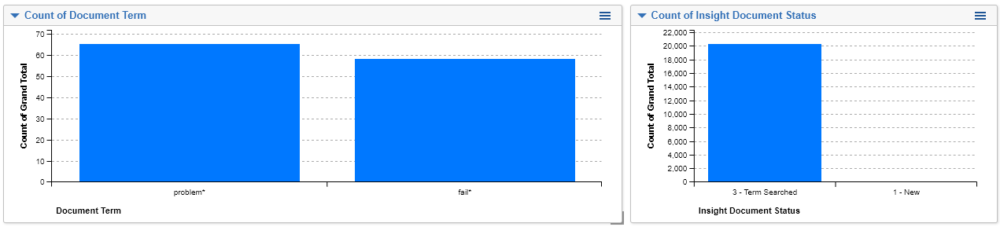

# Dashboards
{: .no_toc }

View current stats on communications, alerts, and reviewer progress in dashboards.
{: .fs-6 .fw-300 }

1. TOC
{:toc}

---

### Dashboard Widgets

You can get a quick understanding of the status of your system and documents by
applying Widgets using Trace Document Fields to the Documents dashboard:

