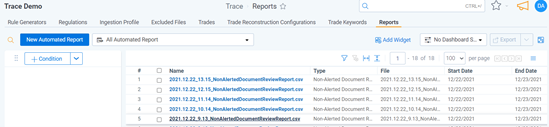
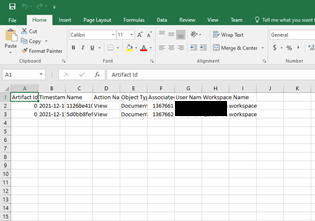

# Notifications
{: .no_toc }

Trace offers predifined notification reports for defensibility and reporting.
{: .fs-6 .fw-300 }

1. TOC
{:toc}

---
## Overview
All clients have similar needs and actions that need to be notified on in flexible time periods. 

## Reports
### Non-Alerted Document Review Report
Companies can track when surveillance team members view communications that have not been alerted on to identify scenarios where compliance team members are abusing their access to view employees communications. Trace will send an email report or real-time notifications regarding these privacy issues where reviewers are looking at non-alerted documents. 

The following are steps on how to view this feature, please see the admin guide on how to enable this.

1. Search Previously Generated Reports 
2. Click on the notification you want to view 
3. Sample notification emailed with attachment 
4. Sample csv 

**General Notes:** If there is nothing to report an email will not be sent, but an Automated Report object will still be created within the product
{: .info}

**General Notes:** Notifications only review previous day, not historical data
{: .info}
